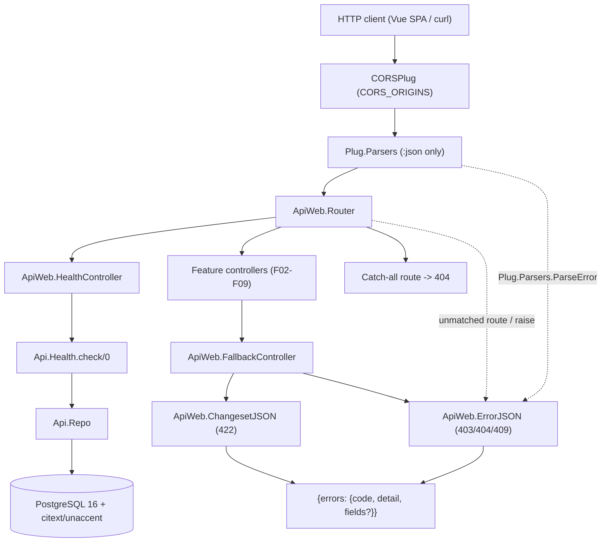
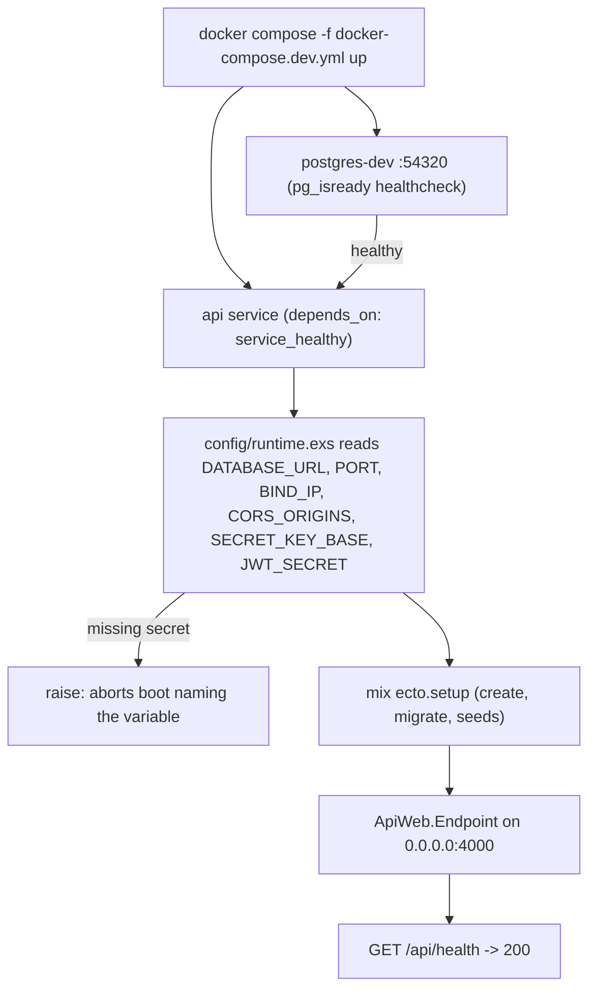

# Technical Specification: API Foundation and Development Environment

**Complexity:** medium

---

## 1. Technical Overview

### What

Convert the existing Phoenix 1.8.8 scaffold in `backend/` into an API-only JSON service on Elixir 1.20 and install the cross-cutting infrastructure every later feature (F02–F12) builds on. Five concerns are delivered together:

1. **API-only conversion and scaffold reduction** — strip the browser stack (session cookies, `Plug.Static`, HTML rendering, the LiveView socket) from the endpoint and router, and delete the generator artefacts this service will never use: `swoosh`/`Api.Mailer`, `gettext`/`ApiWeb.Gettext`, `req`, `dns_cluster` and `priv/static`. LiveDashboard survives as a dev-only diagnostic behind a compile-time flag.
2. **Schema conventions** — a shared `Api.Schema` macro fixing `binary_id` primary keys, `binary_id` foreign keys and `utc_datetime_usec` timestamps, so `(inserted_at, id)` is a stable keyset sort key from the first migration onward (F06 depends on the microsecond precision).
3. **Global error contract** — one JSON envelope for every non-2xx response, produced by `ApiWeb.ErrorJSON` for endpoint-level failures (unmatched routes, parse errors, unhandled exceptions) and by `ApiWeb.FallbackController` for context-level failure tuples, so no controller written in F02–F09 contains error-rendering logic.
4. **Runtime environment** — all configuration read from environment variables in `config/runtime.exs` with a fail-fast guard on required secrets, a multi-stage `Dockerfile`, and an `api` service added to `docker-compose.dev.yml` so a reviewer reaches a serving API without installing Elixir.
5. **Test harness and quality gate** — `DataCase`, `ConnCase` and a new `ChannelCase` over the Ecto SQL sandbox, ExMachina factories through `Api.Factory`, `boundary` compile-time architecture enforcement, and a `mix precommit` alias that gates warnings, formatting, Credo and 80% coverage.

### Why

The scaffold currently contradicts the target architecture in ways that get more expensive to unwind the later they are addressed. `config/config.exs` sets `timestamp_type: :utc_datetime` — second precision — which silently breaks F06's keyset pagination the moment two messages land in the same second; changing it after tables exist means a data migration. `ApiWeb.ErrorJSON` renders `%{errors: %{detail: ...}}` with no `code` key, so a client error handler written against F02 would have to be rewritten once the envelope is standardized. The endpoint still mounts `Plug.Session` and the LiveView socket, which means every request pays for cookie signing that a bearer-token API never reads, and `check_origin`/CSRF semantics that confuse the cross-origin SPA story.

The scaffold also carries roughly 5 MB of dependencies that no code path reaches. `swoosh` and `Api.Mailer` exist for an email feature the PRD removed from the product — there is no email address on the account at all. `gettext` is referenced only by the `use Gettext` line in the controller macro; nothing calls `gettext/1`, and the PRD writes every `errors.detail` as an English literal. `req` has zero call sites because the service makes no outbound HTTP request. `dns_cluster` is inert on a single-node deliverable. Each one left in place is a dependency a reviewer has to check before concluding it is unused, and an audit surface with no upside. LiveDashboard is the one deliberate exception: it justifies its transitive LiveView dependency by giving the evaluator Ecto query stats and a process tree, so it stays — with every plug it requires gated behind `dev_routes`, meaning `test` and `prod` compile no browser stack at all.

Equally important, the authorization predicate that F06/F07 share and the JSON shapes that F12 documents can only be tested from day one if the harness exists first. `ChannelCase` does not exist yet, so F07's channel tests would otherwise arrive with their own ad-hoc setup. Declaring `boundary` now — while `lib/api` holds only `Repo` — costs nothing; declaring it after four contexts exist means untangling whatever leaked in the meantime.

### Scope

**Included:**
- `mix.exs`: Elixir version constraint raised to `~> 1.20`, new dependencies (`cors_plug`, `ex_machina`, `excoveralls`), removal of `swoosh`/`gettext`/`req`/`dns_cluster`, the `boundary` compiler, coverage configuration and the expanded `precommit` alias
- Deletion of the unused scaffold modules and assets: `lib/api/mailer.ex`, `lib/api_web/gettext.ex`, `priv/gettext/`, `priv/static/`, and the `DNSCluster` child spec
- API-only endpoint and router, with LiveDashboard retained under `Application.compile_env(:api, :dev_routes)`
- `Api.Schema` shared schema macro and the `generators` config switch to `utc_datetime_usec`
- Global error envelope: `ApiWeb.ErrorJSON`, `ApiWeb.ChangesetJSON`, `ApiWeb.FallbackController`, and the catch-all 404 route
- CORS via `cors_plug`, origins driven by `CORS_ORIGINS`
- `GET /api/health` with a real `SELECT 1` round trip and a 503 path
- `config/runtime.exs` rewritten to serve all environments; `.env.example`; fail-fast guard on `SECRET_KEY_BASE` and `JWT_SECRET`
- Multi-stage `Dockerfile`, `.dockerignore`, and the `api` service plus healthcheck added to `docker-compose.dev.yml`
- Migration enabling the `citext` and `unaccent` PostgreSQL extensions
- `ChannelCase`, `Api.Factory` (ExMachina), sandbox wiring in all three cases
- `boundary` declarations on `Api` and `ApiWeb`

**Excluded:**
- The `users` table, `RequireAuth` plug, JWT generation/verification and `UserSocket` — all F02. F01 only reserves `JWT_SECRET` in runtime config and the `unauthenticated`/`token_expired` codes in the error table.
- `Api.Factory` factory functions for domain schemas — each is contributed by the feature that introduces its schema (F02–F06).
- Seed content — `priv/repo/seeds.exs` stays as scaffolded; F11 fills it. The Docker entrypoint already invokes `mix ecto.setup`, which runs it.
- `docs/api.md` and the full README (F12). F01 writes only the minimal run instructions and the environment variable table.

---

## 2. Architecture Impact

### Affected components

| Layer | Component | Path |
|---|---|---|
| Build | Mix project, deps, aliases, coverage | `mix.exs` |
| Config | Compile-time app config | `config/config.exs` |
| Config | Runtime/env-driven config for all envs | `config/runtime.exs` |
| Config | Dev repo + endpoint defaults | `config/dev.exs` |
| Web | HTTP entry pipeline | `lib/api_web/endpoint.ex` |
| Web | Routing, pipelines, catch-all | `lib/api_web/router.ex` |
| Web | Controller/channel `use` macros | `lib/api_web.ex` |
| Web | Error rendering | `lib/api_web/controllers/error_json.ex`, `changeset_json.ex` |
| Web | Fallback translation | `lib/api_web/controllers/fallback_controller.ex` |
| Web | Health probe | `lib/api_web/controllers/health_controller.ex`, `health_json.ex` |
| Domain | Shared schema conventions | `lib/api/schema.ex` |
| Domain | Database connectivity check | `lib/api/health.ex` |
| Domain | Boundary root | `lib/api.ex` |
| Database | Extension migration | `priv/repo/migrations/*_enable_extensions.exs` |
| Ops | Container image + orchestration | `Dockerfile`, `.dockerignore`, `docker-compose.dev.yml`, `.env.example` |
| Test | Case templates and factories | `test/support/{data_case,conn_case,channel_case,factory}.ex` |

### Request and boot flow





---

## 3. Technical Decisions

| Decision | Chosen Approach | Alternative Considered | Trade-off |
|---|---|---|---|
| Compose topology | Keep `docker-compose.dev.yml` and `docker-compose.test.yml` separate; add the `api` service to the dev file only | A single consolidated `docker-compose.yml` with profiles, as the original PRD text implied | The evaluator's command carries a `-f` flag instead of being a bare `docker compose up`. Accepted in exchange for a test database that can never be disturbed by a development container, independent of `MIX_TEST_PARTITION`. |
| Container `MIX_ENV` | The `api` container runs in `dev` | A `prod` release built with `mix release` | Loses release-grade startup time and image size. Required because F11 mandates that seeds **refuse to run** under `MIX_ENV=prod`, and the container's whole purpose is a seeded demo. `dev` also keeps `mix ecto.setup` available as the single documented setup path. |
| Health 503 body | Merge the probe fields and the error envelope in one body | Envelope-only (uniform) or probe-fields-only (conventional) | The body carries a slightly redundant `status` key. Accepted because it satisfies both PRD statements simultaneously and lets a container orchestrator read `database` while the SPA's single error handler still finds `errors.code`. |
| Secret guard scope | `runtime.exs` raises on missing `SECRET_KEY_BASE`/`JWT_SECRET` in every env except `test` | Prod-only (stock Phoenix) or all environments | `mix test` needs no exported variables, and CI stays simple. The acceptance criterion is verifiable by booting dev without `.env`. Cost: `config/test.exs` carries literal secrets, which is already true of the scaffold. |
| Test data construction | ExMachina `Api.Factory` with `use ExMachina.Ecto, repo: Api.Repo` | Hand-written `*_fixture/1` functions per context | One more dependency, and `build/1` vs `insert/1` semantics to learn. Buys composable `build(:user, name: "x")`, sequence helpers for unique `@username` values (F02 needs them heavily), and `params_for/2` for controller request bodies. |
| Error rendering split | Endpoint-level failures via `ErrorJSON` (status-to-code table), context-level failures via `FallbackController` | A single plug rewriting all error bodies on the way out | Two modules to keep in sync, mitigated by a shared code table module. Buys correct handling of exceptions that never reach a controller (parse errors, unmatched routes) while keeping `{:error, :not_found}` tuples idiomatic. |
| Architecture enforcement | `boundary` compiler with `Api` (exports `Health`, `Repo`) and `ApiWeb` (deps `[Api]`) | Convention plus code review | Compilation can fail on a boundary violation mid-refactor. Buys a mechanical guarantee that the context separation the PRD is graded on cannot erode, at zero runtime cost. |
| PostgreSQL extensions | One F01 migration enabling `citext` and `unaccent` | Each feature enabling its own extension in its first migration | F01 owns a migration for capabilities it does not itself use. Buys a single privileged DDL step at the base of the migration chain, so F02's `citext` username column and F09's `unaccent` search need no superuser operation mid-stream. |
| Unused scaffold deps | Delete `swoosh`, `gettext`, `req` and `dns_cluster` outright | Leave them installed but unwired, as the original PRD text assumed for Swoosh | Adding any of them back later costs a `mix.exs` line and a `mix deps.get`. Buys a dependency list where every entry has a call site, ~5 MB less to compile, and no reviewer time spent confirming that an installed mailer is genuinely dead. |
| LiveDashboard | Keep it, with every browser plug it needs gated behind `compile_env(:api, :dev_routes)` | Remove it along with the rest of the browser stack for a fully unconditional endpoint | The endpoint keeps one compile-time conditional and dev still pulls LiveView transitively. Buys the evaluator a live view of Ecto query timings, the process tree and memory — the diagnostic the PRD explicitly asks for — while `test` and `prod` compile no session, no `/live` socket and no request logger. |

---

## 4. Component Overview

### Build and configuration

| File Path | New/Modified | Purpose | Key Responsibilities |
|---|---|---|---|
| `mix.exs` | Modified | Project definition | Raise `elixir` to `~> 1.20`; add `{:cors_plug, "~> 3.0"}`, `{:ex_machina, "~> 2.8", only: :test}`, `{:excoveralls, "~> 0.18", only: :test}`; **remove** `:swoosh`, `:gettext`, `:req` and `:dns_cluster`; add `compilers: [:boundary] ++ Mix.compilers()`; set `test_coverage: [tool: ExCoveralls]` and `preferred_cli_env` for coverage tasks; expand the `precommit` alias |
| `config/config.exs` | Modified | Compile-time config | Switch `generators` to `[timestamp_type: :utc_datetime_usec, binary_id: true]`; keep `render_errors` pointed at `ApiWeb.ErrorJSON`; retain the `live_view` signing salt only because LiveDashboard needs it in dev; **remove** the `Api.Mailer` adapter config |
| `config/runtime.exs` | Modified | Env-driven config, all environments | Read `PORT`, `BIND_IP`, `CORS_ORIGINS` for every env; override `Api.Repo` url when `DATABASE_URL` is present so the same file serves native and containerized runs; raise a named error for missing `SECRET_KEY_BASE`/`JWT_SECRET` when `config_env() != :test`; **remove** the `DNS_CLUSTER_QUERY` line and the commented mailer block |
| `config/dev.exs` | Modified | Native dev defaults | Keep `postgres-dev` credentials on port 54320 as the fallback when `DATABASE_URL` is unset; keep `check_origin: false`; **remove** the two `:swoosh` lines |
| `config/test.exs` | Modified | Test defaults | Keep the sandbox pool on port 54321; **remove** the `Api.Mailer` and `:swoosh` lines |
| `config/prod.exs` | Modified | Prod compile-time config | Keep `force_ssl` with the localhost exclusion; **remove** the three `:swoosh` lines |
| `.env.example` | New | Documented environment | Every variable with a working local default: `DATABASE_URL`, `SECRET_KEY_BASE`, `JWT_SECRET`, `PORT`, `BIND_IP`, `CORS_ORIGINS` |

### Web layer

| File Path | New/Modified | Purpose | Key Responsibilities |
|---|---|---|---|
| `lib/api_web/endpoint.ex` | Modified | HTTP entry pipeline | Remove `Plug.Static`, `Plug.Session` and `Plug.MethodOverride`; mount the LiveView socket and session plug only under `Application.compile_env(:api, :dev_routes)`; restrict `Plug.Parsers` to `[:json]` with `pass: ["application/json"]`; insert `CORSPlug` before the router |
| `lib/api_web/router.ex` | Modified | Routing | `:api` pipeline accepting only `json`; `GET /api/health`; a catch-all `match :*, "/*path"` routed to `ApiWeb.ErrorController` returning the 404 envelope; keep the dev-only LiveDashboard scope but **drop** the `/mailbox` Swoosh forward |
| `lib/api_web.ex` | Modified | `use` macros | `controller` uses `formats: [:json]`; **remove** the `use Gettext` line and `static_paths/0`; drop `statics:` from `verified_routes`; add `def channel` unchanged for F07; declare the `ApiWeb` boundary with `deps: [Api]` |
| `lib/api_web/controllers/error_json.ex` | Modified | Endpoint-level error rendering | Map a status template to `{code, detail}` via the shared code table; special-case `%Plug.Parsers.ParseError{}` in `assigns.reason` to `malformed_request`; never leak a stacktrace |
| `lib/api_web/controllers/changeset_json.ex` | New | 422 rendering | Traverse changeset errors into `errors.fields` as `%{field => [message]}` with interpolated `%{count}` options; always emit `code: "validation_error"` |
| `lib/api_web/controllers/fallback_controller.ex` | New | Context-error translation | `{:error, %Ecto.Changeset{}}` → 422, `{:error, :not_found}` → 404, `{:error, :unauthorized}` → 403, `{:error, :conflict}` → 409, `{:error, code, detail}` → explicit status lookup; used by every F02+ controller via `action_fallback` |
| `lib/api_web/controllers/error_controller.ex` | New | Catch-all route target | Single `not_found/2` action rendering the 404 envelope for unmatched paths |
| `lib/api_web/controllers/health_controller.ex` | New | Liveness/readiness probe | Call `Api.Health.check/0`; render 200 or 503 through `HealthJSON`; no authentication |
| `lib/api_web/controllers/health_json.ex` | New | Health rendering | `ok/1` → `%{status: "ok", database: "up"}`; `error/1` → `%{status: "error", database: "down", errors: %{code: "database_unavailable", detail: ...}}` |

### Domain layer

| File Path | New/Modified | Purpose | Key Responsibilities |
|---|---|---|---|
| `lib/api.ex` | Modified | Boundary root | `use Boundary, deps: [], exports: [Health, Repo]`; keep the existing moduledoc |
| `lib/api/application.ex` | Modified | Supervision tree | **Remove** the `DNSCluster` child spec; the tree becomes Telemetry, Repo, PubSub, Endpoint — with `UserSocket`-related children arriving in F07 |
| `lib/api/schema.ex` | New | Shared schema conventions | `__using__/1` injecting `use Ecto.Schema`, `@primary_key {:id, :binary_id, autogenerate: true}`, `@foreign_key_type :binary_id`, `@timestamps_opts [type: :utc_datetime_usec]`, and `import Ecto.Changeset` — every F02–F06 schema starts with `use Api.Schema` |
| `lib/api/health.ex` | New | Database connectivity | `check/0` executing `SELECT 1` through `Ecto.Adapters.SQL.query/3` with a short timeout, returning `:ok` or `{:error, reason}`; rescues `DBConnection.ConnectionError` and `Postgrex.Error` so a down database is a value, not an exception |

### Deleted scaffold artefacts

| Path | Reason |
|---|---|
| `lib/api/mailer.ex` | No email exists anywhere in the product; the PRD removed account recovery and there is no address on the user record |
| `lib/api_web/gettext.ex` | Nothing calls `gettext/1`; the API is single-language and every `errors.detail` is an English literal |
| `priv/gettext/errors.pot`, `priv/gettext/en/LC_MESSAGES/errors.po` | Translation catalogues for the removed backend |
| `priv/static/favicon.ico`, `priv/static/robots.txt` | The service returns only JSON and serves no asset route |

After removal, `mix deps.unlock --unused` (already part of `precommit`) keeps `mix.lock` free of the orphaned transitive dependencies — most visibly `phoenix_live_view`, which must remain since LiveDashboard still requires it in dev.

### Database

| Migration File | Tables Affected | Operation | Notes |
|---|---|---|---|
| `priv/repo/migrations/<ts>_enable_extensions.exs` | none | `CREATE EXTENSION` | Enables `citext` (F02 usernames) and `unaccent` (F09 conversation filtering); `execute/2` with matching `DROP EXTENSION` for reversibility |

### Operations

| File Path | New/Modified | Purpose | Key Responsibilities |
|---|---|---|---|
| `Dockerfile` | New | API image | Multi-stage: builder stage on `hexpm/elixir:1.20.1-erlang-29.0.2-alpine-*` fetching hex/rebar and compiling deps with a cache-friendly layer order (`mix.exs`/`mix.lock` before source); runtime stage carrying the compiled build plus `postgresql-client` for diagnostics |
| `.dockerignore` | New | Build context trim | Exclude `_build`, `deps`, `.git`, `postgres_data`, `docs`, `.elixir_ls` |
| `docker-compose.dev.yml` | Modified | Dev orchestration | Add a `pg_isready` healthcheck (5 s interval, 10 retries) to `postgres-dev`; add the `api` service with `depends_on: {postgres-dev: {condition: service_healthy}}`, `env_file: .env`, port `4000:4000`, `DATABASE_URL` pointing at the service name, `BIND_IP=0.0.0.0`, and a command running `mix deps.get && mix ecto.setup && mix phx.server` |
| `docker-compose.test.yml` | Unchanged | Test database | Remains database-only by design |
| `README.md` | Modified | Minimal run instructions | Prerequisites, the one-command Docker start, the native path, and the environment variable table. F12 expands it with design decisions and seeded credentials. |

### Test support

| File Path | New/Modified | Purpose | Key Responsibilities |
|---|---|---|---|
| `test/support/data_case.ex` | Modified | Context tests | Keep sandbox setup and `errors_on/1`; `import Api.Factory` |
| `test/support/conn_case.ex` | Modified | Controller tests | Keep sandbox setup; `import Api.Factory`; add a `json_conn/0` helper putting `accept: application/json` and `content-type: application/json` |
| `test/support/channel_case.ex` | New | Channel tests | `use ExUnit.CaseTemplate` with `import Phoenix.ChannelTest`, `@endpoint ApiWeb.Endpoint`, shared sandbox setup, `import Api.Factory`; ready for F07's `UserSocket` |
| `test/support/factory.ex` | New | ExMachina root | `use ExMachina.Ecto, repo: Api.Repo` with the module doc stating the one-factory-per-schema convention and a `sequence/2` usage note; carries no factory function until F02 |

---

## 5. API Contracts

### Endpoint: Health Check

- **Method:** GET
- **Path:** `/api/health`
- **Authentication:** None (must remain reachable before F02 exists and when the database is down)

**Request:** no parameters, no body.

**Response (Success — 200):**

| Field | Type | Description |
|---|---|---|
| `status` | `string` | Always `"ok"` |
| `database` | `string` | Always `"up"` — a `SELECT 1` completed |

```json
{
  "status": "ok",
  "database": "up"
}
```

**Response (Failure — 503):**

| Field | Type | Description |
|---|---|---|
| `status` | `string` | Always `"error"` |
| `database` | `string` | Always `"down"` |
| `errors.code` | `string` | Always `"database_unavailable"` |
| `errors.detail` | `string` | Human-readable message; never contains connection strings or credentials |

```json
{
  "status": "error",
  "database": "down",
  "errors": {
    "code": "database_unavailable",
    "detail": "Database connection is not available"
  }
}
```

### Global error envelope

Every non-2xx response in the API — from F01 through F12 — has this shape. `fields` is present only on 422.

```json
{
  "errors": {
    "code": "validation_error",
    "detail": "The request could not be processed",
    "fields": {
      "username": ["has already been taken"],
      "password": ["should be at least 8 character(s)"]
    }
  }
}
```

### Error codes owned by F01

| Code | HTTP Status | Description |
|---|---|---|
| `malformed_request` | 400 | Request body is not valid JSON (`Plug.Parsers.ParseError`) |
| `not_found` | 404 | Route did not match, or the resource is not visible to the caller |
| `method_not_allowed` | 405 | Path exists but not for this HTTP method |
| `unsupported_media_type` | 415 | `content-type` is not `application/json` |
| `validation_error` | 422 | Changeset validation failed; `fields` carries per-field messages |
| `internal_error` | 500 | Unhandled exception; stacktrace logged server-side only |
| `database_unavailable` | 503 | Health check could not reach PostgreSQL |

Reserved by F01's status mapping, emitted by later features: `unauthenticated` (401, F02), `token_expired` (401, F02), `rate_limited` (429, F02/F07), and the domain codes of F03–F09. F12 publishes the exhaustive table.

### CORS contract

| Aspect | Value |
|---|---|
| Allowed origins | `CORS_ORIGINS` as a comma-separated list; default `http://localhost:5173,http://localhost:3000` |
| Allowed methods | `GET, POST, PATCH, DELETE, OPTIONS` |
| Allowed headers | `authorization`, `content-type` |
| Preflight | `OPTIONS` on any `/api/*` path returns 204 with the headers above before authentication runs |

The frontend's Vite dev server is configured on port 5173 (`frontend/vite.config.ts`), which the default already covers.

---

## 6. Data Model

F01 creates no tables. It fixes the conventions every later table follows and enables the extensions they require.

### Schema conventions (`Api.Schema`)

| Aspect | Value | Rationale |
|---|---|---|
| Primary key | `{:id, :binary_id, autogenerate: true}` | UUID v4; defeats enumeration (PRD §2) |
| Foreign key type | `:binary_id` | Consistency with primary keys |
| Timestamps | `[type: :utc_datetime_usec]` | Microsecond precision makes `(inserted_at, id)` a total order for F06 keyset pagination |
| Migration column type | `:binary_id` with `primary_key: true`, default `fragment("gen_random_uuid()")` | `gen_random_uuid()` is built into PostgreSQL 16; no `uuid-ossp` needed |

### Extensions migration

```sql
-- priv/repo/migrations/<timestamp>_enable_extensions.exs
CREATE EXTENSION IF NOT EXISTS citext;
CREATE EXTENSION IF NOT EXISTS unaccent;
```

| Extension | Enabled for | Used by |
|---|---|---|
| `citext` | Case-insensitive unique `username` column | F02 |
| `unaccent` | Accent-insensitive `ILIKE` conversation filtering | F09 |

The migration is reversible via `execute/2` with matching `DROP EXTENSION` statements, so `mix ecto.rollback` on a clean database succeeds.

---

## 7. Testing Strategy

### Test file structure

| Test File | Test Type | Target | Coverage Goal |
|---|---|---|---|
| `test/api_web/controllers/health_controller_test.exs` | Integration | `GET /api/health` | 100% |
| `test/api_web/controllers/error_json_test.exs` | Unit | `ApiWeb.ErrorJSON` | 100% |
| `test/api_web/controllers/changeset_json_test.exs` | Unit | `ApiWeb.ChangesetJSON` | 100% |
| `test/api_web/error_envelope_test.exs` | Integration | Endpoint-level failures through the real pipeline | 90% |
| `test/api_web/cors_test.exs` | Integration | `CORSPlug` configuration | 100% |
| `test/api/health_test.exs` | Unit | `Api.Health.check/0` | 100% |
| `test/api/schema_test.exs` | Unit | `Api.Schema` macro | 100% |
| `test/support/*` | Harness | Compiled with the suite; exercised indirectly | n/a |

Overall gate: `mix coveralls --minimum-coverage 80` over `lib/api`.

### `health_controller_test.exs`

| Test Function | Description | Assertions |
|---|---|---|
| `test "returns 200 and database up when the repo is reachable"` | Happy path against the sandbox connection | Status 200; body equals `%{"status" => "ok", "database" => "up"}` |
| `test "returns 503 with the database_unavailable envelope when the repo is down"` | `Api.Health.check/0` stubbed or the checkout deliberately closed | Status 503; `body["database"] == "down"`; `body["errors"]["code"] == "database_unavailable"`; body contains no connection string |
| `test "requires no authentication"` | Called with no `authorization` header | Status 200, proving the route sits outside any future authenticated pipeline |

### `error_envelope_test.exs`

Maps directly to F01's acceptance criteria on the error contract.

| Test Function | Description | Assertions |
|---|---|---|
| `test "unmatched route returns a 404 JSON envelope"` | `get(conn, "/api/does-not-exist")` | Status 404; `errors.code == "not_found"`; `content-type` starts with `application/json`; body is not HTML |
| `test "unmatched non-api route also returns JSON"` | `get(conn, "/")` | Status 404; JSON envelope, never a Phoenix HTML error page |
| `test "malformed JSON body returns 400 malformed_request"` | POST with `content-type: application/json` and body `"{invalid"` | Status 400; `errors.code == "malformed_request"`; no `Plug.Parsers.ParseError` escapes |
| `test "unsupported content type returns 415"` | POST with `content-type: text/plain` | Status 415; `errors.code == "unsupported_media_type"` |
| `test "every error response carries code and detail"` | Table-driven over the statuses F01 owns | Each body has non-empty `errors.code` and `errors.detail`; `fields` absent unless 422 |
| `test "500 responses never include a stacktrace"` | A route raising under `debug_errors: false` | Status 500; `errors.code == "internal_error"`; body has no `stacktrace`/`__exception__` key |

### `cors_test.exs`

| Test Function | Description | Assertions |
|---|---|---|
| `test "preflight from the vite origin returns the allowed methods and headers"` | `OPTIONS /api/health` with `origin: http://localhost:5173` | 204; `access-control-allow-origin` echoes the origin; `access-control-allow-methods` contains GET, POST, PATCH, DELETE; `access-control-allow-headers` contains `authorization` |
| `test "an unlisted origin is not echoed back"` | Preflight with `origin: http://evil.test` | `access-control-allow-origin` is absent or does not equal the request origin |
| `test "CORS_ORIGINS overrides the default list"` | Application env swapped in setup and restored `on_exit` | The configured origin is allowed; the default is not |

### `health_test.exs` and `schema_test.exs`

| Test Function | Description | Assertions |
|---|---|---|
| `test "check/0 returns :ok against a live repo"` | Sandbox connection | Returns `:ok` |
| `test "check/0 returns an error tuple instead of raising when the connection fails"` | Repo pointed at an unreachable port in a supervised child | Returns `{:error, _}`; no exception escapes |
| `test "schemas using Api.Schema get binary_id keys and usec timestamps"` | A throwaway schema module defined in the test | `__schema__(:primary_key)` is `[:id]` with type `:binary_id`; `__schema__(:type, :inserted_at)` is `:utc_datetime_usec` |

### Harness and scaffold-reduction verification

These are proven by the suite compiling and running rather than by dedicated assertions:

- `ChannelCase` compiles and checks out the sandbox — F07 consumes it directly
- `Api.Factory` compiles with `ExMachina.Ecto` and is imported by all three cases
- `boundary` produces no violations at compile time; a deliberate `Api` → `ApiWeb` call fails `mix compile`
- The whole suite compiles with `--warnings-as-errors` after `swoosh`, `gettext`, `req` and `dns_cluster` are removed, proving no code path referenced them
- `mix deps.unlock --check-unused` (part of `precommit`) reports nothing stale in `mix.lock`
- `MIX_ENV=test mix compile` succeeds with no `Plug.Session` or `/live` socket compiled, since both sit behind the `dev_routes` flag

### Acceptance criteria not covered by ExUnit

Two of F01's criteria are environmental and verified manually, documented as such in the README:

| Criterion | Verification |
|---|---|
| `docker compose -f docker-compose.dev.yml up` reaches a serving state on port 4000 with migrations applied | Cold start on a clean machine, then `curl localhost:4000/api/health` returns `{"status":"ok","database":"up"}` |
| Booting without `JWT_SECRET` aborts startup naming the variable | `env -u JWT_SECRET mix phx.server` exits with the named error; a `config/runtime.exs` unit test can cover the guard function if it is extracted |

### Cross-feature integration

F01 declares no rows in the PRD's Cross-Feature Integration list — it is consumed by every feature rather than integrating with any. Its contracts are validated transitively: the error envelope by every F02–F09 controller test, `ChannelCase` and `Api.Factory` by every later suite, and `Api.Schema`'s `utc_datetime_usec` by F06's 250-message pagination ordering test.
