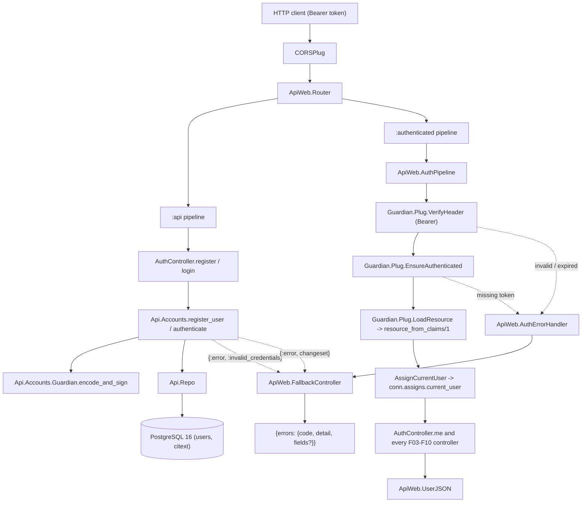
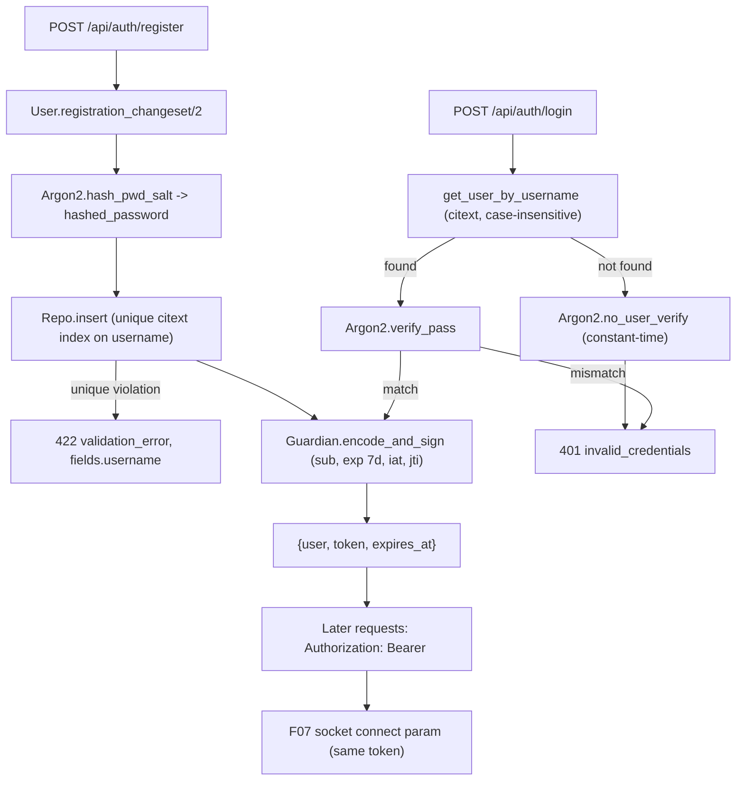

# Technical Specification: User Account and JWT Authentication

**Complexity:** medium

---

## 1. Technical Overview

### What

Introduce the first domain context of the application, `Api.Accounts`, and the cross-cutting authentication layer every later feature depends on without declaring it. Four concerns are delivered together:

1. **User records** — a `users` table with a case-insensitive unique `@username`, a display name, an Argon2id password hash and a nullable `last_seen_at` reserved for F10, plus the `Api.Accounts.User` schema and its validation rules.
2. **Token issuance and verification** — `Api.Accounts.Guardian`, a Guardian implementation module signing HS256 tokens with `sub`, `exp` (7 days), `iat` and `jti`, and resolving a token's subject back to a user record.
3. **Authenticated request path** — `ApiWeb.AuthPipeline`, a Guardian plug pipeline that verifies the `Authorization: Bearer` header, loads the resource and exposes it as `conn.assigns.current_user`, with failures rendered through the existing error envelope by a Guardian error handler that delegates to `ApiWeb.FallbackController`.
4. **Auth endpoints** — `POST /api/auth/register`, `POST /api/auth/login` and `GET /api/auth/me`, plus `ApiWeb.UserJSON` as the single user shape that F03, F06, F08 and F10 re-embed.

The error contract established by F01 is extended in the same pass: `ApiWeb.FallbackController` gains a reason-keyed table so a domain reason can carry its own machine code at a status that already has a generic one, which is what `invalid_credentials` and `token_expired` both need at 401.

### Why

Authentication is the first feature that cannot be added later without rewriting what came before it. Every endpoint from F03 onward reads `conn.assigns.current_user`, every channel from F07 onward reads the same token from a connect param, and `sender_id`/`owner_id` are taken from the authenticated caller rather than the request body throughout the product — so the identity contract has to be fixed before the first business endpoint exists, not after.

The error layer needs the same treatment. F01's `ApiWeb.ErrorJSON` derives the machine code from the HTTP status, which is correct for endpoint-level failures (a 404 route miss is a 404 route miss) but collapses domain distinctions the PRD requires: an expired token and a missing header are both 401, yet the client must be able to prompt for re-login on one and treat the other as a bug. F02 is the first feature to hit that ceiling, and it is also the feature that sets the pattern for the eleven domain codes F03–F09 add later (`user_not_found`, `not_a_contact`, `already_member`, `invalid_cursor`…). Extending the fallback controller once here costs one table; retrofitting it after four contexts have each invented their own rendering costs all of them.

Password storage is the one place where a wrong default is unrecoverable after data exists. `argon2_elixir` is used instead of the PRD's bcrypt: Argon2id is memory-hard, is the current password-hashing recommendation, and — unlike bcrypt — has no 72-byte silent truncation. The declared 8–72 character range is kept anyway so the documented contract does not move.

Finally, the user JSON shape is defined once because it is the most-copied payload in the API. The PRD's primary audience is a client developer generating TypeScript types, and a `user` object that carries `last_seen_at` in one endpoint and omits it in another is exactly the inconsistency the PRD calls costlier than a missing feature. A single `ApiWeb.UserJSON.data/1` also makes it structurally impossible for a later view to forget the field allowlist and leak `hashed_password`.

### Scope

**Included:**
- `users` migration and the `Api.Accounts.User` schema with registration and validation changesets
- `Api.Accounts` context: `register_user/1`, `authenticate/2`, `get_user/1`, `get_user_by_username/1`
- `Api.Accounts.Guardian` implementing `subject_for_token/2` and `resource_from_claims/1`, with a 7-day TTL and the HS256 secret sourced from `JWT_SECRET`
- `ApiWeb.AuthPipeline` (Guardian plug pipeline), `ApiWeb.AuthErrorHandler`, `ApiWeb.Plugs.AssignCurrentUser`, and the router's `:authenticated` pipeline
- `ApiWeb.AuthController` with `register/2`, `login/2` and `me/2`, and `ApiWeb.UserJSON` as the shared user renderer
- `ApiWeb.FallbackController` extended with a reason-keyed `{status, code, detail}` table; `invalid_credentials`, `token_expired` and `unauthenticated` registered in it
- `argon2_elixir` and `guardian` dependencies, Guardian configuration across `config.exs` / `runtime.exs` / `test.exs`, and reduced Argon2 cost parameters in test
- `user_factory/0` in `Api.Factory`, and the boundary declarations for the new sub-boundary

**Deferred (PRD Full Scope additions — explicitly out of this feature):**
- Login rate limiting (10 failed attempts per IP / 5 per username per 60 s) and the `rate_limited` + `Retry-After` response. The `rate_limited` reason already exists in the fallback table from F01 and stays unemitted.
- `DELETE /api/auth/session` and `jti` revocation in an ETS-backed cache. Tokens are valid until `exp`; logout is a client-side token discard.
- Consequently, two PRD Section 9 criteria are not exercised by this feature's suite: *"the 11th failed login from one IP within 60 seconds returns 429"* and *"after logout, the same token is rejected on both an HTTP request and a socket connect"*.

**Excluded (owned by other features):**
- `ApiWeb.UserSocket` and `connect/3` — F07. F02 provides the verification entry point (`Api.Accounts.Guardian.decode_and_verify/1` plus `resource_from_claims/1`) that F07's `connect/3` calls; the remaining F02 criterion about socket connects is verified there.
- Writing `last_seen_at` — F10. F02 only creates the column and returns it.
- Contact resolution by `@username` — F03 consumes `get_user_by_username/1`.
- Profile editing, username changes, password reset — out of scope per PRD §7.

---

## 2. Architecture Impact

### Affected components

| Layer | Component | Path |
|---|---|---|
| Build | Dependencies | `mix.exs` |
| Config | Guardian issuer and TTL | `config/config.exs` |
| Config | Guardian secret from `JWT_SECRET` | `config/runtime.exs` |
| Config | Test secret and reduced Argon2 cost | `config/test.exs` |
| Domain | Accounts context | `lib/api/accounts.ex` |
| Domain | User schema | `lib/api/accounts/user.ex` |
| Domain | Token issuance and verification | `lib/api/accounts/guardian.ex` |
| Domain | Boundary root export list | `lib/api.ex` |
| Web | Auth endpoints | `lib/api_web/controllers/auth_controller.ex` |
| Web | Shared user rendering | `lib/api_web/controllers/user_json.ex` |
| Web | Authenticated request guard | `lib/api_web/auth_pipeline.ex` |
| Web | Guardian failure translation | `lib/api_web/auth_error_handler.ex` |
| Web | `current_user` assign | `lib/api_web/plugs/assign_current_user.ex` |
| Web | Reason-keyed error table | `lib/api_web/controllers/fallback_controller.ex` |
| Web | Routes and `:authenticated` pipeline | `lib/api_web/router.ex` |
| Database | Users table | `priv/repo/migrations/*_create_users.exs` |
| Test | User factory | `test/support/factory.ex` |

### Authenticated request flow



### Credential and token lifecycle



---

## 3. Technical Decisions

| Decision | Chosen Approach | Alternative Considered | Trade-off |
|---|---|---|---|
| Password hashing | `argon2_elixir` with Argon2id defaults in dev/prod, reduced `t_cost`/`m_cost` in test | `bcrypt_elixir` at cost 12, which the PRD originally specified | The PRD was amended to match, and F12's README records the choice in its design-decisions section. Buys a memory-hard KDF that is the current recommendation and has no 72-byte silent truncation. The 8–72 character range is kept unchanged so the published contract does not move. |
| JWT layer | `guardian ~> 2.3` with a `Guardian.Plug` pipeline, used the way the library recommends | `joken` behind a hand-written `RequireAuth` plug, or hand-rolled HS256 | Brings a plug stack and Guardian's own conn storage, and the guard is named `ApiWeb.AuthPipeline` rather than the PRD's original `RequireAuth`. Buys claim validation, expiry handling and header parsing that are already audited, plus `{:error, :token_expired}` distinguished from `{:error, :invalid_token}` for free. |
| `current_user` exposure | A trailing `AssignCurrentUser` plug inside the pipeline copying `Guardian.Plug.current_resource/1` into `conn.assigns.current_user` | Have every controller call `Guardian.Plug.current_resource(conn)` directly | One extra ten-line plug. Buys the assign the PRD names and F03–F10 are written against, and keeps controllers free of any Guardian reference, so swapping the token library later touches three web modules instead of every controller. |
| Domain error codes | `FallbackController` gains a reason-keyed `{status, code, detail}` table; `ErrorJSON`'s status table stays the fallback for endpoint-level failures | Render `invalid_credentials` and `token_expired` inline in the auth controller | The two tables must stay coherent, and F01's `fallback_controller_test.exs` assertion that `token_expired` renders `unauthenticated` is updated by this feature. Buys one discoverable place for the eleven domain codes F03–F09 add, which F12's exhaustive error-code table is generated from. |
| Guardian failure rendering | `ApiWeb.AuthErrorHandler` translates Guardian's `{type, reason}` into a domain reason and calls `ApiWeb.FallbackController.call/2` | Implement a second renderer inside the error handler | A web module calling a controller's `call/2` directly is slightly unusual. Buys a single error table and guarantees a 401 from the pipeline is byte-identical to a 401 from a context. |
| Socket authentication | F02 ships only the verification path; `UserSocket` is F07's | Create a channel-less `UserSocket` now to satisfy the socket criterion in this feature's own suite | The endpoint mounts no socket until F07, and the PRD was amended to move that acceptance criterion there. Buys one feature owning the whole real-time surface, with no half-built socket module sitting unused for four features. |
| User payload shape | One `ApiWeb.UserJSON.data/1` reused by every later view that embeds a user | Each feature renders the user fields its endpoint needs | A shared renderer becomes a coordination point when a feature wants an extra field. Buys one user shape API-wide for the client's generated types, and one field allowlist that `hashed_password` can never escape. |
| Username storage | `citext` column with a plain unique index, `@` stripped at the boundary before validation | `varchar` plus a functional unique index on `lower(username)` | Depends on the `citext` extension F01 already enables. Buys case-insensitive uniqueness *and* case-insensitive lookup from the same column with no `lower()` wrapper in any later query — F03 resolves contacts by username on this column. |
| Unknown-username timing | `Argon2.no_user_verify/0` on the miss branch before returning the generic error | Return `{:error, :invalid_credentials}` immediately when the lookup misses | Every failed login pays a full hash verification. Buys the PRD's stated property that response time does not disclose account existence, which is otherwise trivially measurable. |

---

## 4. Component Overview

### Build and configuration

| File Path | New/Modified | Purpose | Key Responsibilities |
|---|---|---|---|
| `mix.exs` | Modified | Dependencies | Add `{:guardian, "~> 2.3"}` and `{:argon2_elixir, "~> 4.0"}` |
| `config/config.exs` | Modified | Compile-time Guardian options | `config :api, Api.Accounts.Guardian, issuer: "api", ttl: {7, :days}` — no secret at compile time |
| `config/runtime.exs` | Modified | Secret wiring | Replace `config :api, :jwt_secret, jwt_secret` with `config :api, Api.Accounts.Guardian, secret_key: jwt_secret`, keeping the existing fail-fast guard on the missing variable |
| `config/test.exs` | Modified | Test secrets and cost | Literal `secret_key` for the Guardian module, since `runtime.exs` deliberately skips `:test`; `config :argon2_elixir, t_cost: 1, m_cost: 8` so the suite is not dominated by hashing |
| `.env.example` | Modified | Documentation | Comment on `JWT_SECRET` clarifying it signs the API tokens and (from F07) the socket connect param |

### Domain layer

| File Path | New/Modified | Purpose | Key Responsibilities |
|---|---|---|---|
| `lib/api/accounts.ex` | New | Accounts context | `register_user/1` (changeset → insert, unique violation surfaced as a changeset error on `username`); `authenticate/2` (case-insensitive lookup, `Argon2.verify_pass`, `no_user_verify` on the miss branch, returns `{:ok, user}` or `{:error, :invalid_credentials}`); `get_user/1` and `get_user_by_username/1` returning `nil` when absent; declares `use Boundary, deps: [Api], exports: [User, Guardian]` |
| `lib/api/accounts/user.ex` | New | User schema | `use Api.Schema`; fields `username`, `name`, `hashed_password` (`redact: true`), `last_seen_at`, timestamps; `@derive {Inspect, except: [:hashed_password]}`; `registration_changeset/2` casting only `username`, `name` and the virtual `password`, stripping a leading `@`, downcasing, validating format/length, hashing into `hashed_password` and dropping the virtual field, with `unique_constraint(:username)` |
| `lib/api/accounts/guardian.ex` | New | Token issuance and verification | `use Guardian, otp_app: :api`; `subject_for_token/2` returning the user id; `resource_from_claims/1` loading the user and returning `{:error, :resource_not_found}` when the subject no longer exists; a helper returning `{token, expires_at}` so the controller does not decode claims itself |
| `lib/api.ex` | Modified | Boundary root | Add the mass export `{Accounts, []}` so `ApiWeb` reaches the context and its exported `User` and `Guardian` modules |

### Web layer

| File Path | New/Modified | Purpose | Key Responsibilities |
|---|---|---|---|
| `lib/api_web/auth_pipeline.ex` | New | Authenticated request guard | `use Guardian.Plug.Pipeline, otp_app: :api, module: Api.Accounts.Guardian, error_handler: ApiWeb.AuthErrorHandler`; `VerifyHeader` with the `Bearer` scheme, `EnsureAuthenticated`, `LoadResource`, then `AssignCurrentUser` |
| `lib/api_web/auth_error_handler.ex` | New | Guardian failure translation | Implements `Guardian.Plug.ErrorHandler`; maps `{:invalid_token, :token_expired}` (and Guardian's expiry variants) to `:token_expired`, every other type to `:unauthenticated`, then delegates to `ApiWeb.FallbackController.call/2` so the body is the standard envelope |
| `lib/api_web/plugs/assign_current_user.ex` | New | `current_user` assign | Copies `Guardian.Plug.current_resource/1` into `conn.assigns.current_user`; the single assign every later controller reads |
| `lib/api_web/controllers/auth_controller.ex` | New | Auth endpoints | `register/2` → 201, `login/2` → 200, `me/2` → 200; `action_fallback ApiWeb.FallbackController`; never touches error rendering |
| `lib/api_web/controllers/user_json.ex` | New | Shared user rendering | `data/1` returning the canonical user map; `show/1` and `token/1` wrapping it for this feature's responses; the field allowlist that keeps `hashed_password` out of every payload API-wide |
| `lib/api_web/controllers/fallback_controller.ex` | Modified | Error translation | Add a reason-keyed table `%{reason => {status, code, detail}}` consulted before the status table; register `invalid_credentials` (401), `token_expired` (401) and `unauthenticated` (401) with the PRD's detail strings; keep `{:error, reason, detail}` overriding the default detail and unmapped reasons falling through to 500 |
| `lib/api_web/router.ex` | Modified | Routes | Public `POST /api/auth/register` and `POST /api/auth/login` under `:api`; an `:authenticated` pipeline (`:api` + `ApiWeb.AuthPipeline`) carrying `GET /api/auth/me` and every route F03 onward adds |

### Database

| Migration File | Tables Affected | Operation | Notes |
|---|---|---|---|
| `priv/repo/migrations/<ts>_create_users.exs` | `users` | CREATE TABLE + CREATE UNIQUE INDEX | `citext` username (extension already enabled by F01), UUID primary key defaulting to `gen_random_uuid()`, `utc_datetime_usec` timestamps, nullable `last_seen_at` for F10 |

### Test support

| File Path | New/Modified | Purpose | Key Responsibilities |
|---|---|---|---|
| `test/support/factory.ex` | Modified | Test data | Add `user_factory/0` with `sequence(:username, &"user#{&1}")`, a display name, and a pre-hashed password so factory inserts do not pay a full Argon2 hash per record; expose the plaintext through a module attribute so login tests can authenticate a factory-built user |

---

## 5. API Contracts

All three endpoints return the shared `user` object below. `username` is stored and returned **bare** — the leading `@` is a client display convention, accepted on input and stripped.

### Shared user object

| Field | Type | Description |
|---|---|---|
| `id` | `uuid` | User identifier, used as `sub` in the token and as the foreign key by F03–F11 |
| `username` | `string` | Lowercase, 3–20 characters, no leading `@` |
| `name` | `string` | Display name, 2–60 characters |
| `last_seen_at` | `string \| null` | ISO 8601 UTC; always `null` until F10 writes it |

```json
{
  "id": "3f1c2d4e-8a91-4c7b-9b23-6e0f5a2d1c88",
  "username": "anabeatriz",
  "name": "Ana Beatriz",
  "last_seen_at": null
}
```

### Endpoint: Register

- **Method:** POST
- **Path:** `/api/auth/register`
- **Authentication:** None

**Request:**

| Field | Type | Required | Validation | Description |
|---|---|---|---|---|
| `username` | `string` | Yes | 3–20 chars, `~r/^[a-z0-9_]+$/` after stripping a leading `@` and downcasing; unique case-insensitively | Immutable after registration |
| `name` | `string` | Yes | 2–60 chars after trimming | Display name |
| `password` | `string` | Yes | 8–72 chars | Never stored or returned in plaintext |

**Request Example:**
```json
{
  "username": "@anabeatriz",
  "name": "Ana Beatriz",
  "password": "senha123456"
}
```

**Response (Success — 201):**

| Field | Type | Description |
|---|---|---|
| `user` | `object` | The shared user object |
| `token` | `string` | HS256 JWT to send as `Authorization: Bearer <token>` |
| `expires_at` | `string` | ISO 8601 UTC, 7 days ahead; derived from the token's `exp` claim |

```json
{
  "user": {
    "id": "3f1c2d4e-8a91-4c7b-9b23-6e0f5a2d1c88",
    "username": "anabeatriz",
    "name": "Ana Beatriz",
    "last_seen_at": null
  },
  "token": "eyJhbGciOiJIUzI1NiIsInR5cCI6IkpXVCJ9...",
  "expires_at": "2026-07-28T21:14:03.512345Z"
}
```

**Response (Failure — 422):**
```json
{
  "errors": {
    "code": "validation_error",
    "detail": "The request could not be processed",
    "fields": {
      "username": ["has already been taken"]
    }
  }
}
```

**Error Codes:**

| Code | HTTP Status | Description |
|---|---|---|
| `validation_error` | 422 | Username taken, username format/length invalid, name or password out of range; `fields` names the offending inputs |
| `malformed_request` | 400 | Body is not valid JSON (F01) |

### Endpoint: Login

- **Method:** POST
- **Path:** `/api/auth/login`
- **Authentication:** None

**Request:**

| Field | Type | Required | Validation | Description |
|---|---|---|---|---|
| `username` | `string` | Yes | Leading `@` accepted and stripped; matched case-insensitively | — |
| `password` | `string` | Yes | — | Compared against the stored Argon2id hash |

**Request Example:**
```json
{
  "username": "anabeatriz",
  "password": "senha123456"
}
```

**Response (Success — 200):** identical shape to register.

**Response (Failure — 401):**
```json
{
  "errors": {
    "code": "invalid_credentials",
    "detail": "Invalid username or password"
  }
}
```

**Error Codes:**

| Code | HTTP Status | Description |
|---|---|---|
| `invalid_credentials` | 401 | Unknown username **or** wrong password — byte-identical body for both, and both branches pay an Argon2 verification |
| `validation_error` | 422 | `username` or `password` absent from the body |

### Endpoint: Current User

- **Method:** GET
- **Path:** `/api/auth/me`
- **Authentication:** Bearer token (`:authenticated` pipeline)

**Request:** no body. Header `Authorization: Bearer <token>`.

**Response (Success — 200):**
```json
{
  "user": {
    "id": "3f1c2d4e-8a91-4c7b-9b23-6e0f5a2d1c88",
    "username": "anabeatriz",
    "name": "Ana Beatriz",
    "last_seen_at": null
  }
}
```

**Error Codes:**

| Code | HTTP Status | Description |
|---|---|---|
| `unauthenticated` | 401 | Header missing, malformed, not `Bearer`, signature invalid, or the subject no longer exists. Detail: `"Missing or invalid authentication token"` |
| `token_expired` | 401 | Signature valid but `exp` has passed, so the client can prompt for re-login instead of treating it as a permission bug |

### Token contract

| Aspect | Value |
|---|---|
| Algorithm | HS256, secret from `JWT_SECRET` via `config :api, Api.Accounts.Guardian, secret_key: ...` |
| `sub` | User id (UUID string) |
| `exp` | Issue time + 7 days |
| `iat`, `jti` | Issued-at and a unique token id, both set by Guardian; `jti` is unused until revocation is implemented |
| `iss`, `typ`, `nbf`, `aud` | Guardian defaults; `iss` is `"api"` |
| Transport | `Authorization: Bearer <token>` for HTTP; the same token becomes the socket connect param in F07 |

### Error codes introduced by F02

| Code | HTTP Status | Description |
|---|---|---|
| `invalid_credentials` | 401 | Login failed; identical for unknown username and wrong password |
| `unauthenticated` | 401 | Missing, malformed or invalid token on an authenticated route |
| `token_expired` | 401 | Valid signature, expired token |

`rate_limited` (429) stays reserved and unemitted until login rate limiting is implemented.

---

## 6. Data Model

### Table: `users`

| Column | Type | Nullable | Default | Description |
|---|---|---|---|---|
| `id` | `uuid` | No | `gen_random_uuid()` | Primary key; the token's `sub` and the FK target for F03–F11 |
| `username` | `citext` | No | — | 3–20 chars, `[a-z0-9_]` only, stored without the display `@`; unique case-insensitively |
| `name` | `varchar(60)` | No | — | Display name, 2–60 chars |
| `hashed_password` | `varchar(255)` | No | — | Argon2id encoded hash; never selected into a response |
| `last_seen_at` | `timestamptz(6)` | Yes | `NULL` | Written by F10 when a user's last socket disconnects |
| `inserted_at` | `timestamptz(6)` | No | — | `utc_datetime_usec` per `Api.Schema` |
| `updated_at` | `timestamptz(6)` | No | — | `utc_datetime_usec` per `Api.Schema` |

**Indexes:**

| Index Name | Columns | Type | Purpose |
|---|---|---|---|
| `users_pkey` | `id` | btree (PK) | Primary key |
| `users_username_index` | `username` | btree unique | Enforces case-insensitive uniqueness (the column is `citext`) and serves F03's username resolution without a `lower()` wrapper |

**Constraints:**

| Constraint | Type | Definition | Purpose |
|---|---|---|---|
| `users_pkey` | PRIMARY KEY | `id` | Unique identifier |
| `users_username_index` | UNIQUE | `username` | Backs `unique_constraint(:username)`, so a duplicate registration surfaces as a 422 on the field rather than a 500 |

Length, format and password rules are enforced in the changeset rather than as check constraints, so a violation reaches the client as a per-field 422 message instead of a database error.

**Migration:**
```sql
CREATE TABLE users (
    id              UUID PRIMARY KEY DEFAULT gen_random_uuid(),
    username        CITEXT NOT NULL,
    name            VARCHAR(60) NOT NULL,
    hashed_password VARCHAR(255) NOT NULL,
    last_seen_at    TIMESTAMPTZ(6),
    inserted_at     TIMESTAMPTZ(6) NOT NULL,
    updated_at      TIMESTAMPTZ(6) NOT NULL
);

CREATE UNIQUE INDEX users_username_index ON users (username);
```

`citext` is already available: F01's `enable_extensions` migration creates it, so this migration requires no privileged DDL.

### Validation rules (`Api.Accounts.User`)

| Field | Rule | Failure message surface |
|---|---|---|
| `username` | Leading `@` stripped, downcased, trimmed; 3–20 chars; `~r/^[a-z0-9_]+$/`; unique | `fields.username` |
| `name` | Trimmed; 2–60 chars | `fields.name` |
| `password` | Virtual; 8–72 chars; hashed with `Argon2.hash_pwd_salt/1` and removed from the changeset before insert | `fields.password` |
| `last_seen_at` | Never cast from user input; set programmatically by F10 | — |

---

## 7. Testing Strategy

### Test file structure

| Test File | Test Type | Target | Coverage Goal |
|---|---|---|---|
| `test/api/accounts_test.exs` | Unit | `Api.Accounts` | 100% |
| `test/api/accounts/user_test.exs` | Unit | `Api.Accounts.User` changesets | 100% |
| `test/api/accounts/guardian_test.exs` | Unit | `Api.Accounts.Guardian` | 100% |
| `test/api_web/controllers/auth_controller_test.exs` | Integration | The three endpoints through the real pipeline | 95% |
| `test/api_web/auth_pipeline_test.exs` | Integration | `AuthPipeline` + `AuthErrorHandler` on a protected route | 100% |
| `test/api_web/controllers/fallback_controller_test.exs` | Unit (modified) | Reason-keyed table | 100% |

Overall gate unchanged: `mix coveralls --minimum-coverage 80` over `lib/api`.

### `user_test.exs`

| Test Function | Description | Assertions |
|---|---|---|
| `test "accepts a valid username, name and password"` | Happy path changeset | Valid; `hashed_password` present; `password` absent from changes |
| `test "strips a leading @ and downcases the username"` | Input `"@AnaBeatriz"` | Stored change is `"anabeatriz"` |
| `test "rejects usernames with uppercase, spaces or invalid characters"` | Table-driven over `"Ana"`, `"ana beatriz"`, `"ana-beatriz"`, `"ana!"` | Invalid; `errors_on/1` names `:username` |
| `test "rejects usernames shorter than 3 or longer than 20 characters"` | Boundary values 2/3/20/21 | 3 and 20 valid; 2 and 21 invalid |
| `test "rejects names outside 2-60 characters and trims whitespace"` | Boundary values | Invalid at 1 and 61; `" Ana "` stores `"Ana"` |
| `test "rejects passwords shorter than 8 or longer than 72 characters"` | Boundary values | Invalid at 7 and 73; valid at 8 and 72 |
| `test "the hash is not the plaintext and verifies against it"` | `Argon2.verify_pass/2` | Hash differs from input; verification succeeds |
| `test "inspecting a user does not reveal the hash"` | `inspect/1` on a built user | Output contains no hash substring |

### `accounts_test.exs`

| Test Function | Description | Assertions |
|---|---|---|
| `test "register_user/1 persists a user and hashes the password"` | Valid params | `{:ok, user}`; row exists; `hashed_password != password` |
| `test "register_user/1 rejects a duplicate username case-insensitively"` | Register `anabeatriz`, then `AnaBeatriz` | `{:error, changeset}` with `errors_on(changeset).username`; exactly one row |
| `test "authenticate/2 returns the user for correct credentials"` | Factory user with a known password | `{:ok, %User{id: ^id}}` |
| `test "authenticate/2 matches the username case-insensitively"` | Login as `"AnaBeatriz"` | `{:ok, user}` |
| `test "authenticate/2 accepts a leading @ in the username"` | Login as `"@anabeatriz"` | `{:ok, user}` |
| `test "authenticate/2 returns :invalid_credentials for a wrong password"` | — | `{:error, :invalid_credentials}` |
| `test "authenticate/2 returns :invalid_credentials for an unknown username"` | — | Identical error term to the wrong-password case |
| `test "get_user_by_username/1 resolves case-insensitively and returns nil when absent"` | Consumed by F03 | Returns the user; `nil` for an unknown name |

### `guardian_test.exs`

| Test Function | Description | Assertions |
|---|---|---|
| `test "issues a token whose sub is the user id and exp is 7 days ahead"` | Encode for a factory user | `claims["sub"] == user.id`; `exp - iat` within a second of 604800; `jti` and `iat` present |
| `test "verifies a token it issued and resolves the resource"` | `decode_and_verify` + `resource_from_claims` | `{:ok, %User{id: ^id}}` |
| `test "rejects a token signed with a different secret"` | Token forged with another key | `{:error, _}`; never resolves to a user |
| `test "rejects an expired token with a distinguishable reason"` | Token issued with a negative TTL | Error reason maps to `:token_expired`, not a generic invalid token |
| `test "resolving a token whose subject was deleted returns an error"` | Delete the user, then resolve | `{:error, _}`; no `nil` resource leaks into the assign |

### `auth_controller_test.exs`

Maps directly to F02's Section 9 acceptance criteria.

| Test Function | Description | Assertions |
|---|---|---|
| `test "POST /register returns 201 with the user, a token and expires_at"` | Valid body | 201; `user.id` present; token is a non-empty string; `expires_at` parses as ISO 8601 ~7 days ahead |
| `test "no auth response body contains password or hashed_password"` | Register, login and me responses | Serialized bodies contain neither key nor the plaintext value |
| `test "POST /register with an existing username returns 422 with fields.username"` | Duplicate registration | 422; `errors.code == "validation_error"`; `errors.fields.username` non-empty |
| `test "POST /register rejects uppercase, spaced and too-short usernames"` | Table-driven | 422 each; no user row created |
| `test "POST /register treats usernames case-insensitively"` | Register `anabeatriz`, then `AnaBeatriz` | Second call 422 |
| `test "POST /register accepts a leading @ and stores the bare username"` | Body `"@anabeatriz"` | 201; response `user.username == "anabeatriz"` |
| `test "POST /login returns 200 with a token whose sub is the user id"` | Decode the returned token | 200; `sub == user.id`; `exp` 7 days ahead |
| `test "POST /login with a wrong password and with an unknown username return the identical body"` | Compare both responses | Both 401; both bodies equal `%{"errors" => %{"code" => "invalid_credentials", "detail" => ...}}` |
| `test "GET /me returns the authenticated user"` | Bearer header from login | 200; `user.id` matches |
| `test "GET /me without a token returns 401 unauthenticated"` | No header | 401; `errors.code == "unauthenticated"` |
| `test "GET /me with a token signed by another secret returns 401 and resolves no user"` | Forged token | 401; `errors.code == "unauthenticated"` |
| `test "GET /me with an expired token returns 401 token_expired"` | Token issued with a negative TTL | 401; `errors.code == "token_expired"`, distinct from the generic code |

### `auth_pipeline_test.exs`

| Test Function | Description | Assertions |
|---|---|---|
| `test "a valid token assigns current_user"` | Call a protected route and inspect the conn | `conn.assigns.current_user.id == user.id`; not halted |
| `test "a malformed Authorization header is rejected"` | Header `"Token abc"` and `"Bearer"` alone | 401 `unauthenticated`; halted before the action |
| `test "a token for a deleted user is rejected"` | Delete the user after issuing | 401; `conn.assigns[:current_user]` is nil |
| `test "the pipeline's 401 body is identical to a FallbackController 401"` | Compare bodies | Same `errors.code` and `errors.detail`, proving one envelope across both paths |

### `fallback_controller_test.exs` (modified)

| Test Function | Description | Assertions |
|---|---|---|
| `test "translates the authentication reasons to 401"` | **Updated** — F01 asserted both reasons render `unauthenticated` | `:unauthenticated` → `code: "unauthenticated"`; `:token_expired` → `code: "token_expired"`; both 401 |
| `test "translates :invalid_credentials to 401 with its own code"` | New reason | 401; `code: "invalid_credentials"`; detail `"Invalid username or password"` |
| `test "an explicit detail still overrides a reason-table default"` | `{:error, :invalid_credentials, "..."}` | Detail replaced, code unchanged |
| `test "an unmapped reason still becomes a 500"` | Regression on F01 behaviour | 500; `internal_error`; the atom does not appear in the body |

### Cross-feature integration

The PRD's Cross-Feature Integration criteria that reference F02 are verified by the consuming feature, since the counterpart does not exist yet. F02's obligation is to expose what they need:

| Criterion | Where verified | F02's contract |
|---|---|---|
| A registered user is resolvable by `@username` in the add-contact flow (F03) | F03 | `Accounts.get_user_by_username/1`, case-insensitive over the `citext` column |
| `last_seen_at` on the user record is the value presence tracking updates (F10) | F10 | Column present and nullable; rendered by `UserJSON.data/1` |
| Seeded users authenticate through the login endpoint with the documented password (F11) | F11 | `Accounts.register_user/1` as the single write path, so seeded users are hashed identically to registered ones |
| A socket connect with a valid token succeeds; missing/malformed/expired are rejected (moved to F07's criteria) | F07 | `Api.Accounts.Guardian.decode_and_verify/1` plus `resource_from_claims/1` are the entry point `connect/3` calls |

### Acceptance criteria not covered by this feature

| Criterion | Reason |
|---|---|
| The 11th failed login from one IP within 60 seconds returns 429 with `Retry-After` | Login rate limiting is a Full Scope addition, deferred |
| After logout, the same token is rejected on both an HTTP request and a socket connect | Logout and `jti` revocation are a Full Scope addition, deferred |
| A socket connect with a valid token succeeds; missing/malformed/expired tokens are rejected | `UserSocket` is owned by F07; the criterion now lives in the PRD's F07 list |
