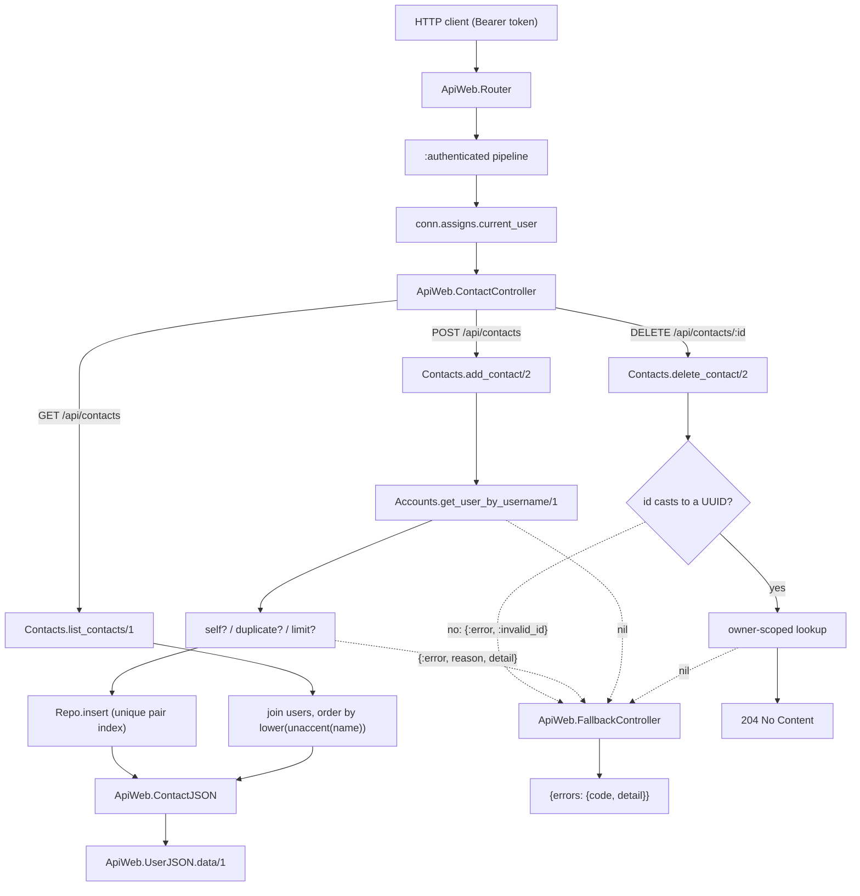
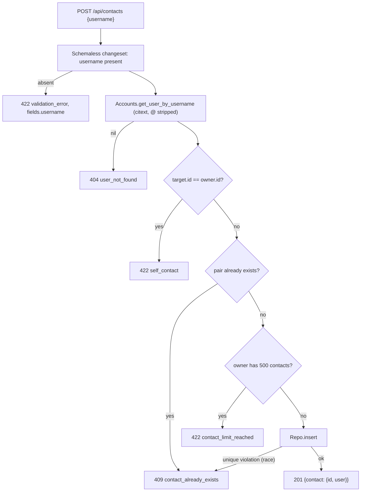

# Technical Specification: Contact Management

**Complexity:** medium

---

## 1. Technical Overview

### What

Introduce `Api.Contacts`, the second domain context, and the three endpoints that maintain a user's personal contact list:

1. **Contact records** — a `contacts` table holding unidirectional `(owner_id, contact_user_id)` pairs with a unique index over the pair, a check constraint forbidding a self-pair, and both foreign keys cascading from `users`. The row carries no state beyond the pair and its creation instant, so it has an `inserted_at` and deliberately no `updated_at`.
2. **`Api.Contacts` context** — `add_contact/2` (resolve a `@username` through `Api.Accounts`, reject self/duplicate/limit, insert), `list_contacts/1` (owner-scoped, joined to the contacted user, ordered accent-insensitively), `delete_contact/2` (rejects a non-UUID id before querying, then scopes the lookup to the owner) and `contact?/2`, the predicate F04 calls to enforce its contact rule.
3. **Endpoints** — `POST /api/contacts`, `GET /api/contacts` and `DELETE /api/contacts/:id`, all behind the `:authenticated` pipeline, plus `ApiWeb.ContactJSON` embedding the canonical user object through `ApiWeb.UserJSON.data/1`.
4. **Five domain error codes** — `invalid_id` (400), `user_not_found` (404), `contact_already_exists` (409), `self_contact` (422) and `contact_limit_reached` (422), registered in the reason-keyed table `ApiWeb.FallbackController` already carries.

No new dependency, no configuration change and no change to the authentication layer. This is the first feature that consumes the seams F01 and F02 built rather than building any of its own.

### Why

Contacts are the authorization root of the product. F04 refuses to open a private conversation with a non-contact and F05 refuses to seat a non-contact in a group, and both ask the same question — *is this user in that user's list?* Answering it in one place from the start is what keeps the rule from being reimplemented, and diverging, across two features. That is why the context exports `contact?/2` even though nothing in F03 itself calls it: the predicate is the feature's real deliverable to the rest of the system, and the three endpoints are the way a user populates what it reads.

The unidirectional model is the reason the table is a plain pair rather than a symmetric friendship. Adding a contact is a private bookkeeping act: the target is not notified, not modified, and gains no row of their own. F04 then layers asymmetric visibility on top — a recipient sees a conversation opened by someone they never added — which only works if "A lists B" and "B lists A" are genuinely independent facts. A symmetric or mutual-consent model would make that behaviour impossible to express and would drag a request/accept state machine into a feature the PRD scopes as a lookup list.

The contact-semantic error codes are worth their table entries because the client renders a different affordance for each. A typo (`user_not_found`) refocuses the input; an existing contact (`contact_already_exists`) is a no-op the UI should treat as success-adjacent; a self-add (`self_contact`) is a UI bug worth surfacing plainly. Collapsing all three into a generic 422 `validation_error` would force the client to string-match `detail`, which is exactly the coupling the single error envelope exists to prevent. F02 built the reason-keyed table anticipating this; F03 is the first feature to fill it, and these entries set the shape for the ones F04–F09 add.

The fifth code, `invalid_id`, is a different kind and is here for a different reason. It says nothing about contacts — it reports that a path segment was not an identifier at all. PRD §6 already fixes this answer for the API when it specifies `invalid_id` at 400 for a malformed conversation id in F08, so F03 registers it rather than inventing a local convention, simply because F03 is the first feature to put an id in a path. Answering 400 discloses nothing a 404 would have hidden: a value that fails a UUID cast cannot name a row, so the response reports a malformed request and never whether some contact exists or whose list it belongs to.

Finally, the ordering guarantee is a server obligation on purpose. The PRD's reference screen groups contacts by initial letter, and a client that sorts a JavaScript array with the default comparator places `Álvaro` after `Zoe`. Ordering by `lower(unaccent(name))` in the query means every client — and the seeded demo data an evaluator sees first — gets the same, correct order without implementing Unicode collation itself.

### Scope

**Included:**
- `contacts` migration: pair table, unique index on `(owner_id, contact_user_id)`, supporting index on `contact_user_id`, self-pair check constraint, both FKs `ON DELETE CASCADE`
- `Api.Contacts.Contact` schema: two `belongs_to` associations to `Api.Accounts.User`, `inserted_at` only, and a constraint-only changeset
- `Api.Contacts` context: `add_contact/2`, `list_contacts/1`, `delete_contact/2`, `contact?/2`; its `Boundary` declaration and export from `lib/api.ex`
- `ApiWeb.ContactController` with `create/2`, `index/2` and `delete/2`, and `ApiWeb.ContactJSON`
- Three routes added to the router's existing `:authenticated` scope
- `ApiWeb.FallbackController` extended with the five new reasons, one of which (`invalid_id`) is the API-wide answer to a malformed path param that F08 later reuses
- `contact_factory/0` in `Api.Factory`
- Context and controller test suites, plus the cross-feature test proving a registered user is resolvable by `@username` in the add-contact flow

**Excluded (owned by other features):**
- Enforcing the contact rule when opening a conversation or creating a group — F04 and F05 consume `contact?/2`; F05 additionally needs a set check that reports the offending usernames, which is F05's contract to design
- The criterion *"removing a contact leaves any existing conversation with that user, and its messages, intact and retrievable"* — no conversation exists until F04. F03's obligation is structural (nothing cascades out of `contacts`), and the criterion is verified in F04. See §7.
- Contact lists in seed data — F11 consumes these endpoints
- Presence or `last_seen_at` on a contact entry — F10 writes the column; F03 renders whatever it holds because the shared user object carries it
- User discovery, directory search, blocking and privacy settings — out of scope per PRD §7; a contact is added by exact `@username` only

---

## 2. Architecture Impact

### Affected components

| Layer | Component | Path |
|---|---|---|
| Domain | Contacts context | `lib/api/contacts.ex` |
| Domain | Contact schema | `lib/api/contacts/contact.ex` |
| Domain | Boundary root export list | `lib/api.ex` |
| Web | Contact endpoints | `lib/api_web/controllers/contact_controller.ex` |
| Web | Contact rendering | `lib/api_web/controllers/contact_json.ex` |
| Web | Four new domain reasons | `lib/api_web/controllers/fallback_controller.ex` |
| Web | Routes in the `:authenticated` scope | `lib/api_web/router.ex` |
| Database | Contacts table | `priv/repo/migrations/*_create_contacts.exs` |
| Test | Contact factory | `test/support/factory.ex` |

### Request flow



### Add-contact decision order

The order below is the contract, not an implementation detail: it decides which error a caller sees when two conditions hold at once. Duplicate is checked before the limit so a user at the ceiling who re-adds an existing contact is told the truth rather than being asked to prune their list.



---

## 3. Technical Decisions

| Decision | Chosen Approach | Alternative Considered | Trade-off |
|---|---|---|---|
| Contact payload shape | Contact row id plus the canonical user object nested under `user`, rendered by `ApiWeb.UserJSON.data/1` | Flatten `user_id`, `username` and `name` onto the contact, matching the PRD's wording literally | A slightly deeper payload and one field (`last_seen_at`) the contacts screen does not use yet. Buys the single user shape `UserJSON`'s moduledoc already promises contacts would use, so the client reuses one generated type across contacts, message senders and group members, and F10's `last_seen_at` reaches this endpoint with no change here. |
| Alphabetical ordering | `ORDER BY lower(unaccent(name)), id` in the query | An ICU nondeterministic collation on `users.name`, or sorting in Elixir after the fetch | the one-argument `unaccent()` is `STABLE`, not `IMMUTABLE`, so this expression cannot back an index — every list request sorts in memory (§6 records the two-argument escape hatch F09 will need). At a hard ceiling of 500 rows per user that is free, and the alternative costs either a Postgres-version-dependent collation migration or moving a documented API guarantee out of the database. `id` is the tie-break so two contacts sharing a display name still have a total order. |
| Duplicate detection | Existence pre-check for the friendly message, with the unique index caught as a backstop that maps the same reason | Rely solely on the unique index and translate the constraint error | One extra indexed lookup per add. Buys a 409 that names the username in `detail` (the pre-check has the record in hand) while still answering 409 rather than 500 when two devices add the same contact concurrently — the same defensive shape F04 will need for its idempotent conversation creation. |
| Self-add prevention | Guard in the context **and** a `CHECK (owner_id <> contact_user_id)` constraint | Context guard alone | A constraint that should never fire. Buys an invariant the database owns, so a future seed script or bulk import cannot write a self-contact through a path that bypasses the context, while the guard is what produces the typed 422 the client branches on. |
| Contact ceiling | `Repo.aggregate(:count)` scoped to the owner, checked before insert | A database trigger, or a denormalised counter column on `users` | A benign race: two simultaneous adds at exactly 499 can both pass and leave 501 rows. The limit exists to bound the unindexed sort and the response size, and 501 does neither harm; a trigger or counter would cost write contention on every add to defend a number that is a soft guardrail. |
| Timestamps on `contacts` | `inserted_at` only, via `timestamps(updated_at: false)` | The `Api.Schema` default of both columns | Diverges from the two-column shape every other table will have. Buys honesty: a contact row is a pair that is inserted and deleted, never modified, so an `updated_at` that always equals `inserted_at` would be a column the client and every later migration must reason about for nothing. |
| Malformed `:id` on delete | 400 `invalid_id`, distinct from the 404 an unknown or foreign id receives | 404 `not_found` for every rejected id alike, collapsing the two into one branch | One extra branch and one extra error code. Buys the split the PRD already fixes for this API — F08 specifies `invalid_id` at 400 for a non-UUID conversation id — so a path param is rejected the same way at every endpoint. Discloses nothing: a value that is not a UUID cannot name a row, so answering 400 says only that the request was malformed, never whether a contact exists or whose it is. F03 owns the code because it is the first feature with an id in a path. |
| Predicate surface | Export `contact?/2` only | Also ship the set check F05 needs for its multi-member validation | F05 adds a second query rather than reusing one. Buys not guessing, a feature early, the return shape F05 needs — its error must name the offending usernames, so the set check returns records, not a boolean, and designing that without its consumer invites a rewrite. |
| Username resolution | Reuse `Accounts.get_user_by_username/1` unchanged | A `Contacts`-local query against `users` | `Api.Contacts` declares a boundary dependency on `Api.Accounts`. Buys one place where the `@`-stripping and case-insensitive `citext` lookup live, so login, add-contact and F11's seeds resolve a username identically. |

---

## 4. Component Overview

### Domain layer

| File Path | New/Modified | Purpose | Key Responsibilities |
|---|---|---|---|
| `lib/api/contacts/contact.ex` | New | Contact schema | `use Api.Schema`; `belongs_to :owner, User` and `belongs_to :user, User, foreign_key: :contact_user_id`; `timestamps(updated_at: false)`; a constraint-only changeset applying `unique_constraint/2` on the pair index, `check_constraint/3` on the self-pair check and `foreign_key_constraint/2` on both keys. Both ids are set programmatically when the struct is built and appear in no `cast/3` call. |
| `lib/api/contacts.ex` | New | Contacts context | `add_contact/2` running the §2 decision order and returning `{:ok, contact}` with the user preloaded, or a typed error tuple carrying its interpolated detail; `list_contacts/1` joining the contacted user and ordering accent-insensitively; `delete_contact/2` casting the id and returning `{:error, :invalid_id}` when the cast fails, otherwise scoping the lookup to the owner and returning `:ok` or `{:error, :not_found}`; `contact?/2` as an indexed `Repo.exists?`. Declares `use Boundary, deps: [Api, Api.Accounts], exports: [Contact]`. |
| `lib/api.ex` | Modified | Boundary root | Add the mass export `{Contacts, []}` alongside `{Accounts, []}` so `ApiWeb` reaches the context and its `Contact` struct |

### Web layer

| File Path | New/Modified | Purpose | Key Responsibilities |
|---|---|---|---|
| `lib/api_web/controllers/contact_controller.ex` | New | Contact endpoints | `create/2` validating the body with a schemaless changeset (the `validate_login/1` pattern from `AuthController`) before delegating to the context, → 201; `index/2` → 200; `delete/2` → 204 with an empty body via `send_resp/3`; `action_fallback ApiWeb.FallbackController`; reads `conn.assigns.current_user` and never accepts an owner from the request |
| `lib/api_web/controllers/contact_json.ex` | New | Contact rendering | `data/1` returning `%{id: contact.id, user: ApiWeb.UserJSON.data(contact.user)}`; `show/1` wrapping one as `%{contact: ...}` and `index/1` wrapping a list as `%{contacts: [...]}` |
| `lib/api_web/controllers/fallback_controller.ex` | Modified | Error translation | Add `invalid_id`, `user_not_found`, `contact_already_exists`, `self_contact` and `contact_limit_reached` to the reason table with the statuses and default details in §5. The existing `{:error, reason, detail}` clause already supplies the username-interpolated variants, so no new clause is needed. |
| `lib/api_web/router.ex` | Modified | Routes | Three routes inside the existing `:authenticated` scope: `post "/contacts"`, `get "/contacts"`, `delete "/contacts/:id"` |

### Database

| Migration File | Tables Affected | Operation | Notes |
|---|---|---|---|
| `priv/repo/migrations/<ts>_create_contacts.exs` | `contacts` | CREATE TABLE + 2× CREATE INDEX + CHECK | UUID PK defaulting to `gen_random_uuid()`, both FKs `references(:users, type: :binary_id, on_delete: :delete_all)`, `timestamps(type: :utc_datetime_usec, updated_at: false)` |

### Test support

| File Path | New/Modified | Purpose | Key Responsibilities |
|---|---|---|---|
| `test/support/factory.ex` | Modified | Test data | Add `contact_factory/0` building a `%Contact{}` with `owner: build(:user)` and `user: build(:user)`, so `insert(:contact, owner: ana)` reads naturally and a bare `insert(:contact)` produces a valid, non-self pair |

---

## 5. API Contracts

All three endpoints require `Authorization: Bearer <token>` and operate exclusively on the authenticated caller's list. The owner is always `conn.assigns.current_user` and is never read from the request.

### Shared contact object

| Field | Type | Description |
|---|---|---|
| `id` | `uuid` | The contact row's id — the value `DELETE /api/contacts/:id` takes. Not the contacted user's id. |
| `user` | `object` | The canonical user object from `ApiWeb.UserJSON.data/1` (F02) |
| `user.id` | `uuid` | The contacted user's id — the value F04 and F05 take as `user_id` / `member_ids` |
| `user.username` | `string` | Bare, lowercase; the leading `@` is a display convention |
| `user.name` | `string` | Display name |
| `user.last_seen_at` | `string \| null` | ISO 8601 UTC; `null` until F10 writes it |

```json
{
  "id": "a2f1b0c9-7d3e-4a51-8f6b-2c9d0e4a7b13",
  "user": {
    "id": "3f1c2d4e-8a91-4c7b-9b23-6e0f5a2d1c88",
    "username": "anabeatriz",
    "name": "Ana Beatriz",
    "last_seen_at": null
  }
}
```

### Endpoint: Add Contact

- **Method:** POST
- **Path:** `/api/contacts`
- **Authentication:** Bearer token

**Request:**

| Field | Type | Required | Validation | Description |
|---|---|---|---|---|
| `username` | `string` | Yes | Non-empty. A leading `@` is stripped and the value is matched case-insensitively against the `citext` column. No format check is applied — a value that cannot be a username simply resolves to nobody. | The `@username` of the user to add |

**Request Example:**
```json
{ "username": "@AnaBeatriz" }
```

**Response (Success — 201):**

| Field | Type | Description |
|---|---|---|
| `contact` | `object` | The shared contact object, with the contacted user embedded so the client inserts it into the rendered list without refetching |

```json
{
  "contact": {
    "id": "a2f1b0c9-7d3e-4a51-8f6b-2c9d0e4a7b13",
    "user": {
      "id": "3f1c2d4e-8a91-4c7b-9b23-6e0f5a2d1c88",
      "username": "anabeatriz",
      "name": "Ana Beatriz",
      "last_seen_at": null
    }
  }
}
```

**Response (Failure — 404):**
```json
{
  "errors": {
    "code": "user_not_found",
    "detail": "No user with @fulano123 exists in the system"
  }
}
```

The echoed username is the **normalised** form — `@` stripped, downcased — and is truncated to 20 characters, the maximum username length, so the detail can never carry an unbounded reflection of the request body.

**Response (Failure — 409):**
```json
{
  "errors": {
    "code": "contact_already_exists",
    "detail": "@anabeatriz is already in your contacts"
  }
}
```

**Error Codes:**

| Code | HTTP Status | Description |
|---|---|---|
| `user_not_found` | 404 | No user carries that `@username`; the searched name appears in `detail` |
| `contact_already_exists` | 409 | The pair is already in the caller's list; no second row is created. Also the answer when two concurrent requests race past the pre-check. |
| `self_contact` | 422 | The resolved user is the caller. `detail`: `"You cannot add yourself as a contact"` |
| `contact_limit_reached` | 422 | The caller already holds 500 contacts. `detail`: `"You have reached the maximum of 500 contacts"` |
| `validation_error` | 422 | `username` absent or blank; `fields.username` names it |
| `unauthenticated` | 401 | Missing or invalid token (F02) |

### Endpoint: List Contacts

- **Method:** GET
- **Path:** `/api/contacts`
- **Authentication:** Bearer token

**Request:** no body, no query parameters. The response is unpaginated by design — the 500-contact ceiling bounds it.

**Response (Success — 200):**

| Field | Type | Description |
|---|---|---|
| `contacts` | `array` | Every contact of the caller, ascending by `lower(unaccent(user.name))` then `user.id`. Empty array when the caller has none — never 404. |

```json
{
  "contacts": [
    {
      "id": "b7c3d1e5-0f42-4b88-91a7-5d2e8c0f3a44",
      "user": {
        "id": "9e2a7c14-3b58-4d09-a6f2-1c7b4e850d3f",
        "username": "alvarom",
        "name": "Álvaro Mendes",
        "last_seen_at": null
      }
    },
    {
      "id": "a2f1b0c9-7d3e-4a51-8f6b-2c9d0e4a7b13",
      "user": {
        "id": "3f1c2d4e-8a91-4c7b-9b23-6e0f5a2d1c88",
        "username": "anabeatriz",
        "name": "Ana Beatriz",
        "last_seen_at": null
      }
    }
  ]
}
```

The example shows the guarantee: `Álvaro` folds to `alvaro` and therefore precedes `Ana Beatriz`, rather than being pushed past `Z` as a naive byte or `String.downcase/1` comparison would do.

**Error Codes:**

| Code | HTTP Status | Description |
|---|---|---|
| `unauthenticated` | 401 | Missing or invalid token (F02) |

### Endpoint: Remove Contact

- **Method:** DELETE
- **Path:** `/api/contacts/:id`
- **Authentication:** Bearer token

**Request:**

| Parameter | Type | Required | Validation | Description |
|---|---|---|---|---|
| `id` | `uuid` (path) | Yes | Cast to a UUID before the lookup; a value that fails the cast is rejected as a malformed request rather than looked up | The **contact row** id, as returned by either of the endpoints above |

**Response (Success — 204):** empty body.

**Response (Failure — 400):**
```json
{
  "errors": {
    "code": "invalid_id",
    "detail": "The provided id is not a valid identifier"
  }
}
```

**Error Codes:**

| Code | HTTP Status | Description |
|---|---|---|
| `invalid_id` | 400 | The path segment is not a UUID and therefore names nothing. Answering 400 rather than 404 discloses no ownership — a non-UUID cannot correspond to a row — and tells the client its request was malformed instead of letting a bug read as an empty result. |
| `not_found` | 404 | The id is a well-formed UUID but is unknown, belongs to another user's list, or was already deleted — one indistinguishable answer across all three, so contact ownership is never disclosed |
| `unauthenticated` | 401 | Missing or invalid token (F02) |

Deleting is not a cascade: the contacted user's account, and any conversation or message already exchanged with them, are untouched. Only the pair row is removed.

### Error codes introduced by F03

| Code | HTTP Status | Default detail |
|---|---|---|
| `invalid_id` | 400 | `"The provided id is not a valid identifier"` — the API-wide answer to a path param that fails a UUID cast. F03 introduces it as the first feature with an id in a path; F08 reuses it for conversation ids, as PRD §6 F08 specifies. |
| `user_not_found` | 404 | `"No user with that @username exists in the system"` — F04 reuses this code for an unknown target user id |
| `contact_already_exists` | 409 | `"This user is already in your contacts"` |
| `self_contact` | 422 | `"You cannot add yourself as a contact"` |
| `contact_limit_reached` | 422 | `"You have reached the maximum of 500 contacts"` |

Each default is overridden with an interpolated message through the fallback controller's existing `{:error, reason, detail}` clause where the PRD specifies one. `self_contact` and `contact_limit_reached` are 422 responses carrying **no** `fields` key — they are not field validation failures, and the client branches on `code`, not on the presence of `fields`.

---

## 6. Data Model

### Table: `contacts`

| Column | Type | Nullable | Default | Description |
|---|---|---|---|---|
| `id` | `uuid` | No | `gen_random_uuid()` | Primary key; the value `DELETE /api/contacts/:id` addresses |
| `owner_id` | `uuid` | No | — | FK → `users(id)`; the user whose list this row belongs to |
| `contact_user_id` | `uuid` | No | — | FK → `users(id)`; the user being listed |
| `inserted_at` | `timestamptz(6)` | No | — | `utc_datetime_usec` per `Api.Schema` |

No `updated_at`: the row is a pair that is inserted and deleted, never modified.

**Indexes:**

| Index Name | Columns | Type | Purpose |
|---|---|---|---|
| `contacts_pkey` | `id` | btree (PK) | Primary key; serves the owner-scoped delete lookup |
| `contacts_owner_id_contact_user_id_index` | `owner_id`, `contact_user_id` | btree unique | Enforces one row per pair; its leftmost prefix serves `list_contacts/1`'s owner scan, and the full key serves both the duplicate pre-check and `contact?/2` as exact matches |
| `contacts_contact_user_id_index` | `contact_user_id` | btree | Keeps `ON DELETE CASCADE` from `users` off a sequential scan when an account is removed |

No index supports the ordering — the one-argument `unaccent(text)` is `STABLE`, not `IMMUTABLE`, because it resolves its dictionary through the search path, so the expression cannot back an index. The 500-row ceiling makes the in-memory sort irrelevant here.

**Note for F09,** which filters an unbounded conversation list with `unaccent` + `ILIKE` and therefore does need an index: the *two-argument* form `unaccent('unaccent'::regdictionary, name)` names its dictionary explicitly and **is** `IMMUTABLE`, so it can back an expression index without a custom wrapper function. F03 deliberately does not create that index — it would serve no query this feature issues — but the escape hatch is recorded here so F09 does not rediscover it.

**Constraints:**

| Constraint | Type | Definition | Purpose |
|---|---|---|---|
| `contacts_pkey` | PRIMARY KEY | `id` | Unique identifier |
| `contacts_owner_id_contact_user_id_index` | UNIQUE | `(owner_id, contact_user_id)` | Backs `unique_constraint/2`, so a concurrent duplicate surfaces as a 409 rather than a 500 |
| `contacts_owner_id_fkey` | FOREIGN KEY | `owner_id REFERENCES users(id) ON DELETE CASCADE` | A deleted account takes its own list with it |
| `contacts_contact_user_id_fkey` | FOREIGN KEY | `contact_user_id REFERENCES users(id) ON DELETE CASCADE` | A deleted account disappears from everyone else's list |
| `contacts_not_self` | CHECK | `owner_id <> contact_user_id` | A self-contact is unrepresentable, whichever path writes the row |

**Migration:**
```sql
CREATE TABLE contacts (
    id              UUID PRIMARY KEY DEFAULT gen_random_uuid(),
    owner_id        UUID NOT NULL REFERENCES users(id) ON DELETE CASCADE,
    contact_user_id UUID NOT NULL REFERENCES users(id) ON DELETE CASCADE,
    inserted_at     TIMESTAMPTZ(6) NOT NULL,
    CONSTRAINT contacts_not_self CHECK (owner_id <> contact_user_id)
);

CREATE UNIQUE INDEX contacts_owner_id_contact_user_id_index
    ON contacts (owner_id, contact_user_id);

CREATE INDEX contacts_contact_user_id_index ON contacts (contact_user_id);
```

### Query shapes

| Function | Shape | Index used |
|---|---|---|
| `list_contacts/1` | `contacts` joined to `users` on `contact_user_id`, filtered by `owner_id`, ordered by `lower(unaccent(u.name))` then `u.id`, with the user preloaded from the join | Pair index (leftmost prefix) |
| `contact?/2` | `Repo.exists?` on the pair | Pair index (exact) |
| duplicate pre-check | `Repo.exists?` on the pair | Pair index (exact) |
| limit check | `Repo.aggregate(:count)` filtered by `owner_id` | Pair index (leftmost prefix, index-only) |
| `delete_contact/2` | `Ecto.UUID.cast/1`, then `Repo.get_by(id, owner_id)` and `Repo.delete/1` | Primary key, filtered on owner; a failed cast never reaches the database |

### Business rules

| Rule | Enforced where | Failure surface |
|---|---|---|
| A contact list is unidirectional | Schema shape — only `owner_id`'s row is written | — |
| One row per `(owner, contact)` pair | Unique index + pre-check | 409 `contact_already_exists` |
| No self-contact | Context guard + check constraint | 422 `self_contact` |
| At most 500 contacts per owner | Context count check | 422 `contact_limit_reached` |
| Only the owner may read or delete their rows | Every query scoped to `conn.assigns.current_user` | 404 `not_found` on delete; other lists are simply unreachable |
| Deleting a contact removes nothing else | No cascade originates from `contacts` | — |

---

## 7. Testing Strategy

### Test file structure

| Test File | Test Type | Target | Coverage Goal |
|---|---|---|---|
| `test/api/contacts_test.exs` | Unit | `Api.Contacts` | 100% |
| `test/api_web/controllers/contact_controller_test.exs` | Integration | The three endpoints through the real authenticated pipeline | 95% |
| `test/api_web/controllers/fallback_controller_test.exs` | Unit (modified) | The five new reason-table entries | 100% |

`Api.Contacts.Contact` gets no dedicated test file: its changeset applies constraints only and carries no validation logic of its own, so every branch of it is reached through the context suite. Overall gate unchanged: `mix coveralls --minimum-coverage 80` over `lib/api`.

### `contacts_test.exs`

| Test Function | Description | Assertions |
|---|---|---|
| `test "add_contact/2 resolves a username and persists the pair"` | Happy path | `{:ok, contact}`; row exists; `owner_id`/`contact_user_id` correct; `contact.user` preloaded |
| `test "add_contact/2 resolves case-insensitively and accepts a leading @"` | Table-driven over `"anabeatriz"`, `"AnaBeatriz"`, `"@anabeatriz"`, `"@AnaBeatriz"` | All four resolve to the same user id |
| `test "add_contact/2 returns :user_not_found for an unknown username"` | — | `{:error, :user_not_found, detail}`; detail contains the normalised name; no row inserted |
| `test "add_contact/2 truncates an oversized username in the detail"` | 200-character input | Detail carries at most 20 characters of it |
| `test "add_contact/2 returns :self_contact when the target is the owner"` | Owner adds their own username | `{:error, :self_contact}`; no row inserted |
| `test "add_contact/2 returns :contact_already_exists on a second add"` | Add twice | Second is `{:error, :contact_already_exists, detail}`; exactly one row |
| `test "add_contact/2 is unidirectional"` | Ana adds Carlos | Carlos's own list is empty; no row with `owner_id == carlos.id` |
| `test "add_contact/2 returns :contact_limit_reached at the ceiling"` | Seed 500 rows with `Repo.insert_all` so the boundary is reached in one statement | `{:error, :contact_limit_reached}`; still 500 rows |
| `test "add_contact/2 reports a duplicate ahead of the limit"` | 500 rows, then re-add one of them | `{:error, :contact_already_exists, _}`, proving the §2 decision order |
| `test "a duplicate pair inserted through the changeset is a constraint error"` | Bypass the pre-check by inserting the same pair twice through `Contact` directly | `{:error, changeset}` on the pair, not a raised `Postgrex.Error` — the race backstop |
| `test "the database rejects a self-pair written directly"` | Insert `owner_id == contact_user_id` through the changeset | Constraint error surfaces on the changeset; no row |
| `test "list_contacts/1 returns only the owner's contacts"` | Two owners with contacts each | Only the caller's rows; the other owner's are absent |
| `test "list_contacts/1 sorts case- and accent-insensitively"` | Names `"Álvaro"`, `"ana"`, `"Bruno"`, `"Ángela"`, `"zoe"` | Order is `Álvaro, ana, Ángela, Bruno, zoe` — accents fold and case is ignored |
| `test "list_contacts/1 breaks ties on a stable key"` | Two contacts with the identical display name | Order is deterministic across repeated calls |
| `test "list_contacts/1 preloads the contacted user"` | — | `contact.user` is a loaded `%User{}`, never `%Ecto.Association.NotLoaded{}` |
| `test "list_contacts/1 returns an empty list for a user with no contacts"` | — | `[]`, not an error |
| `test "delete_contact/2 removes the row"` | — | `:ok`; the row is gone; `list_contacts/1` no longer returns it |
| `test "delete_contact/2 returns :not_found for another user's contact id"` | Carlos deletes Ana's contact id | `{:error, :not_found}`; Ana's row still exists |
| `test "delete_contact/2 returns :not_found for an unknown id"` | Well-formed UUID naming nothing | `{:error, :not_found}` |
| `test "delete_contact/2 returns :invalid_id for a value that is not a UUID"` | Table-driven over `"not-a-uuid"`, `""`, a 200-character string | `{:error, :invalid_id}` for each; no raise and no query issued |
| `test "delete_contact/2 leaves the contacted user's account intact"` | — | The `users` row still exists after the contact is deleted |
| `test "deleting a user cascades to both sides of the contact list"` | Delete a user who is both an owner and someone else's contact | Both rows gone; the other users' accounts untouched |
| `test "contact?/2 is true only for a persisted pair"` | Both directions of one pair | `true` for `(ana, carlos)`; `false` for `(carlos, ana)` and for an unrelated user |

### `contact_controller_test.exs`

Maps directly to F03's PRD Section 9 acceptance criteria.

| Test Function | Description | Assertions |
|---|---|---|
| `test "POST /api/contacts returns 201 with the contact and its user"` | Valid body | 201; `contact.id` present; `contact.user` carries `id`, `username`, `name`, `last_seen_at` |
| `test "POST /api/contacts resolves a leading @ and a bare username identically"` | Two registered users, one added each way | Both 201; both `contact.user.id` values match the intended targets |
| `test "POST /api/contacts returns 404 user_not_found naming the username"` | Unknown name | 404; `errors.code == "user_not_found"`; `errors.detail` contains `"@fulano123"` |
| `test "POST /api/contacts returns 409 on a duplicate and creates no second row"` | Add twice | Second is 409 `contact_already_exists`; `Repo.aggregate(Contact, :count) == 1` |
| `test "POST /api/contacts returns 422 self_contact when adding oneself"` | Caller's own username | 422; `errors.code == "self_contact"`; no row |
| `test "POST /api/contacts returns 422 validation_error when username is absent"` | Empty body and blank string | 422; `errors.code == "validation_error"`; `errors.fields.username` populated |
| `test "POST /api/contacts creates no row in the target's list"` | Ana adds Carlos, Carlos lists | Carlos's `GET /api/contacts` returns `[]` |
| `test "GET /api/contacts returns only the caller's contacts, sorted"` | Two users with overlapping contacts, names chosen to exercise accents and case | 200; ids match the caller's rows only; order is the accent-folded ascending order |
| `test "GET /api/contacts returns an empty array for a new user"` | — | 200; `%{"contacts" => []}` |
| `test "DELETE /api/contacts/:id returns 204 and removes it from the list"` | — | 204 with an empty body; the next `GET` omits it |
| `test "DELETE /api/contacts/:id returns 404 for another user's contact"` | Carlos deletes Ana's contact id | 404 `not_found`, **not** 403; Ana's list is unchanged |
| `test "DELETE /api/contacts/:id returns 404 for a repeated delete"` | Delete twice | Second is 404 |
| `test "DELETE /api/contacts/:id returns 400 invalid_id for a non-UUID id"` | `"not-a-uuid"` | 400; `errors.code == "invalid_id"`; no 500, no cast exception |
| `test "DELETE /api/contacts/:id distinguishes a malformed id from a hidden one"` | A non-UUID against a well-formed UUID belonging to another user | 400 `invalid_id` for the first, 404 `not_found` for the second — the split is observable and ownership stays undisclosed |
| `test "every contact route requires authentication"` | All three routes with no token and with a forged one | 401 `unauthenticated` on each; nothing written |
| `test "no contact response exposes hashed_password"` | Create and list bodies | Neither key nor any hash-shaped value present |

### `fallback_controller_test.exs` (modified)

| Test Function | Description | Assertions |
|---|---|---|
| `test "translates the contact reasons to their codes and statuses"` | Table-driven over the five new reasons | `invalid_id` → 400, `user_not_found` → 404, `contact_already_exists` → 409, `self_contact` → 422, `contact_limit_reached` → 422, each with its own `code` |
| `test "invalid_id does not collide with the endpoint-level 400"` | Compare against F01's `malformed_request`, the other 400 in the API | Both are 400 but carry distinct codes, so a client tells a bad path param from an unparseable body |
| `test "a contact reason at 422 carries no fields key"` | `:self_contact` | Body has `code` and `detail`, and no `fields` — distinguishing it from a changeset 422 |
| `test "an explicit detail still overrides a contact reason's default"` | `{:error, :user_not_found, "..."}` | Detail replaced, code and status unchanged |

### Cross-feature integration

| Criterion | Where verified | Form |
|---|---|---|
| A user record created by registration (F02) is resolvable by `@username` in the add-contact flow (F03), and the returned contact carries that user's id and display name | **Here** — `contact_controller_test.exs` | An end-to-end test registering a user through `POST /api/auth/register`, then adding them through `POST /api/contacts` with the returned `username`, asserting the response's `contact.user.id` and `contact.user.name` equal the registration response's |
| A contact added in F03 is accepted as the target of a private conversation (F04), and a user removed from contacts is rejected on the next creation attempt | F04 | F03's contract is `Contacts.contact?/2`, evaluated at request time so a removal takes effect on the next call |
| A contact added in F03 is accepted in `member_ids` when creating a group (F05), and a non-contact id in the same array fails the whole creation | F05 | F03 provides the pair table and its exact-match index; F05 adds the set check that reports offending usernames |
| Seeded contact lists (F11) are returned by the F03 contacts endpoint for each seeded user | F11 | `Contacts.add_contact/2` is the single write path, so seeded rows pass the same guards as API-created ones |

### Acceptance criteria not covered by this feature

| Criterion | Reason |
|---|---|
| *"Removing a contact leaves any existing conversation with that user, and its messages, intact and retrievable"* | No conversation or message table exists until F04 and F06. F03 discharges the structural half — no cascade originates from `contacts`, verified by the delete tests above — and the criterion is asserted end to end in F04, whose own criteria already include *"after the initiator removes the counterpart from contacts, the existing conversation is still readable but a new creation call returns 403"*. |
