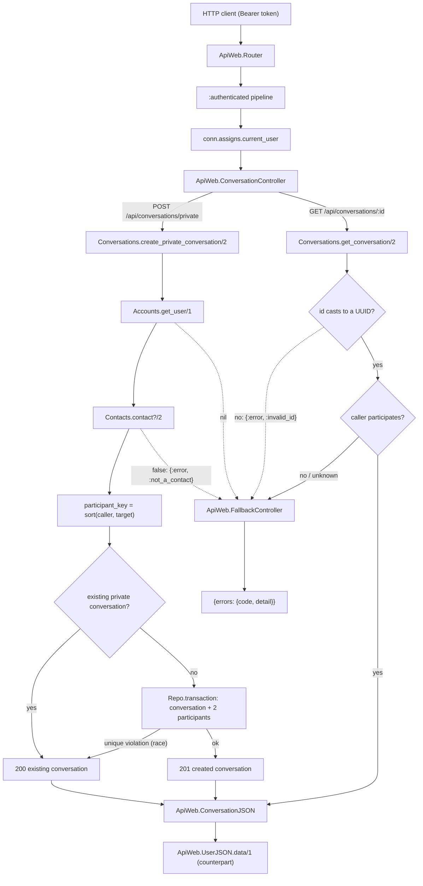
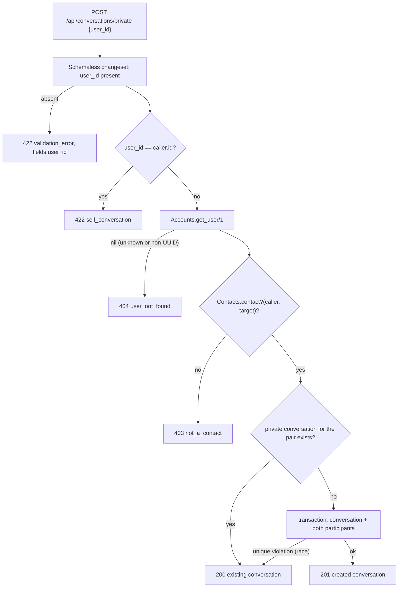

# Technical Specification: Private Conversations

**Complexity:** medium

---

## 1. Technical Overview

### What

Introduce `Api.Conversations`, the domain context that owns every conversation in the product, and the two endpoints that open and read a private one-to-one thread:

1. **The shared conversation schema** — a `conversations` table with a `type` discriminator (`:private` | `:group`), a nullable `name` and `creator_id` that only groups fill, and a `participant_key` that makes a private pair unique; plus a `conversation_participants` table holding one row per member with `last_read_at`, `joined_at` and a nullable `left_at`. Both tables are introduced here because a single table for both conversation kinds is the PRD's design; F05 seats groups in exactly the same rows and adds no base migration of its own.
2. **`Api.Conversations` context** — `create_private_conversation/2` (resolve the target, reject self/unknown/non-contact, then create-or-return idempotently inside one transaction), `get_conversation/2` (participant-scoped read that denormalises the counterpart), and `participant?/2`, the predicate F06's history endpoint, F07's channel `join/3` and its send path will each consume as their single authorization source.
3. **Endpoints** — `POST /api/conversations/private` returning 201 on first creation and 200 on every repeat for the same pair, and `GET /api/conversations/:id` returning the private conversation with its counterpart embedded, both behind the `:authenticated` pipeline, plus `ApiWeb.ConversationJSON`.
4. **Two domain error codes** — `not_a_contact` (403) and `self_conversation` (422), registered in the reason-keyed table `ApiWeb.FallbackController` already carries; the feature reuses `user_not_found` (404), `invalid_id` (400) and `validation_error` (422) unchanged from F03/F01.

No new dependency and no configuration change. F04 is the first feature to write to a shared schema that three later features read, so the shape it fixes here — one conversations table, one participant row per membership, one participation predicate — is the contract F05, F06, F07 and F08 build on.

### Why

A private conversation is not a table of its own; it is a `conversations` row of `type: :private` with exactly two `conversation_participants`. Modelling both private and group threads on the same two tables is what lets F06 write one `messages.conversation_id` foreign key, F07 join one `conversation:<id>` topic, and F08 answer one inbox query, rather than each feature branching on a kind it has to detect. The cost is a `type` discriminator and a handful of columns that stay null for private rows; the alternative — separate `private_conversations` and `group_conversations` tables — would double every downstream query and force a union the moment the inbox has to list both. Because F04 and F05 share this schema and run in the same wave, F04 creates the whole of it up front so there is a single, ordered base migration rather than two that race to add columns to the same table.

Idempotent creation is the feature's sharpest requirement and the reason the schema carries a `participant_key`. "Opening a conversation with the same contact twice returns the same conversation" cannot be enforced by a unique index over the participant rows, because the pair lives in two rows in a child table, not one value on the conversation. So the context computes a deterministic key from the two user ids sorted and joined, stores it on the private conversation, and puts a unique index on it. A pre-check returns the existing conversation with 200 for the ordinary double-click or reload; the unique index is the backstop that turns two genuinely concurrent creates into one winner and one 200 rather than a duplicate or a 500 — the same defensive shape F03 used for a duplicate contact, now guarding a two-row transaction. Sorting the pair before hashing is what makes the key symmetric, so A-opens-B and B-opens-A collapse onto one row.

The authorization predicate is exported for the same reason F03 exported `contact?/2`: it is the feature's real deliverable to the rest of the system. F06's history read, F07's channel join and F07's send are three separate code paths that must answer one question — *may this user see this conversation?* — and the PRD's whole authorization argument rests on that question being answered in one place. F04 introduces `participant?/2` in the form F04 needs, an active-membership check, and deliberately stops there: F06 extends it to bound a departed group member's visibility at `left_at`, and designing that bound now, a feature and a table (`messages`) early, would be guessing the shape of a consumer that does not yet exist. Introducing the predicate but not over-fitting it is the same discipline F03 applied when it shipped `contact?/2` but left the group set-check to F05.

The contact rule is enforced on creation and nowhere else, and that asymmetry is deliberate. `create_private_conversation/2` calls `Contacts.contact?/2`; `get_conversation/2` does not. The result is the PRD's asymmetric visibility for free: the initiator must have the target as a contact to *open* the thread, but the recipient — who may never have added the initiator back — *reads* it and receives its messages, because reading is gated on participation, not on contact. This is also why removing a contact later leaves the conversation readable while blocking a new one: the removal changes what `contact?/2` answers on the next *create*, and touches no participant row.

The two new error codes earn their table entries because the client renders a different affordance for each, exactly as in F03. `not_a_contact` (403) is a rule the user can fix by adding the contact first; `self_conversation` (422) is a UI bug worth surfacing plainly. Collapsing either into a generic status would force the client to string-match `detail`, the coupling the single envelope exists to prevent. `not_a_contact` is registered at 403 with a message F05 will reuse — its own not-a-contact failure names the offending usernames, so F05 overrides the detail through the fallback controller's existing `{:error, reason, detail}` clause rather than adding a second code.

### Scope

**Included:**
- `conversations` migration creating **both** shared tables: `conversations` (`type`, nullable `name`/`creator_id`, `participant_key`) and `conversation_participants` (`last_read_at`, `joined_at`, nullable `left_at`), with the partial unique index on `participant_key` for private pairs and the unique index on `(conversation_id, user_id)`
- `Api.Conversations.Conversation` and `Api.Conversations.Participant` schemas on `Api.Schema`, with changesets that apply the database guarantees as changeset errors
- `Api.Conversations` context: `create_private_conversation/2`, `get_conversation/2`, `participant?/2`; its `Boundary` declaration and export from `lib/api.ex`
- `ApiWeb.ConversationController` with `create_private/2` and `show/2`, and `ApiWeb.ConversationJSON` embedding the counterpart through `ApiWeb.UserJSON.data/1`
- Two routes added to the router's existing `:authenticated` scope
- `ApiWeb.FallbackController` extended with `not_a_contact` (403) and `self_conversation` (422)
- `conversation_factory/0`, `participant_factory/0` and a `private_conversation` test helper in `Api.Factory`
- Context and controller test suites, plus the cross-feature test proving a contact added through F03 is accepted as a private-conversation target and rejected on the next attempt after removal

**Excluded (owned by other features):**
- Group creation, member management and the group branch of `GET /api/conversations/:id` — F05 reuses these tables and this controller and adds the group rendering; F04 owns the private branch and the shared schema
- Message persistence, the history endpoint and the `left_at` visibility bound on `participant?/2` — F06 consumes the conversation records and extends the predicate for departed members
- The channel `join/3` authorization and message broadcast — F07 consumes `participant?/2`
- The aggregated conversation list (`GET /api/conversations`), unread counts and `POST /api/conversations/:id/read` — F08 reads `last_read_at`, which F04 only creates
- `online` / `last_seen_at` on the counterpart in the show response — F10 augments the shape; F04 renders the shared user object, which already carries `last_seen_at` as null
- Any index on `conversation_participants.user_id` for "list a user's conversations" — no query in F04 needs it; F08 adds it with the inbox query that does

---

## 2. Architecture Impact

### Affected components

| Layer | Component | Path |
|---|---|---|
| Domain | Conversations context | `lib/api/conversations.ex` |
| Domain | Conversation schema | `lib/api/conversations/conversation.ex` |
| Domain | Participant schema | `lib/api/conversations/participant.ex` |
| Domain | Boundary root export list | `lib/api.ex` |
| Web | Conversation endpoints | `lib/api_web/controllers/conversation_controller.ex` |
| Web | Conversation rendering | `lib/api_web/controllers/conversation_json.ex` |
| Web | Two new domain reasons | `lib/api_web/controllers/fallback_controller.ex` |
| Web | Routes in the `:authenticated` scope | `lib/api_web/router.ex` |
| Database | Conversations + participants tables | `priv/repo/migrations/*_create_conversations.exs` |
| Test | Conversation and participant factories | `test/support/factory.ex` |

### Request flow



### Create-private decision order

The order below is the contract, not an implementation detail: it decides which error a caller sees when more than one condition holds. Self is checked before existence and contact so a user passing their own id is told `self_conversation` rather than `not_a_contact` (a user is never their own contact). Existence is checked before the contact rule so an unknown id is a 404, not a 403 that would disclose nothing but confuse a typo for a permission problem.



---

## 3. Technical Decisions

| Decision | Chosen Approach | Alternative Considered | Trade-off |
|---|---|---|---|
| One table for both conversation kinds | A single `conversations` table with a `type` discriminator and nullable `name`/`creator_id`, created in full by F04 | Separate `private_conversations` and `group_conversations` tables, each owned by its feature | Private rows carry two columns they never use. Buys one foreign-key target for messages, one channel topic shape and one inbox query for F06/F07/F08, instead of a union everywhere two kinds meet — the PRD's stated design. F04 creates the whole schema so wave 4 has one ordered base migration rather than two adding columns to the same table. |
| Idempotent pair identity | An application-computed `participant_key` (the two user ids sorted and joined) with a **partial unique index** `WHERE type = 'private'`, plus a pre-check that returns the existing row | A unique index over the two participant rows, or an advisory lock around a find-or-create | A denormalised key column that only private rows fill. A pair lives in two child rows, so no index over the child table can express "one conversation per pair"; the key moves that invariant onto the parent where a unique index can hold it. The pre-check serves the common double-click as a 200; the index turns a genuine race into one winner and a 200, never a duplicate or a 500. |
| Concurrent-create resolution | Catch the `participant_key` unique violation, re-read by key, return the existing conversation with 200 | Let the constraint error surface, or serialise creation with a lock | One extra read on the losing request of a race. Buys the §9 criterion — two concurrent creates yield exactly one conversation and no 500 — with the same "constraint as backstop" shape F03 used for a duplicate contact, and without holding a lock across a transaction that inserts three rows. |
| Transactional creation | `Repo.transaction` (an `Ecto.Multi`) inserting the conversation and both participant rows together | Insert the conversation, then the participants, without a transaction | A slightly heavier write path. Buys the guarantee the PRD states outright — a partially created conversation is impossible — so a crash between inserts can never leave a conversation with one participant that the idempotency key would then treat as complete. |
| Participation predicate surface | Export `participant?/2` as an **active-membership** check (a participant row with `left_at` null) | Also ship the `left_at` visibility bound F06 needs for departed group members | F06 extends the predicate rather than reusing it verbatim. Buys not guessing, a feature and a table early, a bound that only makes sense once `messages` and group leaves exist — the same restraint F03 used shipping `contact?/2` but leaving F05's set-check alone. F04's own read only needs active membership. |
| Contact rule placement | `contact?/2` called on **create** only; `get_conversation/2` gated on participation alone | Check the contact relationship on both create and read | The read discloses a conversation to a recipient who never added the initiator. That is precisely the PRD's asymmetric visibility, and gating the read on participation instead of contact is what delivers it — while also making a later contact removal block a new create without hiding the existing thread. |
| `type` representation | `Ecto.Enum, values: [:private, :group]` over a `:string` column | A native PostgreSQL `ENUM` type | A string column instead of a catalog type. Buys adding `:group` in F05 with no `ALTER TYPE` migration and keeps the discriminator readable in `psql`, at the cost of the enum being enforced in Ecto rather than the database — acceptable because `type` is only ever set by the context, never from a request body. |
| Malformed `:id` on show | 400 `invalid_id`, distinct from the 404 an unknown or non-participant id receives | 404 for every rejected id alike | One extra branch, reusing F03's code. Buys the API-wide rule the PRD fixes for conversation ids in F08 — a non-UUID path segment is a malformed request, answered the same way at every endpoint — while a genuine but unreachable id still gets the indistinguishable 404 that hides existence. |
| Counterpart in the payload | Nest the canonical user object under `counterpart` via `ApiWeb.UserJSON.data/1` | Flatten `counterpart_id`, `counterpart_username`, `counterpart_name` onto the conversation | A nested object rather than three flat fields. Buys the single user shape contacts and group members already use, so the client reuses one type and F10's `last_seen_at` reaches the header with no change here. |

---

## 4. Component Overview

### Domain layer

| File Path | New/Modified | Purpose | Key Responsibilities |
|---|---|---|---|
| `lib/api/conversations/conversation.ex` | New | Conversation schema | `use Api.Schema`; `field :type, Ecto.Enum, values: [:private, :group]`, `field :name`, `field :participant_key`, `belongs_to :creator, User`, `has_many :participants`; a `private_changeset/2` that sets `type` and `participant_key` programmatically and applies `unique_constraint/2` on the participant-key index so a race surfaces as a caught error, never a raise. `name`/`creator_id` stay null for private and are cast by F05, not here. |
| `lib/api/conversations/participant.ex` | New | Participant schema | `use Api.Schema`; `belongs_to :conversation`, `belongs_to :user, User`, `field :last_read_at`, `field :joined_at`, `field :left_at`; a changeset applying `unique_constraint/2` on `(conversation_id, user_id)` and both foreign-key constraints. `user_id` and `conversation_id` are set when the struct is built and appear in no `cast/3` call. |
| `lib/api/conversations.ex` | New | Conversations context | `create_private_conversation/2` running the §2 decision order and returning `{:ok, :created, conversation}` or `{:ok, :existing, conversation}` with the counterpart preloaded, or a typed error tuple; `get_conversation/2` casting the id, loading the conversation with its participants, and returning `{:error, :not_found}` when it is absent or the caller does not participate, otherwise the record with the counterpart resolved; `participant?/2` as an indexed `Repo.exists?` over an active participant row. Declares `use Boundary, deps: [Api, Api.Accounts, Api.Contacts], exports: [Conversation, Participant]`. |
| `lib/api.ex` | Modified | Boundary root | Add `{Conversations, []}` to the export list alongside `{Accounts, []}` and `{Contacts, []}` so `ApiWeb` reaches the context and its structs |

### Web layer

| File Path | New/Modified | Purpose | Key Responsibilities |
|---|---|---|---|
| `lib/api_web/controllers/conversation_controller.ex` | New | Conversation endpoints | `create_private/2` validating the body with a schemaless changeset (the `validate_add/1` pattern from `ContactController`) then delegating to the context and rendering 201 for `:created` / 200 for `:existing`; `show/2` → 200; `action_fallback ApiWeb.FallbackController`; reads `conn.assigns.current_user` and never accepts a caller from the request |
| `lib/api_web/controllers/conversation_json.ex` | New | Conversation rendering | `data/2` returning `%{id, type, last_read_at, counterpart: ApiWeb.UserJSON.data(user)}` for a private conversation given the caller; `show/1` wrapping one as `%{conversation: ...}` |
| `lib/api_web/controllers/fallback_controller.ex` | Modified | Error translation | Add `not_a_contact` (403) and `self_conversation` (422) to the reason table with the default details in §5. The existing `{:error, reason, detail}` clause already supplies F05's username-listing variant of `not_a_contact`, so no new clause is needed. |
| `lib/api_web/router.ex` | Modified | Routes | Two routes inside the existing `:authenticated` scope: `post "/conversations/private"` and `get "/conversations/:id"` |

### Database

| Migration File | Tables Affected | Operation | Notes |
|---|---|---|---|
| `priv/repo/migrations/<ts>_create_conversations.exs` | `conversations`, `conversation_participants` | CREATE TABLE ×2 + indexes | `conversations`: `type` string not null, nullable `name`/`creator_id` (`references(:users, on_delete: :nilify_all)`), `participant_key` string; partial unique index on `participant_key` `WHERE type = 'private'`. `conversation_participants`: `conversation_id` (`on_delete: :delete_all`), `user_id` (`on_delete: :delete_all`), `last_read_at`/`left_at` nullable, `joined_at` not null; unique index `(conversation_id, user_id)`. |

### Test support

| File Path | New/Modified | Purpose | Key Responsibilities |
|---|---|---|---|
| `test/support/factory.ex` | Modified | Test data | Add `conversation_factory/0` building a `%Conversation{type: :private}`, `participant_factory/0` building a `%Participant{}` with `conversation: build(:conversation)` and `user: build(:user)`, and a `private_conversation/2` helper inserting a private conversation with both participant rows and the computed `participant_key`, so a test that needs a live pair writes one line |

---

## 5. API Contracts

Both endpoints require `Authorization: Bearer <token>` and operate as the authenticated caller. The caller is always `conn.assigns.current_user` and is never read from the request body or path.

### Shared conversation object (private)

| Field | Type | Description |
|---|---|---|
| `id` | `uuid` | The conversation id — the value F06/F07/F08 take as `conversation_id` |
| `type` | `string` | `"private"` for this feature |
| `last_read_at` | `string \| null` | ISO 8601 UTC; the caller's own read marker, `null` until F08's read endpoint sets it |
| `counterpart` | `object` | The other participant, as the canonical user object from `ApiWeb.UserJSON.data/1` |
| `counterpart.id` | `uuid` | The other participant's user id |
| `counterpart.username` | `string` | Bare, lowercase; the leading `@` is a display convention |
| `counterpart.name` | `string` | Display name |
| `counterpart.last_seen_at` | `string \| null` | ISO 8601 UTC; `null` until F10 writes it |

```json
{
  "id": "7c9e6679-7425-40de-944b-e07fc1f90ae7",
  "type": "private",
  "last_read_at": null,
  "counterpart": {
    "id": "3f1c2d4e-8a91-4c7b-9b23-6e0f5a2d1c88",
    "username": "anabeatriz",
    "name": "Ana Beatriz",
    "last_seen_at": null
  }
}
```

### Endpoint: Open (or Return) a Private Conversation

- **Method:** POST
- **Path:** `/api/conversations/private`
- **Authentication:** Bearer token

**Request:**

| Field | Type | Required | Validation | Description |
|---|---|---|---|---|
| `user_id` | `uuid` | Yes | Present. A value that is absent or blank is a validation error; a well-formed-but-unknown or non-UUID value resolves to no user and returns `user_not_found`. | The contact's **user id** (`user.id` from the F03 contact object), not the contact-row id |

**Request Example:**
```json
{ "user_id": "3f1c2d4e-8a91-4c7b-9b23-6e0f5a2d1c88" }
```

**Response (First creation — 201):** the shared conversation object, wrapped:
```json
{
  "conversation": {
    "id": "7c9e6679-7425-40de-944b-e07fc1f90ae7",
    "type": "private",
    "last_read_at": null,
    "counterpart": {
      "id": "3f1c2d4e-8a91-4c7b-9b23-6e0f5a2d1c88",
      "username": "anabeatriz",
      "name": "Ana Beatriz",
      "last_seen_at": null
    }
  }
}
```

**Response (Repeat call for the same pair — 200):** the identical body, with the same `conversation.id`. The status is the only difference, so a client can treat 200 and 201 alike and never has to reconcile a duplicate.

**Response (Failure — 403):**
```json
{
  "errors": {
    "code": "not_a_contact",
    "detail": "You can only start conversations with your contacts"
  }
}
```

**Error Codes:**

| Code | HTTP Status | Description |
|---|---|---|
| `validation_error` | 422 | `user_id` absent or blank; `fields.user_id` names it |
| `self_conversation` | 422 | `user_id` is the caller's own id. `detail`: `"You cannot start a conversation with yourself"` |
| `user_not_found` | 404 | No user carries that id (unknown or non-UUID) |
| `not_a_contact` | 403 | The target is not in the caller's contact list at call time; nothing is created |
| `unauthenticated` | 401 | Missing or invalid token (F02) |

A duplicate pair is never an error: the second and later calls return 200, and two concurrent first-calls resolve to one conversation and one 200 rather than a 409 or a 500.

### Endpoint: Read a Conversation

- **Method:** GET
- **Path:** `/api/conversations/:id`
- **Authentication:** Bearer token

**Request:**

| Parameter | Type | Required | Validation | Description |
|---|---|---|---|---|
| `id` | `uuid` (path) | Yes | Cast to a UUID before the lookup; a value that fails the cast is rejected as a malformed request rather than looked up | The conversation id |

**Response (Success — 200):**
```json
{
  "conversation": {
    "id": "7c9e6679-7425-40de-944b-e07fc1f90ae7",
    "type": "private",
    "last_read_at": null,
    "counterpart": {
      "id": "3f1c2d4e-8a91-4c7b-9b23-6e0f5a2d1c88",
      "username": "anabeatriz",
      "name": "Ana Beatriz",
      "last_seen_at": null
    }
  }
}
```

The recipient of a conversation reads it through this endpoint even if the initiator is not in their own contact list — the read is gated on participation, never on contact.

**Response (Failure — 404):**
```json
{
  "errors": {
    "code": "not_found",
    "detail": "Not Found"
  }
}
```

**Error Codes:**

| Code | HTTP Status | Description |
|---|---|---|
| `invalid_id` | 400 | The path segment is not a UUID and therefore names nothing (reused from F03) |
| `not_found` | 404 | The id is a well-formed UUID but names no conversation, or names one the caller does not participate in — one indistinguishable answer, so a conversation's existence is never disclosed to an outsider |
| `unauthenticated` | 401 | Missing or invalid token (F02) |

*(The group rendering of this endpoint — name, creator, member list, member count — is added by F05, which reuses the same controller and JSON module. F04 renders the `:private` branch.)*

### Error codes introduced by F04

| Code | HTTP Status | Default detail |
|---|---|---|
| `not_a_contact` | 403 | `"You can only start conversations with your contacts"` — F05 reuses this code with a detail that lists the offending usernames, via the fallback controller's existing `{:error, reason, detail}` clause |
| `self_conversation` | 422 | `"You cannot start a conversation with yourself"` — a 422 carrying no `fields` key, since it is not a field validation failure and the client branches on `code` |

Both are added to the same reason-keyed table F02 built and F03 first filled. `user_not_found` (404), `invalid_id` (400) and `validation_error` (422) are reused from F03/F01 with no change.

---

## 6. Data Model

### Table: `conversations`

| Column | Type | Nullable | Default | Description |
|---|---|---|---|---|
| `id` | `uuid` | No | `gen_random_uuid()` | Primary key; the value F06/F07/F08 take as `conversation_id` |
| `type` | `varchar` | No | — | `'private'` or `'group'` (`Ecto.Enum`); F04 only writes `'private'` |
| `name` | `varchar` | Yes | — | Group name; always null for private (F05 fills it) |
| `creator_id` | `uuid` | Yes | — | FK → `users(id)`; always null for private (F05 fills it) |
| `participant_key` | `varchar` | Yes | — | The two participant user ids sorted and joined; set for private, null for group |
| `inserted_at` | `timestamptz(6)` | No | — | `utc_datetime_usec` per `Api.Schema` |
| `updated_at` | `timestamptz(6)` | No | — | `utc_datetime_usec` per `Api.Schema` |

**Indexes:**

| Index Name | Columns | Type | Purpose |
|---|---|---|---|
| `conversations_pkey` | `id` | btree (PK) | Primary key; serves the show lookup |
| `conversations_participant_key_index` | `participant_key` | btree unique, partial `WHERE type = 'private'` | One private conversation per pair; also serves the create pre-check as an exact match. The partial predicate keeps it off group rows, whose `participant_key` is null. |

**Constraints:**

| Constraint | Type | Definition | Purpose |
|---|---|---|---|
| `conversations_pkey` | PRIMARY KEY | `id` | Unique identifier |
| `conversations_participant_key_index` | UNIQUE (partial) | `(participant_key) WHERE type = 'private'` | Backs `unique_constraint/2`, so a concurrent duplicate surfaces as a caught error the context turns into a 200, never a 500 |
| `conversations_creator_id_fkey` | FOREIGN KEY | `creator_id REFERENCES users(id) ON DELETE SET NULL` | Present for F05; null for private |

### Table: `conversation_participants`

| Column | Type | Nullable | Default | Description |
|---|---|---|---|---|
| `id` | `uuid` | No | `gen_random_uuid()` | Primary key |
| `conversation_id` | `uuid` | No | — | FK → `conversations(id)` |
| `user_id` | `uuid` | No | — | FK → `users(id)`; the member |
| `last_read_at` | `timestamptz(6)` | Yes | — | The member's read marker; null until F08's read endpoint moves it |
| `joined_at` | `timestamptz(6)` | No | — | When the row became active; re-set by F05 on a re-join |
| `left_at` | `timestamptz(6)` | Yes | — | Null while active; F05 sets it on leave/removal, F06 bounds a departed member's visibility by it |
| `inserted_at` | `timestamptz(6)` | No | — | `utc_datetime_usec` per `Api.Schema` |
| `updated_at` | `timestamptz(6)` | No | — | `utc_datetime_usec` per `Api.Schema` |

**Indexes:**

| Index Name | Columns | Type | Purpose |
|---|---|---|---|
| `conversation_participants_pkey` | `id` | btree (PK) | Primary key |
| `conversation_participants_conversation_id_user_id_index` | `conversation_id`, `user_id` | btree unique | One membership row per user per conversation; serves `participant?/2` (exact) and the show query's counterpart lookup (leftmost prefix on `conversation_id`) |

No index on `user_id` alone: no query in F04 lists a user's conversations. F08 adds it with the inbox query that needs it.

**Migration (illustrative SQL):**
```sql
CREATE TABLE conversations (
    id              UUID PRIMARY KEY DEFAULT gen_random_uuid(),
    type            VARCHAR NOT NULL,
    name            VARCHAR,
    creator_id      UUID REFERENCES users(id) ON DELETE SET NULL,
    participant_key VARCHAR,
    inserted_at     TIMESTAMPTZ(6) NOT NULL,
    updated_at      TIMESTAMPTZ(6) NOT NULL
);

CREATE UNIQUE INDEX conversations_participant_key_index
    ON conversations (participant_key) WHERE type = 'private';

CREATE TABLE conversation_participants (
    id              UUID PRIMARY KEY DEFAULT gen_random_uuid(),
    conversation_id UUID NOT NULL REFERENCES conversations(id) ON DELETE CASCADE,
    user_id         UUID NOT NULL REFERENCES users(id) ON DELETE CASCADE,
    last_read_at    TIMESTAMPTZ(6),
    joined_at       TIMESTAMPTZ(6) NOT NULL,
    left_at         TIMESTAMPTZ(6),
    inserted_at     TIMESTAMPTZ(6) NOT NULL,
    updated_at      TIMESTAMPTZ(6) NOT NULL
);

CREATE UNIQUE INDEX conversation_participants_conversation_id_user_id_index
    ON conversation_participants (conversation_id, user_id);
```

### `participant_key` derivation

The key is `Enum.sort([caller.id, target.id]) |> Enum.join(":")` — the two UUID strings ordered lexicographically and joined by a colon. Sorting is what makes it symmetric: A-opens-B and B-opens-A produce the identical key and therefore collide on the unique index, which is exactly the "same conversation twice" guarantee. It is stored on the parent conversation, not derived from the participant rows, because a unique constraint cannot span two child rows.

### Query shapes

| Function | Shape | Index used |
|---|---|---|
| `create_private_conversation/2` pre-check | `Repo.get_by(Conversation, participant_key: key, type: :private)` | Participant-key partial unique (exact) |
| `create_private_conversation/2` insert | `Ecto.Multi`: insert conversation, then both participant rows; on `participant_key` unique violation, re-read by key | Participant-key partial unique (backstop) |
| `get_conversation/2` | `Ecto.UUID.cast/1`, then load the conversation and its participants, confirm the caller is among them, resolve the other as the counterpart | PK + participants unique index (leftmost prefix) |
| `participant?/2` | `Repo.exists?` on `(conversation_id, user_id)` with `left_at` null | Participants unique index (exact) |

### Business rules

| Rule | Enforced where | Failure surface |
|---|---|---|
| A private conversation targets a contact | `Contacts.contact?/2` on create | 403 `not_a_contact` |
| No conversation with oneself | Context guard on create | 422 `self_conversation` |
| One private conversation per pair | `participant_key` partial unique index + pre-check | 200 returning the existing conversation |
| A conversation is created whole or not at all | `Repo.transaction` over conversation + both participants | rolled back; nothing persisted |
| Only participants may read a conversation | `get_conversation/2` scoped to participation, not contact | 404 `not_found` |
| Asymmetric visibility | Read gated on participation; contact checked only on create | recipient reads without adding the initiator back |
| Removing a contact keeps an existing conversation | No participant row references the contact list; `contact?/2` is re-evaluated only on the next create | existing thread readable; new create → 403 |

---

## 7. Testing Strategy

### Test file structure

| Test File | Test Type | Target | Coverage Goal |
|---|---|---|---|
| `test/api/conversations_test.exs` | Unit | `Api.Conversations` | 100% |
| `test/api_web/controllers/conversation_controller_test.exs` | Integration | Both endpoints through the real authenticated pipeline | 95% |
| `test/api_web/controllers/fallback_controller_test.exs` | Unit (modified) | The two new reason-table entries | 100% |

The two schemas get no dedicated test file: their changesets apply constraints only, and every branch is reached through the context suite. Overall gate unchanged: `mix coveralls --minimum-coverage 80` over `lib/api`.

### `conversations_test.exs`

| Test Function | Description | Assertions |
|---|---|---|
| `test "create_private_conversation/2 creates a conversation and two participants"` | Happy path with a contact | `{:ok, :created, conv}`; `type == :private`; two participant rows; `participant_key` set; counterpart preloaded |
| `test "create_private_conversation/2 returns the existing conversation on a second call"` | Call twice for the same pair | Second is `{:ok, :existing, conv}` with the same id; exactly one conversation row and two participant rows |
| `test "create_private_conversation/2 is symmetric across the pair"` | A opens B, then B opens A | Both resolve to the same conversation id; one row exists |
| `test "create_private_conversation/2 rejects a non-contact"` | Target not in the caller's list | `{:error, :not_a_contact}`; no conversation or participant row written |
| `test "create_private_conversation/2 rejects self"` | `user_id` == caller | `{:error, :self_conversation}`; nothing written; checked before the contact rule |
| `test "create_private_conversation/2 returns :user_not_found for an unknown id"` | Random UUID and a non-UUID string | `{:error, :user_not_found}` for both; nothing written |
| `test "a concurrent duplicate is caught and returns the existing conversation"` | Insert the same `participant_key` twice through the schema directly | The second is a caught changeset error, not a raised `Postgrex.Error` — the race backstop |
| `test "creation is transactional"` | Force the second participant insert to fail | No conversation row and no participant row remain |
| `test "the target participates without adding the initiator back"` | A (with B as contact) opens B; B has no contacts | `participant?(conv, B)` is true; `get_conversation/2` as B succeeds |
| `test "get_conversation/2 returns the conversation with the counterpart for a participant"` | Either side reads | `{:ok, conv}`; `counterpart` is the *other* user for each caller |
| `test "get_conversation/2 returns :not_found for a non-participant"` | A third user reads | `{:error, :not_found}`, indistinguishable from an unknown id |
| `test "get_conversation/2 returns :not_found for an unknown id"` | Well-formed UUID naming nothing | `{:error, :not_found}` |
| `test "get_conversation/2 returns :invalid_id for a non-UUID"` | `"not-a-uuid"`, `""` | `{:error, :invalid_id}`; no query issued |
| `test "get_conversation/2 still returns after the initiator removes the contact"` | Create, then `Contacts.delete_contact/2`, then read | `{:ok, conv}` — the removal does not touch the participant rows |
| `test "create_private_conversation/2 returns :not_a_contact after the contact is removed"` | Create, remove the contact, create again | Second create is `{:error, :not_a_contact}`; still one conversation row |
| `test "participant?/2 is true only for an active member"` | A member, a non-member, and (setup for F06) a row with left_at set | true for the active member; false for the outsider and the departed row |

### `conversation_controller_test.exs`

Maps directly to F04's PRD Section 9 acceptance criteria.

| Test Function | Description | Assertions |
|---|---|---|
| `test "POST /conversations/private returns 201 with the conversation and counterpart"` | Valid contact target | 201; `conversation.id` present; `type == "private"`; `counterpart` carries `id`, `username`, `name` |
| `test "POST /conversations/private returns 200 and the same id on the second call"` | Call twice | Second is 200 with the identical `conversation.id`; a count query shows one row |
| `test "two concurrent creates yield one conversation and no 500"` | Fire two creates for the same pair concurrently | Both 2xx; exactly one conversation row; neither is a 500 |
| `test "POST /conversations/private returns 403 not_a_contact for a non-contact"` | Target not a contact | 403; `errors.code == "not_a_contact"`; nothing created |
| `test "POST /conversations/private returns 404 user_not_found for an unknown id"` | Random UUID | 404; `errors.code == "user_not_found"` |
| `test "POST /conversations/private returns 422 self_conversation for one's own id"` | Caller's own id | 422; `errors.code == "self_conversation"`; nothing created |
| `test "POST /conversations/private returns 422 validation_error when user_id is absent"` | Empty body | 422; `errors.code == "validation_error"`; `errors.fields.user_id` populated |
| `test "the recipient reads the conversation without the initiator as a contact"` | A opens B; B (no contacts) GETs the id | 200; `counterpart` is A |
| `test "GET /conversations/:id returns 404 for a non-participant"` | A third user GETs the id | 404 `not_found`; no conversation data in the body |
| `test "GET /conversations/:id returns 400 invalid_id for a non-UUID"` | `"not-a-uuid"` | 400; `errors.code == "invalid_id"`; no cast exception |
| `test "an existing conversation stays readable after the contact is removed, but a new create is refused"` | Create, DELETE the contact, GET then POST again | GET is 200; the second POST is 403 `not_a_contact` |
| `test "both conversation routes require authentication"` | Both routes with no token and a forged one | 401 `unauthenticated` on each; nothing written |
| `test "no conversation response exposes hashed_password"` | Create and show bodies | Neither key nor any hash-shaped value present |

### `fallback_controller_test.exs` (modified)

| Test Function | Description | Assertions |
|---|---|---|
| `test "translates the conversation reasons to their codes and statuses"` | Table-driven over the two new reasons | `not_a_contact` → 403, `self_conversation` → 422, each with its own `code` |
| `test "not_a_contact accepts an overriding detail"` | `{:error, :not_a_contact, "These users are not in your contacts: @carlosedu"}` | 403; detail replaced (the shape F05 emits), code and status unchanged |
| `test "self_conversation at 422 carries no fields key"` | `:self_conversation` | Body has `code` and `detail`, no `fields` |

### Cross-feature integration

| Criterion | Where verified | Form |
|---|---|---|
| A contact added in F03 is accepted as the target of a private conversation (F04), and a user removed from contacts is rejected on the next creation attempt | **Here** — `conversation_controller_test.exs` | An end-to-end test adding a contact through `POST /api/contacts`, opening the conversation with the returned `user.id`, then removing the contact and re-posting, asserting 403 `not_a_contact` on the second create while the first conversation still reads 200 |
| A private conversation created in F04 accepts messages from both of its participants in F06, and rejects history reads from any third user | F06 | F04's contract is `Conversations.participant?/2`, which F06 consumes on the history read and extends with the `left_at` bound |
| Private conversations from F04 appear in the inbox list (F08) with the counterpart's display name as the title and the counterpart user id present | F08 | F04 provides the `conversations`/`conversation_participants` rows and the participant-key uniqueness the inbox aggregates over |

### Acceptance criteria satisfied structurally

| Criterion | How |
|---|---|
| *"Two concurrent creation requests for the same pair result in exactly one conversation and no 500"* | The `participant_key` partial unique index plus the caught-violation-to-200 path, asserted by the concurrent-create tests above |
| *"The recipient can read the conversation and receive its messages without having the initiator in their own contact list"* | Read gated on participation, not contact — the messages half is F06/F07, which reuse `participant?/2` |
