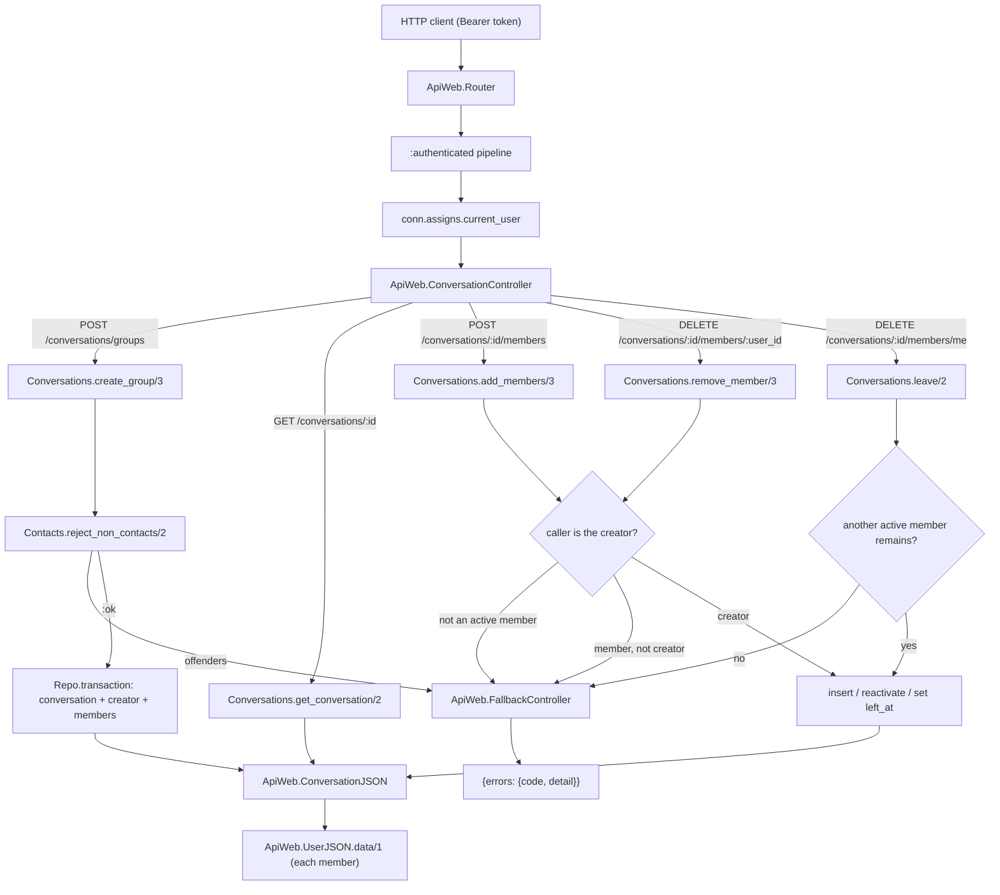
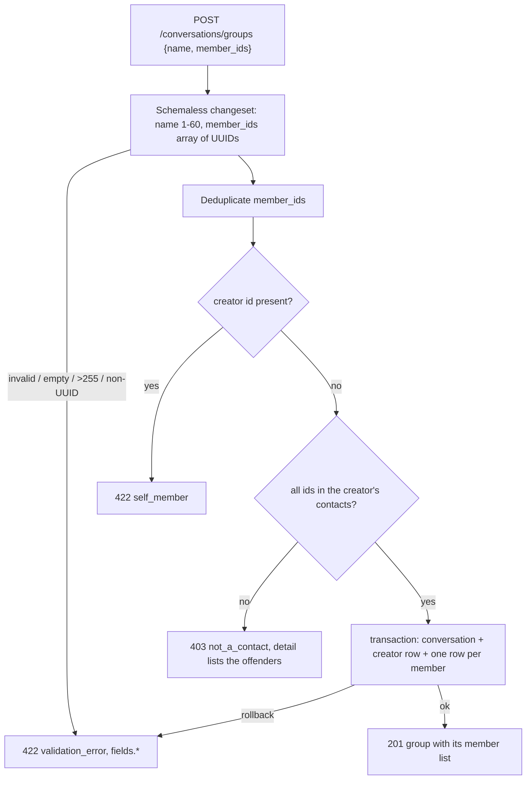
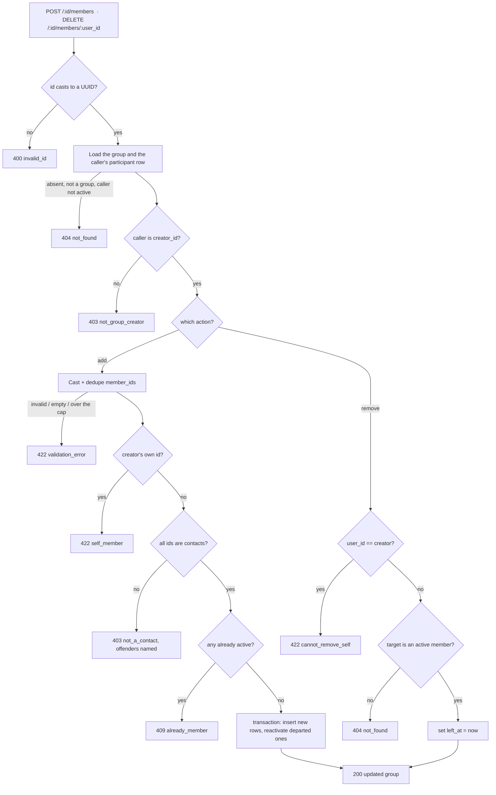

# Technical Specification: Group Management

**Complexity:** medium

---

## 1. Technical Overview

### What

Seat named groups in the conversation tables the private-conversation feature already created, and add the four endpoints that create a group and maintain its membership:

1. **The group branch of the existing schema** — a `conversations` row of `type: :group` carrying the `name` and `creator_id` columns that stay null for private threads, with one `conversation_participants` row per member. No migration: both tables, both columns and both indexes already exist, so this feature adds a `group_changeset/2` to the conversation schema and writes nothing to the database layout.
2. **Four `Api.Conversations` functions** — `create_group/3` (validate the member set against the creator's contacts, then insert the conversation and every participant row in one transaction), `add_members/3` and `remove_member/3` (creator-only membership changes, with a re-add reactivating a departed row), and `leave/2` (any member, guarded so a group never empties). `get_conversation/2` gains its group branch, resolving the active member list and count.
3. **`Contacts.reject_non_contacts/2`** — the set counterpart to `contact?/2`, answering *which of these ids are not in the owner's list* in one query and naming the offenders, so a group creation either seats every requested member or fails naming the ones that could not be seated.
4. **Five domain error codes** — `not_group_creator` (403), `already_member` (409), `last_member` (422), `cannot_remove_self` (422) and `self_member` (422), added to the reason-keyed table in `ApiWeb.FallbackController`; `not_a_contact` (403) is reused with an overriding detail that lists the offending usernames, through the fallback controller's existing `{:error, reason, detail}` clause.

No new dependency, no configuration change and no migration. What this feature adds to the system is the second conversation kind — the one that has a name, an owner, and a membership that changes over time — so the `left_at` column the private feature created but never wrote becomes live here, and the message and inbox features downstream inherit a participant row whose activity is a function of time rather than a constant.

### Why

A group is not a new entity; it is the same two tables with the columns a private thread leaves null. That is the whole reason the private-conversation feature built the schema in full rather than the half it needed: adding groups now costs a changeset and a context function instead of a migration that alters a table three later features already read. The `type` discriminator is an `Ecto.Enum` over a string column precisely so `:group` arrives without an `ALTER TYPE`, and the partial unique index on `participant_key` is scoped `WHERE type = 'private'`, so group rows — whose `participant_key` is null — sit outside it and many groups can coexist without colliding.

Membership is the feature's real subject, and it is modelled as a lifecycle on the participant row rather than as insertion and deletion. A removal sets `left_at`; a re-add clears it and moves `joined_at` forward. Deleting the row instead would be simpler here and wrong two features later: the message feature bounds a departed member's history at `left_at`, and the inbox feature excludes conversations the caller has left — neither can ask a row that no longer exists. Keeping the row also makes the `(conversation_id, user_id)` unique index do real work: a user has exactly one membership row per conversation for the life of the system, and re-joining updates it rather than racing to insert a second one.

The set check is a separate function from `contact?/2` for a reason the error message makes visible. Group creation must accept every requested member or reject the whole request naming the ones that failed — a member removed from contacts between opening the dialog and submitting has to fail the call, not silently drop out of the group. A per-id predicate cannot express that: looping it costs one query per member and, worse, can only report the first offender, while the contract promises all of them. So the contacts context gains one query that subtracts the owner's contacts from the requested set and returns the offenders' `@username`s, which is both cheaper and the only shape that can produce the detail the error contract specifies. It lives in the contacts context, not this one, because every query against the contacts table belongs behind that boundary — the same rule that put `contact?/2` there.

Creator-only control is enforced as a two-step answer, and the order of the two steps is the security decision. An outsider — a non-member, or a member who has left — gets `404 not_found` for every membership endpoint, indistinguishable from a conversation that does not exist, so probing ids discloses nothing. Only a caller who is already an active member gets the more specific `403 not_group_creator`, because at that point they can already see the group and the distinction between "I may not do this" and "this is not here" costs nothing. Collapsing both into one status would either leak existence to outsiders or leave a plain member unable to tell a permission rule from a bad id.

The group has no rename endpoint and no second administrator, and that is a modelling choice rather than an omission. `creator_id` is written once and never rewritten, including when the creator leaves — the PRD's consequence is explicit: once the creator leaves, no further membership change is possible, because the only caller authorized to make one is no longer an active member. Recording the original owner rather than nulling or transferring it keeps the rule decidable from the row itself, and keeps a departed creator's authorship visible to the inbox and the seed data without a second column.

The five new error codes each buy the client a different affordance, which is the same test the earlier features applied. `not_group_creator` is a permission the user cannot fix; `already_member` is a stale member list worth refreshing; `last_member` is a rule the UI can explain before the user tries; `cannot_remove_self` routes the creator to the leave endpoint they actually wanted; `self_member` is a client bug that would otherwise surface as a nonsensical `not_a_contact` naming the caller — a creator is never their own contact. Reusing `not_a_contact` with an overridden detail rather than minting a group-specific twin is the counterpart discipline: the rule is identical to the private-conversation one, only the message differs, and the fallback controller already has the clause for exactly that.

### Scope

**Included:**
- `Api.Conversations.Conversation.group_changeset/2` — casts and validates `name` (1–60 characters, trimmed), sets `type` and `creator_id` programmatically
- `Api.Conversations`: `create_group/3`, `add_members/3`, `remove_member/3`, `leave/2`, and the group branch of `get_conversation/2` resolving the active member list and count
- `Api.Contacts.reject_non_contacts/2` — the set check, exported from the contacts context
- `ApiWeb.ConversationController`: `create_group/2`, `add_members/2`, `remove_member/2`, `leave/2`, with `member_ids` validated by a schemaless changeset before any domain call
- `ApiWeb.ConversationJSON` — the `:group` branch of `data/2`, embedding members through `ApiWeb.UserJSON.data/1`
- Four routes in the router's existing `:authenticated` scope, with the static `members/me` segment declared before the parameterised `members/:user_id`
- `ApiWeb.FallbackController` extended with `not_group_creator` (403), `already_member` (409), `last_member` (422), `cannot_remove_self` (422) and `self_member` (422)
- `group_factory/0` in `Api.Factory`, seating the creator as an active member so a bare `insert(:group)` is valid
- Context and controller test suites, plus the cross-feature test proving a contact added through the contacts endpoint is accepted in `member_ids` while a non-contact in the same array fails the whole creation

**Excluded (owned by other features):**
- Any migration or index — both tables, the `name` and `creator_id` columns, and both indexes were created in full by the private-conversation feature; groups add no database change
- Message persistence, the group history read and the `left_at` visibility bound on `participant?/2` — the message feature consumes the group records and extends the predicate so a departed member sees history up to their `left_at`
- The `conversation:membership_revoked` push that terminates a removed member's channel, and the rejection of their subsequent joins — the real-time channel feature owns both; this feature owns the `left_at` write those behaviours read
- The aggregated conversation list, the group's unread count and its disappearance from the list once the caller leaves — the inbox feature reads `left_at`, which this feature sets
- `online` / `last_seen_at` per member in the group payload — the presence feature augments the shared user object, which already carries `last_seen_at` as null
- Renaming a group, multiple administrators, ownership transfer, avatars, descriptions, invite links and discoverable groups — all explicitly out of the product's scope
- The private branch of `GET /api/conversations/:id` — already shipped; this feature adds the sibling branch and changes nothing about the existing one

---

## 2. Architecture Impact

### Affected components

| Layer | Component | Path |
|---|---|---|
| Domain | Group creation, membership changes, group read | `lib/api/conversations.ex` |
| Domain | Group changeset on the conversation schema | `lib/api/conversations/conversation.ex` |
| Domain | Contact set check | `lib/api/contacts.ex` |
| Web | Four group endpoints | `lib/api_web/controllers/conversation_controller.ex` |
| Web | Group rendering | `lib/api_web/controllers/conversation_json.ex` |
| Web | Five new domain reasons | `lib/api_web/controllers/fallback_controller.ex` |
| Web | Four routes in the `:authenticated` scope | `lib/api_web/router.ex` |
| Test | Group factory | `test/support/factory.ex` |

No entry in `priv/repo/migrations/` and no change to `lib/api.ex`: the conversations context is already exported from the domain root, and its boundary already declares the accounts and contacts contexts as dependencies.

### Request flow



### Create-group decision order

The order is the contract, not an implementation detail: it decides which error a caller sees when more than one condition holds. Structural validation runs first so a malformed body is never reported as a domain rule. The creator's own id is caught before the set check, because a creator is never their own contact and would otherwise be named as an offender in their own group. The contact rule runs before any insert, so a rejected set leaves no row behind.



### Membership-change authorization order

Shared by `add_members/3` and `remove_member/3`. Existence is answered before permission, so an outsider probing ids learns only that nothing is there.



---

## 3. Technical Decisions

| Decision | Chosen Approach | Alternative Considered | Trade-off |
|---|---|---|---|
| Schema for groups | Reuse `conversations` / `conversation_participants` with `type: :group`, filling the `name` and `creator_id` columns the private feature left null; **no migration** | A `groups` table, or an `ALTER TABLE` adding group columns in this feature | Private rows keep two columns they never use — a cost already paid. Buys one foreign-key target for messages, one channel topic shape and one inbox query, and lets this feature ship without touching a table three later features read. |
| Removal representation | Set `left_at` on the participant row; a re-add clears it and moves `joined_at` forward | Delete the participant row and insert a fresh one on re-join | A row per user per conversation lives forever, and every membership query must filter `left_at`. Buys the two facts later features need and a deleted row cannot answer: the message feature bounds a departed member's history at `left_at`, and the inbox excludes conversations the caller has left. Also makes the `(conversation_id, user_id)` unique index the natural target of an upsert instead of a race. |
| Contact validation shape | `Contacts.reject_non_contacts/2` — one query subtracting the owner's contacts from the requested set, returning the offenders' `@username`s | Loop the existing `contact?/2` once per id inside this context | One more exported function on the contacts context. Buys N queries collapsed into one and, decisively, the only shape that can produce the specified detail — the 403 must name *every* offender, which a first-failure loop cannot. Keeping it behind the contacts boundary follows the rule that put `contact?/2` there. |
| All-or-nothing membership | A rejected set fails the whole request and persists nothing, on both create and add | Seat the valid ids and report the rejected ones alongside a partial success | A client must resubmit the corrected set. Buys the guarantee the PRD states outright — a member removed from contacts mid-dialog fails the call rather than silently dropping out — so the group that exists is always the group that was requested. |
| Existence before permission | A non-member or departed caller gets `404 not_found` on every membership endpoint; only an active member reaches `403 not_group_creator` | One status for both, or 403 for every unauthorized caller alike | One extra branch per endpoint. Buys non-disclosure where it matters — an outsider cannot distinguish a group they may not touch from one that does not exist — while a plain member, who can already see the group, gets the specific answer that tells them the rule rather than suggesting a bad id. |
| Add-members precedence | Contact set check (403) before the active-membership check (409) | Report `already_member` first, since it is the cheaper query | Two ordered checks rather than one combined pass. Buys the caller the actionable rule first: a client that fixes a duplicate only to hit a 403 on the retry has been sent round the loop twice, and the contact rule is the one that can also be fixed outside this screen. |
| Creator in `member_ids` | 422 `self_member`, checked before the contact set | Strip the creator's id silently, or let it fall through to the set check | One more code. Buys an honest answer: silently stripping succeeds with a member set that differs from the one sent — the failure mode all-or-nothing exists to prevent — and falling through produces a `not_a_contact` naming the caller, since a creator is never their own contact. |
| Creator removing themselves | 422 `cannot_remove_self`, with a detail pointing at the leave endpoint | Silently delegate to the leave path, or answer 404 | One more code. Buys a client that can route the creator to `DELETE .../members/me` instead of showing a dead end. A `DELETE` on another member's route quietly performing a leave is the kind of hidden branch the explicit-error style avoids, and a 404 would deny the existence of a member plainly in the list. |
| Where the 2-member floor binds | `last_member` guards **leave only**; the creator may remove members down to themselves alone | Enforce the floor on removal too | A group can hold exactly one member. Buys not inventing a restriction the PRD never states: the minimum is a creation-time rule, a creator alone in their own group is recoverable by adding members back, and a group with zero members is the only genuinely unreachable state — which is what leave already guards. |
| Absent or departed DELETE target | 404 `not_found`, on both `members/:user_id` and `members/me` | A 204 idempotent no-op, or a distinct `already_departed` conflict | A repeated removal is not reported as a success. Buys the feature-wide rule that a caller learns nothing about rows they cannot reach: a no-op success hides a mis-click, and a distinct code would confirm to the creator that a given user was once a member. |
| Mutation response body | All three mutations return 200 with the same group object `show` renders | 204 on the deletes, or 204 everywhere with a follow-up GET | A larger body on a mutation. Buys the client re-rendering the member list and count from the response on the exact screen where they just changed, with no second round trip — the same "return the full record" reflex the add-contact and create-conversation endpoints already use. |
| Leave returns the group the caller left | The response carries the group as of the leave, including the member list without the caller; every subsequent read is 404 | Return 204, or return the group with `members` omitted | A departed member holds one snapshot of a member list they can no longer fetch. Bounded and deliberate: they were an active member microseconds earlier and already had that list, so the response discloses nothing new — and it confirms the resulting state, which is the point of choosing 200 over 204. |
| Group size cap | 422 `validation_error` with `fields.member_ids` naming the 256 limit, applied on create and on add | A dedicated `group_limit_reached` code, mirroring the contacts limit | No distinct code to branch on. Buys reuse: the cap is a property of the submitted set, which is exactly what `fields` reports, and the client can enforce 256 before submitting — unlike the contacts limit, which depends on state the client does not hold. |
| `creator_id` after the creator leaves | Never rewritten; the group keeps its original owner and becomes membership-frozen | Null it, or transfer ownership to the oldest remaining member | A group whose creator left admits no further membership change. Buys a rule decidable from the row alone, with no election policy to specify, and keeps the recorded owner visible to the inbox and the seed data. Ownership transfer is explicitly out of the product's scope. |
| Group rendering | Flat `creator_id`, integer `member_count`, and `members` as an array of the canonical user object | Nest the creator as a full user object beside the members | The client resolves the creator against `members` to render their name. Buys the PRD's stated shape and one user object per member instead of one duplicated, and keeps the group branch a structural sibling of the private branch's `counterpart`. |

---

## 4. Component Overview

### Domain layer

| File Path | New/Modified | Purpose | Key Responsibilities |
|---|---|---|---|
| `lib/api/conversations/conversation.ex` | Modified | Group changeset | Add `group_changeset/2`: casts `name` only, `validate_required`, trims it, and `validate_length(min: 1, max: 60)` on the trimmed value; `type` and `creator_id` are set on the struct when it is built and appear in no `cast/3` call, so no request body can name another user as the owner. The private changeset and the participant-key constraint are untouched. |
| `lib/api/conversations.ex` | Modified | Group creation and membership | `create_group/3` running the §2 decision order and inserting the conversation, the creator's participant row and one row per member inside a single `Ecto.Multi`, returning the group with its active members preloaded; `add_members/3` and `remove_member/3` running the membership-change authorization order, the former inserting new rows and reactivating departed ones (`joined_at` moved forward, `left_at` cleared) in one transaction; `leave/2` setting `left_at` for the caller after confirming another active member remains; `get_conversation/2` extended with a `:group` branch that loads active participants with their users and derives `member_count` from them. `participant?/2` is unchanged — active membership is already exactly what a group needs here. |
| `lib/api/contacts.ex` | Modified | Contact set check | Add `reject_non_contacts/2`: takes the owner and a list of already-cast UUIDs, runs one query selecting the intersection with the owner's contacts, and returns `:ok` or `{:error, :not_a_contact, detail}` where the detail lists the offenders' `@username`s. Exported from the context; ids are assumed cast by the caller, so the function issues no UUID validation of its own. |

`lib/api.ex` is unchanged: `{Conversations, []}` and `{Contacts, []}` are already exported, and the conversations boundary already declares `Api.Contacts` as a dependency.

### Web layer

| File Path | New/Modified | Purpose | Key Responsibilities |
|---|---|---|---|
| `lib/api_web/controllers/conversation_controller.ex` | Modified | Group endpoints | `create_group/2` validating the body with a schemaless changeset (`%{name: :string, member_ids: {:array, Ecto.UUID}}`, both required, `member_ids` non-empty and at most 255 after `Enum.uniq/1`) before delegating, rendering 201; `add_members/2` validating `member_ids` the same way and rendering 200; `remove_member/2` and `leave/2` rendering 200. Every action reads `conn.assigns.current_user` and never accepts a caller from the request; every failure falls through to `action_fallback`. |
| `lib/api_web/controllers/conversation_json.ex` | Modified | Group rendering | Add the `:group` clause of `data/2`: `%{id, type, name, creator_id, member_count, last_read_at, members: Enum.map(members, &ApiWeb.UserJSON.data/1)}`, with `last_read_at` taken from the caller's own participant row. Members are rendered in a stable order (`name` ascending) so two reads of an unchanged group produce identical bodies. The private clause is untouched. |
| `lib/api_web/controllers/fallback_controller.ex` | Modified | Error translation | Add five entries to the reason table: `not_group_creator` → 403, `already_member` → 409, `last_member` → 422, `cannot_remove_self` → 422, `self_member` → 422, with the default details in §5. `not_a_contact` is reused unchanged — the existing `{:error, reason, detail}` clause supplies the offender-listing detail. |
| `lib/api_web/router.ex` | Modified | Routes | Four routes inside the existing `:authenticated` scope: `post "/conversations/groups"`, `post "/conversations/:id/members"`, `delete "/conversations/:id/members/me"` and `delete "/conversations/:id/members/:user_id"`. The static `me` segment **must** be declared before the parameterised one — Phoenix matches top-down, and the reverse order sends a leave into the removal action with `"me"` as a `user_id` that fails the UUID cast, turning a valid leave into a 400. |

### Test support

| File Path | New/Modified | Purpose | Key Responsibilities |
|---|---|---|---|
| `test/support/factory.ex` | Modified | Test data | Add `group_factory/0` building a `%Conversation{type: :group}` with a sequenced `name`, a built creator, and the creator's own active participant row, so a bare `insert(:group)` is a valid, readable group and `insert(:group, creator: ana)` seats a named owner in one line |

---

## 5. API Contracts

All four endpoints require `Authorization: Bearer <token>` and operate as the authenticated caller. The caller is always `conn.assigns.current_user` and is never read from the request body or path.

### Shared conversation object (group)

The sibling of the private conversation object: same envelope, same `id` / `type` / `last_read_at`, with the group fields in place of `counterpart`.

| Field | Type | Description |
|---|---|---|
| `id` | `uuid` | The conversation id — the value the message, channel and inbox features take as `conversation_id` |
| `type` | `string` | `"group"` for this feature |
| `name` | `string` | 1–60 characters, trimmed; immutable — no endpoint changes it |
| `creator_id` | `uuid` | The user who created the group; never rewritten, including after they leave |
| `member_count` | `integer` | Active members only (`left_at` null), including the creator while they remain |
| `last_read_at` | `string \| null` | ISO 8601 UTC; the caller's own read marker, `null` until the inbox feature's read endpoint sets it |
| `members` | `array<object>` | Active members, each the canonical user object from `ApiWeb.UserJSON.data/1`, ordered by `name` ascending |

```json
{
  "conversation": {
    "id": "b41d3c02-9f6a-4d51-8a77-2c0e9b3f4d10",
    "type": "group",
    "name": "Time de Produto",
    "creator_id": "3f1c2d4e-8a91-4c7b-9b23-6e0f5a2d1c88",
    "member_count": 3,
    "last_read_at": null,
    "members": [
      {
        "id": "3f1c2d4e-8a91-4c7b-9b23-6e0f5a2d1c88",
        "username": "anabeatriz",
        "name": "Ana Beatriz",
        "last_seen_at": null
      },
      {
        "id": "9d2b7a51-4c3e-4f88-b0a6-1e5c8f7d2a34",
        "username": "carlosedu",
        "name": "Carlos Eduardo",
        "last_seen_at": null
      },
      {
        "id": "c7e0f912-3b45-4a6d-9e18-7f2a4c6b8d50",
        "username": "joaopedro",
        "name": "João Pedro",
        "last_seen_at": null
      }
    ]
  }
}
```

### Endpoint: Create a Group

- **Method:** POST
- **Path:** `/api/conversations/groups`
- **Authentication:** Bearer token

**Request:**

| Field | Type | Required | Validation | Description |
|---|---|---|---|---|
| `name` | `string` | Yes | Trimmed, 1–60 characters. Not unique — two groups may share a name. | The group name, fixed for the life of the group |
| `member_ids` | `array<uuid>` | Yes | Non-empty after `Enum.uniq/1`; at most 255 entries, so the group including the creator never exceeds 256; every element must cast to a UUID. Must not contain the caller's own id. | The initial members, each of which must be in the caller's contact list at the time of the call |

The caller is seated automatically as the creator and an active member, and must **not** appear in `member_ids`. Duplicate ids within the array collapse to one member. A well-formed but unknown UUID is not looked up separately — it cannot be a contact, so it is reported among the offenders of the contact check.

**Request Example:**
```json
{
  "name": "Time de Produto",
  "member_ids": [
    "9d2b7a51-4c3e-4f88-b0a6-1e5c8f7d2a34",
    "c7e0f912-3b45-4a6d-9e18-7f2a4c6b8d50"
  ]
}
```

**Response (Success — 201):** the shared group object, wrapped as `{"conversation": {...}}`, with `member_count` of 3 and the creator present in `members`.

**Response (Failure — 403):**
```json
{
  "errors": {
    "code": "not_a_contact",
    "detail": "These users are not in your contacts: @carlosedu, @joaopedro"
  }
}
```

**Error Codes:**

| Code | HTTP Status | Description |
|---|---|---|
| `validation_error` | 422 | `name` absent, blank or over 60 characters; `member_ids` absent, not an array, empty, over 255 entries, or containing a non-UUID element. `fields` names the offending key; nothing is created. |
| `self_member` | 422 | `member_ids` contains the caller's own id. `detail`: `"You are added to your own group automatically and must not be listed as a member"` |
| `not_a_contact` | 403 | One or more ids are not in the caller's contact list; the detail lists every offender's `@username` and no group row is created |
| `unauthenticated` | 401 | Missing or invalid token |

### Endpoint: Read a Group

- **Method:** GET
- **Path:** `/api/conversations/:id`
- **Authentication:** Bearer token

The same route the private-conversation feature registered; this feature adds the branch that renders a `:group`. The caller must be an **active** member.

**Response (Success — 200):** the shared group object, wrapped.

**Error Codes:**

| Code | HTTP Status | Description |
|---|---|---|
| `invalid_id` | 400 | The path segment is not a UUID and therefore names nothing |
| `not_found` | 404 | The id names no conversation, or names a group the caller does not actively belong to — including a member who has left. One indistinguishable answer, so a group's existence is never disclosed to an outsider. |
| `unauthenticated` | 401 | Missing or invalid token |

### Endpoint: Add Members

- **Method:** POST
- **Path:** `/api/conversations/:id/members`
- **Authentication:** Bearer token — **creator only**

**Request:**

| Field | Type | Required | Validation | Description |
|---|---|---|---|---|
| `member_ids` | `array<uuid>` | Yes | Same rules as creation, plus: the resulting active member count must not exceed 256, and no id may already be an active member | The users to seat; a user who previously left is reactivated rather than duplicated |

**Request Example:**
```json
{ "member_ids": ["c7e0f912-3b45-4a6d-9e18-7f2a4c6b8d50"] }
```

**Response (Success — 200):** the updated group object, including the new members in `members` and the new `member_count`.

A member who had previously left receives a new `joined_at` and a cleared `left_at` on their existing row — no second participant row is ever created for the same user in the same conversation.

**Error Codes:**

| Code | HTTP Status | Description |
|---|---|---|
| `invalid_id` | 400 | `:id` is not a UUID |
| `not_found` | 404 | The conversation is absent, is not a group, or the caller is not an active member — the outsider's answer |
| `not_group_creator` | 403 | The caller is an active member but not the creator. `detail`: `"Only the group creator can manage members"` |
| `validation_error` | 422 | `member_ids` absent, empty, over the cap, or containing a non-UUID element |
| `self_member` | 422 | `member_ids` contains the creator's own id |
| `not_a_contact` | 403 | One or more ids are not in the creator's contacts; the detail lists every offender and nothing is seated |
| `already_member` | 409 | One or more ids are already active members. `detail`: `"This user is already a member of the group"` |
| `unauthenticated` | 401 | Missing or invalid token |

### Endpoint: Remove a Member

- **Method:** DELETE
- **Path:** `/api/conversations/:id/members/:user_id`
- **Authentication:** Bearer token — **creator only**

**Response (Success — 200):** the updated group object, with the removed user absent from `members` and `member_count` decremented.

The removal sets `left_at` on the target's participant row. The row is never deleted, so the message feature can bound the departed member's history and the inbox feature can exclude the group from their list.

**Error Codes:**

| Code | HTTP Status | Description |
|---|---|---|
| `invalid_id` | 400 | `:id` or `:user_id` is not a UUID |
| `not_found` | 404 | The conversation is absent, is not a group, the caller is not an active member, or `:user_id` names no active member of it — including one who already left |
| `not_group_creator` | 403 | The caller is an active member but not the creator |
| `cannot_remove_self` | 422 | `:user_id` is the creator's own id. `detail`: `"The creator cannot remove themselves; leave the group instead"` |
| `unauthenticated` | 401 | Missing or invalid token |

The creator may remove members down to themselves alone; the 2-member minimum binds creation and leaving, not removal.

### Endpoint: Leave a Group

- **Method:** DELETE
- **Path:** `/api/conversations/:id/members/me`
- **Authentication:** Bearer token — **any active member**

**Response (Success — 200):** the group as of the leave — the caller absent from `members`, `member_count` decremented. This is the last representation of the group the caller ever receives; every subsequent read of it returns 404.

The creator may leave provided at least one other active member remains. `creator_id` is not rewritten, so a group whose creator has left keeps its recorded owner and admits no further membership change — no remaining member is authorized to make one.

**Error Codes:**

| Code | HTTP Status | Description |
|---|---|---|
| `invalid_id` | 400 | `:id` is not a UUID |
| `not_found` | 404 | The conversation is absent, is not a group, or the caller is not an active member — including a caller who already left |
| `last_member` | 422 | The caller is the only active member left. `detail`: `"A group must keep at least one member"` |
| `unauthenticated` | 401 | Missing or invalid token |

### Error codes introduced by this feature

| Code | HTTP Status | Default detail |
|---|---|---|
| `not_group_creator` | 403 | `"Only the group creator can manage members"` |
| `already_member` | 409 | `"This user is already a member of the group"` |
| `last_member` | 422 | `"A group must keep at least one member"` |
| `cannot_remove_self` | 422 | `"The creator cannot remove themselves; leave the group instead"` |
| `self_member` | 422 | `"You are added to your own group automatically and must not be listed as a member"` |

All five join the same reason-keyed table the authentication feature built. The three 422 entries carry no `fields` key: they are not field validation failures, and a client branches on `code`. `not_a_contact` (403), `validation_error` (422), `not_found` (404), `invalid_id` (400) and `unauthenticated` (401) are reused unchanged.

---

## 6. Data Model

**No migration.** Both tables, the `name` and `creator_id` columns and both indexes were created in full by the private-conversation feature. This section states how a group occupies rows that already exist.

### `conversations` — the group row

| Column | Group value | Private value (for contrast) |
|---|---|---|
| `type` | `'group'` | `'private'` |
| `name` | The group name, 1–60 characters, set once and never updated | `NULL` |
| `creator_id` | The creating user; never rewritten, including after they leave | `NULL` |
| `participant_key` | `NULL` — a group is not a pair, and the unique index is partial `WHERE type = 'private'`, so many groups coexist without colliding | The two user ids sorted and joined |

`creator_id` references `users(id) ON DELETE SET NULL`. A deleted user therefore leaves the group ownerless and permanently membership-frozen, which is the correct terminal state: no caller can satisfy the creator check, and the existing members keep their history.

### `conversation_participants` — the membership lifecycle

Groups are the only writer of the `left_at` column, and the only feature that moves `joined_at` after insert.

| State | `joined_at` | `left_at` | Reached by |
|---|---|---|---|
| Active | Insert time | `NULL` | Group creation, or being added |
| Departed | Unchanged | Removal or leave time | The creator removing a member, or a member leaving |
| Re-activated | Moved forward to the re-add time | `NULL` again | The creator re-adding a departed member |

The `(conversation_id, user_id)` unique index guarantees one row per user per conversation for the life of the system, so a re-add is an update of the existing row and never a competing insert.

### Query shapes

| Function | Shape | Index used |
|---|---|---|
| `create_group/3` | `Ecto.Multi`: insert the conversation, then `insert_all` the creator's row and one row per member with `joined_at` set | Participants unique index (constraint only) |
| `Contacts.reject_non_contacts/2` | One `SELECT contact_user_id` over the owner's contacts filtered by `contact_user_id in ^ids`, subtracted from the requested set in memory | Contacts `(owner_id, contact_user_id)` unique index (leftmost prefix + `IN`) |
| `add_members/3` | Load active member ids for the conflict check, then one transaction inserting the genuinely new rows and updating the departed ones | Participants unique index (`conversation_id` prefix) |
| `remove_member/3` / `leave/2` | Update the one participant row matching `(conversation_id, user_id)` with `left_at` null, setting `left_at` | Participants unique index (exact) |
| `get_conversation/2` (group branch) | Load the conversation and its participants where `left_at` is null, preloading each user; `member_count` is the length of that list | PK + participants unique index (`conversation_id` prefix) |
| `leave/2` last-member guard | `Repo.aggregate(:count)` over active participants of the conversation, inside the same transaction as the update | Participants unique index (`conversation_id` prefix) |

No new index. The member listing and the active-member count both filter on `conversation_id` and read `left_at` from the row, which the existing composite unique index serves as a leftmost prefix; a group is bounded at 256 rows, so the residual filter is never expensive.

### Business rules

| Rule | Enforced where | Failure surface |
|---|---|---|
| A group name is 1–60 characters, trimmed | `group_changeset/2` | 422 `validation_error`, `fields.name` |
| A group name is immutable | No endpoint accepts it after creation; `group_changeset/2` is called only on insert | No route exists to violate it |
| A group holds at least 2 members at creation | `member_ids` non-empty after dedupe, plus the automatic creator | 422 `validation_error`, `fields.member_ids` |
| A group holds at most 256 members | Cap checked on create (≤255 supplied) and on add (active + new ≤ 256) | 422 `validation_error`, `fields.member_ids` |
| Every member must be a contact of the creator | `Contacts.reject_non_contacts/2` on create and on add | 403 `not_a_contact`, detail listing every offender |
| The creator is seated automatically and must not be listed | Context guard before the contact set check | 422 `self_member` |
| A group is created whole or not at all | `Ecto.Multi` over the conversation and every participant row | rolled back; nothing persisted |
| Only the creator changes membership | `creator_id` compared to the caller, after active membership is confirmed | 403 `not_group_creator` (404 for a non-member) |
| Only active members read the group | `get_conversation/2` scoped to `left_at` null | 404 `not_found` |
| A member is never seated twice | `(conversation_id, user_id)` unique index; a re-add updates the existing row | 409 `already_member` for an active one |
| A re-added member gets a fresh `joined_at` and a cleared `left_at` | `add_members/3` reactivation branch | — |
| The creator cannot remove themselves | Guard on `remove_member/3` | 422 `cannot_remove_self` |
| A group never empties | Active-member count checked inside `leave/2`'s transaction | 422 `last_member` |
| A departed creator freezes membership | `creator_id` never rewritten; the creator check requires active membership | every later membership call → 404 |

---

## 7. Testing Strategy

### Test file structure

| Test File | Test Type | Target | Coverage Goal |
|---|---|---|---|
| `test/api/conversations_test.exs` | Unit (modified) | The four group functions and the group branch of `get_conversation/2` | 100% |
| `test/api/contacts_test.exs` | Unit (modified) | `Contacts.reject_non_contacts/2` | 100% |
| `test/api_web/controllers/conversation_group_controller_test.exs` | Integration (new) | All four endpoints through the real authenticated pipeline | 95% |
| `test/api_web/controllers/fallback_controller_test.exs` | Unit (modified) | The five new reason-table entries | 100% |

The group endpoints get their own controller file rather than joining the private-conversation suite: four endpoints and thirteen acceptance criteria would otherwise bury the two private ones. Overall gate unchanged: `mix coveralls --minimum-coverage 80` over `lib/api`.

### `contacts_test.exs` (modified)

| Test Function | Description | Assertions |
|---|---|---|
| `test "reject_non_contacts/2 returns :ok when every id is a contact"` | All ids present in the owner's list | `:ok`; one query issued regardless of list size |
| `test "reject_non_contacts/2 names every offender, not just the first"` | Two of three ids are not contacts | `{:error, :not_a_contact, detail}`; the detail contains both `@username`s and neither the valid one |
| `test "reject_non_contacts/2 treats an unknown user id as a non-contact"` | A well-formed UUID naming no user | Reported as an offender; no separate existence query |
| `test "reject_non_contacts/2 scopes to the owner"` | An id that is another user's contact | Reported as an offender for this owner |
| `test "reject_non_contacts/2 accepts an empty list"` | `[]` | `:ok`; no query issued |

### `conversations_test.exs` (modified)

| Test Function | Description | Assertions |
|---|---|---|
| `test "create_group/3 seats the creator and every member"` | Two contacts | `{:ok, group}`; `type == :group`; three active participant rows; `creator_id == creator.id`; `name` stored trimmed |
| `test "create_group/3 rejects a non-contact and persists nothing"` | One contact, one stranger | `{:error, :not_a_contact, detail}` naming the stranger; zero conversation and participant rows |
| `test "create_group/3 rejects the creator's own id"` | Creator in `member_ids` | `{:error, :self_member}`; nothing written; checked before the contact set |
| `test "create_group/3 rejects an empty member set"` | `[]` | `{:error, changeset}` with `member_ids` in the errors; nothing written |
| `test "create_group/3 rejects a name outside 1-60 characters"` | `""`, `"   "`, 61 characters | `{:error, changeset}` with `name` in the errors for each; nothing written |
| `test "create_group/3 deduplicates member_ids"` | The same contact id twice | One participant row for that user; `member_count == 2` |
| `test "create_group/3 rejects a set that would exceed 256 members"` | 256 supplied ids | `{:error, changeset}`; nothing written |
| `test "create_group/3 is transactional"` | Force a participant insert to fail | No conversation row and no participant row remain |
| `test "get_conversation/2 returns the group with its active members"` | A member reads | `{:ok, group}`; `name`, `creator_id`, active members preloaded; the count matches |
| `test "get_conversation/2 returns :not_found for a non-member"` | An outsider reads | `{:error, :not_found}`, indistinguishable from an unknown id |
| `test "get_conversation/2 returns :not_found for a departed member"` | Leave, then read | `{:error, :not_found}` |
| `test "add_members/3 seats a new contact"` | Creator adds a contact | `{:ok, group}`; the member is active; `member_count` incremented |
| `test "add_members/3 reactivates a departed member"` | Remove, then re-add | One participant row for that user, not two; `left_at` null; `joined_at` moved forward past the original |
| `test "add_members/3 rejects a non-creator"` | A plain member adds | `{:error, :not_group_creator}`; nothing seated |
| `test "add_members/3 returns :not_found for a non-member caller"` | An outsider adds | `{:error, :not_found}`, never `:not_group_creator` |
| `test "add_members/3 rejects an already-active member"` | Add an existing member | `{:error, :already_member}`; no second row |
| `test "add_members/3 reports the contact failure before the duplicate"` | A set holding one stranger and one existing member | `{:error, :not_a_contact, _}`, not `:already_member` |
| `test "add_members/3 is all-or-nothing"` | Two valid ids and one stranger | Neither valid id is seated |
| `test "remove_member/3 sets left_at"` | Creator removes a member | `{:ok, group}`; the row survives with `left_at` set; the user is absent from `members` |
| `test "remove_member/3 rejects the creator's own id"` | Creator targets themselves | `{:error, :cannot_remove_self}`; still active |
| `test "remove_member/3 rejects a non-creator"` | A plain member removes another | `{:error, :not_group_creator}` |
| `test "remove_member/3 returns :not_found for an absent or departed target"` | A stranger's id, then a member removed twice | `{:error, :not_found}` for both |
| `test "remove_member/3 may reduce the group to the creator alone"` | Remove the only other member | `{:ok, group}`; `member_count == 1` |
| `test "leave/2 sets left_at for any member"` | A plain member leaves | `{:ok, group}`; their row has `left_at`; they are absent from `members` |
| `test "leave/2 lets the creator leave while another member remains"` | Creator leaves a 2-member group | `{:ok, group}`; `creator_id` unchanged and still naming the departed creator |
| `test "membership is frozen once the creator has left"` | Creator leaves, then attempts to add | `{:error, :not_found}`; no remaining member can add either |
| `test "leave/2 rejects the last active member"` | The only member leaves | `{:error, :last_member}`; still active |
| `test "leave/2 returns :not_found for a non-member and for a repeated leave"` | An outsider, then a member leaving twice | `{:error, :not_found}` for both |
| `test "participant?/2 is false for a departed group member"` | Remove, then ask | `false`; the predicate needs no change for groups |

### `conversation_group_controller_test.exs`

Maps directly to the PRD Section 9 F05 acceptance criteria.

| Test Function | Description | Assertions |
|---|---|---|
| `test "POST /conversations/groups returns 201 with the group, creator and three members"` | Name plus two contact ids | 201; `id`, `name`, `creator_id`; `member_count == 3`; the creator among `members` |
| `test "the creator is seated without appearing in member_ids"` | Same request | The creator's id is in `members` though it was never sent |
| `test "POST /conversations/groups returns 403 naming every non-contact"` | Two stranger ids | 403; `errors.code == "not_a_contact"`; both `@username`s in `detail`; no conversation row created |
| `test "POST /conversations/groups returns 422 for an empty member_ids"` | `[]` | 422; `errors.code == "validation_error"`; `errors.fields.member_ids` populated; nothing created |
| `test "POST /conversations/groups returns 422 for a name outside 1-60 characters"` | `""` and 61 characters | 422 for each; `errors.fields.name` populated; nothing created |
| `test "POST /conversations/groups returns 422 self_member when the creator is listed"` | Creator's own id in `member_ids` | 422; `errors.code == "self_member"`; nothing created |
| `test "no route changes a group's name"` | Create, then read twice with a mutation between | `name` is byte-identical on every read; the router exposes no PATCH or PUT for a conversation |
| `test "POST /:id/members returns 200 and the new member appears immediately"` | Creator adds a contact | 200; the member is in `members` of the same response; `member_count` incremented |
| `test "POST /:id/members returns 403 not_group_creator for a plain member"` | A member adds | 403; `errors.code == "not_group_creator"`; membership unchanged |
| `test "DELETE /:id/members/:user_id returns 403 not_group_creator for a plain member"` | A member removes another | 403; `errors.code == "not_group_creator"` |
| `test "POST /:id/members returns 409 already_member"` | Add an active member | 409; `errors.code == "already_member"`; no duplicate row |
| `test "the creator removing a member drops them from the list"` | Creator removes | 200; the user is absent from `members`; a subsequent GET as that user returns 404 |
| `test "DELETE /:id/members/me lets any member leave"` | A member leaves | 200; a subsequent GET of the group as them returns 404 |
| `test "DELETE /:id/members/me returns 422 last_member for the last member"` | Sole member leaves | 422; `errors.code == "last_member"`; still a member |
| `test "a removed member re-added receives a new joined_at and a cleared left_at"` | Remove then re-add through the endpoints | 200; the member is active again; one participant row for them, with `joined_at` later than the original and `left_at` null |
| `test "GET /conversations/:id returns 404 for a non-member"` | An outsider reads a group | 404; no group data in the body |
| `test "DELETE /:id/members/:user_id returns 422 cannot_remove_self"` | Creator targets themselves | 422; `errors.code == "cannot_remove_self"`; still active |
| `test "membership endpoints return 404 for an outsider, never 403"` | An outsider adds, removes and leaves | 404 `not_found` on all three; the group's existence is never disclosed |
| `test "membership endpoints return 400 invalid_id for a non-UUID"` | `"not-a-uuid"` as `:id` and as `:user_id` | 400; `errors.code == "invalid_id"`; no cast exception |
| `test "the leave route is matched before the removal route"` | `DELETE /:id/members/me` | Resolves to the leave action — not a removal with `"me"` cast as a `user_id` — so the response is 200 or `last_member`, never `invalid_id` |
| `test "every group route requires authentication"` | All four with no token and with a forged one | 401 `unauthenticated` on each; nothing written |
| `test "no group response exposes hashed_password"` | Create, show and all three mutation bodies | Neither the key nor any hash-shaped value present in any member object |

### Cross-feature integration

| Criterion | Where verified | Form |
|---|---|---|
| A contact added in F03 is accepted in `member_ids` when creating a group (F05), and a non-contact id in the same array causes the whole creation to fail | **Here** — `conversation_group_controller_test.exs` | An end-to-end test adding two contacts through `POST /api/contacts`, creating a group with both returned `user.id`s, then repeating the creation with one of them plus a stranger's id and asserting 403 `not_a_contact` naming only the stranger, with no second conversation row written |
| A group created in F05 accepts messages from every active member in F06, and a member removed in F05 is rejected on their next send and sees no messages after `left_at` | F06 | This feature's contract is the participant row's `left_at`, which the message feature reads to bound history and to reject a departed sender |
| Group conversations from F05 appear in the inbox list (F08) with the group name as the title and the active member count, and disappear once the caller leaves | F08 | This feature provides `name`, `creator_id` and the `left_at` the inbox filters on |
| Seeded groups (F11) appear for their members through the F05 group detail endpoint with the correct creator and member list | F11 | The seed script builds groups through `create_group/3`, so seeded groups pass exactly the validations a runtime group does |

### Acceptance criteria satisfied structurally

| Criterion | How |
|---|---|
| *"No endpoint exists that changes a group's name"* | `name` is cast only by `group_changeset/2`, which is called only on insert, and the router registers no update route for a conversation — asserted by the immutability test above |
| *"A removed member re-added by the creator receives a new `joined_at` and a cleared `left_at`"* | The `(conversation_id, user_id)` unique index makes a second row impossible, so the re-add path can only be an update of the existing one |
| *"The creator removing a member sets `left_at`; the removed user … no longer sees the group in their conversation list"* | The `left_at` write is this feature's; the list exclusion is the inbox feature reading it |
