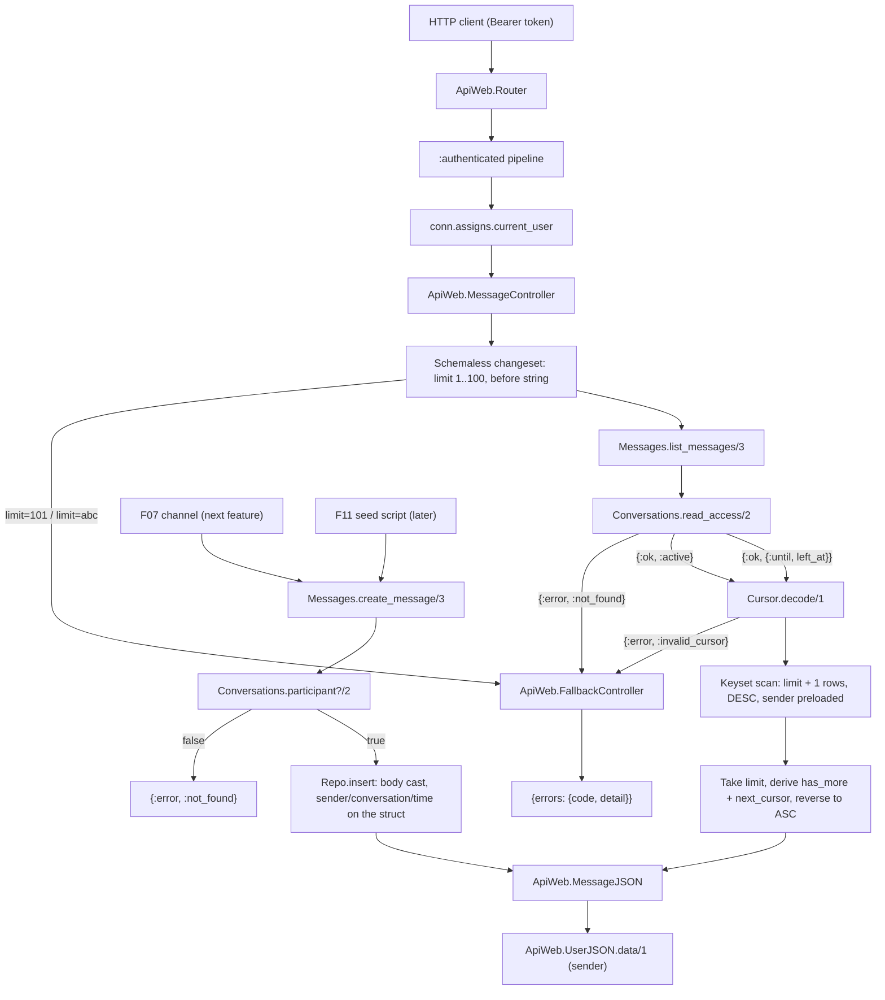
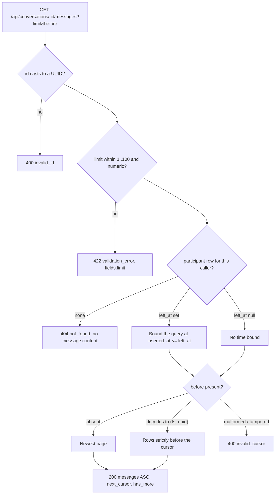
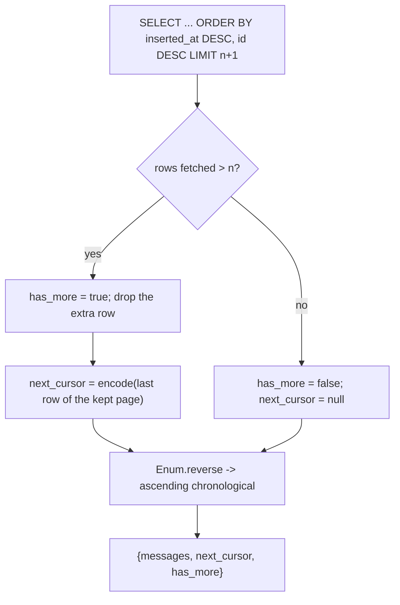

# Technical Specification: Message Persistence and History

**Complexity:** medium

---

## 1. Technical Overview

### What

Give the conversation rows the two previous features built something to hold, and give clients a way to read it back in pages that survive concurrent writes:

1. **A `messages` table and the `Api.Messages` context** — the first table this project adds since the conversation pair, carrying `conversation_id`, `sender_id`, `body` and the `Api.Schema` timestamps, indexed on `(conversation_id, inserted_at DESC, id DESC)` so both the newest-page read and every older page are one index range scan. `Api.Messages` is a boundary of its own, depending on the accounts and conversations contexts and exporting only its schema.
2. **`Messages.create_message/3`** — the single write path, shared by the REST layer, the real-time channel that comes next and the seed script after that. It resolves the sender from the authenticated caller, gates on active participation, and casts nothing but `:body`; the conversation, the sender and the insertion time are placed on the struct by the context and can never arrive from a request body.
3. **`Messages.list_messages/3` and keyset pagination** — a descending `(inserted_at, id)` range read of `limit + 1` rows, reversed into ascending chronological order before it leaves the context, with `next_cursor` and `has_more` derived from the extra row. The cursor is a base64url string over the `(inserted_at, id)` pair that fails closed: anything that does not decode, parse and cast is `invalid_cursor`, never a silent fall back to the first page.
4. **`Conversations.read_access/2`** — the read counterpart to the existing `participant?/2`, defined over the same participant row. It answers `{:ok, :active}`, `{:ok, {:until, left_at}}` for a departed group member, or `{:error, :not_found}`, which is how a member removed from a group keeps the history they saw without gaining a single message written after they left.
5. **`GET /api/conversations/:id/messages`** — one endpoint on a new `ApiWeb.MessageController`/`ApiWeb.MessageJSON` pair, with `limit` and `before` validated by a schemaless changeset before any domain call, and one new reason (`invalid_cursor`, 400) registered in the fallback controller's table.

One migration, one new context, one new endpoint, no new dependency and no configuration value. What this feature adds to the system is durability: every feature downstream — the channel, the inbox, search, the seed data — reads or writes through `Messages`, and `MessageJSON.data/1` becomes the one message shape the channel broadcast and the search result both render.

### Why

The message table is the one place in this schema where the index has to be designed before the query, because the query is fixed by the product and the table is the only one that grows without bound. A conversation is read newest-first, in pages, forever; every other access pattern is somebody else's feature. So the index is `(conversation_id, inserted_at DESC, id DESC)` and the read is a range scan over it — the first page and the ten-thousandth page cost the same, because the cursor tells Postgres where to start rather than how many rows to discard. `OFFSET` would have been three characters shorter and would have degraded linearly with conversation length, which is precisely the case a chat application is guaranteed to hit.

Offset pagination is also wrong here for a reason that has nothing to do with speed, and it is the reason the PRD states the guarantee twice. Messages arrive while a user scrolls. Under `OFFSET 30`, a message inserted between two requests shifts every row down by one, so page two re-serves the last message of page one and the client renders it twice; under a `DELETE` it would skip one instead. A keyset cursor anchored on the row's own `(inserted_at, id)` is immune to both, because it names a position in a total order rather than a count of rows preceding it. This is also why `Api.Schema` fixes microsecond timestamps and UUID primary keys, and says so in its own moduledoc: `(inserted_at, id)` is only a total order if two rows written in the same millisecond can still be told apart, and only unguessable if `id` is not a counter. The comparison is written as a Postgres row constructor — `(inserted_at, id) < (?, ?)` — rather than the expanded `inserted_at < ? OR (inserted_at = ? AND id < ?)`, because the row form is what the planner recognises as a single index range bound; the expanded form is logically identical and frequently plans as two scans and a merge.

The cursor is opaque but not signed, and the distinction is worth stating because "opaque" invites the assumption that it is a capability. It is not. By the time a cursor is decoded, `read_access/2` has already decided that this caller may read this conversation; the cursor only chooses where inside it to start. A forged cursor therefore grants nothing that the request did not already have — the worst a caller can do is skip their own messages. Signing would add a genuine failure mode (every in-flight cursor breaks when `SECRET_KEY_BASE` rotates) to buy an access-control property that the authorization layer already owns. What the cursor does need is to fail closed, and that is what the 400 is for: a cursor that does not decode must be an error rather than a silent `nil`, because falling back to the newest page would hand the client a duplicate of content it already has and no way to detect that it happened.

Sender identity is denormalized into the payload and not into the table, and the two readings of that word point at opposite designs. Copying `username` and `name` into `messages` would remove a join and would be a bug the first time somebody changes their display name: history would render under names that no longer exist, and the client would face two user shapes. Joining and preloading the sender keeps one row of truth per user, and lets the message payload embed `ApiWeb.UserJSON.data/1` — the shape contacts, private counterparts and group members already render through, whose own moduledoc promises exactly this reuse. The concrete dividend arrives with presence: `last_seen_at` reaches message senders with no change here at all.

`participant?/2` stays a boolean and a new function carries the bound, rather than the predicate growing a return type. The two questions genuinely differ. *May this user write here, or hold this channel open?* is a yes-or-no about the present, and a departed member's answer is no. *What may this user read?* has three answers, one of which is a timestamp. Overloading a `?`-suffixed function to return a tuple would break the naming convention the project states in its own guidelines, and would force every existing caller — the send path and, next feature, the channel join — to pattern-match a shape they have no use for. Both functions read the same participant row, so there is still exactly one place where membership is decided; there are simply two questions asked of it. The bound itself lives in the conversations context and not in `Messages`, for the same reason `contact?/2` lives in `Contacts`: every query against `conversation_participants` belongs behind that boundary.

A departed member reading history is a deliberate product decision with a security shape, not a leniency. The rule is that leaving a group freezes what you can see rather than erasing it — the conversation you were part of remains readable up to the instant you left, and not one message further. Bounding on `left_at` rather than dropping the participant row is what makes that decidable at all, which is why the previous feature soft-marks departures. The bound is applied inside the query as `inserted_at <= left_at`, not as a filter over a fetched page, so a departed member's `has_more` and `next_cursor` describe the history they are allowed to see and never leak the existence of traffic after their departure through a page count.

The write path casts one field, and the list of fields it does not cast is the security surface. `sender_id` comes from `conn.assigns.current_user` and appears in no `cast/3` call, so a body naming another user is not rejected — it is not read. `conversation_id` comes from the path and is authorized before the insert is attempted. `inserted_at` is placed on the struct by the context, which is what lets the seed script backdate a demo conversation through the same function the channel uses, while the channel and the controller, which only ever forward a body, remain structurally incapable of setting a timestamp. Immutability then costs nothing to enforce: with no update and no delete endpoint, and one write path that only inserts, a message row is write-once by construction rather than by convention.

### Scope

**Included:**
- Migration creating `messages` with the history index, a `sender_id` index and a body-length check constraint
- `Api.Messages.Message` — schema and `changeset/2`, casting `:body` only, trimmed and bounded at 1–4000 characters
- `Api.Messages` — the context boundary, `create_message/3` (the only write path) and `list_messages/3` (keyset read)
- `Api.Messages.Cursor` — `encode/1` and `decode/1` over the `(inserted_at, id)` pair, private to the messages boundary
- `Api.Conversations.read_access/2` — the three-answer read gate over the participant row, exported with the context
- `ApiWeb.MessageController` — `index/2`, validating `limit` and `before` with a schemaless changeset before any domain call
- `ApiWeb.MessageJSON` — `index/1` and `data/1`, embedding the sender through `ApiWeb.UserJSON.data/1`
- One route in the router's existing `:authenticated` scope
- `ApiWeb.FallbackController` extended with `invalid_cursor` (400)
- `message_factory/0` in `Api.Factory`
- `{Messages, []}` added to the `Api` boundary's exports
- Context, cursor and endpoint test suites, plus the two cross-feature tests covering messaging over an F04 private conversation and an F05 group with a removed member

**Excluded (owned by other features):**
- The socket, the channel topics, the `new_message` inbound event, the `message:new` broadcast, the `conversation:updated` push, the send rate limit and the 64 KB frame cap — the real-time feature owns all of them and calls `create_message/3`; this feature owns the function and the payload shape it broadcasts
- Any send endpoint over REST — messages are written through the channel only; the REST surface here is read-only by design
- The aggregated conversation list, last-message previews and unread counts — the inbox feature derives them from these rows
- Full-text search over `body` and its index — the search feature adds both; this feature adds no text index
- Backdated demo messages — the seed feature passes `inserted_at` through `create_message/3`, which this feature builds to accept it on the struct
- Editing, deleting, reactions, attachments, read receipts per message, threads and forwarding — all explicitly out of the product's scope
- Any change to `participant?/2` — it keeps its current behaviour and its current callers; `read_access/2` is added beside it

---

## 2. Architecture Impact

### Affected components

| Layer | Component | Path |
|---|---|---|
| Database | The `messages` table and its indexes | `priv/repo/migrations/<ts>_create_messages.exs` |
| Domain | Message schema and body changeset | `lib/api/messages/message.ex` |
| Domain | Write path and keyset read | `lib/api/messages.ex` |
| Domain | Cursor encoding and strict decoding | `lib/api/messages/cursor.ex` |
| Domain | Read gate with the departed-member bound | `lib/api/conversations.ex` |
| Domain | Messages exported from the domain root | `lib/api.ex` |
| Web | History endpoint | `lib/api_web/controllers/message_controller.ex` |
| Web | Message and page rendering | `lib/api_web/controllers/message_json.ex` |
| Web | `invalid_cursor` reason | `lib/api_web/controllers/fallback_controller.ex` |
| Web | One route in the `:authenticated` scope | `lib/api_web/router.ex` |
| Test | Message factory | `test/support/factory.ex` |

### Request flow



### Read authorization order

Existence is answered before content, and the outsider's answer is indistinguishable from an absent conversation, so probing ids discloses nothing — the same rule the conversation read already applies. The cursor is decoded only after access is granted, so an unauthorized caller cannot use the difference between `400 invalid_cursor` and `404 not_found` as an existence oracle.



### Page assembly

Fetching one row beyond the requested limit is what makes `has_more` exact rather than inferred from page size — a conversation holding exactly 30 messages must report `has_more: false` on its first page, which a size comparison alone cannot distinguish from a full page with more behind it.



---

## 3. Technical Decisions

| Decision | Chosen Approach | Alternative Considered | Trade-off |
|---|---|---|---|
| Pagination strategy | Keyset over `(inserted_at, id)` with an opaque cursor | `OFFSET`/`LIMIT` | Cursors cannot jump to an arbitrary page number, which chat has no use for; in exchange, cost is constant in conversation length and concurrent inserts can neither duplicate nor skip a row |
| Cursor integrity | Base64url over `"<iso8601>|<uuid>"`, strict decode, no signature | `Phoenix.Token.sign/verify` | A forged cursor is accepted if it happens to be well-formed — harmless, since access is already decided and the cursor only positions inside an authorized conversation; avoids invalidating every in-flight cursor on secret rotation |
| Cursor failure mode | Any decode failure is `400 invalid_cursor` | Fall back to the newest page | A client bug surfaces loudly instead of silently re-serving content the client already has with no way to detect the repeat |
| Departed-member read | New `Conversations.read_access/2` returning `:active` / `{:until, left_at}` / `:not_found` | Widen `participant?/2` to return the bound | Two functions over one participant row instead of one function with a wider type; keeps the `?` naming convention and leaves the send path and the coming channel join untouched |
| Sender identity | `sender_id` only; join and preload, render through `UserJSON.data/1` | Copy `sender_username` / `sender_name` into `messages` | One join per page in exchange for a single row of truth per user: renames stay correct in old history, the client keeps one user type, and presence reaches senders without a change here |
| Module placement | New `Api.Messages` boundary and `ApiWeb.MessageController` | Fold into `Api.Conversations` and its controller | One more boundary to declare; keeps the largest context from absorbing the channel, inbox and search work that all lands on messages next |
| Write path signature | `create_message/3` taking an attrs map, casting `:body` only | Plain body string, or a fourth `opts` argument | The map admits `inserted_at` for the seed script without a second write path, while `cast/3` still sees exactly one field, so no request body can set a sender, a conversation or a time |
| Body storage | `text` column, stored verbatim, no HTML processing | Sanitize or escape on write | Escaping is the client's obligation, stated in the PRD; storing verbatim keeps the persisted bytes identical to what was sent and keeps one canonical form for the coming search index |
| Body length backstop | `check` constraint on `char_length(btrim(body))`, declared as `check_constraint/3` | Changeset validation alone | A redundant guarantee at the storage layer, surfacing as a changeset error rather than a raised exception, so a future writer that bypasses the changeset cannot store an empty or oversized body |
| History index | `(conversation_id, inserted_at DESC, id DESC)` | Separate indexes per column | One composite serving both the newest-page read and every cursor-bounded page as a range scan; the leading equality on `conversation_id` makes the direction annotations interchangeable in practice, and they are written as the PRD states them |

---

## 4. Component Overview

### Domain

| File Path | New/Modified | Purpose | Key Responsibilities |
|---|---|---|---|
| `lib/api/messages/message.ex` | New | Message schema | `use Api.Schema`; `belongs_to :conversation` and `belongs_to :sender`; `changeset/2` casting `:body` only, trimming it, requiring it, bounding it at 1–4000 characters, and attaching the length check and both foreign-key constraints |
| `lib/api/messages.ex` | New | Messages context and boundary | `use Boundary, deps: [Api, Api.Accounts, Api.Conversations], exports: [Message]`; `create_message/3` gating on `participant?/2` and building the struct with sender, conversation and time; `list_messages/3` resolving `read_access/2`, decoding the cursor, running the keyset query and assembling the page |
| `lib/api/messages/cursor.ex` | New | Cursor codec | `encode/1` from a message into a base64url string; `decode/1` returning `{:ok, {inserted_at, id}}` or `{:error, :invalid_cursor}`, failing on a bad base64, a missing separator, an unparseable timestamp or a non-castable UUID |
| `lib/api/conversations.ex` | Modified | Read gate | Adds `read_access/2` over the participant row — `{:ok, :active}`, `{:ok, {:until, left_at}}`, `{:error, :not_found}`, `{:error, :invalid_id}` — reusing the existing id cast; `participant?/2` and every other function unchanged |
| `lib/api.ex` | Modified | Domain root boundary | Adds `{Messages, []}` to the exports list |

### Web

| File Path | New/Modified | Purpose | Key Responsibilities |
|---|---|---|---|
| `lib/api_web/controllers/message_controller.ex` | New | History endpoint | `index/2` reading the caller from `conn.assigns.current_user`; validates `limit` (integer, 1–100, default 30) and `before` (string) with a schemaless changeset before any domain call; `action_fallback ApiWeb.FallbackController` |
| `lib/api_web/controllers/message_json.ex` | New | Message rendering | `index/1` rendering `{messages, next_cursor, has_more}`; `data/1` rendering one message with its sender embedded through `ApiWeb.UserJSON.data/1` — the shape the channel broadcast and the search result reuse |
| `lib/api_web/controllers/fallback_controller.ex` | Modified | Error table | Registers `invalid_cursor` → `{:bad_request, "invalid_cursor", "The pagination cursor is invalid"}` |
| `lib/api_web/router.ex` | Modified | Route | `get "/conversations/:id/messages", MessageController, :index` inside the existing `:authenticated` scope |

### Test

| File Path | New/Modified | Purpose | Key Responsibilities |
|---|---|---|---|
| `test/support/factory.ex` | Modified | Message factory | `message_factory/0` building a conversation and a sender by default, so a bare `insert(:message)` is valid and either side takes an override |

### Database

| Migration File | Tables Affected | Operation | Notes |
|---|---|---|---|
| `priv/repo/migrations/<ts>_create_messages.exs` | `messages` | CREATE | Table, history index, sender index and body-length check; generated with `mix ecto.gen.migration create_messages` |

---

## 5. API Contracts

### Endpoint: Conversation History

- **Method:** GET
- **Path:** `/api/conversations/:id/messages`
- **Authentication:** JWT Bearer (`:authenticated` pipeline)

**Path parameters:**

| Field | Type | Required | Validation | Description |
|---|---|---|---|---|
| `id` | `uuid` | Yes | castable UUID | The conversation, private or group |

**Query parameters:**

| Field | Type | Required | Validation | Description |
|---|---|---|---|---|
| `limit` | `integer` | No | 1–100, default 30 | Maximum messages in the page |
| `before` | `string` | No | decodable cursor | Returns only messages strictly older than the cursor position |

**Request example:**
```
GET /api/conversations/9f1c8e2a-.../messages?limit=30&before=MjAyNi0wNy0yMlQxMzo0ODoxNy4xMjM0NTZafDlmMWM4ZTJhLTQ0ZDgtNGYxYS1iN2QzLTAwMTFhMmIzYzRkNQ
Authorization: Bearer <token>
```

**Response (200):**

| Field | Type | Description |
|---|---|---|
| `messages` | `array` | The page, ascending by `(inserted_at, id)` |
| `messages[].id` | `uuid` | Message id |
| `messages[].conversation_id` | `uuid` | The conversation the message belongs to |
| `messages[].body` | `string` | Stored verbatim; escaping is the client's responsibility |
| `messages[].inserted_at` | `string` | ISO 8601 with microseconds, UTC |
| `messages[].sender` | `object` | `ApiWeb.UserJSON.data/1`: `id`, `username`, `name`, `last_seen_at` |
| `next_cursor` | `string \| null` | Position before the oldest message of this page; null when the oldest message of the conversation is in the page |
| `has_more` | `boolean` | Whether older messages exist beyond this page |

**Response example:**
```json
{
  "messages": [
    {
      "id": "3a1d0c74-8e5b-4a11-9c22-5b7c1f2d3e40",
      "conversation_id": "9f1c8e2a-44d8-4f1a-b7d3-0011a2b3c4d5",
      "body": "bom dia, time",
      "inserted_at": "2026-07-22T13:48:17.123456Z",
      "sender": {
        "id": "6b2f1e90-7c33-4d55-8a01-2f4e6a8b0c1d",
        "username": "anabeatriz",
        "name": "Ana Beatriz",
        "last_seen_at": null
      }
    },
    {
      "id": "5c3e2f81-9a44-4b66-8d12-3e5f7b9c0d2e",
      "conversation_id": "9f1c8e2a-44d8-4f1a-b7d3-0011a2b3c4d5",
      "body": "bom dia!",
      "inserted_at": "2026-07-22T13:49:02.884210Z",
      "sender": {
        "id": "7d4a3b21-0e55-4c77-9b23-4a6c8d0e2f30",
        "username": "carlosedu",
        "name": "Carlos Eduardo",
        "last_seen_at": null
      }
    }
  ],
  "next_cursor": "MjAyNi0wNy0yMlQxMzo0ODoxNy4xMjM0NTZafDNhMWQwYzc0LThlNWItNGExMS05YzIyLTViN2MxZjJkM2U0MA",
  "has_more": true
}
```

**Empty or fully-read conversation:**
```json
{ "messages": [], "next_cursor": null, "has_more": false }
```

**Error codes:**

| Code | HTTP Status | When |
|---|---|---|
| `unauthenticated` | 401 | Missing, malformed or expired bearer token |
| `invalid_id` | 400 | `:id` is not a castable UUID |
| `invalid_cursor` | 400 | `before` fails base64 decode, split, timestamp parse or UUID cast |
| `validation_error` | 422 | `limit` non-numeric or outside 1–100; `fields.limit` names the accepted range |
| `not_found` | 404 | No participant row for the caller, or no such conversation — indistinguishable |

**Error example (422):**
```json
{
  "errors": {
    "code": "validation_error",
    "detail": "The request could not be processed",
    "fields": { "limit": ["must be between 1 and 100"] }
  }
}
```

**Error example (400):**
```json
{
  "errors": {
    "code": "invalid_cursor",
    "detail": "The pagination cursor is invalid"
  }
}
```

### Domain contract: `Messages.create_message/3`

No REST endpoint writes a message; the write path is a context function, consumed by the channel next and the seed script later. It is specified here because it is the contract those features build against.

| Argument | Type | Description |
|---|---|---|
| `sender` | `%Api.Accounts.User{}` | The authenticated caller; the only source of `sender_id` |
| `conversation_id` | `binary` | Cast to a UUID before any query |
| `attrs` | `map` | `%{body: binary}`; `%{body: binary, inserted_at: DateTime.t()}` for backdated seed data. Only `:body` is cast |

| Return | Meaning |
|---|---|
| `{:ok, %Message{sender: %User{}}}` | Persisted, sender preloaded, ready for `MessageJSON.data/1` |
| `{:error, %Ecto.Changeset{}}` | Body empty, whitespace-only or over 4000 characters — 422 with `fields.body` |
| `{:error, :not_found}` | The sender is not an active participant, or the conversation does not exist |
| `{:error, :invalid_id}` | `conversation_id` is not a castable UUID |

### Domain contract: `Conversations.read_access/2`

| Return | Meaning |
|---|---|
| `{:ok, :active}` | Active participant; unbounded history |
| `{:ok, {:until, %DateTime{}}}` | Departed group member; history bounded at `inserted_at <= left_at` |
| `{:error, :not_found}` | No participant row ever existed for this caller, or no such conversation |
| `{:error, :invalid_id}` | Either id fails the UUID cast |

---

## 6. Data Model

### Table: `messages`

| Column | Type | Nullable | Default | Description |
|---|---|---|---|---|
| `id` | `uuid` | No | `gen_random_uuid()` | Primary key; half of the keyset order and the tie-break that makes it total |
| `conversation_id` | `uuid` | No | — | FK → `conversations(id)`; private or group alike, which is the point of one conversation table |
| `sender_id` | `uuid` | No | — | FK → `users(id)`; set from the authenticated caller, never cast |
| `body` | `text` | No | — | Trimmed, 1–4000 characters, stored verbatim with no HTML processing |
| `inserted_at` | `timestamptz(6)` | No | — | `utc_datetime_usec` per `Api.Schema`; the chronological half of the keyset order |
| `updated_at` | `timestamptz(6)` | No | — | `utc_datetime_usec` per `Api.Schema`; equal to `inserted_at` for the life of the row, since messages are never updated |

**Indexes:**

| Index Name | Columns | Type | Purpose |
|---|---|---|---|
| `messages_pkey` | `id` | btree (PK) | Primary key |
| `messages_conversation_id_inserted_at_id_index` | `conversation_id`, `inserted_at DESC`, `id DESC` | btree | The history read: leading equality on the conversation, then a range bound on the `(inserted_at, id)` pair. Serves the cursorless newest page and every `before` page as one range scan, and the inbox's last-message lookup as a one-row read of the same range |
| `messages_sender_id_index` | `sender_id` | btree | Foreign-key maintenance and the "messages by this user" reads the seed script and search perform; without it a user delete degrades to a sequential scan of the largest table |

**Constraints:**

| Constraint | Type | Definition | Purpose |
|---|---|---|---|
| `messages_pkey` | PRIMARY KEY | `id` | Unique identifier |
| `messages_conversation_id_fkey` | FOREIGN KEY | `conversation_id REFERENCES conversations(id) ON DELETE CASCADE` | A conversation's history goes with it, matching `conversation_participants` |
| `messages_sender_id_fkey` | FOREIGN KEY | `sender_id REFERENCES users(id) ON DELETE CASCADE` | `sender_id` is `NOT NULL`, so nulling is not representable; cascade matches the participant row's treatment of the same reference |
| `messages_body_length` | CHECK | `char_length(btrim(body)) BETWEEN 1 AND 4000` | Storage-layer backstop for the changeset rule; declared as `check_constraint/3` so a violation surfaces as `{:error, changeset}` rather than a raised exception |

No text search index here: the search feature adds it together with the query that needs it, so the shape of the index is decided by the shape of that query.

**Migration (illustrative SQL):**
```sql
CREATE TABLE messages (
    id              UUID PRIMARY KEY DEFAULT gen_random_uuid(),
    conversation_id UUID NOT NULL REFERENCES conversations(id) ON DELETE CASCADE,
    sender_id       UUID NOT NULL REFERENCES users(id) ON DELETE CASCADE,
    body            TEXT NOT NULL,
    inserted_at     TIMESTAMPTZ(6) NOT NULL,
    updated_at      TIMESTAMPTZ(6) NOT NULL,
    CONSTRAINT messages_body_length
        CHECK (char_length(btrim(body)) BETWEEN 1 AND 4000)
);

CREATE INDEX messages_conversation_id_inserted_at_id_index
    ON messages (conversation_id, inserted_at DESC, id DESC);

CREATE INDEX messages_sender_id_index ON messages (sender_id);
```

### Cursor format

The cursor is the two ordering columns of one row, joined and encoded:

```
raw     = "2026-07-22T13:48:17.123456Z|3a1d0c74-8e5b-4a11-9c22-5b7c1f2d3e40"
cursor  = Base.url_encode64(raw, padding: false)
```

Decoding is strict and every failure is the same error, so no distinction between failure modes is observable:

| Step | Failure |
|---|---|
| `Base.url_decode64(cursor, padding: false)` | not base64url → `{:error, :invalid_cursor}` |
| split on `"|"` into exactly two parts | wrong arity → `{:error, :invalid_cursor}` |
| `DateTime.from_iso8601/1` | unparseable, or not UTC → `{:error, :invalid_cursor}` |
| `Ecto.UUID.cast/1` | not a UUID → `{:error, :invalid_cursor}` |

Padding is omitted so the cursor is URL-safe without escaping, and the encoded value never contains `=`, `+` or `/`.

### Query shapes

| Call | Shape | Index used |
|---|---|---|
| `read_access/2` | `Repo.one` over `conversation_participants` by `(conversation_id, user_id)`, selecting `left_at` — no `is_nil` filter, since a departed row is a distinct answer rather than an absent one | `conversation_participants_conversation_id_user_id_index` (exact) |
| `list_messages/3`, newest page | `where conversation_id == ^cid`, `order_by [desc: inserted_at, desc: id]`, `limit ^(n + 1)`, `join`/`preload :sender` | `messages_conversation_id_inserted_at_id_index` (range start) |
| `list_messages/3`, with `before` | the above plus `where fragment("(?, ?) < (?, ?)", m.inserted_at, m.id, ^ts, ^id)` | same index, range bounded on both ends |
| `list_messages/3`, departed member | any of the above plus `where inserted_at <= ^left_at` | same index; the bound narrows the range rather than filtering the page |
| `create_message/3` gate | `Conversations.participant?/2` | `conversation_participants_conversation_id_user_id_index` (exact) |

The row-constructor comparison is the reason the cursor carries both columns: `(inserted_at, id) < (ts, id)` is a single index range bound, whereas the boolean expansion of the same predicate frequently plans as two scans and a merge.

---

## 7. Testing Strategy

### Test file structure

| Test File | Test Type | Target | Notes |
|---|---|---|---|
| `test/api/messages_test.exs` | Unit / context | `Api.Messages` | Write path, keyset read, pagination invariants, departed-member bound |
| `test/api/messages/cursor_test.exs` | Unit | `Api.Messages.Cursor` | Round trip and every decode failure mode |
| `test/api/conversations_test.exs` | Unit / context | `Conversations.read_access/2` | Extends the existing suite; `participant?/2` tests unchanged |
| `test/api_web/controllers/message_controller_test.exs` | Integration | `GET /api/conversations/:id/messages` | Full authenticated pipeline, one test per acceptance criterion, plus the two cross-feature criteria |

### `test/api/messages/cursor_test.exs`

| Test Function | Description | Assertions |
|---|---|---|
| `encodes and decodes a message round trip` | `decode(encode(message))` | Returns `{:ok, {inserted_at, id}}` equal to the message's own, microseconds preserved |
| `produces a URL-safe value` | Encoding output | Contains none of `=`, `+`, `/` |
| `rejects a non-base64 value` | `decode("!!!")` | `{:error, :invalid_cursor}` |
| `rejects a value missing the separator` | Base64 of a bare timestamp | `{:error, :invalid_cursor}` |
| `rejects an unparseable timestamp` | Base64 of `"nope\|<uuid>"` | `{:error, :invalid_cursor}` |
| `rejects a non-UUID id` | Base64 of `"<iso8601>\|nope"` | `{:error, :invalid_cursor}` |
| `rejects a tampered but well-formed base64 value` | Flip a character inside a valid cursor | `{:error, :invalid_cursor}` |

### `test/api/messages_test.exs`

| Test Function | Description | Assertions |
|---|---|---|
| `persists a message from an active participant` | `create_message/3` on a private conversation | `{:ok, message}`; row readable through a fresh `Repo.get`, sender preloaded |
| `takes the sender from the argument and never from attrs` | Pass `sender_id` inside `attrs` | Persisted `sender_id` is the passed user's; the attrs value is ignored |
| `accepts a backdated inserted_at on the struct` | `attrs` carrying `inserted_at` | Persisted timestamp equals the supplied one; ordering places it accordingly |
| `rejects an empty body` | `%{body: ""}` | `{:error, changeset}` with `:body` errors; row count unchanged |
| `rejects a whitespace-only body` | `%{body: "   \n "}` | `{:error, changeset}` with `:body` errors; nothing persisted |
| `rejects a 4001-character body` | Over the bound | `{:error, changeset}` with `:body` errors; nothing persisted |
| `accepts a 4000-character body verbatim` | At the bound | `{:ok, message}`; persisted `body` byte-identical to the input |
| `trims surrounding whitespace` | `"  oi  "` | Persisted body is `"oi"` |
| `rejects a send from a non-participant` | Third user on a private conversation | `{:error, :not_found}`; nothing persisted |
| `rejects a send from a departed group member` | Member removed, then sends | `{:error, :not_found}`; nothing persisted |
| `rejects a malformed conversation id` | `"not-a-uuid"` | `{:error, :invalid_id}` |
| `returns the newest page in ascending order` | 50 messages, default limit | 30 returned, ascending by `(inserted_at, id)`, last element is the newest message |
| `returns an empty page for a conversation with no messages` | Fresh conversation | `messages: []`, `next_cursor: nil`, `has_more: false` |
| `paginates a 250-message conversation exactly once` | Walk `before` to exhaustion | Union of pages equals all 250 ids, no duplicate, no gap, each page ascending |
| `reports has_more false exactly on the oldest page` | Walk to the end | `has_more` true on every page but the last; `next_cursor` null only there |
| `reports has_more false when the page holds every message` | Exactly `limit` messages | `has_more: false`, `next_cursor: nil` |
| `is stable across concurrent inserts` | Read page one, insert new messages, read page two with the cursor | No id appears twice and none is skipped; the new messages appear in neither older page |
| `caps and defaults the limit` | `limit` omitted, `1`, `100` | 30, 1 and 100 rows respectively |
| `rejects a malformed cursor` | Tampered `before` | `{:error, :invalid_cursor}`; no fall back to the newest page |
| `rejects a history read from a non-participant` | Third user | `{:error, :not_found}` |
| `bounds a departed group member at left_at` | Messages before and after removal | Only messages with `inserted_at <= left_at`; the later ones appear in no page and do not affect `has_more` |
| `preloads the sender on every message` | Any page | Each element carries a `%User{}` with `username` and `name` |

### `test/api/conversations_test.exs` (extended)

| Test Function | Description | Assertions |
|---|---|---|
| `read_access returns active for a current participant` | Private and group member | `{:ok, :active}` |
| `read_access returns the bound for a departed member` | Removed group member | `{:ok, {:until, left_at}}` matching the stored `left_at` |
| `read_access returns not_found for an outsider` | Non-member | `{:error, :not_found}` |
| `read_access returns not_found for an unknown conversation` | Random UUID | `{:error, :not_found}`, indistinguishable from the outsider's answer |
| `read_access rejects a malformed id` | `"nope"` | `{:error, :invalid_id}` |
| `read_access returns active again after a re-add` | Leave, then re-add | `{:ok, :active}` |
| `participant? still excludes a departed member` | Regression | `false`, confirming the predicate's behaviour is unchanged |

### `test/api_web/controllers/message_controller_test.exs`

| Test Function | Description | Assertions |
|---|---|---|
| `returns the newest 30 messages ascending without a cursor` | 50 seeded messages | 200; 30 entries ascending; `has_more` true; `next_cursor` present |
| `survives an application restart` | Insert through the context, read through the endpoint in a later request | The message is returned with the same id, body and timestamp |
| `walks a 250-message conversation without duplicates or gaps` | Follow `next_cursor` to exhaustion | Every id exactly once; final page has `next_cursor: null` and `has_more: false` |
| `does not duplicate or skip when messages arrive between pages` | Insert between two requests | Older pages unchanged; no id repeated |
| `accepts limit=100` | Boundary | 200; at most 100 entries |
| `rejects limit=101` | Over the cap | 422 `validation_error`, `fields.limit` naming the 1–100 range |
| `rejects a non-numeric limit` | `limit=abc` | 422 `validation_error`, `fields.limit` |
| `rejects a tampered cursor` | Mutated `before` | 400 `invalid_cursor`, detail "The pagination cursor is invalid"; body carries no messages |
| `rejects a malformed conversation id` | `/api/conversations/nope/messages` | 400 `invalid_id` |
| `returns 404 to a non-participant with no message content` | Third user | 404 `not_found`; response body contains no `messages` key |
| `returns 404 for an unknown conversation` | Random UUID | 404 `not_found`, identical to the non-participant answer |
| `requires authentication` | No bearer token | 401 `unauthenticated` |
| `embeds sender id, username and display name on every message` | Any page | Each entry's `sender` carries all three, plus `last_seen_at` |
| `returns an empty page for a conversation with no messages` | Fresh conversation | 200; `messages: []`, `next_cursor: null`, `has_more: false` |

### Cross-feature integration (same file)

| Test Function | PRD criterion | Assertions |
|---|---|---|
| `a private conversation accepts messages from both participants and rejects a third reader` | F04 → F06 | Both participants' messages are persisted and returned to both; a third user reading the same conversation receives 404 with no content |
| `a group accepts messages from every active member, and a removed member is rejected on send and bounded on read` | F05 → F06 | Every active member's send succeeds; after removal through the group endpoint, the member's next send returns `not_found` and their history read returns 200 containing only messages up to `left_at`, with the post-removal messages absent from every page |

### Coverage

`mix precommit` runs `coveralls` at the project's 80% floor over `lib/api`. The cursor codec, the page assembly and both authorization branches are the paths that carry the invariants, so each has direct unit coverage rather than incidental coverage through the endpoint.

---

## Assumptions and Decisions

Derived from the PRD, the existing codebase and the interview:

1. **Cursor payload** — the PRD specifies "an opaque base64 cursor encoding `inserted_at` and `id`" without fixing the inner format. `"<iso8601 with microseconds>|<uuid>"` base64url-encoded without padding is used, with strict decoding on all four steps.
2. **`limit` error message** — the PRD requires the 422 to name the accepted range; the changeset message is "must be between 1 and 100", surfacing under `fields.limit`.
3. **`sender_id` foreign-key behaviour** — `ON DELETE CASCADE`, matching `conversation_participants.user_id`. `SET NULL` is not representable, since `sender_id` is `NOT NULL`. No user-deletion path exists in the product today.
4. **Body length counting** — graphemes, Ecto's `validate_length/3` default. The check constraint counts with `char_length`, which counts characters; the two agree for all practical bodies and the changeset is the one a client ever sees.
5. **`updated_at`** — kept, because `Api.Schema`'s `timestamps()` is the project-wide convention and diverging for one table would be a surprise. It stays equal to `inserted_at` for the life of every row, since nothing updates a message.
6. **Sends are not exposed over REST** — the PRD places message creation on the channel only. `create_message/3` is built and tested here as a context function; no `POST` route is added.
7. **`Api.Messages.Cursor` is not exported from the boundary** — the controller passes the raw string through and the context decodes it, so the codec has no caller outside `Api.Messages`.
8. **Response envelope** — `{messages, next_cursor, has_more}` at the top level, as the PRD states it verbatim, rather than nested under a `data` key. The API has no `data` envelope elsewhere.

Traceability to the PRD: **Consumes** (F04/F05 conversation records) → Scope and the read authorization order; **Provides** (persisted message records) → the API contract and `MessageJSON.data/1`; **Capabilities** → Data Model, API Contracts and Technical Decisions; **Experience** → the page assembly and cursor semantics; **Error Handling** → the error-code table and the fallback controller entry; **Section 9 per-feature criteria** → the context and controller test tables; **Section 9 Cross-Feature Integration** (the F04→F06 and F05→F06 lines) → the cross-feature integration table.
