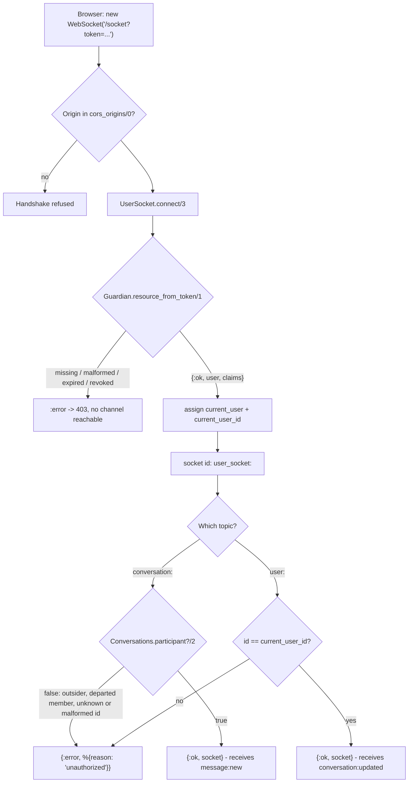
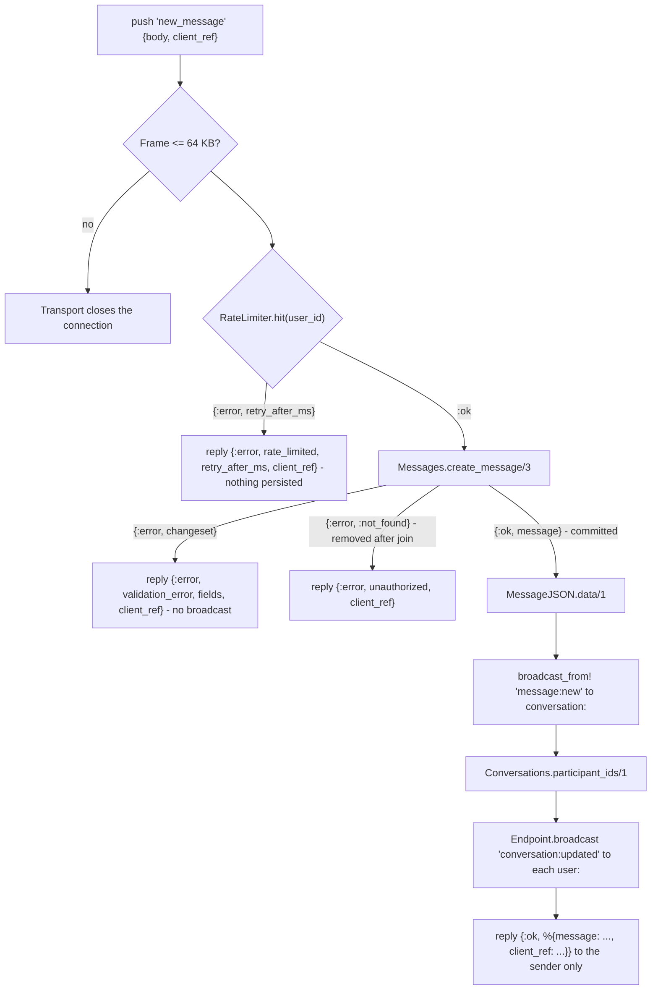
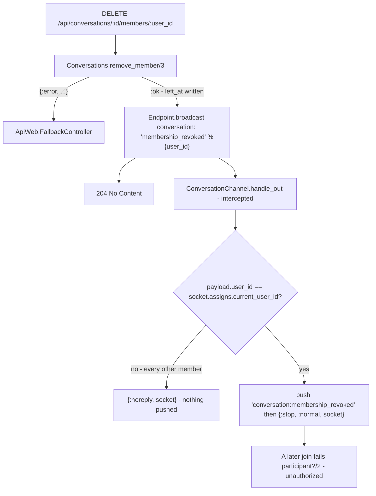

# Technical Specification: Real-Time Message Channel

**Complexity:** medium

---

## 1. Technical Overview

### What

Give the persisted message a delivery path, and give the token that already authenticates every HTTP request a second surface to authenticate:

1. **`ApiWeb.UserSocket` at `/socket`** — the transport. `connect/3` reads the `token` connect param, resolves it through the same `Api.Accounts.Guardian` entry point the HTTP pipeline uses, and assigns the resolved user; anything else fails the handshake. `id/1` returns `"user_socket:<user_id>"`, so every socket a user holds can be closed with one broadcast. The transport caps inbound frames at 64 KB and validates the request origin against the same allowlist CORS reads.
2. **`ApiWeb.ConversationChannel` on `conversation:*`** — message traffic. `join/3` calls the very same `Conversations.participant?/2` the REST layer calls, so the channel adds no authorization rule of its own. `new_message` rate-limits, persists through `Messages.create_message/3`, replies to the sender with the persisted record, and `broadcast_from!`s `message:new` to everyone else.
3. **`ApiWeb.UserChannel` on `user:*`** — per-user notification. One join rule: the topic id must be the authenticated user's own. It carries no inbound event; it exists to receive `conversation:updated` today and presence tomorrow.
4. **`ApiWeb.RateLimiter`** — a fixed-window counter over a public ETS table, keyed on `{user_id, window}`, one atomic increment per send. It is per user rather than per channel process, which is what a socket holding several conversations requires, and it needs no dependency to be.
5. **`Conversations.participant_ids/1` and the `conversation:updated` fan-out** — after each insert commits, one query resolves the active members and each gets a summary pushed to their personal topic, so a client that has not joined a conversation still learns it moved.
6. **The membership-revocation relay** — `ConversationController.remove_member/2` broadcasts on the conversation topic after the context reports success; the channel intercepts it, and the one socket belonging to the removed member pushes `conversation:membership_revoked` and stops.

No migration, no new dependency, no new REST route. What this feature adds is the second half of a send: the previous feature made a message durable, this one makes it arrive.

### Why

The socket authenticates with a connect param and not a header, and that is a constraint rather than a preference. The browser WebSocket constructor accepts a URL and a subprotocol list and nothing else — there is no place to put `Authorization: Bearer`. So the token travels as a query parameter, which is why `connect/3` is the only place in this codebase that reads a credential from a URL, and why it is worth stating that this is safe here for reasons that would not hold generally: the token is short-lived by policy, the connection is TLS in every deployed environment, and the handshake URL is not a resource a browser will place in a referrer or a user will bookmark. What matters more is that it resolves through `Api.Accounts.Guardian` and nothing else. That module's own moduledoc already promises one credential across both surfaces; a second verification path — a socket-only secret, a hand-rolled `Phoenix.Token`, a relaxed expiry — would be a second place for the authentication rules to drift, and drift in that direction is not a bug that shows up in tests.

Authorization on join reuses `participant?/2` unchanged, and that reuse is the whole point of the predicate existing. The channel is a second door into the same conversations the history endpoint guards; if it asked its own question, a group removal would take effect on the REST surface and not on the live one, and the two would disagree for exactly as long as a socket stayed open. Calling the same function also inherits its answers for free: a malformed conversation id fails the predicate's own UUID cast and returns false, an unknown id has no participant row and returns false, and a departed member's row has a `left_at` and returns false — so the PRD's three distinct rejections are one code path with one indistinguishable answer, which is also the property that keeps a stranger from probing conversation ids over a socket. The read-side counterpart `read_access/2` is deliberately *not* used here: holding a channel open is a question about the present, and a departed member gets no live traffic even though they keep their history.

Persist-then-broadcast is stated as an ordering, but the reason it is not merely an ordering is failure. If the broadcast went first, a validation failure or a constraint violation would already have painted a message into every participant's window that no history read will ever return, and there is no compensating message that undoes it — the clients that saw it may have scrolled, may have closed, may be offline. Inserting first makes the failure mode strictly better: the worst case is a message that is durable but undelivered, which the client repairs on its next history fetch, because F06 already made history the single source of truth. That is also why the channel replays nothing on join. A channel that replayed recent messages would be a second, subtly different history implementation — different bound, no cursor, no departed-member rule — and the first conversation with a gap would make it the client's job to reconcile two of them.

The sender is answered by a reply and excluded from the broadcast, rather than receiving the broadcast like everyone else. Both give the sender the record; only the reply gives it back on the same request the client is already awaiting, correlated by `client_ref`, so the optimistic bubble is replaced by the persisted row without the client matching on body text or timestamps. `broadcast_from!/3` excludes the calling socket's transport process specifically — not the user — so the same person's second device is a subscriber like any other and receives `message:new` normally, which is the behaviour a multi-device client needs and a user-level exclusion would have broken.

The rate limit is per user rather than per channel, and the difference is not pedantry: a limit tracked in `socket.assigns` doubles when a user opens a second conversation, and a spammer opens conversations. Shared state across processes on one node means ETS, and ETS with `:ets.update_counter/4` means the check is a single atomic operation with no GenServer in the hot path — the process exists only to own the table and sweep it. A fixed window is chosen over a sliding log because the worst case it admits, forty messages straddling a boundary, is not a threat model for a chat application, while the sliding version keeps a list per active user and does list work on every send to buy precision nobody consumes. The limiter lives in `ApiWeb` and not in the domain because it guards a transport, not an invariant: `create_message/3` stays the rule about what a message *is*, and nothing in the domain becomes unenforceable if the limiter is removed.

Membership revocation crosses a boundary the compiler enforces one way. `Api.Conversations` may not call `ApiWeb`, and it should not want to — a context that knew about socket topics would be a context that could not be tested without an endpoint. Publishing a domain event and subscribing to it from each channel would respect the boundary, but it buys generality for a single caller and pays for it with a subscribe/unsubscribe lifecycle on every join, forever. Relaying from the controller after the context reports `:ok` keeps the domain untouched, fires only on a removal that actually happened, and puts the transport concern in the layer that owns transport. The channel then filters in `handle_out` rather than the broadcaster addressing one socket, because the conversation topic is the only handle the web layer has on "the live channels of this conversation" — and every other member's process short-circuits on a pattern match.

`conversation:updated` carries a boolean and not a count, and that is a seam rather than an omission. The inbox feature owns `last_read_at` and the counting rules that go with it — messages sent while a member was active, the cap at 99, the overflow flag — and it is being built in the same wave. Computing a live count here would mean one query per participant per message, on semantics that feature may still change, to produce a number the client can already get from the list endpoint. A boolean says what this event actually knows: something arrived, and it was not yours.

### Scope

**Included:**
- `ApiWeb.UserSocket` — token-authenticated `connect/3`, per-user socket `id/1`, both channel routes, the 64 KB frame cap and origin checking
- `ApiWeb.ConversationChannel` — `join/3` gated on `participant?/2`, the `new_message` handler with its four reply shapes, the `message:new` broadcast, the `conversation:updated` fan-out, and the `membership_revoked` intercept
- `ApiWeb.UserChannel` — `join/3` restricted to the caller's own topic
- `ApiWeb.RateLimiter` — the ETS fixed-window counter, its supervision-tree entry and its sweep
- `Api.Conversations.participant_ids/1` — active member ids for the fan-out
- `ApiWeb.ConversationJSON.updated/1` — the `conversation:updated` payload shape
- `ApiWeb.ChangesetJSON.fields/1` — the existing error translator made reusable by the channel
- `ApiWeb.ConversationController.remove_member/2` extended with the revocation broadcast
- `ApiWeb.ChannelCase` extended with a connected-socket helper
- Socket, channel, limiter and cross-feature test suites

**Excluded (owned by other features):**
- Presence, online status, `presence:state`, `presence:diff` and writing `last_seen_at` on disconnect — the presence feature owns all of them and consumes the socket lifecycle this feature provides; nothing here writes `last_seen_at`
- Unread counts, `last_read_at`, the mark-as-read endpoint and the aggregated conversation list — the inbox feature owns them; this feature emits a boolean indicator only
- Any change to `Messages.create_message/3`, `Messages.list_messages/3` or the `messages` table — the write path is consumed exactly as it exists
- Any change to `Conversations.participant?/2` or `read_access/2` — `participant_ids/1` is added beside them
- Message history replay on join, and any REST send endpoint — history is fetched through F06 and messages are written over the channel only
- Typing indicators, delivery and read receipts per message, editing, deleting and reactions — out of the product's scope
- Multi-node PubSub distribution — the deployment is a single node; `Phoenix.PubSub` already in the tree makes this a configuration change if that changes

---

## 2. Architecture Impact

### Affected components

| Layer | Component | Path |
|---|---|---|
| Domain | Active member ids for the fan-out | `lib/api/conversations.ex` |
| Domain | Limiter added to the supervision tree | `lib/api/application.ex` |
| Web | Socket transport, token authentication, channel routes | `lib/api_web/channels/user_socket.ex` |
| Web | Conversation topic: join, send, broadcast, revocation | `lib/api_web/channels/conversation_channel.ex` |
| Web | Personal topic: join rule | `lib/api_web/channels/user_channel.ex` |
| Web | Per-user send limiter over ETS | `lib/api_web/rate_limiter.ex` |
| Web | Socket declaration with frame cap and origin check | `lib/api_web/endpoint.ex` |
| Web | `conversation:updated` payload | `lib/api_web/controllers/conversation_json.ex` |
| Web | Changeset error translation made reusable | `lib/api_web/controllers/changeset_json.ex` |
| Web | Revocation broadcast after a successful removal | `lib/api_web/controllers/conversation_controller.ex` |
| Web | `RateLimiter` added to the boundary's exports | `lib/api_web.ex` |
| Test | Connected-socket helper | `test/support/channel_case.ex` |

### Connect and join authorization

Every rejection on this diagram is the same shape to the client, and that is deliberate: an unknown conversation, a conversation the caller never joined and one they were removed from are indistinguishable, so a socket is not an oracle for ids the REST surface already refuses to confirm.



### Send flow

The insert commits before anything leaves the node, so every event a client receives names a row a history read can return. The limiter runs first because a rejected send must cost no database work.



### Membership revocation

The context is never told that channels exist; the controller relays the fact of a removal it already observed, and the filtering happens in the one process that can act on it.



---

## 3. Technical Decisions

| Decision | Chosen Approach | Alternative Considered | Trade-off |
|---|---|---|---|
| Socket authentication | `token` connect param resolved through `Api.Accounts.Guardian.resource_from_token/1` | A socket-specific `Phoenix.Token` | The credential appears in a handshake URL, which is acceptable under TLS for a short-lived token; in exchange there is exactly one place where authentication rules live and one credential a client manages |
| Socket assigns | Both `current_user` (the struct Guardian loaded) and `current_user_id` | Only the id, reloading the user per send | The struct can go stale over a 7-day token — only for `name`/`username` in a rendered payload, never for identity; in exchange every send avoids a query and `create_message/3` is called with the shape it already takes |
| Join authorization | `Conversations.participant?/2`, unchanged | A channel-local membership query | None: the same predicate REST calls, so a removal takes effect on both surfaces at once and the three PRD rejections collapse into one indistinguishable answer |
| Delivery ordering | Insert commits, then broadcast | Broadcast optimistically, persist after | A message can be durable but undelivered, which the client repairs through the history endpoint; the reverse failure — a rendered message that no history read returns — has no repair at all |
| Sender's copy | Reply on the push, `broadcast_from!` to the rest | Broadcast to everyone and let the sender de-duplicate | The sender's other devices still receive `message:new` because the exclusion is by transport process, not by user; the sending client gets its record correlated by `client_ref` on the call it is already awaiting |
| Rate limiting | `ApiWeb.RateLimiter`: fixed window, public ETS, `:ets.update_counter/4` | `:hammer`, or a counter in `socket.assigns` | Assigns would grant one limit per open conversation, which defeats the rule; `:hammer` adds a dependency and a config surface for ~40 lines. A fixed window admits a boundary-straddling burst of 40, which is not a threat model here |
| Limiter placement | `ApiWeb`, started by `Api.Application`, exported from the `ApiWeb` boundary | `Api.Messages` | Requires one export addition; keeps a transport guard out of the domain, so no domain invariant depends on the limiter existing |
| Membership revocation | Controller relays via `Endpoint.broadcast` after `:ok`; the channel intercepts and filters | The context publishes a domain PubSub event | The relay only covers callers that go through the controller — which is every caller — and in exchange the domain stays free of topic names and the join path gains no subscription lifecycle |
| `conversation:updated` unread field | Boolean, `sender_id != recipient_id` | A live unread count per recipient | The client's badge count comes from the inbox endpoint; in exchange this feature performs no `last_read_at` read and does not couple to semantics the inbox feature owns and is still defining |
| Fan-out execution | Synchronous, after the broadcast, before the reply | A supervised `Task` after replying | Adds the fan-out to the sender's perceived latency — one query plus N local PubSub sends, microseconds each; in exchange delivery is ordered and the "every participant is notified" criterion is testable without a sync point |
| Channel modules | `ConversationChannel` and `UserChannel`, two socket routes | One module matching both topic prefixes | One more file; each module carries one authorization rule and one event vocabulary, and presence lands in `UserChannel` next without touching the send path |
| Error vocabulary | `%{reason: "..."}` on the channel, reusing the REST `code` strings | The full `{errors: {code, detail}}` envelope | Two error shapes across the API, as the PRD specifies; the `reason` values are the same strings a client already branches on, so only the wrapper differs |
| Frame limit | `max_frame_size: 65_536` on the socket transport | Validating payload size in the handler | An oversized frame closes the connection instead of producing a reply the client can act on; in exchange the 4000-character body limit is never reachable by a frame the handler has to parse |
| Origin checking | `check_origin: {ApiWeb.Endpoint, :cors_origins, []}` | `check_origin: false` | The socket and CORS read one allowlist from `CORS_ORIGINS`, so a new frontend origin is one variable rather than two settings that can disagree |

---

## 4. Component Overview

### Web

| File Path | New/Modified | Purpose | Key Responsibilities |
|---|---|---|---|
| `lib/api_web/channels/user_socket.ex` | New | Transport and authentication | `use Phoenix.Socket`; routes `"conversation:*"` and `"user:*"`; `connect/3` resolving the `token` param through `Api.Accounts.Guardian.resource_from_token/1` and assigning `current_user` and `current_user_id`, returning `:error` on any other shape or failure; `id/1` returning `"user_socket:<user_id>"` |
| `lib/api_web/channels/conversation_channel.ex` | New | Message traffic | `join/3` gated on `Conversations.participant?/2`, assigning the conversation id; `handle_in("new_message", ...)` running the limiter, then `Messages.create_message/3`, then `broadcast_from!` of `message:new` and the `conversation:updated` fan-out, replying with the persisted message and the echoed `client_ref`; `handle_in/3` catch-all answering `unknown_event`; `intercept ["membership_revoked"]` with a `handle_out/3` that pushes and stops for the named user and no-ops for everyone else |
| `lib/api_web/channels/user_channel.ex` | New | Personal notification topic | `join/3` accepting `"user:<own id>"` and rejecting every other id with `unauthorized`; no inbound events |
| `lib/api_web/rate_limiter.ex` | New | Per-user send limiter | A `GenServer` owning a named public ETS set (`read_concurrency`, `write_concurrency`); `hit/1` returning `:ok` or `{:error, retry_after_ms}` via one `:ets.update_counter/4` on `{user_id, window}`; a periodic sweep deleting buckets older than the current window |
| `lib/api_web/endpoint.ex` | Modified | Socket declaration | `socket "/socket", ApiWeb.UserSocket, websocket: [max_frame_size: 65_536, check_origin: {ApiWeb.Endpoint, :cors_origins, []}], longpoll: false`, placed with the existing dev-only LiveView socket |
| `lib/api_web/controllers/conversation_json.ex` | Modified | Event payload | `updated/1` rendering `{conversation_id, last_message: {preview, sender_id, inserted_at}, unread}` from a message and a recipient id, truncating the preview at 120 characters |
| `lib/api_web/controllers/changeset_json.ex` | Modified | Reusable translation | `translate_errors/1` promoted to a public `fields/1`; `error/1` calls it, so the channel and the 422 envelope share one translator |
| `lib/api_web/controllers/conversation_controller.ex` | Modified | Revocation relay | `remove_member/2` broadcasts `membership_revoked` on the conversation topic after the context returns `:ok`, before answering 204 |
| `lib/api_web.ex` | Modified | Boundary exports | Adds `RateLimiter` to the `ApiWeb` boundary's exports so the application supervisor may name it |

### Domain

| File Path | New/Modified | Purpose | Key Responsibilities |
|---|---|---|---|
| `lib/api/conversations.ex` | Modified | Fan-out recipients | `participant_ids/1` selecting the `user_id` of every active participant row for a conversation, over the existing `(conversation_id, user_id)` index; returns `[]` for an unknown or malformed id, so the fan-out cannot raise |
| `lib/api/application.ex` | Modified | Supervision tree | `ApiWeb.RateLimiter` added between `Phoenix.PubSub` and `ApiWeb.Endpoint`, so the table exists before the first socket can connect |

### Test

| File Path | New/Modified | Purpose | Key Responsibilities |
|---|---|---|---|
| `test/support/channel_case.ex` | Modified | Connected-socket helper | A helper building an authenticated socket for a user — issue a token, `connect/3` through `UserSocket` — so no channel test restates the handshake |

### Database

No migration. This feature adds no table, column, index or constraint; it reads `conversation_participants` through a new context function and writes `messages` through the existing one.

---

## 5. API Contracts

### Socket: `/socket`

- **Transport:** WebSocket (`longpoll: false`)
- **Authentication:** `token` connect param — the same JWT the `Authorization: Bearer` header carries
- **Limits:** inbound frames above 64 KB close the connection; origins are checked against `ApiWeb.Endpoint.cors_origins/0`

**Connect example:**
```
wss://api.example.com/socket/websocket?token=<jwt>&vsn=2.0.0
```

| Outcome | Condition |
|---|---|
| Handshake succeeds | The token verifies and names an existing user |
| Handshake fails (403) | `token` absent, malformed, expired, or naming a deleted user; no channel is reachable |
| Handshake refused | The `Origin` header is not in the configured allowlist |

**Socket id:** `user_socket:<user_id>` — `ApiWeb.Endpoint.broadcast("user_socket:<id>", "disconnect", %{})` closes every socket that user holds.

### Topic: `conversation:<conversation_id>`

**Join**

| Result | Condition |
|---|---|
| `{:ok, %{}}` | The caller is an active participant, private or group |
| `{:error, %{reason: "unauthorized"}}` | Non-participant, departed group member, unknown conversation id, or an id that is not a UUID — one answer for all four |

**Inbound: `new_message`**

| Field | Type | Required | Validation | Description |
|---|---|---|---|---|
| `body` | `string` | Yes | trimmed, 1–4000 characters | Stored verbatim; escaping is the client's responsibility |
| `client_ref` | `string` | No | — | Echoed unchanged in every reply, success or failure, so an optimistic bubble is resolved by correlation and never by content |

**Push example:**
```json
{
  "topic": "conversation:9f1c8e2a-44d8-4f1a-b7d3-0011a2b3c4d5",
  "event": "new_message",
  "payload": { "body": "bom dia, time", "client_ref": "tmp-8f21" },
  "ref": "7"
}
```

**Reply (ok):**
```json
{
  "status": "ok",
  "response": {
    "message": {
      "id": "3a1d0c74-8e5b-4a11-9c22-5b7c1f2d3e40",
      "conversation_id": "9f1c8e2a-44d8-4f1a-b7d3-0011a2b3c4d5",
      "body": "bom dia, time",
      "inserted_at": "2026-07-22T13:48:17.123456Z",
      "sender": {
        "id": "6b2f1e90-7c33-4d55-8a01-2f4e6a8b0c1d",
        "username": "anabeatriz",
        "name": "Ana Beatriz",
        "last_seen_at": null
      }
    },
    "client_ref": "tmp-8f21"
  }
}
```

The `message` object is `ApiWeb.MessageJSON.data/1` — byte-for-byte the shape the history endpoint returns, which is what makes a broadcast record and a history record the same thing to a client.

**Reply (error):**

| `reason` | When | Extra fields |
|---|---|---|
| `validation_error` | Body empty, whitespace-only, absent or over 4000 characters | `fields` — `{"body": ["..."]}`, from the same translator the 422 envelope uses |
| `rate_limited` | More than 20 sends in the current 10-second window | `retry_after_ms` — milliseconds until the window rolls |
| `unauthorized` | The caller was removed from the conversation after joining | — |
| `unknown_event` | Any inbound event other than `new_message` | — |

```json
{
  "status": "error",
  "response": {
    "reason": "validation_error",
    "fields": { "body": ["can't be blank"] },
    "client_ref": "tmp-8f21"
  }
}
```

```json
{
  "status": "error",
  "response": { "reason": "rate_limited", "retry_after_ms": 4200, "client_ref": "tmp-8f22" }
}
```

**Outbound: `message:new`** — broadcast to every joined participant except the sending socket. Payload is the same `MessageJSON.data/1` object shown above, unwrapped.

**Outbound: `conversation:membership_revoked`** — pushed only to the socket of a member removed from the group, immediately before that channel process stops.
```json
{ "conversation_id": "9f1c8e2a-44d8-4f1a-b7d3-0011a2b3c4d5" }
```

### Topic: `user:<user_id>`

**Join**

| Result | Condition |
|---|---|
| `{:ok, %{}}` | The topic id equals `socket.assigns.current_user_id` |
| `{:error, %{reason: "unauthorized"}}` | Any other id, well-formed or not |

**Inbound:** none.

**Outbound: `conversation:updated`** — pushed to every active participant of a conversation, the sender included, on each successful send.

| Field | Type | Description |
|---|---|---|
| `conversation_id` | `uuid` | The conversation that moved |
| `last_message.preview` | `string` | The first 120 characters of the body |
| `last_message.sender_id` | `uuid` | Who sent it, so the client renders a "You:" prefix without inspecting content |
| `last_message.inserted_at` | `string` | ISO 8601 with microseconds, UTC — the ordering key for the conversation list |
| `unread` | `boolean` | `false` on the sender's own topic, `true` for every other recipient |

```json
{
  "conversation_id": "9f1c8e2a-44d8-4f1a-b7d3-0011a2b3c4d5",
  "last_message": {
    "preview": "bom dia, time",
    "sender_id": "6b2f1e90-7c33-4d55-8a01-2f4e6a8b0c1d",
    "inserted_at": "2026-07-22T13:48:17.123456Z"
  },
  "unread": true
}
```

### Domain contract: `Conversations.participant_ids/1`

| Argument | Type | Description |
|---|---|---|
| `conversation_id` | `binary` \| `%Conversation{}` | Cast before the query |

| Return | Meaning |
|---|---|
| `[binary]` | The `user_id` of every active participant row |
| `[]` | Unknown conversation, or an id that fails the UUID cast — never an error, so a fan-out cannot raise on a conversation that vanished between the insert and the push |

### Domain contract: `ApiWeb.RateLimiter.hit/1`

| Return | Meaning |
|---|---|
| `:ok` | This send is the 20th or earlier in the current window |
| `{:error, retry_after_ms}` | The window is exhausted; `retry_after_ms` is the time remaining in it, in `1..10_000` |

---

## 6. Data Model

No relational change. Two shapes matter to this feature: the in-memory table the limiter owns, and the queries it and the fan-out perform against tables the previous features created.

### ETS table: `ApiWeb.RateLimiter`

| Aspect | Value | Rationale |
|---|---|---|
| Type | `:set`, named, `:public` | `hit/1` runs in the calling channel process, so the GenServer is never in the send path |
| Concurrency | `read_concurrency: true`, `write_concurrency: true` | Every send from every user writes the same table |
| Key | `{user_id, div(system_time_ms, 10_000)}` | Per user across all conversations, as the rule requires; the window is derived from the clock and never stored |
| Value | `integer` | Incremented with `:ets.update_counter(table, key, {2, 1}, {key, 0})` — one atomic operation that creates the bucket on first use |
| Limit | 20 per 10 000 ms | The PRD's rule, as module attributes |
| Sweep | Every 30 s, `:ets.select_delete/2` on buckets below the current window | Bounds the table at the active-user count rather than at the total-user count; correctness never depends on it, since a stale bucket is unreachable by key |
| Lifetime | Node-local, lost on restart | A restart resets every window, which for an abuse guard is the acceptable direction to fail |

### Query shapes

| Call | Shape | Index used |
|---|---|---|
| `participant?/2` on join | Existing `Repo.exists?` over `conversation_participants` by `(conversation_id, user_id)` with `left_at` null | `conversation_participants_conversation_id_user_id_index` (exact) |
| `participant_ids/1` on send | `select user_id where conversation_id == ^cid and is_nil(left_at)` | Same index, leading-column range — one row per active member, no join |
| `create_message/3` on send | Unchanged: the existing participation gate plus the insert | As specified by the message persistence feature |

The send path costs exactly three database operations — the gate, the insert, and the participant id list — regardless of conversation size, and none of them scans `messages`.

### Payload sizes

| Payload | Bound | Note |
|---|---|---|
| Inbound frame | 64 KB, enforced by the transport | A 4000-character body is at most ~16 KB in UTF-8, so the cap cannot reject a valid message |
| `message:new` | Body plus a fixed user object | Unbounded by count: one event per message per subscriber |
| `conversation:updated` | Preview capped at 120 characters | One event per message per active participant, capped by the 256-member group limit |

---

## 7. Testing Strategy

### Test file structure

| Test File | Test Type | Target | Notes |
|---|---|---|---|
| `test/api_web/channels/user_socket_test.exs` | Integration | `ApiWeb.UserSocket` | The handshake and its rejections; `async: false` |
| `test/api_web/channels/conversation_channel_test.exs` | Integration | `ApiWeb.ConversationChannel` | Join authorization, the send path, broadcasts, the fan-out, revocation, and both cross-feature criteria; `async: false` |
| `test/api_web/channels/user_channel_test.exs` | Integration | `ApiWeb.UserChannel` | The two join outcomes and receipt of `conversation:updated`; `async: false` |
| `test/api_web/rate_limiter_test.exs` | Unit | `ApiWeb.RateLimiter` | The counter in isolation, without a socket; `async: true` |
| `test/api/conversations_test.exs` | Unit / context | `Conversations.participant_ids/1` | Extends the existing suite |

Channel suites run with `async: false` on purpose. `Api.DataCase.setup_sandbox/1` checks the connection out in shared mode only for non-async tests, and a channel runs in its own process — an async channel test would see an empty database from inside `join/3`. The limiter suite has no database and stays async.

### `test/api_web/rate_limiter_test.exs`

| Test Function | Description | Assertions |
|---|---|---|
| `allows the configured number of hits in one window` | 20 sequential `hit/1` calls for one id | Every call returns `:ok` |
| `rejects the hit past the limit` | The 21st call | `{:error, ms}` with `ms` in `1..10_000` |
| `keeps rejecting for the rest of the window` | Calls 22 and 23 | Both `{:error, _}`, no counter reset |
| `tracks users independently` | Two ids interleaved, one exhausted | The exhausted id is rejected while the other still returns `:ok` |
| `creates the bucket on first use` | A never-seen id | `:ok`, no crash on a missing key |
| `counts across conversations` | Hits attributed to one user regardless of caller | The limit is reached at 20 total, not 20 per caller |
| `sweeps stale buckets` | Insert a past-window bucket, trigger the sweep | The stale key is gone and the current one survives |

### `test/api_web/channels/user_socket_test.exs`

| Test Function | Description | Assertions |
|---|---|---|
| `connects with a valid token` | `connect(UserSocket, %{"token" => token})` | `{:ok, socket}`; `current_user_id` equals the user's id and `current_user` is that `%User{}` |
| `rejects a missing token` | Empty params | `:error` |
| `rejects a malformed token` | `"not-a-jwt"` | `:error` |
| `rejects an expired token` | Token issued with a past expiry | `:error` |
| `rejects a token whose subject no longer exists` | Delete the user after issuing | `:error` |
| `assigns a per-user socket id` | `UserSocket.id/1` | `"user_socket:<user_id>"` |
| `cannot reach a channel after a failed connect` | Rejected handshake | No channel join is possible — the connect result carries no socket |

### `test/api_web/channels/conversation_channel_test.exs`

| Test Function | Description | Assertions |
|---|---|---|
| `joins as an active participant` | Private conversation, both members | `{:ok, _, socket}` for each |
| `joins as an active group member` | Group | `{:ok, _, socket}` |
| `rejects a non-participant` | Third user | `{:error, %{reason: "unauthorized"}}` |
| `rejects a departed group member` | Member removed, then joins | `{:error, %{reason: "unauthorized"}}` |
| `rejects an unknown conversation id` | Random UUID | `{:error, %{reason: "unauthorized"}}`, identical to the outsider's answer |
| `rejects a malformed conversation id` | `"conversation:nope"` | `{:error, %{reason: "unauthorized"}}` — no raised cast error |
| `replies with the persisted message` | Push `new_message` | `{:ok, %{message: msg}}` with a server-assigned `id` and `inserted_at`, and the sender embedded with id, `@username` and display name |
| `echoes client_ref unchanged` | Push with `client_ref: "tmp-1"` | The reply carries `"tmp-1"` verbatim |
| `echoes client_ref on an error reply` | Push an empty body with a `client_ref` | The error reply carries the same `client_ref` |
| `broadcasts message:new to other participants` | Second joined socket | Receives `message:new` whose payload equals the reply's `message` field |
| `does not broadcast to the sending socket` | The sender's own socket | Receives no `message:new`; the record arrives exactly once, in the reply |
| `delivers to a second socket of the same user` | Same user joined twice | The other socket receives `message:new`, confirming the exclusion is per transport rather than per user |
| `rejects an empty body without broadcasting` | `body: ""` | `{:error, %{reason: "validation_error", fields: %{body: [_]}}}`; no subscriber receives `message:new`; no row persisted |
| `rejects a whitespace-only body` | `body: "   "` | Same shape as above |
| `rejects a 4001-character body` | Over the bound | Same shape; nothing persisted, nothing broadcast |
| `accepts a 4000-character body` | At the bound | `{:ok, _}`; persisted verbatim |
| `rejects a payload with no body key` | `%{"client_ref" => "x"}` | `validation_error` with `fields.body` |
| `rejects a send from a member removed after joining` | Remove through the context while joined | `{:error, %{reason: "unauthorized"}}`; nothing persisted |
| `answers an unknown inbound event` | Push `"typing"` | `{:error, %{reason: "unknown_event"}}`; the channel stays alive |
| `rate limits the 21st send in a window` | 21 pushes | The first 20 reply `:ok`; the 21st replies `{:error, %{reason: "rate_limited", retry_after_ms: ms}}`; exactly 20 rows persisted; the connection stays open and a later join still works |
| `pushes conversation:updated to every participant` | Group with three members | Each member's `user:<id>` topic receives the event with the conversation id, the preview, the sender id and the timestamp |
| `marks the sender's own notification as read` | The sender's personal topic | `unread: false` on the sender's copy and `true` on every other |
| `truncates the preview at 120 characters` | A 200-character body | `preview` is exactly the first 120 characters; the broadcast `message:new` body is untruncated |
| `handles 5 concurrent senders of 20 messages each` | 5 sockets pushing into one group, a 6th subscribed | Exactly 100 rows persisted, the sixth socket receives exactly 100 `message:new` events, every message id distinct and each appearing once |
| `pushes membership_revoked to the removed member only` | Creator removes a joined member through the REST endpoint | The removed member's socket receives `conversation:membership_revoked` with the conversation id and its channel process stops; no other joined member receives it |
| `rejects a rejoin after revocation` | The same member joins again | `{:error, %{reason: "unauthorized"}}` |
| `does not revoke on a voluntary leave` | A member calls the leave endpoint | No `conversation:membership_revoked` is pushed; the next join is still rejected |

### `test/api_web/channels/user_channel_test.exs`

| Test Function | Description | Assertions |
|---|---|---|
| `joins the caller's own topic` | `user:<own id>` | `{:ok, _, socket}` |
| `rejects another user's topic` | `user:<other id>` | `{:error, %{reason: "unauthorized"}}` |
| `rejects a malformed topic id` | `user:nope` | `{:error, %{reason: "unauthorized"}}` |
| `receives conversation:updated without joining the conversation` | A participant joined only to their personal topic | The event arrives with the conversation id, preview, sender id, timestamp and `unread: true` |
| `accepts no inbound events` | Push any event | An error reply; nothing is persisted |

### `test/api/conversations_test.exs` (extended)

| Test Function | Description | Assertions |
|---|---|---|
| `participant_ids returns both members of a private conversation` | Private pair | Exactly the two user ids |
| `participant_ids excludes departed group members` | Member removed | The departed id is absent, every active id present |
| `participant_ids returns an empty list for an unknown conversation` | Random UUID | `[]` |
| `participant_ids returns an empty list for a malformed id` | `"nope"` | `[]`, no raised cast error |

### Cross-feature integration (in `conversation_channel_test.exs`)

| Test Function | PRD criterion | Assertions |
|---|---|---|
| `a broadcast message is the exact record the history endpoint returns` | F06 → F07 | Push `new_message`, capture the `message:new` payload, then read `GET /api/conversations/:id/messages` through the authenticated pipeline: the id, sender identity, body and `inserted_at` match field for field, confirming persist-before-broadcast |
| `a socket connection is the lifecycle presence will consume` | F07 → F10 | `connect/3` succeeds and `UserSocket.id/1` yields `"user_socket:<user_id>"`; closing the socket terminates the channel processes it held. Presence tracking and `last_seen_at` are asserted by the presence feature against this lifecycle |

### Coverage

`mix precommit` runs `coveralls` at the project's 80% floor. The limiter, the join predicate branches and the four reply shapes of `new_message` carry the invariants and each has direct coverage rather than incidental coverage through a happy path. The boundary compiler must accept `RateLimiter` in the `ApiWeb` exports and confirm that no channel module reaches around `Api`'s exported contexts.

---

## Assumptions and Decisions

Derived from the PRD, the existing codebase and the interview:

1. **Rate-limit window algorithm** — the PRD fixes 20 per 10 seconds and a `retry_after_ms` but not the algorithm. A fixed window keyed on `div(now_ms, 10_000)` is used, with `retry_after_ms` being the time left in the current bucket. A boundary-straddling burst of up to 40 is accepted.
2. **`client_ref` on error replies** — the PRD requires it echoed in the success reply. It is echoed in every reply, including `validation_error` and `rate_limited`, so a client can mark the right optimistic bubble as failed rather than guessing.
3. **Unknown inbound events** — answered `{:error, %{reason: "unknown_event"}}` rather than silently dropped, so a client typo surfaces instead of hanging on a reply that never arrives.
4. **Origin checking** — the socket reuses `ApiWeb.Endpoint.cors_origins/0` through an MFA, so `CORS_ORIGINS` governs both surfaces. The PRD does not mention socket origins.
5. **Voluntary leave emits no revocation push** — the PRD names the event only for removal. A member who left initiated it and already knows; their next join is refused by the same predicate.
6. **`conversation:updated` reaches the sender too** — the PRD says "each participant". The sender's copy carries `unread: false`, which is what keeps the conversation list reordering on the sending device without a refetch.
7. **Preview truncation** — a plain first-120-characters slice, as the PRD words it for this event. The whole-word truncation with an ellipsis belongs to the inbox feature's REST payload and is not replicated here.
8. **`participant_ids/1` returns `[]` rather than an error** — a conversation deleted between the insert and the fan-out must not crash a channel that has already replied `:ok`.
9. **Socket assigns hold the user struct** — the PRD names `current_user_id`; that assign exists, and `current_user` is assigned beside it to avoid reloading the sender on every message. Only rendered fields can go stale, never identity.
10. **Channel tests are not async** — a consequence of the existing sandbox helper, which shares the connection only for non-async tests; a channel runs in its own process.
11. **Limiter state is node-local** — the deployment is a single node. A multi-node deployment would need a shared counter, which is noted as a limitation and not built.
12. **No presence, no `last_seen_at`** — this feature provides the socket lifecycle; the presence feature consumes it. Nothing here writes to the users table.

Traceability to the PRD: **Consumes** (F02 token verification, F06 message records) → the connect flow and the send path; **Provides** (socket lifecycle for F10) → the socket id, `connect/3` and the cross-feature test; **Capabilities** → API Contracts, Component Overview and Technical Decisions; **Experience** → the send-flow and revocation diagrams; **Error Handling** → the reply-shape tables and the connect outcomes; **Section 9 per-feature criteria** → the socket, channel and limiter test tables; **Section 9 Cross-Feature Integration** (the F06→F07 and F07→F10 lines) → the cross-feature integration table.
