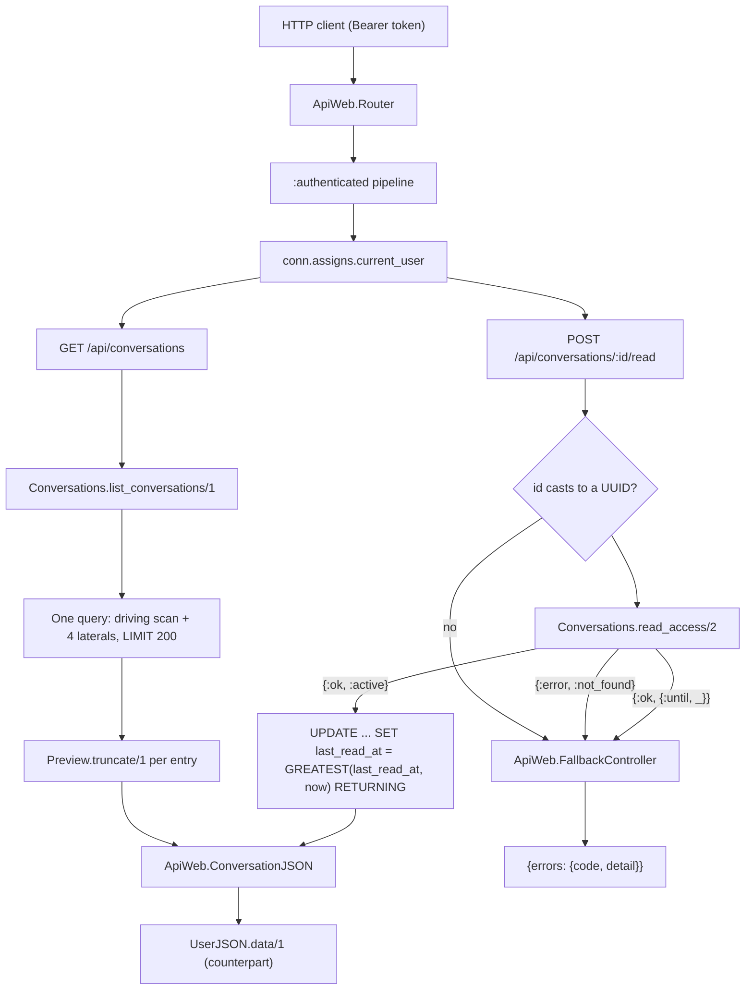
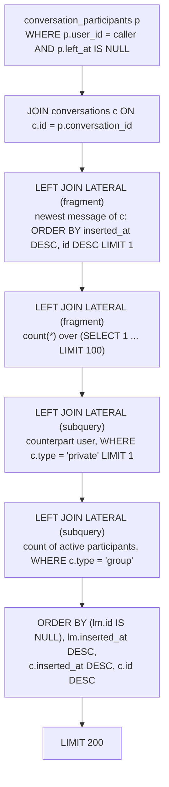
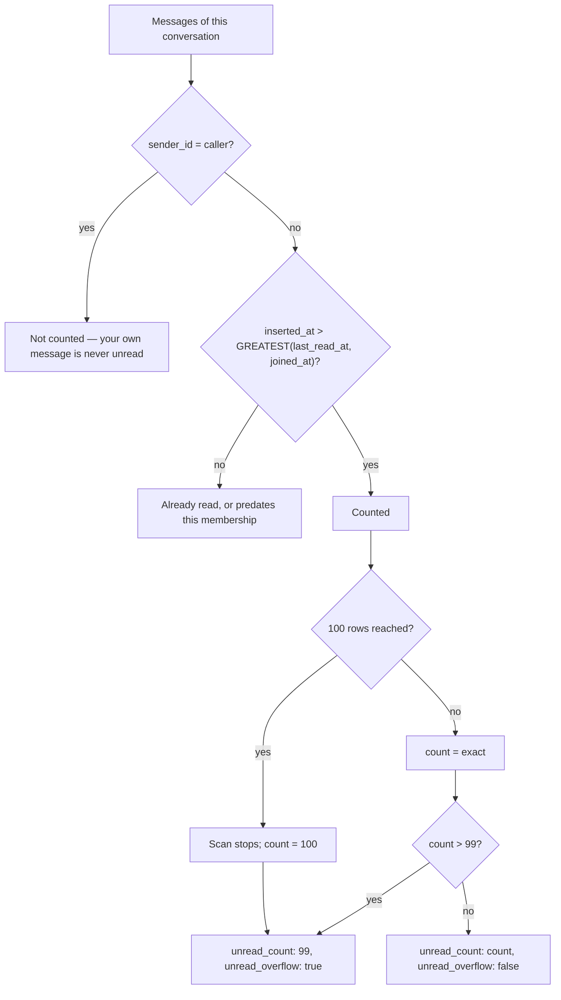
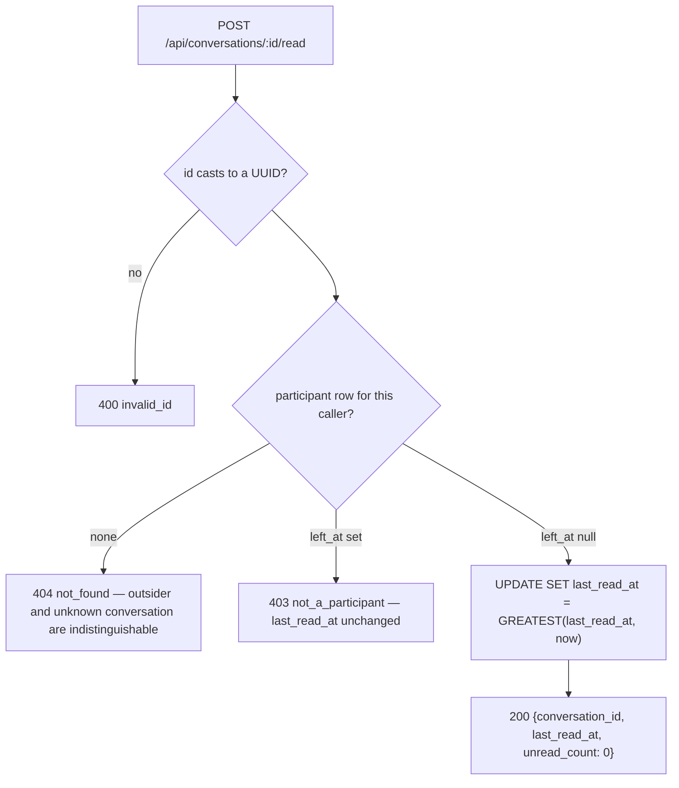

# Technical Specification: Conversation Inbox and Unread Tracking

**Complexity:** medium

---

## 1. Technical Overview

### What

Turn the rows the previous four features wrote into the one screen a chat client opens on:

1. **`GET /api/conversations`** — every conversation the caller actively participates in, private and group alike, in a single response capped at 200 entries, ordered by last activity. Each entry carries a resolved display title, the counterpart or the active member count, the last message preview and the caller's unread count.
2. **One aggregate query** — `Conversations.list_conversations/1` answers the whole endpoint in exactly one round trip: the driving scan is the caller's active participant rows, and four `LEFT JOIN LATERAL` sub-plans attach the last message, the capped unread count, the private counterpart and the active member count. No part of the response costs a query per conversation.
3. **The unread window** — `inserted_at > GREATEST(last_read_at, joined_at)` with `sender_id <> caller`, counted through an inner `LIMIT 100` so the query stops at the display cap rather than counting a backlog nobody renders. `unread_count` is the count capped at 99 and `unread_overflow` says whether it was.
4. **`POST /api/conversations/:id/read`** — moves the caller's own `last_read_at` marker forward with `GREATEST(last_read_at, now())`, so two devices marking at once both succeed and a cleared badge can never reappear.
5. **`Api.Conversations.Preview`** — the 120-character truncation rule, private to the conversations boundary and unit-tested on its own, the way `Api.Messages.Cursor` is to the messages boundary.

One migration adding a single partial index, no new table, no new context, no new dependency and no configuration value. The `last_read_at`, `joined_at` and `left_at` columns this feature reads were all written by the two conversation features; nothing about the schema changes except the index that makes "conversations of this user" a lookup instead of a scan.

### Why

This is the first endpoint in the product whose cost is not bounded by what the caller asked for. History reads one conversation, contacts reads one list, a group read reads one row — all of them scale with a page the client requested. The inbox reads *n* conversations and needs four facts about each, and the naive shape of that is a list query followed by 4*n* follow-ups. At 50 conversations that is 201 round trips to render one screen, every time the app opens, for every user. The acceptance criterion that pins the query count at 50 seeded conversations exists because this is the single place in the codebase where an N+1 would be invisible in development (a demo account has six conversations and a warm cache) and fatal in use. So the query count is not an optimization here; it is a correctness property, and it is asserted as one.

`LATERAL` is what makes "the newest message of each conversation" a bounded sub-plan rather than an aggregate over the whole table. The alternatives are all worse in a way that matters. A window function (`row_number() OVER (PARTITION BY conversation_id ORDER BY inserted_at DESC)`) has to read *every* message of every conversation the caller belongs to before discarding all but the first of each — the cost grows with total history, which is precisely the number that grows without bound. A `GROUP BY conversation_id` with `max(inserted_at)` finds the timestamp but not the row, so it needs a self-join to recover the body and the sender, and that join has to be told what to do about two messages sharing a timestamp. A lateral with `ORDER BY inserted_at DESC, id DESC LIMIT 1` is a one-row read of the index the history feature already built for exactly this order — the same `(conversation_id, inserted_at DESC, id DESC)` index, entered at its leading edge, 200 times at most. The PRD names this design, and the reason it names it is that the index it depends on already exists.

The unread count is capped inside the query rather than after it, and the difference is the whole point of the cap. `LEAST(count(*), 99)` still counts a 40,000-message backlog before throwing the number away. Counting over `(SELECT 1 FROM messages ... LIMIT 100)` stops the scan at the 100th qualifying row, so the worst case per conversation is 100 index entries regardless of how far behind the user is — and the response is identical, because a client that renders "99+" never needed the true number. The cap is 100 rather than 99 so that "more than 99" is decidable: a count of exactly 100 means at least one more exists, which is what `unread_overflow: true` reports.

The unread window is one predicate doing three jobs, and it is worth stating why it collapses. The rule from the PRD reads as three: count only messages the caller did not send; count everything when `last_read_at` is null; for groups, count only messages sent while the caller was an active member. The first is a plain `sender_id <> caller`. The other two are both bounds on the *lower* edge of the window, and `GREATEST(last_read_at, joined_at)` is exactly their maximum — because Postgres `GREATEST` ignores NULL operands, a null `last_read_at` degrades to `joined_at`, and for a private conversation `joined_at` predates every message in it, so "count everything not mine" falls out with no special case. For a group it is the membership bound, and for a re-added member it is the re-join time, since `seat!/2` rewrites `joined_at` on reactivation. One expression, no `CASE`, no branch on conversation type, and the three acceptance criteria that describe it are three readings of the same inequality.

Ordering has to place message-less conversations somewhere, and "somewhere" is a decision the PRD makes for a product reason: a group created seconds ago must be visible immediately, or the user who just created it thinks it failed. So the sort is two-tiered — conversations with messages first, by message time descending; then conversations without, by their own creation time descending — expressed as `ORDER BY (last_message.id IS NULL), last_message.inserted_at DESC, c.inserted_at DESC, c.id DESC`. The `c.id` tail is not decoration: without a total order, two conversations created in the same microsecond can swap places between two identical requests, and a client diffing the list would see phantom movement.

Marking as read is an idempotent write that must be monotonic, and those are not the same property. Idempotence alone is satisfied by `SET last_read_at = now()` — calling it twice leaves the same state. Monotonicity is what stops a badge from reappearing, and it fails under the ordinary case of a user with two devices: both open the conversation, both send the mark, and if the request that was *issued* first is *committed* second, the row ends up holding the earlier timestamp and messages that arrived in between become unread again. `GREATEST(last_read_at, $now)` makes the write a maximum rather than an assignment, so commit order stops mattering. It costs one SQL function and removes a class of bug that only appears on real devices with real latency, which is to say the class that never appears in tests written to reproduce it.

Both functions live in `Api.Conversations` even though half of what they read is messages, and the boundary graph is the reason the query is written the way it is. `Api.Messages` already declares `Api.Conversations` as a dependency — the send path gates on `participant?/2` and the history read on `read_access/2` — so declaring the reverse edge would close a cycle and the `boundary` compiler rejects it outright. The alternative placements each break something real: a new `Api.Inbox` boundary would have to write `last_read_at` into another context's table, and pushing the query into `Api.Messages` would put "which conversations does this user belong to" behind the wrong boundary. Keeping it here and reaching the `messages` table as a bare table source is the honest cost — the query names a table instead of a schema, so every UUID and timestamp it selects is wrapped in `type/2` to recover the Ecto type information a schema would have carried. That cost is confined to two `fragment/2` joins and is documented at the call site.

Preview truncation belongs to the domain and not to the renderer, for the same reason ordering does. It is not formatting; it is part of what the context promises to *provide* — the search feature returns this exact entry shape from its own filtered query, and a truncation rule living in the view would either be re-implemented there or reached across a layer. Putting it in `Api.Conversations.Preview` gives the rule one home, direct unit tests for its edge cases (a body of exactly the limit, a single 200-character word with no break, a body that is all whitespace after a newline collapse), and the same relationship to its boundary that `Api.Messages.Cursor` has to its own: used by exactly one caller, exported to nobody, tested on its own terms.

### Scope

**Included** (PRD Core Scope and Full Scope additions):
- `GET /api/conversations` — the aggregated list, capped at 200, with display title, counterpart or member count, last message preview and ordering by most recent activity *(Core Scope)*
- Unread count per entry with the 99 cap and the `unread_overflow` flag, and `POST /api/conversations/:id/read` *(Full Scope additions)*
- `Api.Conversations.list_conversations/1` — the single aggregate query with its four lateral sub-plans
- `Api.Conversations.mark_read/2` — the monotonic marker write, restricted to active participants
- `Api.Conversations.Preview` — `truncate/1`, private to the boundary
- Migration adding `conversation_participants_user_id_active_index`, the partial index the driving scan needs
- `ApiWeb.ConversationController.index/2` and `mark_read/2`, and two routes in the existing `:authenticated` scope
- `ApiWeb.ConversationJSON.index/1`, `summary/1` and `read/1` — the entry shape the search feature reuses verbatim
- `ApiWeb.FallbackController` extended with `not_a_participant` (403)
- `Api.DataCase.count_queries/1` — the telemetry helper the bounded-query criterion is asserted with
- Context, preview and endpoint test suites, plus the three cross-feature criteria naming this feature as consumer

**Excluded (owned by other features):**
- `GET /api/conversations?q=<term>` — the filtered variant is the search feature's; it reuses this entry shape and this query, adding one `WHERE` over the resolved title, and no accommodation for it is built here beyond keeping the query composable
- `conversation:updated` pushes that keep the list ordered and badged without a refetch — the real-time feature owns the broadcast; this feature owns the shape it carries
- Presence and `online` state on the embedded counterpart — the presence feature adds it to `UserJSON.data/1`, and it reaches this endpoint with no change here
- Pagination of the conversation list — the PRD fixes a flat 200-entry cap; there is no cursor, no `limit` and no `page` parameter
- Per-message read receipts, delivery status and typing indicators — all explicitly out of the product's scope
- Any change to `participant?/2`, `read_access/2`, `get_conversation/2` or the message write path

---

## 2. Architecture Impact

### Affected components

| Layer | Component | Path |
|---|---|---|
| Database | Partial index on the participant's user column | `priv/repo/migrations/<ts>_add_conversation_participants_user_index.exs` |
| Domain | Aggregate list query and monotonic read marker | `lib/api/conversations.ex` |
| Domain | Preview truncation rule | `lib/api/conversations/preview.ex` |
| Web | List and mark-as-read actions | `lib/api_web/controllers/conversation_controller.ex` |
| Web | Inbox entry and read-marker rendering | `lib/api_web/controllers/conversation_json.ex` |
| Web | `not_a_participant` reason | `lib/api_web/controllers/fallback_controller.ex` |
| Web | Two routes in the `:authenticated` scope | `lib/api_web/router.ex` |
| Test | Query-count assertion helper | `test/support/data_case.ex` |

### Request flow



### The aggregate query

The driving scan is the caller's own participant rows, so the number of rows entering the plan is bounded by the caller's membership before any join runs. Each lateral is correlated on `c.id` and produces at most one row, which is what keeps the result exactly one row per conversation — a plain join to `conversation_participants` for the counterpart would fan a 40-member group into 40 rows and then need a `DISTINCT ON` to undo it.



### Unread window



`GREATEST` ignoring NULL is what makes this one expression rather than three: a null `last_read_at` leaves `joined_at` as the bound, and a private conversation's `joined_at` predates its first message, so "count every message I did not send" is the same query as "count every message since I last read" and as "count only what was sent while I was a member".

### Mark-as-read authorization

A caller who has left the conversation gets 403 rather than the 404 an outsider gets, and this is a deliberate departure from the non-disclosure rule the rest of the conversations context follows. The rule elsewhere is that an outsider and an absent conversation share one answer, so probing ids discloses nothing. A departed member is not probing: they already know the conversation exists, because they were in it. Answering 404 would hide nothing and would tell them their own membership record vanished; `not_a_participant` tells them what is true.



---

## 3. Technical Decisions

| Decision | Chosen Approach | Alternative Considered | Trade-off |
|---|---|---|---|
| Aggregate shape | One query, four `LEFT JOIN LATERAL` sub-plans, `LIMIT 200` | Two or three batched queries grouped in Elixir | The SQL is the most complex in the codebase; in exchange the whole screen is one round trip in one snapshot, and no batch read can return 200 x 256 participant rows for a groups-heavy account |
| Last message resolution | Lateral with `ORDER BY inserted_at DESC, id DESC LIMIT 1` | `row_number()` window, or `GROUP BY` + self-join | Cost is bounded by conversation count, not by total history; reuses the history index at its leading edge instead of scanning every message to discard all but one per partition |
| Unread cap | `count(*)` over an inner `SELECT 1 ... LIMIT 100` | `LEAST(count(*), 99)` | The scan stops at 100 index entries per conversation instead of counting an unbounded backlog; 100 rather than 99 is what makes "more than 99" decidable |
| Unread window | `inserted_at > GREATEST(last_read_at, joined_at)` | `CASE` on null `last_read_at`, plus a type-dependent membership bound | Postgres `GREATEST` ignores NULLs, so three stated rules collapse into one inequality with no branch on conversation type |
| Context placement | `list_conversations/1` and `mark_read/2` on `Api.Conversations` | A new `Api.Inbox` boundary, or folding into `Api.Messages` | `Api.Messages` already depends on `Api.Conversations`, so the reverse edge is a cycle the boundary compiler rejects; keeping it here means the `messages` table is reached as a bare table source rather than through its schema |
| Messages access | Two `fragment/2` lateral joins naming the `messages` table, with `type/2` on every selected column | `subquery/1` over `Api.Messages.Message` with `parent_as/1` | Avoids both the boundary cycle and the fact that `parent_as/1` does not resolve through the two levels of nesting the capped count needs; costs explicit type annotations that a schema source would have supplied |
| Participant laterals | `subquery/1` with `parent_as(:conversation)` over `Participant` and `User` | `fragment/2`, for symmetry with the message laterals | Both tables are inside this boundary and one level deep, so the typed, composable form works; symmetry is not worth giving up type inference |
| Counterpart fan-out | `c.type = 'private'` inside the counterpart lateral, `c.type = 'group'` inside the member-count lateral | A plain join plus `DISTINCT ON`, or two separate queries per type | Each lateral yields at most one row, so one conversation is always one result row; a group returns NULL for counterpart and a private returns NULL for member count without a second pass |
| Ordering | `(last_message.id IS NULL)`, then message time DESC, then `c.inserted_at DESC, c.id DESC` | `COALESCE(last_message.inserted_at, c.inserted_at) DESC` | The two-tier form places every message-less conversation below every active one, which `COALESCE` does not; the `c.id` tail makes the order total, so identical requests cannot return different sequences |
| Read marker write | `update_all` with `SET last_read_at = GREATEST(last_read_at, $now)`, `RETURNING` the new value | `SET last_read_at = $now`, or a read-modify-write in Elixir | Monotonic under concurrent marks from two devices with no lock and no transaction; a cleared badge cannot reappear because commit order stopped mattering |
| Preview truncation | `Api.Conversations.Preview`, applied in the domain | In `ConversationJSON`, or inline in the query with `left()` | The truncated preview is part of what the context provides, so the search feature reuses it rather than restating the rule; the whole-word rule is Elixir-side because SQL `left()` cannot find a word boundary |
| Departed member on mark-as-read | 403 `not_a_participant` | 404, matching the context's non-disclosure rule elsewhere | A departed member already knows the conversation exists, so 404 conceals nothing and misreports the reason; the PRD states 403 explicitly |
| Driving-scan index | Partial `conversation_participants (user_id) WHERE left_at IS NULL` | Plain index on `user_id`; or none, relying on the existing unique index | The existing unique index leads on `conversation_id`, so a lookup by `user_id` is a sequential scan; the partial predicate keeps departed rows out of the index entirely, since the driving scan never wants them |
| Response cap | Flat `LIMIT 200`, no pagination and no cap disclosure | Keyset pagination, as the history endpoint uses | The PRD fixes the cap; an inbox is rendered whole, and a client that pages it cannot show a global unread state. A user above the cap loses their least recently active conversations, which is the correct thing to lose |

---

## 4. Component Overview

### Domain

| File Path | New/Modified | Purpose | Key Responsibilities |
|---|---|---|---|
| `lib/api/conversations.ex` | Modified | Aggregate read and read marker | Adds `list_conversations/1` — the driving scan over the caller's active participant rows, the four lateral joins, the two-tier ordering, the 200 cap, and assembly of each row into a summary map with the preview truncated and the unread count capped. Adds `mark_read/2` — id cast, `read_access/2` gate mapping `{:until, _}` to `:not_a_participant`, and the `GREATEST` update returning the new marker. Boundary declaration, `participant?/2`, `read_access/2` and every existing function unchanged |
| `lib/api/conversations/preview.ex` | New | Truncation rule | `truncate/1` collapsing whitespace runs to single spaces, returning bodies at or under the limit verbatim, and otherwise cutting at the last word boundary within the limit — falling back to a hard cut when the first word is longer than the limit — and appending a single-character ellipsis. Not exported from the boundary; used only by `list_conversations/1` |

### Web

| File Path | New/Modified | Purpose | Key Responsibilities |
|---|---|---|---|
| `lib/api_web/controllers/conversation_controller.ex` | Modified | List and mark-as-read | `index/2` reading the caller from `conn.assigns.current_user` and taking no parameters; `mark_read/2` passing the path id straight to the context. Both delegate every failure to the existing `action_fallback`; the existing five actions are untouched |
| `lib/api_web/controllers/conversation_json.ex` | Modified | Inbox rendering | `index/1` wrapping the entries under `conversations`; `summary/1` rendering one entry — id, type, title, counterpart through `UserJSON.data/1`, member count, nested `last_message` or null, unread count and overflow, and the caller's `last_read_at`; `read/1` rendering the marker response. `show/1` and both `data/2` clauses unchanged, since the detail shape and the inbox shape answer different questions |
| `lib/api_web/controllers/fallback_controller.ex` | Modified | Error table | Registers `not_a_participant` → `{:forbidden, "not_a_participant", "You have left this conversation"}` |
| `lib/api_web/router.ex` | Modified | Routes | `get "/conversations", ConversationController, :index` and `post "/conversations/:id/read", ConversationController, :mark_read` inside the existing `:authenticated` scope. Neither collides with the existing conversation routes: the list is a one-segment GET, and `read` is a distinct literal segment from `members` |

### Test

| File Path | New/Modified | Purpose | Key Responsibilities |
|---|---|---|---|
| `test/support/data_case.ex` | Modified | Query counting | `count_queries/1` attaching a handler to `[:api, :repo, :query]` for the duration of a function, detaching in an `after` clause, and returning the number of queries the function issued. Shared by `ConnCase` and `ChannelCase` through the existing sandbox arrangement |

### Database

| Migration File | Tables Affected | Operation | Notes |
|---|---|---|---|
| `priv/repo/migrations/<ts>_add_conversation_participants_user_index.exs` | `conversation_participants` | CREATE INDEX | Partial index on `user_id` where `left_at IS NULL`; generated with `mix ecto.gen.migration add_conversation_participants_user_index`. No column, constraint or table change |

---

## 5. API Contracts

### Endpoint: Conversation Inbox

- **Method:** GET
- **Path:** `/api/conversations`
- **Authentication:** JWT Bearer (`:authenticated` pipeline)

Takes no path, query or body parameters. The response is capped at 200 entries and is not paginated.

**Request example:**
```
GET /api/conversations
Authorization: Bearer <token>
```

**Response (200):**

| Field | Type | Description |
|---|---|---|
| `conversations` | `array` | At most 200 entries, ordered by last activity |
| `conversations[].id` | `uuid` | Conversation id |
| `conversations[].type` | `"private" \| "group"` | Which shape the entry carries |
| `conversations[].title` | `string` | Counterpart's display name for private, group name for group |
| `conversations[].counterpart` | `object \| null` | `UserJSON.data/1` for private; null for group |
| `conversations[].member_count` | `integer \| null` | Active members for group; null for private |
| `conversations[].last_message` | `object \| null` | Null when the conversation has never been used |
| `conversations[].last_message.id` | `uuid` | The previewed message |
| `conversations[].last_message.body` | `string` | Truncated to at most 120 characters including the ellipsis |
| `conversations[].last_message.sender_id` | `uuid` | Lets the client prefix "You:" without inspecting content |
| `conversations[].last_message.inserted_at` | `string` | ISO 8601 with microseconds, UTC |
| `conversations[].unread_count` | `integer` | 0–99; never counts the caller's own messages |
| `conversations[].unread_overflow` | `boolean` | True when more than 99 messages are unread |
| `conversations[].last_read_at` | `string \| null` | The caller's own marker; null until first marked |

**Response example:**
```json
{
  "conversations": [
    {
      "id": "9f1c8e2a-44d8-4f1a-b7d3-0011a2b3c4d5",
      "type": "group",
      "title": "Time de Produto",
      "counterpart": null,
      "member_count": 7,
      "last_message": {
        "id": "3a1d0c74-8e5b-4a11-9c22-5b7c1f2d3e40",
        "body": "pessoal, subi a versao nova no ambiente de homologacao e vale a pena dar uma olhada antes da…",
        "sender_id": "6b2f1e90-7c33-4d55-8a01-2f4e6a8b0c1d",
        "inserted_at": "2026-07-22T13:48:17.123456Z"
      },
      "unread_count": 12,
      "unread_overflow": false,
      "last_read_at": "2026-07-22T09:14:02.000000Z"
    },
    {
      "id": "b7e4d310-2a91-4c88-9f55-6d3a1b0e7c22",
      "type": "private",
      "title": "Ana Beatriz",
      "counterpart": {
        "id": "6b2f1e90-7c33-4d55-8a01-2f4e6a8b0c1d",
        "username": "anabeatriz",
        "name": "Ana Beatriz",
        "last_seen_at": null
      },
      "member_count": null,
      "last_message": {
        "id": "5c3e2f81-9a44-4b66-8d12-3e5f7b9c0d2e",
        "body": "bom dia!",
        "sender_id": "7d4a3b21-0e55-4c77-9b23-4a6c8d0e2f30",
        "inserted_at": "2026-07-22T11:02:44.884210Z"
      },
      "unread_count": 99,
      "unread_overflow": true,
      "last_read_at": null
    },
    {
      "id": "c81a5f62-3b77-4d99-8e11-7a2c4d6e8f01",
      "type": "group",
      "title": "Churrasco de Sabado",
      "counterpart": null,
      "member_count": 3,
      "last_message": null,
      "unread_count": 0,
      "unread_overflow": false,
      "last_read_at": null
    }
  ]
}
```

**Caller with no conversations:**
```json
{ "conversations": [] }
```

**Error codes:**

| Code | HTTP Status | When |
|---|---|---|
| `unauthenticated` | 401 | Missing, malformed or expired bearer token |

There is no other failure mode: the endpoint takes no input, and a caller with no conversations is a 200 with an empty array.

### Endpoint: Mark Conversation Read

- **Method:** POST
- **Path:** `/api/conversations/:id/read`
- **Authentication:** JWT Bearer (`:authenticated` pipeline)

**Path parameters:**

| Field | Type | Required | Validation | Description |
|---|---|---|---|---|
| `id` | `uuid` | Yes | castable UUID | The conversation, private or group |

Takes no request body.

**Request example:**
```
POST /api/conversations/9f1c8e2a-44d8-4f1a-b7d3-0011a2b3c4d5/read
Authorization: Bearer <token>
```

**Response (200):**

| Field | Type | Description |
|---|---|---|
| `conversation_id` | `uuid` | Echo of the conversation marked |
| `last_read_at` | `string` | The marker after the write; equal to the previous value when a later mark had already been recorded |
| `unread_count` | `integer` | Always 0 |

**Response example:**
```json
{
  "conversation_id": "9f1c8e2a-44d8-4f1a-b7d3-0011a2b3c4d5",
  "last_read_at": "2026-07-22T14:30:11.204518Z",
  "unread_count": 0
}
```

**Error codes:**

| Code | HTTP Status | When |
|---|---|---|
| `unauthenticated` | 401 | Missing, malformed or expired bearer token |
| `invalid_id` | 400 | `:id` is not a castable UUID |
| `not_found` | 404 | No participant row ever existed for the caller, or no such conversation — indistinguishable |
| `not_a_participant` | 403 | The caller left this conversation; `last_read_at` is not written |

**Error example (403):**
```json
{
  "errors": {
    "code": "not_a_participant",
    "detail": "You have left this conversation"
  }
}
```

### Domain contract: `Conversations.list_conversations/1`

The entry shape is what the PRD's **Provides** block promises to the search feature, so it is specified as a domain contract and not only as a response body.

| Argument | Type | Description |
|---|---|---|
| `caller` | `%Api.Accounts.User{}` | The authenticated caller; the only source of the driving scan and of the unread window |

| Return | Meaning |
|---|---|
| `[summary]` | At most 200 maps, ordered; never an error tuple, since the function takes no input that can fail |

Each summary carries `:id`, `:type`, `:title`, `:counterpart` (a `%User{}` or `nil`), `:member_count` (integer or `nil`), `:last_message` (a map of `:id`, `:body`, `:sender_id`, `:inserted_at`, or `nil`), `:unread_count`, `:unread_overflow` and `:last_read_at`. `:body` is already truncated when it leaves the context.

### Domain contract: `Conversations.mark_read/2`

| Return | Meaning |
|---|---|
| `{:ok, %{conversation_id: binary, last_read_at: DateTime.t()}}` | Marker written or already ahead |
| `{:error, :not_found}` | No participant row, or no such conversation |
| `{:error, :not_a_participant}` | The caller's participant row carries a `left_at` |
| `{:error, :invalid_id}` | `id` is not a castable UUID |

---

## 6. Data Model

No table, column or constraint changes. The three columns this feature reads — `conversation_participants.last_read_at`, `.joined_at` and `.left_at` — were all created with the table, and `last_read_at` has had no writer until now.

### Index added: `conversation_participants`

| Index Name | Columns | Type | Purpose |
|---|---|---|---|
| `conversation_participants_user_id_active_index` | `user_id`, partial on `left_at IS NULL` | btree | The inbox's driving scan. The existing unique index leads on `conversation_id`, so "every conversation of this user" cannot use it and degrades to a sequential scan of the participant table, which grows with every conversation in the product rather than with the caller's own |

**Migration (illustrative SQL):**
```sql
CREATE INDEX conversation_participants_user_id_active_index
    ON conversation_participants (user_id)
    WHERE left_at IS NULL;
```

The predicate mirrors the query exactly: the driving scan never wants departed rows, so keeping them out of the index makes it smaller than the table and keeps a user who has left many groups from carrying dead entries in the structure their inbox is read through.

### Existing indexes this feature depends on

| Index | Used by | Access pattern |
|---|---|---|
| `messages_conversation_id_inserted_at_id_index` | Last-message lateral | One-row read at the leading edge of the range for a given conversation — the same index the history read enters, entered at its first row |
| `messages_conversation_id_inserted_at_id_index` | Unread lateral | Range scan from `GREATEST(last_read_at, joined_at)` forward, filtering `sender_id`, stopped by the inner `LIMIT 100` |
| `conversation_participants_conversation_id_user_id_index` | Counterpart and member-count laterals, `read_access/2` in `mark_read/2` | Leftmost-prefix scan on `conversation_id` for the laterals; exact lookup for the read gate |

No index is added for `messages.sender_id` inside the unread window: `sender_id <> caller` is an inequality over a scan already bounded to at most 100 rows, so it is a filter and not an access path.

### Query shapes

**The aggregate (illustrative SQL):**
```sql
SELECT c.id, c.type, c.name, c.inserted_at, p.last_read_at,
       lm.id, lm.body, lm.sender_id, lm.inserted_at,
       un.unread,
       cp.id, cp.username, cp.name, cp.last_seen_at,
       mc.members
  FROM conversation_participants p
  JOIN conversations c ON c.id = p.conversation_id
  LEFT JOIN LATERAL (
        SELECT m.id, m.body, m.sender_id, m.inserted_at
          FROM messages m
         WHERE m.conversation_id = c.id
         ORDER BY m.inserted_at DESC, m.id DESC
         LIMIT 1
  ) lm ON true
  LEFT JOIN LATERAL (
        SELECT count(*) AS unread FROM (
              SELECT 1 FROM messages m
               WHERE m.conversation_id = c.id
                 AND m.sender_id <> $1
                 AND m.inserted_at > GREATEST(p.last_read_at, p.joined_at)
               LIMIT 100
        ) capped
  ) un ON true
  LEFT JOIN LATERAL (
        SELECT u.id, u.username, u.name, u.last_seen_at
          FROM conversation_participants o
          JOIN users u ON u.id = o.user_id
         WHERE c.type = 'private'
           AND o.conversation_id = c.id
           AND o.user_id <> $1
           AND o.left_at IS NULL
         LIMIT 1
  ) cp ON true
  LEFT JOIN LATERAL (
        SELECT count(*) AS members
          FROM conversation_participants a
         WHERE c.type = 'group'
           AND a.conversation_id = c.id
           AND a.left_at IS NULL
  ) mc ON true
 WHERE p.user_id = $1
   AND p.left_at IS NULL
 ORDER BY (lm.id IS NULL), lm.inserted_at DESC, c.inserted_at DESC, c.id DESC
 LIMIT 200;
```

**Ecto expression rules:**

| Sub-plan | Written as | Why |
|---|---|---|
| Last message | `join(:left_lateral, ..., in fragment("SELECT ... FROM messages ..."), on: true)` with `type/2` on `id`, `sender_id` and `inserted_at` | The `messages` table cannot be referenced through `Api.Messages.Message` without closing a boundary cycle; a bare source carries no Ecto type information, so UUIDs would return as raw 16-byte binaries and timestamps in the driver's own shape |
| Unread count | `join(:left_lateral, ..., in fragment("SELECT count(*) ... LIMIT 100) capped"), on: true)` | Same boundary reason, plus `parent_as/1` does not resolve through the two levels of subquery nesting the capped count requires |
| Counterpart | `join(:left_lateral, ..., in subquery(...), on: true)` with `parent_as(:conversation)` | Both `Participant` and `User` are reachable from this boundary and the correlation is one level deep, so the typed, composable form works and no annotation is needed |
| Active member count | `join(:left_lateral, ..., in subquery(...), on: true)` with `parent_as(:conversation)` | Same |
| Ordering | `order_by: [asc: fragment("? IS NULL", lm.id), desc: lm.inserted_at, desc: c.inserted_at, desc: c.id]` | The two-tier sort; the `c.id` tail makes the order total |

The outer query names its bindings with `as: :participant` and `as: :conversation` so `parent_as/1` can reach them, and the two `fragment/2` joins receive `c.id`, `p.user_id`, `p.last_read_at` and `p.joined_at` as interpolated parameters rather than reading them through a binding.

**The read marker (illustrative SQL):**
```sql
UPDATE conversation_participants
   SET last_read_at = GREATEST(last_read_at, $1), updated_at = $1
 WHERE conversation_id = $2 AND user_id = $3 AND left_at IS NULL
RETURNING last_read_at;
```

`GREATEST` ignoring NULL is what makes the first mark work: a null `last_read_at` yields the supplied timestamp rather than null.

### Preview rule

| Input | Output |
|---|---|
| Body at or under 120 characters | Verbatim, whitespace runs collapsed, no ellipsis |
| Longer, with a word boundary inside the limit | Cut at the last boundary that fits within 119 characters, trailing whitespace stripped, ellipsis appended |
| Longer, with no word boundary inside the limit | Hard cut at 119 characters, ellipsis appended |
| Body containing newlines or repeated spaces | Runs of whitespace collapse to a single space before the length is measured |

The result is never longer than 120 characters, counting the ellipsis, which is a single grapheme. The stored body is untouched: the history endpoint returns it verbatim, and this rule applies only to the preview.

---

## 7. Testing Strategy

### Test file structure

| Test File | Test Type | Target | Notes |
|---|---|---|---|
| `test/api/conversations/preview_test.exs` | Unit | `Api.Conversations.Preview` | The truncation rule at and around every boundary |
| `test/api/conversations_test.exs` | Unit / context | `list_conversations/1`, `mark_read/2` | Extends the existing suite; ordering, unread window, caps, query count |
| `test/api_web/controllers/conversation_inbox_controller_test.exs` | Integration | Both endpoints | Full authenticated pipeline, one test per acceptance criterion, plus the three cross-feature criteria. A file of its own so the existing conversation controller suites stay about creation and membership |

### `test/api/conversations/preview_test.exs`

| Test Function | Description | Assertions |
|---|---|---|
| `returns a short body verbatim` | 20-character body | Identical string, no ellipsis |
| `returns a body of exactly the limit verbatim` | 120 characters | Identical string, no ellipsis |
| `truncates at the last word boundary` | 200 characters of ordinary words | Result at most 120 characters, ends with the ellipsis, last word is not cut mid-way |
| `hard-cuts a single word longer than the limit` | One 200-character token | Result exactly 120 characters including the ellipsis |
| `collapses newlines and repeated spaces` | Body with `"\n\n"` and double spaces | Single spaces only; no newline survives into the preview |
| `strips trailing whitespace before the ellipsis` | Boundary falls on a space | No space between the last word and the ellipsis |
| `counts characters and not bytes` | Accented and multi-byte body over the limit | Result at most 120 graphemes; no invalid encoding |

### `test/api/conversations_test.exs` (extended)

| Test Function | Description | Assertions |
|---|---|---|
| `lists private and group conversations in one response` | Caller in 2 private and 2 groups | 4 entries, both types present |
| `resolves the title from the counterpart for private conversations` | Private pair | `title` equals the counterpart's `name`; `counterpart` carries their id and username; `member_count` is nil |
| `resolves the title from the group name for groups` | Group of 3 | `title` equals the group name; `member_count` is 3; `counterpart` is nil |
| `orders by last message timestamp descending` | Three conversations messaged at different times | Order matches newest-message-first |
| `places message-less conversations after those with messages` | Two messaged, one empty | The empty one is last regardless of its creation time |
| `orders message-less conversations by their own creation time` | Two empty conversations | Newer first |
| `previews the newest message of each conversation` | 10 messages per conversation | `last_message.id` is the newest by `(inserted_at, id)`; body truncated; `sender_id` and `inserted_at` match the row |
| `breaks a timestamp tie on message id` | Two messages sharing `inserted_at` | The higher id is previewed, deterministically across repeated calls |
| `returns a null last_message for a conversation never used` | Fresh group | `last_message` is nil, `unread_count` is 0 |
| `excludes the caller's own messages from the unread count` | Caller sends 5, other sends 3 | `unread_count` is 3 |
| `counts every message the caller did not send when last_read_at is null` | Marker never set | `unread_count` equals the other participant's message count |
| `counts only messages after last_read_at` | Marker set between two batches | Only the later batch counts |
| `caps the unread count at 99 and flags the overflow` | 150 unread | `unread_count` is 99, `unread_overflow` is true |
| `reports 99 without overflow at exactly 99 unread` | 99 unread | `unread_count` is 99, `unread_overflow` is false |
| `flags overflow at exactly 100 unread` | 100 unread | `unread_count` is 99, `unread_overflow` is true |
| `counts only messages sent while the caller was an active member` | Group messaged before the caller joined and after | Only messages after `joined_at` count |
| `restarts the unread window after a re-add` | Leave, messages arrive, re-add | Messages sent while away do not count |
| `omits a conversation the caller has left` | Group left after messaging | Absent from the list entirely |
| `omits a conversation the caller was never in` | Third party's conversation | Absent |
| `caps the response at 200 conversations` | 205 seeded | 200 entries, the 5 least recently active absent |
| `issues exactly one query regardless of conversation count` | 5 conversations, then 50, each with messages | `count_queries/1` returns the same number for both, and that number is 1 |
| `mark_read sets the marker for an active participant` | First mark | `{:ok, %{last_read_at: t}}`; the participant row holds `t` |
| `mark_read zeroes the unread count on the next list` | Mark, then list | `unread_count` is 0 and stays 0 on a second list |
| `mark_read is idempotent` | Two consecutive marks | Both succeed; the second returns a marker not earlier than the first |
| `mark_read never moves the marker backwards` | Mark, then mark again with an earlier server time simulated by pre-setting a future marker | Stored value is unchanged; the earlier timestamp does not win |
| `mark_read refuses a departed member and writes nothing` | Removed group member | `{:error, :not_a_participant}`; the row's `last_read_at` is unchanged |
| `mark_read refuses a non-participant` | Outsider | `{:error, :not_found}` |
| `mark_read refuses an unknown conversation` | Random UUID | `{:error, :not_found}`, indistinguishable from the outsider's answer |
| `mark_read rejects a malformed id` | `"nope"` | `{:error, :invalid_id}` |

### `test/api_web/controllers/conversation_inbox_controller_test.exs`

| Test Function | Description | Assertions |
|---|---|---|
| `returns every active conversation in one response` | Private and group membership | 200; both appear; each entry carries every documented key |
| `orders by last activity with message-less conversations last` | Mixed set | Response order matches the context's |
| `carries the counterpart display name as the title for private` | Private pair | `title`, `counterpart.id`, `counterpart.username` present; `member_count` null |
| `carries the group name and active member count for groups` | Group of 4, one removed | `title` is the name; `member_count` is 3 |
| `truncates the preview to at most 120 characters` | 400-character message | `last_message.body` at most 120 characters, ends with the ellipsis, and differs from the body the history endpoint returns for the same message |
| `carries the last message sender id and timestamp` | Any messaged conversation | Both match the persisted row, letting the client render "You:" |
| `executes the same number of queries with 5 and with 50 conversations` | Two requests through the full pipeline | `count_queries/1` returns an identical, small constant for both |
| `excludes the caller's own messages from the badge` | Caller sends the last message | `unread_count` is 0 |
| `reports 99 with unread_overflow for more than 99 unread` | 120 unread | `unread_count` is 99; `unread_overflow` true |
| `clears the badge after marking as read` | POST read, then GET list | 200 with `unread_count: 0` in the response body, and 0 again on the subsequent list |
| `mark as read is idempotent across two calls` | POST twice | Both 200; the second `last_read_at` is not earlier than the first |
| `omits a group the caller has left` | Leave through the existing endpoint, then list | The group is absent |
| `returns 404 marking a conversation the caller does not participate in` | Outsider | 404 `not_found`; body carries no conversation data |
| `returns 403 marking a conversation the caller has left` | Removed member | 403 `not_a_participant` |
| `returns 400 for a non-UUID conversation id` | `/api/conversations/nope/read` | 400 `invalid_id` |
| `returns an empty array for a caller with no conversations` | Fresh user | 200; `conversations` is `[]`, not 404 |
| `requires authentication on both endpoints` | No bearer token | 401 `unauthenticated` on the list and on the mark |

### Cross-feature integration (same file)

| Test Function | PRD criterion | Assertions |
|---|---|---|
| `private conversations from the conversation feature appear with the counterpart as the title` | F04 → F08 | A conversation opened through `POST /api/conversations/private` appears in the list with the counterpart's display name as `title` and their user id present in `counterpart` |
| `groups appear with their name and active member count, and disappear once the caller leaves` | F05 → F08 | A group created through `POST /api/conversations/groups` appears with its name and its active member count; after `DELETE /api/conversations/:id/members/me` it is absent from the caller's next list |
| `the last persisted message is the one previewed, and moves its conversation to the top` | F06 → F08 | A message written through the context appears as `last_message` with matching id, sender id and timestamp, and its conversation is first in the next list |

### Coverage

`mix precommit` runs `coveralls` at the project's 80% floor over `lib/api`. The preview rule, the unread cap arithmetic and both authorization branches of `mark_read/2` carry the invariants, so each has direct unit coverage rather than incidental coverage through the endpoint. The query-count assertion is the one test that fails for a reason no other test can detect, so it exists at both the context and the endpoint level.

---

## Assumptions and Decisions

Derived from the PRD, the existing codebase and the interview:

1. **Scope** — the interview selected Core Scope plus Full Scope additions, so unread counts, `unread_overflow` and `POST /:id/read` are all specified here.
2. **Driving-scan index** — the PRD does not mention an index for this endpoint. One is required: today's only index on `conversation_participants` leads on `conversation_id`, so the caller-scoped lookup would be a sequential scan. Added as a partial index on `user_id` where `left_at IS NULL`, matching the query's predicate exactly.
3. **Unread lower bound** — the PRD states the null-`last_read_at` rule and the group membership rule separately. Both are implemented as `inserted_at > GREATEST(last_read_at, joined_at)`, relying on Postgres `GREATEST` ignoring NULL operands. This also fixes the behaviour after a re-add, which the PRD does not address: `joined_at` is rewritten on reactivation, so messages sent while away never count as unread.
4. **Unread cap arithmetic** — the inner limit is 100, one above the display cap, because "more than 99" is otherwise not decidable. A count of 100 renders as 99 with `unread_overflow: true`.
5. **Preview length** — "truncated to 120 characters" is read as at most 120 *including* the single-character ellipsis, so the field never exceeds the number the criterion names. The word-boundary rule falls back to a hard cut when the first word alone exceeds the limit.
6. **Whitespace in previews** — the PRD is silent. Runs of whitespace, including newlines, collapse to a single space in the preview only. The stored body and the history endpoint are unaffected.
7. **Entry shape** — `last_message` is a nested object or null rather than three flat correlated fields, so "never used" is one check. `counterpart` embeds `UserJSON.data/1` rather than a bare id, since the title join has already loaded the row and presence reaches it later with no change here.
8. **Mark-as-read response** — `{conversation_id, last_read_at, unread_count: 0}`, flat and unnested like the history page response. It is not the full refreshed entry: the client already holds the row it is clearing, and re-running the aggregate for one conversation would cost a second round trip on every conversation open.
9. **`member_count` and `counterpart` are mutually exclusive** — each is null for the type it does not describe, rather than both being present with a placeholder. The type field says which to read.
10. **403 for a departed member on mark-as-read** — a deliberate departure from the context's usual "outsider and unknown conversation share one answer" rule, stated explicitly by the PRD. A departed member already knows the conversation exists, so 404 would conceal nothing.
11. **No factory changes** — the existing `private_conversation/2`, `group_factory/0`, `participant_factory/0` and `message_factory/0` compose into every scenario the suites need, including overriding `last_read_at` and `joined_at` inline.
12. **Query-count helper placement** — `count_queries/1` goes in `Api.DataCase`, which `ConnCase` and `ChannelCase` already share their sandbox arrangement with, so the endpoint suite reaches it through the same import path the context suite does.
13. **`Api.Conversations.Preview` is not exported from the boundary** — it has exactly one caller inside the context, and the direct unit test follows the precedent `test/api/messages/cursor_test.exs` already set for `Api.Messages.Cursor`.
14. **Response envelope** — `{conversations: [...]}`, matching `{contacts: [...]}`. The API has no `data` envelope anywhere.

Traceability to the PRD: **Consumes** (F04 private records, F05 group records with membership timestamps, F06 persisted messages) → the aggregate query and the unread window; **Provides** (conversation summary entries) → the `list_conversations/1` domain contract and the entry shape in API Contracts; **Core Scope** and **Full Scope additions** → Scope → Included; **Capabilities** → Data Model, API Contracts and Technical Decisions; **Experience** → the ordering rules and the mark-as-read response; **Error Handling** → the error-code tables and the `not_a_participant` fallback entry; **Section 9 per-feature criteria** → the context and endpoint test tables; **Section 9 Cross-Feature Integration** (the F04→F08, F05→F08 and F06→F08 lines) → the cross-feature integration table. The F08→F09 line is met by the search feature reusing this entry shape and is out of scope here.
