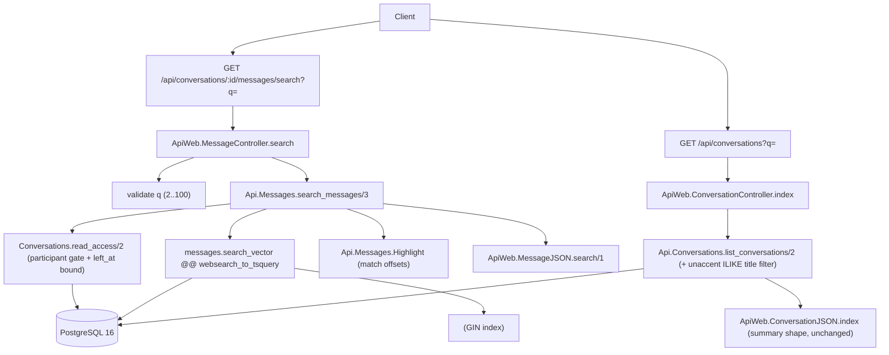

# F09. Message and Conversation Search — Technical Specification

**Complexity:** medium

## 1. Technical Overview

**What.** Two read surfaces that let a client find things it already has access to. The first is full-text search inside a single conversation: `GET /api/conversations/:id/messages/search?q=<term>` returns the messages of that conversation matching a term, newest-first, each hit carrying its 1-based position, the full message object, and the character offsets of the matched term for client-side highlighting, plus a `total_matches` counter and a `truncated` flag. The second is a filter over the existing inbox: `GET /api/conversations?q=<term>` narrows the conversation list to entries whose display title matches, returning the exact same entry shape the unfiltered list already returns.

**Why.** Message search over a growing history must not scan client-side or table-scan server-side; it is backed by a PostgreSQL `tsvector` generated column with a GIN index so a term resolves through the index rather than a sequential read, matching the p95 target for search over 10,000 messages. The conversation filter operates over a bounded set (at most 200 entries) so a substring `ILIKE` with `unaccent` is sufficient and no index is required. Both surfaces reuse authorization and shape decisions already made upstream rather than reimplementing them: the participant gate is the same one history uses, and the filtered list returns the inbox's own summary entry so the client renders it with the component it already has.

**Scope.**

**Included:**
- In-conversation full-text message search endpoint with ranked-by-recency results, positions, total-match counting with truncation, and match offsets for highlighting.
- A generated `tsvector` column on `messages` with a GIN index and an unaccent-aware Portuguese text-search configuration.
- Conversation-list filtering by display title (private counterpart display name or `@username`, group name) using accent- and case-insensitive `unaccent` `ILIKE`, returning the unfiltered entry shape.
- Reuse of the participation predicate (`Conversations.read_access/2`) and the message JSON object.

**Excluded (out of scope for this feature):**
- Cross-conversation / global message search.
- Search result pagination beyond the fixed 100-match cap (client navigates matches by message id through the existing history cursor).
- Ranking by relevance score; results are ordered strictly by recency.
- Stemmer-accurate highlight spans; highlighting is query-token substring matching (see Decisions).

**Consumed input contracts (from the PRD):**
- From message persistence (F06): persisted message records (message id, conversation id, sender id, body, `inserted_at`) and the participation/read-access predicate that gates every conversation read.
- From the inbox (F08): the conversation summary entry (id, type, display title, counterpart or member identities, last-message preview, timestamp, unread count) — the filtered list returns this shape unchanged.

## 2. Architecture Impact

**Affected components:**

- `priv/repo/migrations/<ts>_create_message_search_vector.exs` — new migration: unaccent-aware Portuguese TS config, generated `search_vector` column, GIN index.
- `lib/api/messages.ex` — new `search_messages/3`.
- `lib/api/messages/highlight.ex` — new module computing match offsets.
- `lib/api_web/controllers/message_controller.ex` — new `search` action + query validation.
- `lib/api_web/controllers/message_json.ex` — new `search/1` render clause reusing `data/1`.
- `lib/api/conversations.ex` — `list_conversations/2` gains an optional title filter.
- `lib/api_web/controllers/conversation_controller.ex` — `index` reads the `q` param.
- `lib/api_web/router.ex` — new message-search route.



## 3. Technical Decisions

| Decision | Chosen Approach | Alternative Considered | Trade-off |
|----------|----------------|----------------------|-----------|
| Accent-insensitive full-text search | A dedicated `portuguese_unaccent` text-search configuration (`COPY = portuguese`, `unaccent` prepended to the word mappings) used by both the generated column and `websearch_to_tsquery` | Plain `to_tsvector('portuguese', body)` | The stock `portuguese` config does **not** strip diacritics, so `familia` would not match `Família` and the acceptance criterion fails. A named config keeps `to_tsvector(regconfig, text)` `IMMUTABLE`, which a `STORED GENERATED` column requires — `unaccent(body)` inside the column is rejected because `unaccent/1` is only `STABLE`. |
| Search authorization | Reuse `Conversations.read_access/2` (the same predicate history uses), applying the departed-member `left_at` upper bound | Reuse only the boolean `participant?/2` | Consistency with F06: a departed group member searches exactly the window they can read and never learns the conversation continued. Costs one extra membership lookup, already amortized. |
| Match offsets | Compute in Elixir in a dedicated `Api.Messages.Highlight` module: tokenize `q`, normalize body and tokens (downcase + unaccent), find occurrences, map to original grapheme offsets | `ts_headline` markup parsed back into offsets | Offsets are a clean data contract the client highlights without re-matching; `ts_headline` returns HTML-ish markup and is expensive per row. Highlighting is query-token substring based, not full stemmer spans (see Assumptions). |
| Total-match counting | Fetch `LIMIT 101`; `> 100` ⇒ `total_matches: 100, truncated: true`, drop the extra row; otherwise `total_matches = count, truncated: false` | A separate `SELECT count(*)` | One round trip instead of two; exact below the cap, honestly truncated above it — mirrors the `limit + 1` trick history already uses for `has_more`. |
| `search_vector` visibility to Ecto | Filter via a bare-column `fragment` (`search_vector @@ …`); the column is **not** declared on the `Message` schema | Add `field :search_vector, Api.Types.TSVector` | The column is database-managed and write-once by generation; keeping it off the schema mirrors how the inbox reaches `messages` as a bare source and prevents it ever entering a `cast`/`select`. |
| Conversation filter mechanism | `unaccent(title) ILIKE unaccent('%' || q || '%')` over the already-joined counterpart/group columns, no index | Add a trigram/GIN index on titles | The list is capped at 200 rows and the filter runs after the same bounded driving scan, so a sequential match over ≤200 rows is well under budget; an index would be dead weight. |
| Query-length gates | Message search: reject `< 2` or `> 100` chars (trimmed) with 422 in the controller, before any DB call. Conversation filter: any `q` with `≥ 1` trimmed char filters; a blank/absent `q` returns the full list (no 422) | Validate both in the context | Matches the existing `validate_page/1` pattern in `MessageController`; guarantees "no database scan" for a too-short message query. The filter is a substring over a bounded set, so 1 char is safe and an empty filter is simply "no filter". |

### Assumptions & Auto-Accept Decisions

Applied because the PRD and codebase do not pin these down. Each is flagged for later review.

1. **Unaccent-aware TS configuration (`portuguese_unaccent`).** The PRD names `to_tsvector('portuguese', body)`, but the accent-insensitivity acceptance criterion (`familia` matches `Família`) is unreachable with the stock config. Auto-Accept "partial PRD specification" default: apply the industry-standard fix — a `COPY = portuguese` configuration with `unaccent` prepended to the word mappings — and document it. This is the only deviation from the literal PRD wording.
2. **Highlight semantics.** `match_offsets` are computed by normalizing (downcase + `unaccent`) and locating each whitespace-delimited query token as a substring of the body, then mapping to original grapheme offsets. `unaccent` is treated as grapheme-length-preserving (each source grapheme maps to one output grapheme), so offsets into the normalized string are valid offsets into the original. Full stemmer-span highlighting (e.g. highlighting `correu` for query `correr`) is out of scope; the acceptance tests exercise terms present verbatim.
3. **Result ordering.** Strictly `inserted_at DESC, id DESC` (recency), not `ts_rank`. The PRD specifies recency ordering and the "1 / N" navigator; relevance ranking is not requested.
4. **`position` semantics.** 1-based index within the returned (capped) result set in its `inserted_at DESC` order — i.e. position 1 is the newest match.
5. **Blank conversation filter.** A `q` that is absent, empty, or whitespace-only yields the unfiltered list (no error), since the filter is an optional narrowing of a bounded set.
6. **Check order in the search action.** Query-length validation runs before the participation gate, so a too-short query is 422 even for a non-participant, guaranteeing no DB scan; a valid query from a non-participant is 404.
7. **`search_vector` is not backfilled explicitly.** A `STORED GENERATED` column is computed for every existing row at `ADD COLUMN` time, so no data migration step is needed.

**Traceability.** PRD Capabilities → Section 5/6 (endpoints, migration). PRD Experience → Section 5 response shapes. PRD Consumes (F06 records + predicate, F08 summary entry) → Section 1 Scope + Sections 5/7. PRD Section 9 F09 criteria → Section 7 acceptance tests. PRD Cross-Feature Integration lines referencing F09 → Section 7 integration tests.

## 4. Component Overview

**Backend — contexts and domain:**

| File Path | New/Modified | Purpose | Key Responsibilities |
|-----------|--------------|---------|---------------------|
| `lib/api/messages.ex` | Modified | In-conversation search | Add `search_messages/3`: cast id, gate via `read_access/2` (applying the `left_at` bound), run the `@@` query with `LIMIT 101`, assign positions, compute `total_matches`/`truncated`, attach offsets via `Highlight`. |
| `lib/api/messages/highlight.ex` | New | Match-offset computation | Tokenize the query, normalize (downcase + unaccent) body and tokens, locate occurrences, return `[%{start, length}]` in original graphemes. Pure, unit-tested beside the boundary like `Cursor`/`Preview`. |
| `lib/api/conversations.ex` | Modified | Title-filtered inbox | `list_conversations/2` accepts an options map with an optional `:query`; when present (≥1 trimmed char) append an `unaccent`/`ILIKE` `where` over group name and private counterpart name/username. Entry shape unchanged. |

**Backend — web layer:**

| File Path | New/Modified | Purpose | Key Responsibilities |
|-----------|--------------|---------|---------------------|
| `lib/api_web/controllers/message_controller.ex` | Modified | Search endpoint | New `search` action: validate `q` (2..100 trimmed) via a schemaless changeset (`fields.q` on failure), then call `Messages.search_messages/3`, render `:search`. |
| `lib/api_web/controllers/message_json.ex` | Modified | Search rendering | New `search/1`: render `total_matches`, `truncated`, and `messages` where each hit is `data/1` merged with `position` and `match_offsets`. |
| `lib/api_web/controllers/conversation_controller.ex` | Modified | Filtered list | `index` reads `params["q"]` and forwards it to `list_conversations/2`. |
| `lib/api_web/router.ex` | Modified | Routing | Add `get "/conversations/:id/messages/search"` (distinct segment count from `/messages`, no ordering hazard). |

**Database:**

| Migration File | Tables Affected | Operation | Notes |
|----------------|-----------------|-----------|-------|
| `<ts>_create_message_search_vector.exs` | `messages` | CREATE TS CONFIG, ALTER TABLE ADD generated column, CREATE GIN INDEX | `up`/`down` (not `change`) because `execute` for the TS config is irreversible on its own. Depends on the `unaccent` extension already enabled by the base extensions migration. |

## 5. API Contracts

### Endpoint: Search messages in a conversation

- **Method:** GET
- **Path:** `/api/conversations/:id/messages/search`
- **Authentication:** JWT Bearer (authenticated pipeline; caller is `conn.assigns.current_user`)

**Request (path + query):**

| Field | Type | Required | Validation | Description |
|-------|------|----------|------------|-------------|
| `id` | `uuid` (path) | Yes | valid UUID, else 400 `invalid_id` | Conversation to search within |
| `q` | `string` (query) | Yes | trimmed length 2–100, else 422 `validation_error` (`fields.q`) | Search term; multi-word and quoted phrases honored via `websearch_to_tsquery` |

**Request example:** `GET /api/conversations/6f1.../messages/search?q=cronograma`

**Response (200):**

| Field | Type | Description |
|-------|------|-------------|
| `messages` | `array` | Matching messages, newest first, capped at 100 |
| `messages[].id` | `uuid` | Message id (used to load surrounding history via the F06 cursor) |
| `messages[].conversation_id` | `uuid` | Owning conversation |
| `messages[].body` | `string` | Full body, verbatim |
| `messages[].inserted_at` | `string` (ISO 8601) | Server insertion time |
| `messages[].sender` | `object` | Embedded user object (`id`, `username`, `name`, `last_seen_at`) |
| `messages[].position` | `integer` | 1-based index within the result set (1 = newest match) |
| `messages[].match_offsets` | `array` | `{start, length}` grapheme spans of the matched term(s) in `body` |
| `total_matches` | `integer` | Exact when ≤ 100; reported as 100 when more exist |
| `truncated` | `boolean` | `true` when more than 100 messages matched |

**Response example:**
```json
{
  "messages": [
    {
      "id": "9b2c...",
      "conversation_id": "6f1a...",
      "body": "O cronograma novo saiu hoje",
      "inserted_at": "2026-07-20T14:03:11.482913Z",
      "sender": {
        "id": "1a2b...",
        "username": "anabeatriz",
        "name": "Ana Beatriz",
        "last_seen_at": null
      },
      "position": 1,
      "match_offsets": [{ "start": 2, "length": 10 }]
    }
  ],
  "total_matches": 3,
  "truncated": false
}
```

**Empty-result example (200):**
```json
{ "messages": [], "total_matches": 0, "truncated": false }
```

**Error codes:**

| Code | HTTP Status | Description |
|------|-------------|-------------|
| `validation_error` | 422 | `q` shorter than 2 or longer than 100 characters (`fields.q`); no DB scan executed |
| `invalid_id` | 400 | `:id` is not a valid UUID |
| `not_found` | 404 | Caller is not a participant, or the conversation does not exist (indistinguishable) |
| `unauthenticated` | 401 | Missing or invalid token |

### Endpoint: List conversations filtered by title

- **Method:** GET
- **Path:** `/api/conversations`
- **Authentication:** JWT Bearer

Extends the existing inbox endpoint with one optional query parameter. All response fields and semantics are unchanged from the inbox contract.

**Request (query):**

| Field | Type | Required | Validation | Description |
|-------|------|----------|------------|-------------|
| `q` | `string` | No | trimmed length ≥ 1 filters; blank/absent returns the full list | Substring matched accent- and case-insensitively against each conversation's display title |

**Request example:** `GET /api/conversations?q=ana`

**Response (200):** identical shape to the unfiltered inbox list, restricted to matching entries.
```json
{
  "conversations": [
    {
      "id": "6f1a...",
      "type": "private",
      "title": "Ana Beatriz",
      "counterpart": { "id": "1a2b...", "username": "anabeatriz", "name": "Ana Beatriz", "last_seen_at": null },
      "member_count": null,
      "last_message": { "id": "9b2c...", "body": "…", "sender_id": "1a2b...", "inserted_at": "2026-07-20T14:03:11.482913Z" },
      "unread_count": 0,
      "unread_overflow": false,
      "last_read_at": null
    }
  ]
}
```

**Error codes:**

| Code | HTTP Status | Description |
|------|-------------|-------------|
| `unauthenticated` | 401 | Missing or invalid token |

## 6. Data Model

No new tables. One generated column and one index are added to `messages`, backed by a named text-search configuration.

**Table: `messages` (added column)**

| Column | Type | Nullable | Default | Description |
|--------|------|----------|---------|-------------|
| `search_vector` | `tsvector` | No | generated | `GENERATED ALWAYS AS (to_tsvector('portuguese_unaccent', body)) STORED`; database-managed, absent from the Ecto schema |

**Indexes:**

| Index Name | Columns | Type | Purpose |
|------------|---------|------|---------|
| `messages_search_vector_index` | `search_vector` | GIN | Index-backed `@@` full-text lookup, one conversation's matches without a sequential scan |

**Text-search configuration:**

| Object | Definition | Purpose |
|--------|------------|---------|
| `portuguese_unaccent` | `COPY = portuguese`, with `unaccent` prepended to the `word`, `hword`, `hword_part` mappings | Diacritic-insensitive stemming so `familia` matches `Família`; `IMMUTABLE` under a constant `regconfig`, which the generated column requires |

**Migration:**
```sql
-- up
CREATE TEXT SEARCH CONFIGURATION portuguese_unaccent (COPY = portuguese);

ALTER TEXT SEARCH CONFIGURATION portuguese_unaccent
  ALTER MAPPING FOR hword, hword_part, word
  WITH unaccent, portuguese_stem;

ALTER TABLE messages
  ADD COLUMN search_vector tsvector
  GENERATED ALWAYS AS (to_tsvector('portuguese_unaccent', body)) STORED;

CREATE INDEX messages_search_vector_index
  ON messages USING GIN (search_vector);

-- down
DROP INDEX IF EXISTS messages_search_vector_index;
ALTER TABLE messages DROP COLUMN IF EXISTS search_vector;
DROP TEXT SEARCH CONFIGURATION IF EXISTS portuguese_unaccent;
```

**Query shapes (described, not implemented):**
- Message search filter (bare-column fragment, keeps `search_vector` off the schema):
  `WHERE conversation_id = $1 AND search_vector @@ websearch_to_tsquery('portuguese_unaccent', $2)`, plus the departed-member bound `AND inserted_at <= $left_at` when `read_access` returns `{:until, left_at}`, `ORDER BY inserted_at DESC, id DESC LIMIT 101`.
- Conversation filter (appended to the existing inbox query, over already-joined columns):
  `AND ((c.type = 'group' AND unaccent(c.name) ILIKE unaccent('%' || $q || '%')) OR (c.type = 'private' AND (unaccent(cp.name) ILIKE unaccent('%' || $q || '%') OR unaccent(cp.username::text) ILIKE unaccent('%' || $q || '%'))))`.

**Cross-Database Notes:** the feature is PostgreSQL-specific (`tsvector`, GIN, `unaccent`, generated columns); the project targets PostgreSQL 16 only, and the extensions (`unaccent`) are enabled by the base migration.

## 7. Testing Strategy

Tests follow the existing conventions: `ApiWeb.ConnCase` (async) for controllers with `Api.Factory` builders and Guardian-issued tokens; `Api.DataCase` for context and pure modules. Message bodies are written through `Messages.create_message/3` (or `insert(:message, ...)` with explicit `inserted_at`) so ordering is deterministic.

**Test files:**

| Test File | Type | Target | Coverage Goal |
|-----------|------|--------|---------------|
| `test/api/messages/highlight_test.exs` | Unit | `Api.Messages.Highlight` | ≥ 90% |
| `test/api/messages_test.exs` | Context | `Messages.search_messages/3` (extend) | ≥ 90% |
| `test/api_web/controllers/message_search_controller_test.exs` | Integration | search endpoint | ≥ 90% |
| `test/api_web/controllers/conversation_inbox_controller_test.exs` | Integration | `?q=` filter (extend) | ≥ 90% |

**`Api.Messages.Highlight`:**

| Test Function | Description | Assertions |
|---------------|-------------|------------|
| `test "returns the offset of a plain term"` | Single token present once | One `{start, length}` delimiting the term exactly |
| `test "matches accent- and case-insensitively"` | `familia` against `Família` | Offset spans `Família` in the original body |
| `test "returns an offset per occurrence"` | Term appears twice | Two spans, both correct |
| `test "handles multi-token queries"` | Two whitespace-delimited tokens | One span per token found |
| `test "returns an empty list when nothing matches"` | Token absent from body | `[]` |

**`Messages.search_messages/3` (context):**

| Test Function | Description | Assertions |
|---------------|-------------|------------|
| `test "returns matching messages newest-first with total_matches"` | Term in 3 of N messages | 3 hits, `total_matches: 3`, `inserted_at` descending |
| `test "assigns 1-based positions across the result set"` | Multiple hits | Positions `1..total_matches`, 1 = newest |
| `test "caps at 100 with truncated true"` | Term in 101+ messages | 100 hits, `total_matches: 100`, `truncated: true` |
| `test "is accent- and case-insensitive"` | Query `familia`, body `Família` | Message returned |
| `test "returns empty with total_matches 0 for no match"` | Absent term | `%{messages: [], total_matches: 0, truncated: false}` |
| `test "rejects a non-participant with not_found"` | Outsider caller | `{:error, :not_found}` |
| `test "bounds a departed group member at left_at"` | Member with `left_at`, matches before and after | Only pre-`left_at` matches returned |
| `test "rejects a malformed conversation id"` | Non-UUID | `{:error, :invalid_id}` |

**Search endpoint (integration):**

| Test Function | Description | Assertions |
|---------------|-------------|------------|
| `test "returns hits with position, match_offsets, id and body"` | Term in 3 messages | 200; `total_matches: 3`; each hit has `id`, full `body`, `position`, `match_offsets` with correct spans |
| `test "returns 100 with truncated for a broad term"` | Term in 101+ messages | `truncated: true`, 100 hits |
| `test "matches familia against Família"` | Accent case | Message returned |
| `test "rejects a query shorter than 2 characters with 422 and no scan"` | `q=a` | 422, `code: "validation_error"`, `fields.q` |
| `test "returns 404 to a non-participant with no message content"` | Outsider | 404 `not_found`; no `messages` key |
| `test "returns 200 with empty array for no matches"` | Absent term | 200, `messages: []`, `total_matches: 0` (not 404) |
| `test "returns 400 for a malformed conversation id"` | `id=nope` | 400 `invalid_id` |
| `test "requires authentication"` | No token | 401 `unauthenticated` |

**Conversation filter (integration, extend inbox suite):**

| Test Function | Description | Assertions |
|---------------|-------------|------------|
| `test "returns only conversations whose title matches"` | Private "Ana Beatriz" + others, `q=ana` | Only the matching entry, in the unfiltered entry shape |
| `test "matches group names and private @usernames and display names"` | Group + private counterpart by username and by name | Each matches when its title/username matches |
| `test "is accent- and case-insensitive"` | `q=familia`, group "Família" | Group returned |
| `test "returns the full list for a blank q"` | `q=` (empty) | Unfiltered list |

**Cross-feature integration tests (PRD Section 9):**

| Test Function | Description | Assertions |
|---------------|-------------|------------|
| `test "a persisted message is findable by its body and its id loads a history page containing it"` | Persist via F06 path, search by body text, then GET history around the returned id | Search returns the message; a history request paged to that id includes it (links F06 ↔ F09) |
| `test "the filtered list returns the exact F08 summary entry shape"` | Compare `?q=` entry against the unfiltered inbox entry for the same conversation | Identical keys and values: `title`, `last_message` preview, `inserted_at`/timestamp, `unread_count` (links F08 ↔ F09) |

## Prerequisites & Traceability Summary

- Depends on F06 (messages table, `Messages` context, `create_message/3`, cursor) and F08 (`list_conversations`, summary entry, `ConversationJSON.summary/1`) — both implemented.
- Reuses `Conversations.read_access/2` and `ApiWeb.MessageJSON.data/1` unchanged.
- Requires the `unaccent` extension (already enabled) and adds the `portuguese_unaccent` TS configuration.
