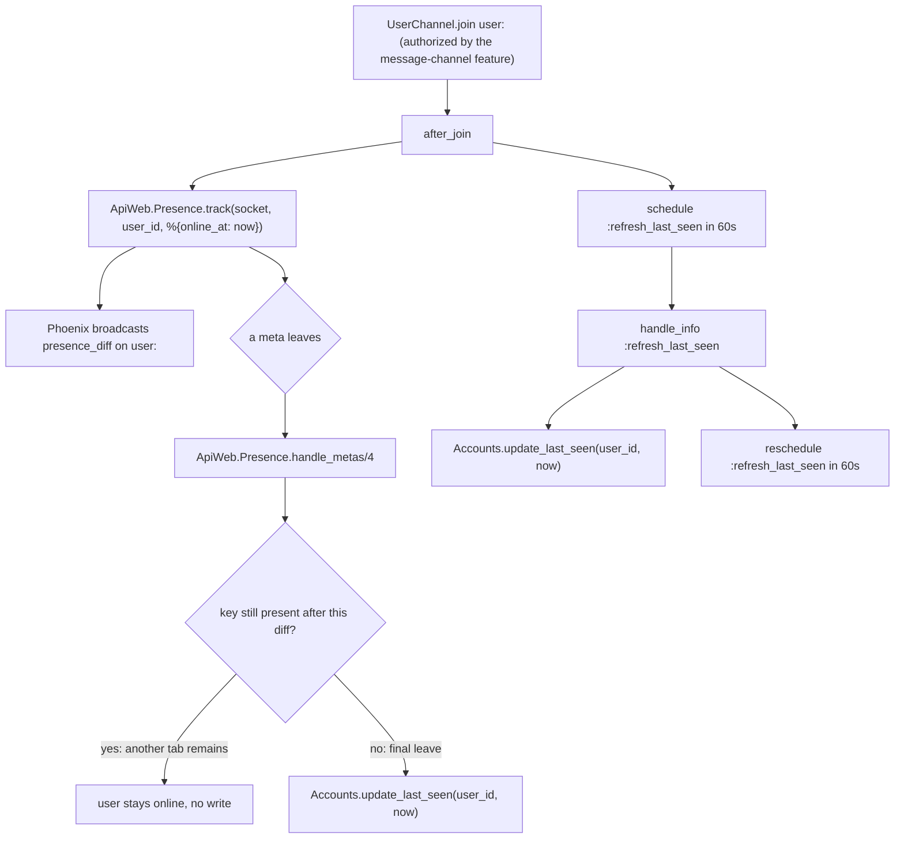
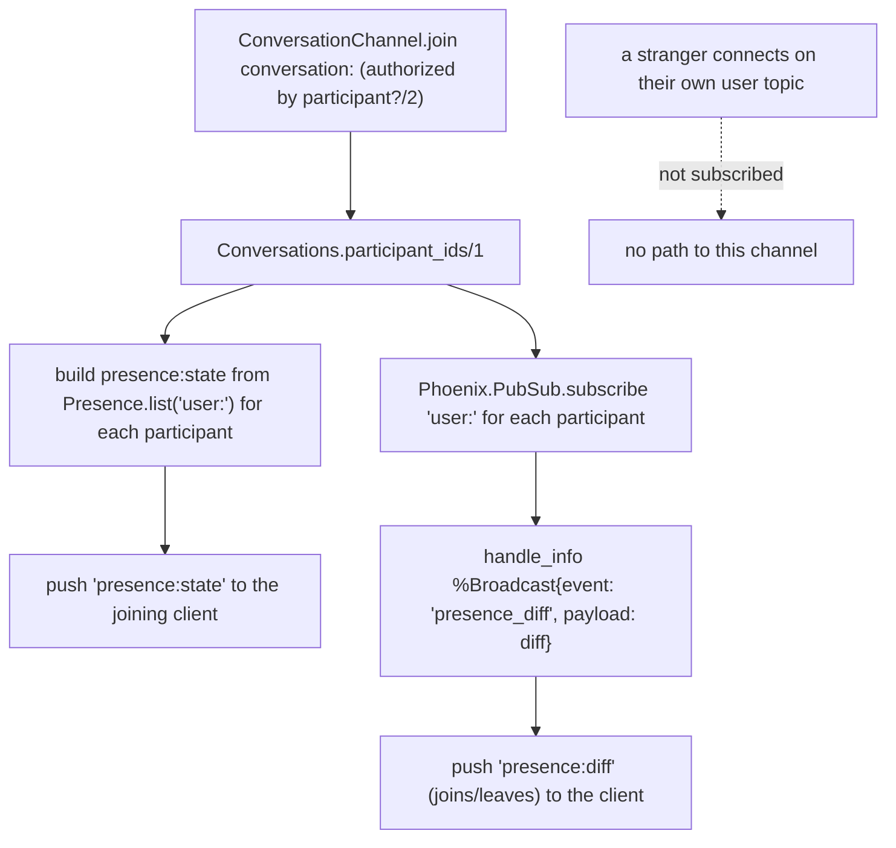
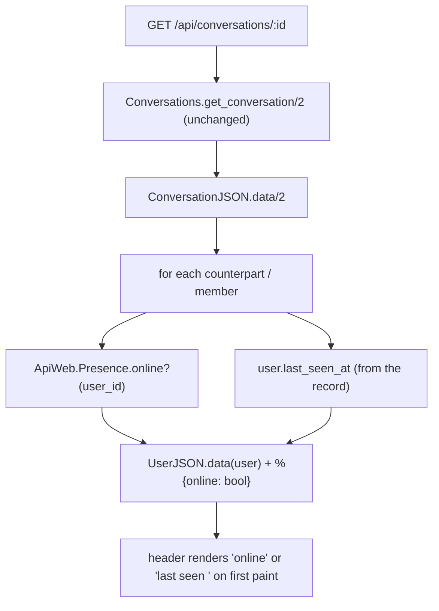

# Technical Specification: Presence and Last Seen

**Complexity:** medium

---

## 1. Technical Overview

### What

Turn the socket lifecycle the message channel already provides into two observable facts about every user — *are they connected right now* and *when were they last connected* — without adding a table, a migration or a REST endpoint. Five pieces carry it:

1. **`ApiWeb.Presence`** — a `Phoenix.Presence` tracker over `Api.PubSub`. A user is tracked under the key `<user_id>` on their own `user:<user_id>` topic, with metadata `%{online_at: <utc>}`. Every tab is one meta under one key, so a user is online while at least one meta survives and offline only when the last one leaves. Its `handle_metas/4` callback is where a final leave becomes a `last_seen_at` write.
2. **The tracking lifecycle in `ApiWeb.UserChannel`** — when a client joins its personal topic, the channel tracks it in presence and schedules a periodic `last_seen_at` refresh, so a node that dies without firing a leave still leaves a value no more than a minute stale.
3. **`Api.Accounts.update_last_seen/2`** — the single domain write for the field. `last_seen_at` stays out of every changeset cast (it is not request data); this bypasses the changeset with a targeted `update_all`, so a presence process writes one column and touches nothing else.
4. **Conversation-scoped presence on `ApiWeb.ConversationChannel`** — on join the channel pushes `presence:state` carrying the current status of exactly this conversation's participants, then subscribes to each participant's presence topic and forwards every change as `presence:diff`. A client with a thread open sees the counterpart go online or offline live, and never sees anyone it shares no conversation with.
5. **Presence enrichment of the conversation detail** — `GET /api/conversations/:id` gains, per counterpart or member, an `online` boolean beside the `last_seen_at` the user object already carries, so the header renders correctly on first paint before any diff arrives.

### Why

Presence is tracked on `user:<user_id>` and not on the conversation topic because online is a fact about a *person*, not about which thread they happen to have open. If presence were tracked per conversation, "online" would silently mean "has this conversation focused", a counterpart with the app open on another chat would read as offline, and the same user would need one tracked entry per conversation. Tracking once, on the topic a socket joins the moment it connects, makes online a single global truth that every conversation reads rather than re-derives.

The `user:<user_id>` topic already exists and already has exactly the right join rule: `UserChannel` admits only the caller's own id. That is the natural place to `track/3`, because a socket that reaches that channel has already proven it is the user it claims to be, so no presence entry can ever be forged for someone else. It is also why presence needs no authorization logic of its own — it inherits the channel's.

`last_seen_at` is written from two places for one reason: a leave is not guaranteed to fire. The clean path is `handle_metas/4` detecting the final leave and stamping `now`, which lands within a second of the disconnect and satisfies the accuracy the header needs. But a node that crashes never runs a leave callback, and a user tracked only in that dead node's memory would keep an ancient `last_seen_at` forever. The periodic refresh bounds that failure: while connected, the value is rewritten at most once a minute, so the worst a crash can do is show a timestamp sixty seconds old instead of a live one — the acceptable direction to be wrong. Neither write goes through a changeset, because `last_seen_at` is deliberately absent from the user's cast (it is presence state, never a request field); a scoped `update_all` writes the one column without reopening the field to a request body.

Conversation channels forward presence rather than track it, and the distinction is what keeps scope correct. The channel does not `track` anyone — it *subscribes* to the `user:<participant_id>` topic of each active participant and relays the diffs Phoenix already broadcasts there. Because it only ever subscribes to this conversation's participants, a diff for an unrelated user can never reach the client: the scoping is structural, not a filter that could be forgotten. `presence:state` on join and `presence:diff` on change are pushed in Phoenix's own presence format, so a JavaScript client feeds them straight into `Presence.syncState`/`Presence.syncDiff` with no bespoke decoding.

The REST enrichment exists so the header is correct before the socket says anything. A diff only tells a client about a *change*; a client that just opened a conversation has missed every change that happened before it arrived. `GET /api/conversations/:id` answering `online` and `last_seen_at` for each member gives the header its first-paint state, and the live diffs keep it current from there. `online` is added only in the conversation detail view and not in the shared user object, because a message sender or a contact-list entry has no online status to answer — presence is a property of a *participant in a conversation the caller shares*, which is exactly the guarantee that also stops presence leaking for strangers: there is no endpoint that returns presence for a user the caller shares no conversation with.

### Scope

**Included** (the feature has no Core/Full split in the PRD — the whole feature is in scope):
- `ApiWeb.Presence` — the tracker module, its supervision-tree entry, and the `handle_metas/4` final-leave write
- Tracking a user on join of its personal topic, and the once-a-minute `last_seen_at` refresh while connected
- `Api.Accounts.update_last_seen/2` — the single, changeset-free write path for the column
- `ApiWeb.Presence.online?/1` — the online lookup the conversation detail uses
- `presence:state` on conversation-channel join and `presence:diff` on participant change, scoped to that conversation's participants
- `online` added per counterpart and per member in the `GET /api/conversations/:id` payload (and, by the shared renderer, in the private-conversation create response)
- Presence, tracking, channel-relay and cross-feature test suites

**Excluded (owned by other features or out of product scope):**
- The socket transport, its authentication, the personal-topic join rule and the conversation-topic join rule — provided by the real-time message channel and consumed here unchanged
- The `last_seen_at` column, the users table and the user object's shape — provided by the account feature; this feature writes the column and reads it, and adds no field to the user schema
- The conversation detail query and its member preload — provided by the private/group features; this feature adds one boolean to the rendered output, not a new query
- Relative rendering ("last seen 5 minutes ago") — a client concern; the API returns absolute UTC only
- Typing indicators, per-message delivery/read receipts, a global "who is online" roster endpoint, and presence for users the caller shares no conversation with — out of scope by the PRD
- Multi-node presence replication — the deployment is a single node; `Phoenix.PubSub` already in the tree makes this a configuration change, not a code change, if that ever changes

---

## 2. Architecture Impact

### Affected components

| Layer | Component | Path |
|---|---|---|
| Web | Presence tracker and final-leave write | `lib/api_web/presence.ex` |
| Web | Track on personal-topic join, periodic refresh | `lib/api_web/channels/user_channel.ex` |
| Web | `presence:state` on join, `presence:diff` relay | `lib/api_web/channels/conversation_channel.ex` |
| Web | `online` added to counterpart and members | `lib/api_web/controllers/conversation_json.ex` |
| Web | Presence added to the boundary exports | `lib/api_web.ex` |
| Domain | Presence tracker in the supervision tree | `lib/api/application.ex` |
| Domain | Single changeset-free `last_seen_at` write | `lib/api/accounts.ex` |
| Test | Presence-aware socket/leave helpers | `test/support/channel_case.ex` |

### Tracking lifecycle

A socket becomes online by joining the topic that already proves whose it is; it becomes offline when its last meta leaves, which is also the moment `last_seen_at` is stamped.



### Conversation-scoped presence relay

The conversation channel tracks no one; it subscribes to the presence topic of each participant and relays, so scope is structural — a diff for a non-participant has no path to the client.



### First-paint enrichment



---

## 3. Technical Decisions

| Decision | Chosen Approach | Alternative Considered | Trade-off |
|---|---|---|---|
| Presence topic | Track each user under key `<user_id>` on `user:<user_id>` | Track on each `conversation:<id>` topic | Per-conversation tracking would make "online" mean "has this thread open" and cost one entry per conversation; one entry on the personal topic is a single global truth every conversation reads |
| Where tracking happens | In `UserChannel` after_join, reusing its "own id only" join rule | A dedicated presence channel | The personal topic already proves the socket is the user it claims to be, so presence inherits authorization and forges nothing; no new topic or join rule |
| Final-leave detection | `Phoenix.Presence.handle_metas/4`, writing when the key is absent from the post-diff presences | `terminate/2` on the channel | `terminate` is not guaranteed on a crash and cannot see whether another tab remains; `handle_metas` fires on every real leave and knows the surviving set, so the write happens once, on the last leave only |
| Stale-value bound | Periodic `last_seen_at` refresh every 60s while connected | Rely on the leave callback alone | A crashed node never runs a leave; the refresh bounds staleness to 60s, which for a "last seen" label is the acceptable direction to be wrong |
| Refresh location | A per-personal-topic-channel timer | A central sweeper listing every online user | A per-channel timer is one `Process.send_after` and needs no global registry walk; multiple tabs write more often than strictly necessary, but each write is monotonic `now` and only the staleness bound matters |
| `last_seen_at` write | `Api.Accounts.update_last_seen/2` via scoped `update_all` | A changeset on the user | Keeps the field out of every cast (it is never request data) and writes exactly one column without loading, validating or touching `updated_at`'s meaning of "profile changed" |
| Presence payload format | Phoenix's own `presence_state`/`presence_diff` shapes | A bespoke `{user_id, online}` map | The JS client feeds them into `Presence.syncState`/`syncDiff` unchanged; a custom shape would need bespoke client decoding for no gain |
| Conversation scope | Channel subscribes to participants' `user:<id>` topics and relays | Track participants on the conversation topic; or broadcast all presence and filter | Subscribing only to participants makes leakage structurally impossible; tracking on the conversation topic would conflate "online" with "in this thread", and broadcast-then-filter risks a forgotten filter exposing strangers |
| `online` placement | Added only in the conversation detail view, merged onto the user object | Added to the shared `UserJSON.data/1` | A message sender or contact entry has no online status to answer; scoping `online` to conversation members keeps it where a shared conversation guarantees the caller may see it |
| Participant set for the relay | Snapshotted at channel join | Re-resolved on every membership change | A membership change mid-session is rare and already forces a rejoin elsewhere (revocation stops the socket); re-subscribing live would add a membership-event lifecycle for a case the rejoin already covers |
| New dependency | None — `Phoenix.Presence` ships with Phoenix, `Api.PubSub` is already supervised | Adding a presence library | The framework already provides tracking over the PubSub already in the tree; a dependency would add nothing |

---

## 4. Component Overview

### Web

| File Path | New/Modified | Purpose | Key Responsibilities |
|---|---|---|---|
| `lib/api_web/presence.ex` | New | Presence tracker and the final-leave write | `use Phoenix.Presence, otp_app: :api, pubsub_server: Api.PubSub`; `handle_metas/4` inspecting each leave and calling `Api.Accounts.update_last_seen/2` with `now` only when the key no longer appears in the post-diff presences; `online?/1` returning whether `list("user:<id>")` holds any meta |
| `lib/api_web/channels/user_channel.ex` | Modified | Tracking lifecycle | On join, arrange an `after_join` that calls `ApiWeb.Presence.track/3` with `%{online_at: <utc>}` and schedules `:refresh_last_seen`; `handle_info(:refresh_last_seen, ...)` writing `Accounts.update_last_seen/2` with `now` and rescheduling in 60s; existing join rule and `unknown_event` reply unchanged |
| `lib/api_web/channels/conversation_channel.ex` | Modified | Scoped presence relay | On join, arrange an `after_join` that resolves `Conversations.participant_ids/1`, pushes `presence:state` merged from `ApiWeb.Presence.list/1` over each participant's topic, and `Phoenix.PubSub.subscribe/2`s each `user:<pid>`; `handle_info(%Phoenix.Socket.Broadcast{event: "presence_diff"}, ...)` pushing `presence:diff`; the send path, revocation intercept and join rule unchanged |
| `lib/api_web/controllers/conversation_json.ex` | Modified | First-paint online state | `data/2` for a private conversation merges `%{online: ApiWeb.Presence.online?(counterpart.id)}` onto the counterpart's user object; for a group, merges the same onto each member; the inbox `summary/1` and the `updated/1` event are unchanged |
| `lib/api_web.ex` | Modified | Boundary exports | Adds `Presence` to the `ApiWeb` boundary's exports so the application supervisor may name it and the domain never can |

### Domain

| File Path | New/Modified | Purpose | Key Responsibilities |
|---|---|---|---|
| `lib/api/accounts.ex` | Modified | Single `last_seen_at` write | `update_last_seen/2` running a scoped `update_all` that sets `last_seen_at` for one user id, casting the id and returning `:ok` regardless of whether a row matched, so a presence write for a since-deleted user never raises |
| `lib/api/application.ex` | Modified | Supervision tree | `ApiWeb.Presence` added after `{Phoenix.PubSub, name: Api.PubSub}` and before `ApiWeb.Endpoint`, so the tracker's PubSub exists before it starts and the tracker exists before the first socket can connect |

### Test

| File Path | New/Modified | Purpose | Key Responsibilities |
|---|---|---|---|
| `test/support/channel_case.ex` | Modified | Presence-aware helpers | A helper to join a user's personal topic and confirm it is tracked, and a way to close a tracked socket and await its leave, so presence tests do not restate the tracking handshake or sleep to observe a leave |

### Database

No migration. The `last_seen_at` column already exists on `users`; this feature writes it through `Accounts.update_last_seen/2` and reads it through the existing conversation query and user object. Presence state lives in memory (an ETS-backed `Phoenix.Presence` tracker), not in a table.

---

## 5. API Contracts

This feature adds no REST route. It enriches one existing REST response and defines two channel events plus two domain functions.

### REST: `GET /api/conversations/:id` (enriched)

- **Method:** GET
- **Authentication:** JWT Bearer (unchanged)
- **Change:** each user object under `counterpart` (private) or `members` (group) gains an `online` boolean; `last_seen_at` was already present on the user object.

**Response (private, 200) — counterpart now carries `online`:**
```json
{
  "conversation": {
    "id": "9f1c8e2a-44d8-4f1a-b7d3-0011a2b3c4d5",
    "type": "private",
    "last_read_at": null,
    "counterpart": {
      "id": "6b2f1e90-7c33-4d55-8a01-2f4e6a8b0c1d",
      "username": "carlos",
      "name": "Carlos Silva",
      "last_seen_at": "2026-07-23T14:02:10.551234Z",
      "online": false
    }
  }
}
```

**Response (group, 200) — every member carries `online`:**
```json
{
  "conversation": {
    "id": "1c9d7f30-2a11-4b88-9e01-77aa22bb33cc",
    "type": "group",
    "name": "Time",
    "creator_id": "6b2f1e90-7c33-4d55-8a01-2f4e6a8b0c1d",
    "member_count": 2,
    "members": [
      {
        "id": "6b2f1e90-7c33-4d55-8a01-2f4e6a8b0c1d",
        "username": "carlos",
        "name": "Carlos Silva",
        "last_seen_at": null,
        "online": true
      },
      {
        "id": "a1b2c3d4-e5f6-4a7b-8c9d-0e1f2a3b4c5d",
        "username": "anabeatriz",
        "name": "Ana Beatriz",
        "last_seen_at": "2026-07-23T13:55:00.000000Z",
        "online": false
      }
    ]
  }
}
```

| Field | Type | Description |
|---|---|---|
| `...online` | `boolean` | `true` while the user holds at least one tracked socket; `false` otherwise |
| `...last_seen_at` | `string` \| `null` | Absolute ISO 8601 UTC of the last disconnect (or last refresh); `null` for a user who has never connected |

The private-conversation create response (`POST /api/conversations/private`) renders through the same `data/2` and therefore also gains `online` on its counterpart.

### Channel event: `presence:state`

- **Topic:** `conversation:<conversation_id>`
- **Direction:** outbound, pushed once to the joining client immediately after join
- **Scope:** only this conversation's active participants who are currently online
- **Format:** Phoenix `presence_state` — keys are user ids, each mapping to a `metas` list.

```json
{
  "6b2f1e90-7c33-4d55-8a01-2f4e6a8b0c1d": {
    "metas": [
      { "online_at": "2026-07-23T14:00:00.000000Z", "phx_ref": "F9x1..." }
    ]
  }
}
```

A participant who is offline at join time simply has no key here; the client falls back to the `last_seen_at` the conversation detail returned.

### Channel event: `presence:diff`

- **Topic:** `conversation:<conversation_id>`
- **Direction:** outbound, pushed whenever a participant of this conversation connects or disconnects
- **Scope:** structurally limited to this conversation's participants (the channel subscribes to no other user topic)
- **Format:** Phoenix `presence_diff` — `joins` and `leaves`, each a `presence_state` map.

```json
{
  "joins": {
    "6b2f1e90-7c33-4d55-8a01-2f4e6a8b0c1d": {
      "metas": [ { "online_at": "2026-07-23T14:05:12.000000Z", "phx_ref": "G2y7..." } ]
    }
  },
  "leaves": {}
}
```

A disconnect arrives as the same shape with the user id under `leaves` and an empty `joins`.

### Domain contract: `Api.Accounts.update_last_seen/2`

| Argument | Type | Description |
|---|---|---|
| `user_id` | `binary` | Cast before the write; a non-UUID is a no-op |
| `at` | `DateTime.t()` | The timestamp to stamp |

| Return | Meaning |
|---|---|
| `:ok` | The write ran; whether it matched a row is not surfaced, so a presence write for a since-deleted user never raises or blocks a leave |

### Domain contract: `ApiWeb.Presence.online?/1`

| Argument | Type | Description |
|---|---|---|
| `user_id` | `binary` | The user to look up |

| Return | Meaning |
|---|---|
| `true` | `list("user:<id>")` holds at least one meta — the user has a live socket |
| `false` | No tracked meta — offline, or never connected |

---

## 6. Data Model

No relational change. Two shapes matter: the in-memory presence state, and the one column this feature writes.

### Presence state: `ApiWeb.Presence`

| Aspect | Value | Rationale |
|---|---|---|
| Backing | `Phoenix.Presence` over `Api.PubSub` (ETS-backed, node-local) | The PubSub server is already supervised; tracking rides on it with no new infrastructure |
| Topic | `user:<user_id>` | The topic a socket joins the instant it connects, whose join rule already proves identity |
| Key | `<user_id>` | One key per person; every tab is a distinct meta under it, so online is "≥ 1 meta" and offline is "0 metas" |
| Meta | `%{online_at: <utc_datetime>}` (plus the framework's `phx_ref`) | The only fact a client needs beyond presence itself; relative labels are computed client-side |
| Lifetime | Node-local, lost on restart | A restart drops every meta; the leave-driven and periodic `last_seen_at` writes are the durable trace |

### Column write: `users.last_seen_at`

| Aspect | Value |
|---|---|
| Column | `last_seen_at` (`utc_datetime_usec`), already present on `users` |
| Written by | `Api.Accounts.update_last_seen/2` only |
| Write shape | `UPDATE users SET last_seen_at = $at WHERE id = $user_id` — one column, no changeset, `updated_at` deliberately untouched |
| Written when | (1) the final tracked socket for a user leaves (`handle_metas/4`), within ~1s of disconnect; (2) at most once every 60s while any socket is connected |
| Never written by | Any changeset cast — the field stays out of `registration_changeset` and has no update changeset |

**Illustrative write (not a migration):**
```sql
UPDATE users SET last_seen_at = '2026-07-23T14:02:10.551234Z'
WHERE id = '6b2f1e90-7c33-4d55-8a01-2f4e6a8b0c1d';
```

### Read shapes

| Read | Where | Note |
|---|---|---|
| `online?/1` | Conversation detail render | `Presence.list("user:<id>")` non-empty; O(1) ETS lookup, no DB |
| `list("user:<pid>")` per participant | Conversation-channel `presence:state` | One lookup per active participant at join, bounded by the 256-member group cap |
| `user.last_seen_at` | Conversation detail render | Already loaded by the existing member preload / counterpart subquery; no extra query |

---

## 7. Testing Strategy

### Test file structure

| Test File | Test Type | Target | Notes |
|---|---|---|---|
| `test/api_web/presence_test.exs` | Integration | `ApiWeb.Presence` tracking and the leave-driven `last_seen_at` write | `async: false` — presence and the sandbox write cross processes |
| `test/api_web/channels/user_channel_test.exs` | Integration | Tracking on join, the periodic refresh | extends the existing suite; `async: false` |
| `test/api_web/channels/conversation_channel_test.exs` | Integration | `presence:state` on join, `presence:diff` on change, scope | extends the existing suite; `async: false` |
| `test/api_web/controllers/conversation_controller_test.exs` | Integration | `online` in the conversation detail | extends the existing suite; the exact-match counterpart assertion is updated to include `online` |
| `test/api/accounts_test.exs` | Unit / context | `Accounts.update_last_seen/2` | extends the existing suite; `async: true` (no socket) |

Presence and channel suites run `async: false`: `Api.DataCase.setup_sandbox/1` shares the connection only for non-async tests, and both the channel and the presence tracker run in their own processes — a write from the leave callback needs the shared connection to be visible. The accounts unit test needs no socket and stays async.

### `test/api_web/presence_test.exs`

| Test Function | PRD criterion | Assertions |
|---|---|---|
| `tracks a user as online while a socket is open` | "open socket is reported as online" | After joining `user:<id>`, `Presence.online?/1` is `true` and `list("user:<id>")` holds one meta with an `online_at` |
| `a never-connected user is offline` | "never connected has last_seen_at: null and online: false" | For a user who never joined, `online?/1` is `false` and the record's `last_seen_at` is `nil` |
| `two sockets, closing one keeps the user online` | "opening two sockets and closing one keeps the user online" | Two personal-topic joins; close one and await its leave; `online?/1` stays `true` and `last_seen_at` is not yet written |
| `closing the second socket marks offline and writes last_seen_at` | "closing the second marks them offline" + "written when the last socket disconnects" | After the second leave, `online?/1` is `false` and the reloaded record's `last_seen_at` is set |
| `last_seen_at is within one second of the disconnect` | "within 1 second of the disconnect time" | The written `last_seen_at` is within 1s of the moment the last socket closed |
| `timestamps are absolute ISO 8601 UTC` | "absolute ISO 8601 UTC values, no relative strings" | The rendered `last_seen_at` (through the conversation detail) parses as UTC ISO 8601 and carries no relative phrasing |

### `test/api_web/channels/user_channel_test.exs` (extended)

| Test Function | Description | Assertions |
|---|---|---|
| `tracks the caller on join of the personal topic` | Join `user:<own id>` | The user appears in `Presence.list("user:<id>")` with `online_at` |
| `refreshes last_seen_at while connected` | Drive the refresh (fast-forward or a short test interval) | `last_seen_at` is written while the socket is still open, without the socket having closed |

### `test/api_web/channels/conversation_channel_test.exs` (extended)

| Test Function | PRD criterion | Assertions |
|---|---|---|
| `pushes presence:state on join` | "receives presence:state on join" | Immediately after join, the client receives `presence:state`; with the counterpart online it contains the counterpart's key, and with the counterpart offline the key is absent |
| `pushes presence:diff when a participant connects` | "presence:diff when a participant connects" | With a client joined to the conversation, the counterpart joins its personal topic; the client receives `presence:diff` with the counterpart under `joins` |
| `pushes presence:diff when a participant disconnects` | "...or disconnects" | The counterpart closes its last socket; the joined client receives `presence:diff` with the counterpart under `leaves` |
| `does not push presence for a non-participant` | "not returned for users with whom the caller shares no conversation" | An unrelated user connects on its own topic; the joined client receives no `presence:diff` naming it |

### `test/api_web/controllers/conversation_controller_test.exs` (extended)

| Test Function | PRD criterion | Assertions |
|---|---|---|
| `returns online:false for an offline counterpart` | "reported as online in the conversation detail response" (negative) | `GET /api/conversations/:id` on a private thread renders `counterpart.online == false` and its `last_seen_at` when the counterpart holds no socket |
| `returns online:true for a counterpart with an open socket` | "A user with an open socket is reported as online in the conversation detail response" | With the counterpart's personal topic joined, the same read renders `counterpart.online == true` |
| `renders online per member in a group` | conversation detail per member | Each object under `members` carries an `online` boolean |
| `updates the exact-match counterpart assertion` | contract change | The existing create-private assertion is updated to expect `online: false` beside `last_seen_at` |

### `test/api/accounts_test.exs` (extended)

| Test Function | Description | Assertions |
|---|---|---|
| `update_last_seen writes the column` | Existing user, a timestamp | The reloaded record's `last_seen_at` equals the written value; `updated_at` is unchanged |
| `update_last_seen is a no-op for an unknown id` | Random UUID | Returns `:ok`, raises nothing, writes nothing |
| `update_last_seen is a no-op for a non-UUID id` | `"nope"` | Returns `:ok`, no cast error |
| `last_seen_at is never accepted from registration params` | Registration attrs including `last_seen_at` | The created user's `last_seen_at` is `nil`, confirming the field stays out of the cast |

### Cross-feature integration (in `presence_test.exs` / `conversation_channel_test.exs`)

| Test Function | PRD criterion | Assertions |
|---|---|---|
| `the last_seen_at field is the value presence writes and reads` | F02 → F10: "the last_seen_at field on the user record from F02 is the value returned and updated by presence tracking in F10" | Connect then disconnect a user; the `last_seen_at` written by the leave callback is the exact value the conversation detail then returns for that user |
| `a socket connection makes the user online and its termination writes last_seen_at` | F07 → F10: "a socket connection established in F07 causes the corresponding user to be tracked as online in F10, and its termination writes last_seen_at" | A socket established through the message-channel handshake causes `online?/1` to be `true`; closing it flips `online?/1` to `false` and writes `last_seen_at` |

### Coverage

`mix precommit` runs `coveralls` at the project's 80% floor. The leave-vs-stay branch of `handle_metas/4`, the two write triggers (leave and refresh), the online/offline branch of the conversation-detail render, and the scope guarantee of the relay each carry an invariant and have direct coverage rather than incidental coverage. The boundary compiler must accept `Presence` in the `ApiWeb` exports and confirm no domain module reaches into it.

---

## Assumptions and Decisions

Applied where the PRD and codebase did not fully specify a detail; each is here for later review.

1. **Final-leave detection via `handle_metas/4`** — the PRD says "using the presence leave callback"; `Phoenix.Presence.handle_metas/4` is that callback, and the final leave is detected by the key being absent from the post-diff presences. *(Auto-accept: clear recommendation.)*
2. **Refresh implemented as a per-personal-topic-channel 60s timer** — the PRD fixes "at most once every 60 seconds" but not the mechanism. A `Process.send_after` in the `user:<id>` channel is used; multiple tabs may write more than once per 60s, which still honours the staleness bound the requirement is about. *(Auto-accept: partial-spec default, documented.)*
3. **`last_seen_at` written with `now` on refresh** — while online the client shows "online" from presence, so the refreshed value only ever surfaces after an unclean disconnect, where a value ≤60s old is correct behaviour. *(Auto-accept: clear recommendation.)*
4. **`update_last_seen/2` bypasses the changeset** — consistent with the user schema's stated rule that `last_seen_at` is programmatic and never cast; a scoped `update_all` writes one column and leaves `updated_at` untouched. *(Derived from the codebase.)*
5. **Presence payloads use Phoenix's native `presence_state`/`presence_diff` format** — so a JS client uses the framework's `syncState`/`syncDiff` directly. The PRD names the events but not their body. *(Auto-accept: partial-spec default.)*
6. **`online` added only in the conversation detail view, not in `UserJSON.data/1`** — the PRD scopes online to counterparts and members; the shared user object is reused by message senders and contacts, which have no online status. This changes the existing exact-match counterpart test, which is updated. *(Auto-accept: clear recommendation, contract change documented.)*
7. **The scoped relay subscribes to participants' `user:<id>` topics rather than tracking on the conversation topic** — makes non-participant leakage structurally impossible and keeps "online" a global fact, not "has this thread open". *(Auto-accept: clear recommendation.)*
8. **Participant set for the relay is snapshotted at join** — a membership change mid-session already forces a rejoin through the revocation path; live re-subscription is not built. *(Auto-accept: edge case not covered by the PRD.)*
9. **No general presence lookup endpoint** — presence is surfaced only through the conversation detail (a shared conversation) and conversation-scoped diffs (participants), which is exactly what satisfies "never exposed for users who share no conversation with the caller". *(Derived from the PRD.)*
10. **`online?/1` and the relay perform no database work** — presence is an ETS lookup; the conversation detail's `last_seen_at` is already loaded by the existing preload/subquery, so enrichment adds no query. *(Derived from the codebase.)*
11. **Presence and channel tests run `async: false`** — a consequence of the existing shared-sandbox helper, since the tracker and channels run in their own processes. *(Derived from the codebase.)*
12. **Single-node presence** — the deployment is one node; multi-node replication is a noted non-goal, reachable through the already-supervised PubSub if it ever changes. *(Auto-accept: out of scope per the PRD.)*

Traceability to the PRD: **Consumes** (F02 user records with `last_seen_at`, F07 socket lifecycle) → the tracking lifecycle, `update_last_seen/2` and the personal-topic track; **Capabilities** → `ApiWeb.Presence`, the multi-tab online rule, the leave-plus-refresh write strategy, the conversation-scoped events, the detail enrichment and the no-leak guarantee, mapped across API Contracts, Component Overview and Technical Decisions; **Experience** → the tracking-lifecycle and scoped-relay diagrams and the first-paint enrichment; **Section 9 per-feature criteria** → the presence, channel and controller test tables; **Section 9 Cross-Feature Integration** (the F02→F10 and F07→F10 lines) → the cross-feature integration table.
