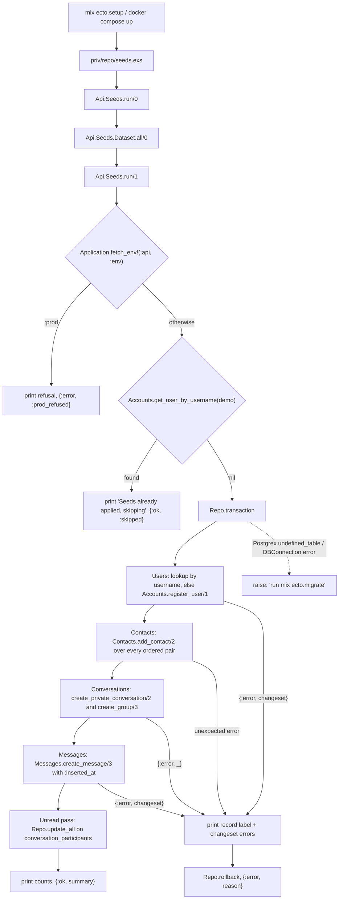

# Technical Specification: Demo Seed Data

**Complexity:** medium

---

## 1. Technical Overview

### What

Turn an empty database into the application the reference screens show, with one command and no manual step:

1. **`Api.Seeds.Dataset`** — the demo content as data, not as code: seven users, a full contact mesh, four private conversations, two groups and 62 messages, each message carrying a `{days_ago, minutes_back}` offset instead of a timestamp. Nothing in it executes; it is a map, and every count an acceptance criterion asserts can be read off it.
2. **`Api.Seeds`** — the interpreter. `run/0` resolves the dataset and hands it to `run/1`, which refuses to run outside a development-shaped environment, returns early when the demo account already exists, and otherwise walks the dataset inside one transaction, writing users through `Accounts.register_user/1`, contacts through `Contacts.add_contact/2`, conversations through `Conversations.create_private_conversation/2` and `create_group/3`, and every message through `Messages.create_message/3`.
3. **The unread pass** — after the messages land, `last_read_at` is written on the participant rows so that exactly two of `@demo`'s six conversations start with a non-zero unread count and the other four start read.
4. **`config :api, :env, config_env()`** — the one new configuration key, and the fact the production refusal is decided on.
5. **`priv/repo/seeds.exs` and the README** — the script becomes `Api.Seeds.run()`, and the README gains a "Seeded accounts" table so the documented credentials exist the moment the feature lands.

No migration, no endpoint, no new dependency, no environment variable. `mix ecto.setup` already runs `priv/repo/seeds.exs`, and `docker-compose.dev.yml` already runs `mix ecto.setup`, so the "populated on a cold start" capability is satisfied by replacing the body of a file that is already wired in.

### Why

The seed script is the only code in this project whose job is to be *read* by someone who did not write it, and that inverts the usual priority. A reviewer opening `priv/repo/seeds.exs` is asking two questions — what data will I get, and can I trust it — and both are answered by the shape of the code before a single line of it is understood. So the demo content is a data structure and the mechanics are an interpreter over it: adding a message is adding a tuple, the count of private conversations is the length of a filtered list, and there is no branch anywhere in the content. The alternative, sixty `create_message/3` calls in sequence, hides the same information inside control flow and makes "at least 60 messages, 4 private and 2 groups" a thing you verify by counting statements.

Seeding through the contexts rather than through `Repo.insert` is the decision the PRD states and the one that carries the most weight, because it makes the demo data *evidence* rather than decoration. A message written by `Messages.create_message/3` has passed the participation gate, the trim, and the 1–4000 bound; it could not have been written by a non-member, and it cannot be empty. A group built by `Conversations.create_group/3` has passed the contact check and the size bounds, and has its creator recorded the way the endpoint records it. This is why the contact mesh is seeded before the conversations and the conversations before the messages: the order is not a convenience, it is the dependency chain the domain enforces, and a seed script that had to bypass any link in it would be telling you the link is wrong. The cost is real — 62 messages are 62 authorization checks, and seven users are seven Argon2 hashes — and it is the right cost to pay for a dataset that is indistinguishable from one a user produced.

Timestamps are computed backwards from the moment the script runs, and the reason is that "today" is not a date. The reference screens show `14:24`, and reproducing that literally means a reviewer who seeds at nine in the morning gets a conversation whose newest message is five hours in the future — relative-time rendering shows "in 5 hours", ordering by last activity still works but describes something that has not happened, and the unread arithmetic starts comparing a `last_read_at` of *now* against messages that postdate it. Anchoring every offset as *minutes before now* makes the guarantee structural instead of incidental: no seeded message can be dated in the future at any hour of any day, and "today, yesterday and the previous week" is true whenever the script is run. What is lost is pixel fidelity to the screenshot clock; what is gained is that the date separators and relative timestamps the PRD wants exercised are exercised correctly rather than coincidentally.

The production refusal is decided on a compiled configuration key rather than on `Mix.env()`, and the difference matters twice. `Mix` does not exist inside a release, so a guard written against it is not a guard that fails safe in the one environment it exists to protect — it is a guard that raises `UndefinedFunctionError` and produces a stack trace instead of a refusal. And a guard read from `Application.fetch_env!(:api, :env)` is a guard a test can exercise: `put_env(:api, :env, :prod)`, run the seed, assert that not one row was written. The acceptance criterion says "exits without creating any record", and that is only a criterion if something can check it. Adding `config :api, :env, config_env()` to `config/config.exs` costs one line and gives the application a fact about itself that every environment agrees on.

Idempotency has two layers for the same reason keyset pagination had two: one for the ordinary case and one for the case that actually happens. The ordinary case is `mix ecto.setup` run twice, and the demo account lookup handles it — the script prints "Seeds already applied, skipping" and returns before opening a transaction. The case that actually happens is a developer who registered `@anabeatriz` by hand while testing the registration endpoint and then wants a populated database. Looking each username up before inserting, and reusing whatever is found, means that database seeds rather than dying on a unique constraint. Neither layer is a substitute for the other: without the early return, a re-run pays sixty authorization checks to discover it has nothing to do; without the per-user lookup, a partially populated database is a dead end.

Whole-run atomicity is not caution, it is what makes a failure debuggable. A seed that inserts users, then contacts, then dies halfway through the fourth conversation leaves a database that is neither empty nor seeded — the skip check will fire on the next run because `@demo` exists, so the developer gets a silent "already applied" over a broken dataset. One transaction collapses that to two states: seeded or untouched. The failure path prints which record failed and its changeset errors before rolling back, because `{:error, %Ecto.Changeset{}}` from inside a transaction is otherwise the least informative thing a script can produce.

`run/1` takes the dataset as an argument, and that is the only reason the rollback is testable. A test cannot make the real dataset fail without editing it; a test that passes a dataset carrying one empty body can assert the exact contract — the run errors, and the database is untouched. The same seam gives the suite a way to seed a two-user fixture without paying for the full mesh. `run/0` remains the single entry point everything else uses, so the seam costs nothing at the call site.

`last_read_at` is written directly rather than through a new context function, because the function that belongs there does not belong to this feature. Marking a conversation read is the inbox feature's endpoint, with its own signature, its own monotonic clamp and its own return shape; inventing that API from inside a seed script would fix those decisions in the wrong place and guarantee a rewrite. `Participant` and `Repo` are both exported from the `Api` boundary, so the seed writing the column is a legal, visible dependency rather than a hole punched through a wall. What the seed does owe is a precise result, and it produces one: `last_read_at` is set to the `inserted_at` of the message immediately preceding the first unread message, so the unread count is exactly the number the dataset declares rather than "some positive number".

### Scope

**Included:**
- `Api.Seeds.Dataset` — the demo content as data: seven users, the mesh flag, six conversations with their ordered transcripts and declared unread depth
- `Api.Seeds` — the boundary and interpreter: `run/0`, `run/1`, the environment guard, the skip guard, the single transaction, the failure report and the summary line
- The unread pass writing `last_read_at` on `conversation_participants` via `Repo.update_all`
- `config :api, :env, config_env()` in `config/config.exs`
- `priv/repo/seeds.exs` reduced to `Api.Seeds.run()`
- `{Seeds, []}` added to the `Api` boundary's exports
- A "Seeded accounts" section in `backend/README.md` listing the seven usernames and the shared password
- Rescue and re-raise of `Postgrex.Error` on an undefined table and `DBConnection.ConnectionError`, with an explicit `mix ecto.migrate` instruction
- Dataset, seed and cross-feature test suites

**Excluded (owned by other features):**
- The mark-as-read endpoint, the aggregated conversation list, unread counts in a response payload and the `unread_overflow` flag — the inbox feature owns all of them; this feature only writes the column they read
- Any change to `Accounts`, `Contacts`, `Conversations` or `Messages` — every write goes through their existing public functions, unchanged
- The channel, presence and search features' data needs — the transcript already contains a searchable term, but no index, topic or tracker is added here
- The rest of the README and `docs/api.md` — the documentation feature owns them; this feature adds only the credentials table its own acceptance criterion depends on
- Any migration — `conversation_participants.last_read_at` already exists
- Any change to `mix ecto.setup` or `docker-compose.dev.yml` — both already run the seed script
- Faker-style random data, avatars, and per-environment dataset variants

---

## 2. Architecture Impact

### Affected components

| Layer | Component | Path |
|---|---|---|
| Domain | Demo content as data | `lib/api/seeds/dataset.ex` |
| Domain | Guards, transaction and interpreter | `lib/api/seeds.ex` |
| Domain | `Seeds` exported from the domain root | `lib/api.ex` |
| Config | `:env` key backing the production refusal | `config/config.exs` |
| Script | One-line invoker | `priv/repo/seeds.exs` |
| Docs | Seeded credentials table | `README.md` |
| Test | Dataset, seed and cross-feature suites | `test/api/seeds/dataset_test.exs`, `test/api/seeds_test.exs`, `test/api_web/seeds_integration_test.exs` |

### Seeding flow



### Guard order

The two guards run before the transaction is opened, in this order, and the order is the contract:

1. **Environment.** `Application.fetch_env!(:api, :env) == :prod` returns `{:error, :prod_refused}` after printing a refusal. Nothing is queried, so a production database is never even connected to on behalf of this script.
2. **Already seeded.** `Accounts.get_user_by_username("demo")` returning a user prints `Seeds already applied, skipping` and returns `{:ok, :skipped}`. This is a success, not an error: `mix ecto.setup` must exit 0 on a populated database.

Running the environment guard first is what makes the refusal unconditional. Were the skip check first, a production database that happened to contain a `@demo` account would take the skip branch and report success, which reads identically to a refusal and means something different.

### Write order and why it is fixed

| Step | Function called | Depends on |
|---|---|---|
| 1. Users | `Accounts.register_user/1` (after `get_user_by_username/1`) | — |
| 2. Contacts | `Contacts.add_contact/2` | user records from step 1 |
| 3. Private conversations | `Conversations.create_private_conversation/2` | the pair being contacts (step 2) |
| 4. Groups | `Conversations.create_group/3` | every member being a contact of the creator (step 2) |
| 5. Messages | `Messages.create_message/3` | active participation (steps 3 and 4) |
| 6. Unread | `Repo.update_all` over `Participant` | message `inserted_at` values from step 5 |

Each step is a precondition of the next, enforced by the domain rather than by the script. A reordering does not produce wrong data — it produces `{:error, :not_a_contact}` or `{:error, :not_found}` and a rolled-back transaction.

### Timestamp resolution

The anchor is `DateTime.utc_now()`, taken once per run so every conversation shares one clock. A transcript entry's offset `{days_ago, minutes_back}` resolves to:

```
anchor |> DateTime.add(-days_ago, :day) |> DateTime.add(-minutes_back, :minute)
```

Both components are non-negative, so every resolved timestamp is strictly in the past. Within a conversation the resolved values must strictly increase, which the dataset guarantees by construction and a dataset test asserts directly rather than through the database.

### Unread resolution

For each conversation the dataset declares `unread: n`, the number of trailing messages that must remain unread for `@demo`:

- `n == 0` → `last_read_at` is set to the anchor, so every message predates it and the count is zero.
- `n > 0` → `last_read_at` is set to the `inserted_at` of the message at index `length - n - 1`, so exactly the last `n` messages postdate it. The dataset guarantees none of those `n` was sent by `@demo`, which is what makes the count exactly `n` under the inbox feature's formula (`inserted_at > last_read_at` and `sender_id != current_user`).

Every participant row that does not belong to `@demo` is set to the anchor, so a reviewer logging in as any other seeded account sees a clean inbox.

---

## 3. Technical Decisions

| Decision | Chosen Approach | Alternative Considered | Trade-off |
|---|---|---|---|
| Code placement | `Api.Seeds` boundary in `lib`, script is a one-line invoker | All logic inside `priv/repo/seeds.exs` | The module compiles into the release and is subject to Credo and the coverage floor; in exchange the idempotency, rollback and refusal criteria are assertable in the ordinary test suite instead of through `Code.eval_file/1` |
| Content representation | Declarative dataset module + interpreter | Sixty sequential `create_message/3` calls | One more module; the demo content becomes editable and countable without reading control flow, and the dataset gets its own tests independent of the database |
| Write path | Every row through the existing context functions | `Repo.insert_all` for speed | Roughly a hundred authorization checks and seven Argon2 hashes per cold start; in exchange no seeded row can violate a rule a real row must satisfy, which is the whole point of the feature |
| Environment guard | `Application.fetch_env!(:api, :env)`, set from `config_env()` | `Mix.env() == :prod` | One new configuration key; works inside a release where `Mix` does not exist, and the refusal branch becomes reachable from a test |
| Idempotency | Early return on the primary account, plus per-username lookup | Per-record upsert, or `ON CONFLICT DO NOTHING` throughout | A partially seeded database still completes rather than dying on a unique constraint, and the common re-run costs one query |
| Atomicity | One `Repo.transaction` around the whole run | A transaction per conversation | A long-held transaction during a cold start; in exchange the database is only ever untouched or fully seeded, so the skip check can never fire over a half-written dataset |
| Testability seam | `run/1` takes the dataset | Only `run/0`, with the dataset read internally | A second public arity; the rollback contract becomes assertable by passing a deliberately invalid dataset, and fixtures can seed a smaller graph |
| Timestamps | Offsets resolved backwards from run time | Fixed wall-clock times from the reference screens | Clock times no longer match the screenshots exactly; no seeded message can ever be dated in the future, at any hour |
| `last_read_at` | `Repo.update_all` over the exported `Participant` schema | Add `Conversations.mark_read/2` now | A direct write from outside the conversations context; avoids fixing the inbox feature's endpoint signature from inside a seed script |
| Reviewer output | `IO.puts` for the skip line, the failure report and the summary | `Logger` | Bypasses log-level configuration, so the messages the PRD quotes appear verbatim regardless of environment; these are script output, not application events |
| Missing schema | Rescue `Postgrex.Error` (`:undefined_table`) and `DBConnection.ConnectionError`, re-raise with an instruction | Let the raw error surface | One rescue clause; the first-run failure mode a reviewer is most likely to hit reads as an instruction rather than as a driver stack trace |

---

## 4. Component Overview

### Domain

| File Path | New/Modified | Purpose | Key Responsibilities |
|---|---|---|---|
| `lib/api/seeds/dataset.ex` | New | Demo content as data | `all/0` returning the dataset map: `:password`, `:primary`, `:users`, `:conversations`. No database access, no `alias` of a context, pure data and the module attributes holding it |
| `lib/api/seeds.ex` | New | Seed boundary and interpreter | `use Boundary, deps: [Api, Api.Accounts, Api.Contacts, Api.Conversations, Api.Messages]`; `run/0` delegating to `run/1`; the environment and skip guards; the transaction walking users, contacts, conversations, messages and the unread pass; the failure report and the `Postgrex`/`DBConnection` rescue |
| `lib/api.ex` | Modified | Domain root boundary | Adds `{Seeds, []}` to the exports list |

### Config and scripts

| File Path | New/Modified | Purpose | Key Responsibilities |
|---|---|---|---|
| `config/config.exs` | Modified | Environment fact | `config :api, env: config_env()`, placed with the other `:api` application settings |
| `priv/repo/seeds.exs` | Modified | Entry point | Replaces the generator comment block with `Api.Seeds.run()` and a short comment naming the module that owns the content |
| `README.md` | Modified | Seeded credentials | A "Seeded accounts" section: the seven `@username`s with display names, the shared password, and a note that the script is idempotent and refuses to run in `prod` |

### Test

| File Path | New/Modified | Purpose | Key Responsibilities |
|---|---|---|---|
| `test/api/seeds/dataset_test.exs` | New | Dataset invariants | Asserts the counts, the strictly increasing offsets, the body bounds, the sender-membership rule and the unread declarations, all without touching the database |
| `test/api/seeds_test.exs` | New | Seed behaviour | The full run, idempotency, the unread outcome, the backdating spread, the production refusal and the transaction rollback |
| `test/api_web/seeds_integration_test.exs` | New | Cross-feature criteria | The four PRD integration lines: login, contacts, group detail and message history over the seeded data, through the real HTTP endpoints |

### Database

No migration. The feature writes rows into `users`, `contacts`, `conversations`, `conversation_participants` and `messages`, all of which exist, and updates `conversation_participants.last_read_at`, which exists and is currently written by nothing.

---

## 5. API Contracts

This feature exposes no HTTP endpoint. Its contracts are the module API and the command-line behaviour.

### Domain contract: `Api.Seeds.run/0` and `run/1`

```elixir
@spec run() :: {:ok, map()} | {:ok, :skipped} | {:error, term()}
@spec run(dataset :: map()) :: {:ok, map()} | {:ok, :skipped} | {:error, term()}
```

| Return | Condition | Side effects |
|---|---|---|
| `{:ok, %{users: 7, conversations: 6, messages: 62}}` | An empty (or partially populated) database outside `:prod` | Everything in the dataset is written; a summary line is printed |
| `{:ok, :skipped}` | `@demo` already exists | None; `Seeds already applied, skipping` is printed |
| `{:error, :prod_refused}` | `Application.fetch_env!(:api, :env) == :prod` | None; a refusal naming the environment is printed. No query is issued |
| `{:error, {label, %Ecto.Changeset{}}}` | Any write in the dataset fails validation | None — the transaction is rolled back; the label and the changeset errors are printed |

`run/0` is `run(Api.Seeds.Dataset.all())`. The summary map's keys are the counts actually written, so a caller can assert on them without re-reading the dataset.

Raises `RuntimeError` — never a driver error — when the schema is missing or the database is unreachable:

```
The database is not ready for seeding: relation "users" does not exist.
Run `mix ecto.migrate` (or `mix ecto.setup`) and try again.
```

### Domain contract: `Api.Seeds.Dataset.all/0`

```elixir
%{
  password: "senha123",
  primary: "demo",
  users: [
    %{username: "demo", name: "Usuário Demo"},
    %{username: "anabeatriz", name: "Ana Beatriz"},
    ...
  ],
  conversations: [
    %{
      kind: :private,
      with: "anabeatriz",
      unread: 0,
      messages: [
        {"anabeatriz", "Oi! Conseguiu ver a proposta que mandei?", {7, 545}},
        {"demo", "Vi sim, ficou ótima", {7, 540}},
        ...
      ]
    },
    %{
      kind: :group,
      name: "Time de Produto",
      creator: "demo",
      members: ["demo", "rafaelalves", "anabeatriz", "carlosedu", "leticiam"],
      unread: 3,
      messages: [
        {"rafaelalves", "subi a build de staging", {0, 132}},
        ...
      ]
    }
  ]
}
```

- A `:private` conversation is implicitly between `:primary` and `:with`; it carries no member list.
- A message tuple is `{sender_username, body, {days_ago, minutes_back}}`.
- The contact mesh is not listed: every ordered pair of distinct seeded users is a contact, derived from `:users`.

### CLI contract

| Command | Output on an empty database | Output on a seeded database |
|---|---|---|
| `mix ecto.setup` | `Seeded 7 users, 6 conversations and 62 messages.` | `Seeds already applied, skipping` |
| `mix run priv/repo/seeds.exs` | same | same |
| `MIX_ENV=prod mix run priv/repo/seeds.exs` | `Refusing to seed demo data in the prod environment.` and no record written | same |

---

## 6. Data Model

### Configuration

| Key | Value | File |
|---|---|---|
| `:api, :env` | `config_env()` — `:dev`, `:test` or `:prod` | `config/config.exs` |

Read only by `Api.Seeds`. Tests override it with `Application.put_env/3` and restore it in `on_exit`.

### Seeded users

All share the password `senha123`, hashed by `User.registration_changeset/2` like any registration.

| `username` | `name` |
|---|---|
| `demo` | Usuário Demo |
| `anabeatriz` | Ana Beatriz |
| `carlosedu` | Carlos Eduardo |
| `joaopedro` | João Pedro |
| `leticiam` | Letícia Moraes |
| `marianas` | Mariana Silva |
| `rafaelalves` | Rafael Alves |

`senha123` is eight characters, satisfying the schema's 8–72 bound. `demo` is four characters, satisfying the 3–20 username bound and the lowercase-alphanumeric format.

### Seeded contacts

The full mesh: every ordered pair of distinct users, 7 × 6 = **42 rows**. Contacts are unidirectional, so both directions of each pair are written, which is what lets any seeded account open a conversation with any other on first login.

### Seeded conversations

| # | Kind | Title / counterpart | Members | Messages | `unread` for `@demo` |
|---|---|---|---|---|---|
| 1 | private | Ana Beatriz | demo, anabeatriz | 14 | 0 |
| 2 | private | Carlos Eduardo | demo, carlosedu | 10 | 2 |
| 3 | private | Mariana Silva | demo, marianas | 8 | 0 |
| 4 | private | João Pedro | demo, joaopedro | 8 | 0 |
| 5 | group | Time de Produto | demo (creator), rafaelalves, anabeatriz, carlosedu, leticiam | 14 | 3 |
| 6 | group | Família | demo (creator), marianas, joaopedro, leticiam | 8 | 0 |

**62 messages**, above the 60 the criteria require. Four private and two groups, as the PRD fixes. Both groups are created by `@demo`, so every management endpoint is demonstrable from the documented account.

### Timestamp spread

| `days_ago` | Used by | Purpose |
|---|---|---|
| `0` | conversations 1, 2, 3, 5 | Today — exercises relative timestamps ("14:33") and puts recent activity at the top of the list |
| `1` | conversations 1, 2, 3, 5, 6 | Yesterday — exercises the "Ontem" date separator |
| `7` and `8` | conversations 1, 2, 4, 5 | The previous week — exercises full-date separators and gives history worth paginating |

Conversation 1 carries the smallest `minutes_back` on `days_ago: 0`, so it is the most recently active and sorts first once the inbox feature lands. The dataset includes the term **cronograma** in conversation 1, so the search feature has a guaranteed hit and the PRD's Experience narrative holds.

### The unread write

```sql
UPDATE conversation_participants
   SET last_read_at = $1, updated_at = $2
 WHERE conversation_id = $3 AND user_id = $4
```

Issued through `Repo.update_all` over `Api.Conversations.Participant`, once per participant row of every seeded conversation. `$1` is the anchor for read rows, and the `inserted_at` of the message at index `length - unread - 1` for the two unread ones.

---

## 7. Testing Strategy

### Test file structure

```
test/api/seeds/dataset_test.exs        # pure data invariants, async: true
test/api/seeds_test.exs                # seeding behaviour, async: false
test/api_web/seeds_integration_test.exs # the four cross-feature criteria, async: false
```

`test/api/seeds_test.exs` and the integration suite are `async: false`: two of their tests run through `Ecto.Adapters.SQL.Sandbox.unboxed_run/2` so the seed's own transaction is genuinely top-level, and they clean up the rows they write in `on_exit`.

### `test/api/seeds/dataset_test.exs`

Assertions over `Dataset.all/0` alone — no repo, no fixtures. These are the invariants the interpreter depends on, and finding a violation here names the offending tuple instead of producing an opaque changeset error inside a transaction.

| Test | Asserts |
|---|---|
| `test "declares seven users including the primary account"` | Seven entries, unique usernames, `:primary` present among them |
| `test "declares four private and two group conversations"` | The kind split the criteria state |
| `test "declares at least sixty messages"` | Summed transcript length ≥ 60 |
| `test "offsets are strictly increasing within every conversation"` | Resolved against a fixed anchor, each timestamp is later than its predecessor |
| `test "no offset resolves into the future"` | Every resolved timestamp is `<=` the anchor for a non-negative pair |
| `test "every body satisfies the message length bounds"` | Trimmed length between 1 and 4000 |
| `test "every sender is a member of its conversation"` | Private senders are the pair; group senders are in `:members` |
| `test "spans today, yesterday and the previous week"` | The set of `days_ago` values includes `0`, `1` and at least one `>= 7` |
| `test "unread declarations name only messages from other senders"` | For each conversation with `unread: n > 0`, none of the trailing `n` was sent by the primary account |
| `test "both groups record a creator that is one of their members"` | Creator present in `:members` |

### `test/api/seeds_test.exs`

| Test | Asserts | Criterion |
|---|---|---|
| `test "seeds the full dataset into an empty database"` | `{:ok, %{users: 7, conversations: 6, messages: 62}}`; the row counts match, four conversations are `:private` and two `:group` | "creates at least 7 users, 6 conversations (4 private, 2 groups) and at least 60 messages" |
| `test "every seeded user authenticates with the documented password"` | `Accounts.authenticate(username, "senha123")` returns `{:ok, _}` for all seven | "Every seeded user can log in with the credentials documented in the README" |
| `test "seeds the full contact mesh"` | 42 contact rows; `Contacts.contact?/2` true for every ordered pair | Capability: "A full contact graph among the seeded users" |
| `test "backdates messages across today, yesterday and the previous week"` | The distinct `inserted_at` dates include today, yesterday and a date at least seven days old; no message is later than the run time | "Seeded messages have backdated `inserted_at` values spanning today, yesterday and the previous week" |
| `test "leaves exactly two conversations unread for the demo account"` | Counting `inserted_at > last_read_at and sender_id != demo.id` per conversation yields `2` and `3` for the two declared, `0` for the other four | "At least two seeded conversations start with a non-zero unread count" |
| `test "marks every other participant fully read"` | No non-demo participant row has an unread message | Assumption 6 below |
| `test "is idempotent"` | A second `run/0` returns `{:ok, :skipped}` and leaves every row count unchanged | "Running the seed script a second time creates no duplicate records and exits successfully with a skip message" |
| `test "reuses a pre-existing seeded username instead of failing"` | Register `@anabeatriz` by hand, run the seed, assert seven users total and that the pre-existing record's id is the one seated in the conversations | Error Handling: "existing records are detected by `username` lookup" |
| `test "seeded bodies satisfy the runtime message validations"` | Every persisted body is non-empty after trimming and at most 4000 characters | "no seeded body is empty or exceeds 4000 characters" |
| `test "refuses to run in the prod environment"` | With `:env` set to `:prod`, returns `{:error, :prod_refused}` and the user count stays zero | "Attempting to run seeds with `MIX_ENV=prod` exits without creating any record" |
| `test "rolls back the whole run when a record fails validation"` | Through `unboxed_run/2`, `run/1` with a dataset carrying one empty body returns an error and leaves zero users, zero conversations and zero messages | "A validation failure during seeding rolls back the transaction, leaving no partial dataset" |
| `test "raises an instruction when the schema is missing"` | Through `unboxed_run/2` with `users` temporarily renamed, the raised message names `mix ecto.migrate`; the table is renamed back in an `after` block | Error Handling: "fails fast with an explicit instruction" |

### `test/api_web/seeds_integration_test.exs`

The four PRD Cross-Feature Integration criteria that reference this feature, exercised through the real HTTP endpoints against a seeded database.

| Test | Asserts | Criterion |
|---|---|---|
| `test "seeded users log in through the auth endpoint and receive a working token"` | `POST /api/auth/login` with each seeded username and `senha123` returns 200 with a token; the token then authorizes `GET /api/auth/me` | "Seeded users (F11) authenticate through the F02 login endpoint" |
| `test "seeded contact lists are returned by the contacts endpoint"` | `GET /api/contacts` as each seeded user returns the other six, ordered by display name | "Seeded contact lists (F11) are returned by the F03 contacts endpoint" |
| `test "seeded groups appear with the correct creator and member list"` | `GET /api/conversations/:id` as a member of each group returns the group name, `@demo` as creator, and the exact member set | "Seeded groups (F11) appear for their members through the F05 group detail endpoint" |
| `test "seeded messages are returned in chronological order with their backdated timestamps"` | `GET /api/conversations/:id/messages` returns the transcript ascending, with `inserted_at` values matching the dataset offsets, and paginating a 14-message conversation with `limit=10` yields the remaining four | "Seeded messages (F11) are returned by the F06 history endpoint in correct chronological order with their backdated timestamps" |

### Coverage

`mix precommit` runs `coveralls` at the project's 80% floor over `lib/api`. `Api.Seeds.Dataset` is data and is fully covered by the dataset suite; `Api.Seeds`' branches — the two guards, the reuse path, the abort path and the rescue — each have a direct test rather than incidental coverage through the happy path.

---

## Assumptions and Decisions

Derived from the PRD, the existing codebase and the interview:

1. **Primary demo account** — the PRD names six users and "a primary demo account" without fixing its identity. `@demo` / "Usuário Demo" is used, and it is the account the README's credentials table leads with.
2. **Message distribution** — the PRD requires "at least 60 messages" without a split. 14 / 10 / 8 / 8 / 14 / 8 across the six conversations gives 62, with the longest conversation deep enough to require a second page at the default limit of 30 only when combined; conversation 1 at 14 messages is paginated in the integration test with an explicit `limit=10`.
3. **"Família" membership** — the PRD fixes five members for "Time de Produto" and says nothing about "Família". Four members are used: `@demo` as creator plus `@marianas`, `@joaopedro` and `@leticiam`.
4. **Group creators** — both groups are created by `@demo`, so every creator-only management endpoint is exercisable from the documented account on first login.
5. **Which conversations start unread** — "Time de Produto" (3) and the Carlos Eduardo thread (2), so the badge appears on both a group and a private entry. The PRD requires at least two; these are exactly two.
6. **Non-demo participants** — every participant row that is not `@demo`'s is marked fully read, so logging in as another seeded account shows a clean inbox rather than incidental badges. The PRD constrains only the primary account.
7. **Offset unit** — `{days_ago, minutes_back}`, both non-negative, resolved backwards from a single anchor taken once per run. The PRD requires the spread but fixes no representation.
8. **Transaction timeout** — the `Repo.transaction` call passes `timeout: :infinity`, because seven Argon2 hashes plus roughly a hundred authorization checks can exceed the 15-second default on a cold container.
9. **Reviewer-facing output uses `IO.puts`** — the PRD quotes "Seeds already applied, skipping" verbatim, and script output must not depend on the logger level.
10. **`run/1` is public** — the dataset argument exists so the rollback contract can be asserted with a deliberately invalid dataset. `run/0` remains the single entry point used by the script.
11. **Partially seeded databases** — when `@demo` is absent but other seeded usernames exist, users are reused and conversations are created fresh. Group conversations have no natural lookup key, so a database containing a hand-created "Família" would end up with two. This is accepted: the state is a developer's local artefact, and `mix ecto.reset` is the documented recovery.
12. **README scope** — this feature adds only the "Seeded accounts" section, so its own login criterion is verifiable on delivery. The documentation feature owns the rest of the README.

Traceability to the PRD: **Consumes** (F02 user records, F03 contact entries, F05 group records, F06 message records) → the write order table and the seeding flow; **Capabilities** → the Data Model tables and the guard order; **Experience** → the timestamp spread, the unread resolution and the CLI contract; **Error Handling** → the guard order, the abort path and the `Postgrex`/`DBConnection` rescue; **Section 9 per-feature criteria** → the `seeds_test.exs` table, one row per criterion; **Section 9 Cross-Feature Integration** (the four lines naming F11) → `seeds_integration_test.exs`.
