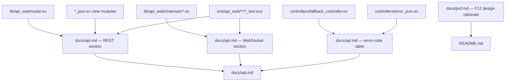

# F12. API Documentation — Technical Specification

## Section 1: Technical Overview

**What:** Produce the human-facing contract for the whole backend so a client developer can integrate without reading Elixir. Two deliverables: a new `backend/docs/api.md` that documents every REST endpoint, the full WebSocket contract, and a table of every `errors.code` the API emits; and additions to the existing `backend/README.md` — a "Design decisions" section and a "What I would do differently with more time" section. No application code changes.

**Why:** REST routes are discoverable from the router, but channel topics and events are not — they exist only in `lib/api_web/channels/` and are invisible to a consumer. The error envelope is uniform but the set of `code` values is spread across `ApiWeb.FallbackController` and `ApiWeb.ErrorJSON`; a client that wants to branch exhaustively needs them collected in one table. The README already documents how to run the project, the seeded credentials, the environment variables and the error shape, but omits the design rationale the practical-test brief asks for.

**Scope:**

**Included:**
- `docs/api.md` documenting all 17 REST endpoints (method, path, auth requirement, path/query params, request example, success response with status, at least one error response with its `code`).
- A WebSocket section: socket URL and connect params, both topic patterns and their join-authorization rules, the one inbound event and all five outbound events with concrete payload examples.
- A single error-code table mapping every `errors.code` to its HTTP status and meaning.
- README "Design decisions" section covering the six mandated choices, and a "What I would do differently with more time" section.
- Documented examples transcribed from existing test assertions so the docs reflect real payloads.

**Excluded (deferred / not applicable):**
- OpenAPI/Swagger specifications or any machine-readable schema format — PRD mandates hand-authored Markdown at `docs/api.md`.
- Any change to endpoints, channels, error codes or response shapes; F12 documents the system as built and must not alter it.
- An automated documentation-generation or doc-drift-failing test harness (see Assumptions).
- The four README areas already present (Docker/native run, seeded accounts, environment variables, error format) are kept as-is, not rewritten.

## Section 2: Architecture Impact

**Affected components:**

| Path | Change | Role |
|------|--------|------|
| `backend/docs/api.md` | New | Full REST + WebSocket + error-code reference |
| `backend/README.md` | Modified | Adds "Design decisions" and "What I would do differently with more time" |

**Sources the documentation is derived from (read-only inputs, not modified):**

## Section 3: Technical Decisions

| Decision | Chosen Approach | Alternative Considered | Trade-off |
|----------|-----------------|------------------------|-----------|
| Documentation format | Hand-authored Markdown at `docs/api.md` | OpenAPI/Swagger spec + generated docs | Markdown is immediately readable and matches the existing `docs/` and `README.md`; it cannot be consumed by a codegen tool and is not machine-validated. PRD explicitly specifies `docs/api.md`. |
| File layout | Single `docs/api.md` for REST, WebSocket and error codes | One file per domain (auth, contacts, conversations…) | One file is searchable end-to-end and matches the PRD's single-artifact requirement; it grows long, mitigated by a table-of-contents header and per-section anchors. |
| Example sourcing | Payload examples transcribed from existing test assertions, each cross-referenced to the asserting test | Examples written freehand from the JSON view modules | Transcribing from tests keeps documentation aligned with verified behaviour; it requires manual cross-referencing during writing rather than automated extraction (see Assumptions). |
| Error-code table source | Enumerate the table from `FallbackController.@reasons` and `ErrorJSON.@errors`, plus the channel reply reasons | Document codes ad hoc as each endpoint is written | Enumerating both source tables guarantees the "every code appears" acceptance criterion; the writer must keep the two module tables and the channel reasons in view while compiling the list. |

## Section 4: Component Overview

**Documentation:**

| File Path | New/Modified | Purpose | Key Responsibilities |
|-----------|--------------|---------|----------------------|
| `docs/api.md` | New | Complete API reference | Table of contents; per-endpoint REST reference; WebSocket contract; error-code table |
| `README.md` | Modified | Project narrative | Add "Design decisions" (6 choices) and "What I would do differently with more time" |

**Read-only sources consulted while writing (not modified):**

| File Path | Provides |
|-----------|----------|
| `lib/api_web/router.ex` | Authoritative list of REST routes, methods, path params, pipelines (public vs authenticated) |
| `lib/api_web/controllers/*_json.ex` | Exact success-response field shapes per endpoint |
| `lib/api_web/controllers/fallback_controller.ex` | Domain `errors.code` values and their statuses |
| `lib/api_web/controllers/error_json.ex` | Status-to-code table for endpoint-level failures |
| `lib/api_web/channels/user_socket.ex` | Socket mount path `/socket`, `token` connect param, socket id convention |
| `lib/api_web/channels/conversation_channel.ex` | `conversation:<id>` join rule, `new_message` inbound, `message:new`, `presence:state`, `presence:diff`, `conversation:membership_revoked` outbound, reply/error shapes |
| `lib/api_web/channels/user_channel.ex` | `user:<id>` join rule, `conversation:updated` outbound |
| `test/api_web/controllers/*_test.exs`, `test/api_web/channels/*_test.exs` | Verified request/response and event payload examples to transcribe |

## Section 5: Documentation Coverage Contract

This section is the checklist the finished `docs/api.md` must satisfy. It is the "contract" of a documentation feature: every item below must appear.

### REST endpoints to document (17)

Each entry must carry: method, path, authentication requirement, path/query parameters, a request-body example (where a body applies), a success response example with its status code, and at least one error response with its `code`.

| # | Method | Path | Auth | Notes to document |
|---|--------|------|------|-------------------|
| 1 | GET | `/api/health` | none | 200 `{"status":"ok","database":"up"}`; 503 `database_unavailable` |
| 2 | POST | `/api/auth/register` | none | body `username,name,password`; 201 `{user,token,expires_at}` |
| 3 | POST | `/api/auth/login` | none | body `username,password`; 200 `{user,token,expires_at}`; 401 `invalid_credentials` |
| 4 | GET | `/api/auth/me` | Bearer | 200 current user; 401 `unauthenticated` |
| 5 | POST | `/api/contacts` | Bearer | body `username` (leading `@` stripped); 201 contact; 404 `user_not_found`; 409 `contact_already_exists`; 422 `self_contact` |
| 6 | GET | `/api/contacts` | Bearer | 200 array sorted by name |
| 7 | DELETE | `/api/contacts/:id` | Bearer | 204; 404 `not_found` |
| 8 | GET | `/api/conversations` | Bearer | optional `?q=` filter; 200 summary array |
| 9 | POST | `/api/conversations/private` | Bearer | body `user_id`; 201 or 200 (idempotent); 403 `not_a_contact`; 404 `user_not_found`; 422 `self_conversation` |
| 10 | POST | `/api/conversations/groups` | Bearer | body `name,member_ids`; 201 group; 403 `not_a_contact`; 422 `validation_error` |
| 11 | GET | `/api/conversations/:id` | Bearer | 200 detail incl. `online`/`last_seen_at`; 404 `not_found` |
| 12 | POST | `/api/conversations/:id/read` | Bearer | 200 `{unread_count:0}`; 404 `not_found`; 403 `not_a_participant`; 400 `invalid_id` |
| 13 | POST | `/api/conversations/:id/members` | Bearer | body `member_ids`; 403 `not_group_creator`/`not_a_contact`; 409 `already_member` |
| 14 | DELETE | `/api/conversations/:id/members/me` | Bearer | 204; 422 `last_member` |
| 15 | DELETE | `/api/conversations/:id/members/:user_id` | Bearer | 204; 403 `not_group_creator`; 422 `cannot_remove_self` |
| 16 | GET | `/api/conversations/:id/messages` | Bearer | query `limit` (≤100), `before` cursor; 200 `{messages,next_cursor,has_more}`; 400 `invalid_cursor`; 422 range; 404 `not_found` |
| 17 | GET | `/api/conversations/:id/messages/search` | Bearer | query `q` (2–100 chars); 200 `{results,total_matches,truncated}`; 422; 404 `not_found` |

### WebSocket contract to document

- **Socket:** URL `/socket`; connect param `token` (the same JWT as HTTP); handshake fails (403) on missing/invalid/expired/revoked token; socket id `user_socket:<user_id>`.
- **Topics and join rules:**
  - `conversation:<conversation_id>` — join calls the participant predicate; non-participant, departed member or unknown id → `{:error, %{reason: "unauthorized"}}`.
  - `user:<user_id>` — join to any id other than the authenticated user is rejected.
- **Inbound events:**
  - `new_message` — payload `{"body": "...", "client_ref": "<optional>"}`; reply `{:ok, %{message: <full message>, client_ref}}`; error replies `{:error, %{reason: "validation_error", fields, client_ref}}`, `{:error, %{reason: "rate_limited", retry_after_ms, client_ref}}`, `{:error, %{reason: "unauthorized", client_ref}}`; unknown event → `{:error, %{reason: "unknown_event", client_ref}}`.
- **Outbound events (payload example each):**
  - `message:new` (on `conversation:<id>`) — the persisted message record.
  - `conversation:updated` (on `user:<id>`) — conversation id, last-message preview, timestamp, sender id, unread indicator.
  - `presence:state` (on `conversation:<id>` join) — current presence snapshot of the conversation's participants.
  - `presence:diff` (on `conversation:<id>`) — joins/leaves diff.
  - `conversation:membership_revoked` (on `conversation:<id>`) — pushed to a removed member before their channel is closed.

### Error-code table to document

Every `code` below must appear with its HTTP status and meaning. Endpoint-level codes come from `ErrorJSON.@errors`; domain codes from `FallbackController.@reasons`; channel reasons from the channel modules.

| Code | Status | Source |
|------|--------|--------|
| `malformed_request` | 400 | ErrorJSON |
| `invalid_id` | 400 | FallbackController |
| `invalid_cursor` | 400 | FallbackController |
| `unauthenticated` | 401 | ErrorJSON / FallbackController |
| `invalid_credentials` | 401 | FallbackController |
| `token_expired` | 401 | FallbackController |
| `forbidden` | 403 | ErrorJSON |
| `not_a_contact` | 403 | FallbackController |
| `not_group_creator` | 403 | FallbackController |
| `not_a_participant` | 403 | FallbackController |
| `not_found` | 404 | ErrorJSON |
| `user_not_found` | 404 | FallbackController |
| `method_not_allowed` | 405 | ErrorJSON |
| `conflict` | 409 | ErrorJSON |
| `contact_already_exists` | 409 | FallbackController |
| `already_member` | 409 | FallbackController |
| `unsupported_media_type` | 415 | ErrorJSON |
| `validation_error` | 422 | ErrorJSON / ChangesetJSON |
| `self_contact` | 422 | FallbackController |
| `contact_limit_reached` | 422 | FallbackController |
| `self_conversation` | 422 | FallbackController |
| `last_member` | 422 | FallbackController |
| `cannot_remove_self` | 422 | FallbackController |
| `rate_limited` | 429 | ErrorJSON |
| `internal_error` | 500 | ErrorJSON |
| `database_unavailable` | 503 | ErrorJSON |

Channel reply reasons (documented in the WebSocket section, not the HTTP table): `unauthorized`, `rate_limited`, `validation_error`, `unknown_event`.

### README sections to add

- **Design decisions** — justify each of: JWT over cookie sessions (cross-origin SPA), Argon2id over bcrypt (memory-hard, no 72-byte truncation), REST plus Channels over an all-channel or GraphQL API, a single `conversations` table for private and group, keyset over offset pagination, unidirectional contacts.
- **What I would do differently with more time** — as requested by the practical-test brief.

## Section 6: Data Model

Not applicable — F12 introduces no tables, columns, indexes, constraints or migrations. It documents the schema and behaviour delivered by F01–F11 without altering the data layer.

## Section 7: Testing Strategy

F12 is a documentation feature: its acceptance criteria are verified by inspection against the codebase rather than by new ExUnit tests, and the PRD prescribes no test module for it. The "verification" work is confirming coverage and payload fidelity against the existing suite, which is already the source of truth for behaviour.

**Verification approach:**

| Check | Method | Passing condition |
|-------|--------|-------------------|
| Route coverage | Cross-check `docs/api.md` against `mix phx.routes` (and `lib/api_web/router.ex`) | Every non-dev route appears with method, path, request example and success response |
| Error-response coverage | For each documented endpoint, confirm ≥1 error response with a `code` | No endpoint lacks an error example |
| Error-code completeness | Diff the docs table against `FallbackController.@reasons` + `ErrorJSON.@errors` + channel reasons | Every emitted `code` is in the table with its status |
| Channel-topic coverage | Cross-check against `conversation_channel.ex` / `user_channel.ex` / `user_socket.ex` | Both topic patterns and their join rules documented |
| Channel-event coverage | Cross-check inbound `new_message` and the five outbound events | Every event documented with a concrete payload |
| Example fidelity | Each documented payload traced to an assertion in `test/api_web/**/*_test.exs` | No hand-invented shape that no test asserts |
| README completeness | Inspect for the six design decisions and the "differently" section | Both new sections present; a reviewer using only the README reaches a running, populated, loggable-in app |

**Sources for transcribed examples:**

| Source test file | Supplies examples for |
|------------------|-----------------------|
| `test/api_web/controllers/auth_controller_test.exs` | register, login, me |
| `test/api_web/controllers/contact_controller_test.exs` | contacts CRUD |
| `test/api_web/controllers/conversation_controller_test.exs` | conversations, groups, inbox, read, members |
| `test/api_web/controllers/message_controller_test.exs` | history, search |
| `test/api_web/controllers/health_controller_test.exs` | health |
| `test/api_web/channels/conversation_channel_test.exs` | `new_message`, `message:new`, presence, membership_revoked |
| `test/api_web/channels/user_channel_test.exs` | `conversation:updated` |
| `test/api_web/channels/user_socket_test.exs` | connect success/failure |

**Acceptance criteria mapping (PRD Section 9, F12):**

| Acceptance criterion | Verified by |
|----------------------|-------------|
| Every router route documented with method/path/request/success example | Route coverage check |
| Every documented endpoint lists ≥1 error response with its `code` | Error-response coverage check |
| Every emitted `code` appears in the error-code table with its status | Error-code completeness check |
| Both channel topic patterns documented with join rules | Channel-topic coverage check |
| Every inbound and outbound channel event documented with a payload | Channel-event coverage check |
| README documents prerequisites, one-command Docker, non-Docker setup, env vars, seeded credentials | README completeness check (already present) |
| README has a "Design decisions" section justifying the six choices | README completeness check |
| README has a "What I would do differently with more time" section | README completeness check |
| A reviewer following only the README reaches a running, populated, loggable-in app | README completeness check |

## Assumptions and Decisions (Auto-Accept)

The following were applied without an interactive interview (batch/auto-accept). Review and override as needed.

1. **No automated doc-drift test is built.** The PRD's "examples are copied from actual test assertions rather than written by hand" is satisfied by transcribing examples from the existing test suite and cross-referencing each to its asserting test, not by adding a code-generation step or a test that fails on drift. Building such a harness is gold-plating for a single-node practical-test deliverable; it can be added later. *(Auto-Accept: Partial PRD specification — industry-standard default, documented.)*
2. **The README is extended, not rewritten.** It already contains the run instructions, seeded credentials, environment-variable table and error-format section the PRD lists; F12 adds only the two missing narrative sections. *(Auto-Accept: derived from observed codebase state.)*
3. **Markdown, not OpenAPI.** No machine-readable schema is produced; the PRD names `docs/api.md` and the project makes no outbound HTTP calls that would consume such a spec. *(Auto-Accept: technical decision with clear recommendation.)*
4. **Single-file `docs/api.md`** with a table-of-contents header rather than a split multi-file reference, matching the PRD's single-artifact wording. *(Auto-Accept: technical decision with clear recommendation.)*
