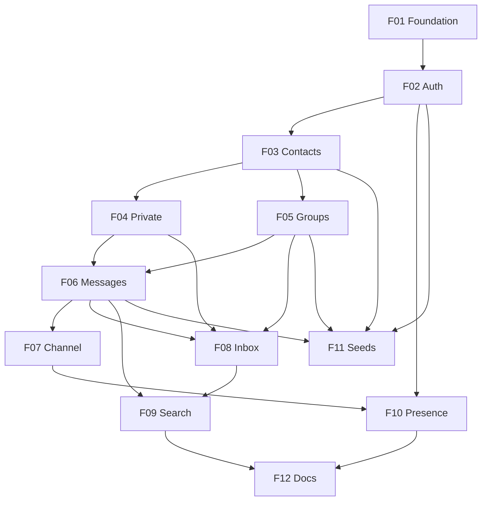

# Granter Chat — Backend API

## 1. Executive Summary

Granter Chat Backend is an Elixir 1.20 + Phoenix API service that provides the complete server side of a messaging application supporting private one-to-one conversations and named groups. It exposes a stateless JWT-authenticated REST surface for account management, contacts, groups, conversation listing, paginated history and search, plus a Phoenix Channels WebSocket surface that delivers messages to every participant in real time without polling or page reloads. All state is persisted in PostgreSQL 16, so conversation history survives restarts and reconnections.

The direct consumers are the Vue 3 + TypeScript single-page application that will be built against this API, and the Granter engineering team that will evaluate the delivery. Indirectly it serves the end user of the messaging product, whose experience depends entirely on server-side guarantees this backend owns: strict chronological ordering, durable history, correct authorization boundaries between contacts and group members, accurate unread counters, and sub-second message fan-out.

At a high level the service is organized as Phoenix contexts over an Ecto/PostgreSQL data layer: `Accounts` (users, credentials, tokens, last seen), `Contacts` (unidirectional contact lists resolved by `@username`), `Conversations` (private conversations and groups with membership and read state), and `Messages` (persistence, keyset-paginated history, full-text search). A `UserSocket` authenticated by the same JWT used for HTTP hosts one channel per conversation plus a per-user channel; writes go through the domain contexts and are broadcast over Phoenix PubSub. The delivery includes a Docker Compose environment, demo seed data mirroring the reference screens, an ExUnit suite covering contexts, controllers and channels, and documentation of every endpoint and channel event. The frontend application is explicitly not part of this scope.

## 2. Problem and Opportunity

### The Problem

**Real-time messaging cannot be faked with request/response alone**
- A conversation UI that polls a REST endpoint every few seconds shows messages 2–5 seconds late and burns a query per client per interval
- Naive polling at 10 clients × 1 request/2s already produces 300 requests/minute against the history endpoint for zero new data most of the time
- Message ordering breaks under concurrent sends when clients reconstruct order from independent responses instead of a single authoritative sequence
- Without a server-owned transport, "sent" and "delivered" are indistinguishable and the client cannot tell a dropped message from a slow one

**Authorization in a chat domain is easy to get subtly wrong**
- Conversation history is the most sensitive data in the product: a single missing membership check on a history endpoint leaks every message of a group the caller never joined
- Identifiers are guessable at scale when sequential integers are exposed, so an unauthorized read is one incremented ID away
- The same authorization rule must hold on three separate paths — REST history, channel join, and message send — and drifts between them when it is implemented three times
- Group membership changes over time, so "is a member" must be evaluated at request time, not cached at conversation creation

**Conversation history grows without bound while clients need a fixed window**
- A single active conversation reaches thousands of messages, and returning them all makes the payload and render cost grow linearly forever
- Offset-based pagination (`LIMIT/OFFSET`) shifts and duplicates rows whenever a new message arrives mid-scroll, which is the normal case in a live chat
- The inbox screen needs a last-message preview per conversation, which is an N+1 query against the messages table if computed naively across 200 conversations

**The inbox is an aggregate that no single table answers**
- Rendering the conversation list requires, per conversation, the counterpart's display name or group name, the last message body and timestamp, its author, and a count of unread messages
- Computing unread counts per conversation on every list request is a full scan of messages unless read state is modeled explicitly
- Sorting by "most recent activity" cannot come from the conversations table alone, because activity lives in messages

**A practical-test backend is judged on what surrounds the code, not only the code**
- An evaluator who cannot start the project in one command may never see the features at all
- An empty database makes every screen look broken, hiding work that was actually done
- Undocumented channel events are invisible: unlike REST routes, they cannot be discovered by reading the router

### The Opportunity

Phoenix Channels over PubSub solve the real-time problem natively: a message is written once through a domain context and broadcast to every connected participant in the same operation, so ordering is decided server-side by a single insert and delivery is push-based instead of polled (**F06**, **F07**). The same authorization predicate is implemented once in the `Conversations` context and invoked from the REST history endpoint, the channel `join/3` callback, and the send path, which removes the drift between the three (**F04**, **F05**, **F06**, **F07**). Public identifiers are UUIDs, so enumeration is not a viable attack (**F01**).

History is served through keyset (cursor) pagination anchored on `(inserted_at, id)`, which is stable under concurrent inserts and does not degrade as a conversation grows (**F06**). The inbox is answered by a single purpose-built aggregate query using a lateral join for the last message and a `last_read_at` marker per participant for unread counts, replacing N+1 access with one round trip (**F08**). Message search is backed by a PostgreSQL GIN index over a `tsvector`, so in-conversation search returns ranked matches with navigation positions instead of scanning client-side (**F09**). Presence and `last_seen_at` come from `Phoenix.Presence` tracking the same authenticated socket, so online state costs nothing extra (**F10**).

Around the code, a Docker Compose environment brings up PostgreSQL 16 and the API in one command (**F01**), seed data reproduces the reference screens so the evaluator sees a populated product immediately (**F11**), and every REST endpoint and channel event is documented with request/response examples and error codes (**F12**).

## 3. Target Audience

### Primary Users

**Frontend Client Developer**
- Builds the Vue 3 + TypeScript SPA against this API and needs predictable JSON shapes, a single documented error envelope, and stable field names to generate or hand-write TypeScript types
- Needs one authentication credential that works for both HTTP requests and the WebSocket connection, without cookie/CSRF handling across origins
- Needs to know exactly which channel topic to join, which events are pushed, and what each payload contains, because channel contracts are not discoverable from the router

**Granter Technical Evaluator**
- Clones the repository and needs the project running with realistic data in under five minutes, without hunting for undocumented environment variables
- Reads for domain modeling quality, context boundaries, authorization correctness, and test coverage rather than feature count
- Checks that the stated stack constraints (Elixir 1.20 + Phoenix, PostgreSQL 16) are actually met and that design decisions are justified in writing

**End User of the Messaging Product** *(indirect — served through the client application)*
- Expects a message typed in one window to appear in the other participant's window immediately, with no reload
- Expects the full conversation history to be there after logging out and back in, in the order it was written
- Expects that only their contacts and group members can reach their conversations, and that a group they left stops delivering messages to them

### Behavioral Profile

All three audiences interact with the same contract from different distances, and each is intolerant of a different failure. The client developer will not tolerate inconsistency — a field that is a string in one endpoint and an object in another costs more than a missing feature. The evaluator will not tolerate setup friction or unverifiable claims — anything asserted in the README must be reproducible by running the project. The end user will not tolerate latency or loss — a message that arrives late reads as broken, and a message that disappears after a refresh destroys trust in the product entirely. The common demand across all three is determinism: identical requests must produce identical results, errors must be explicit and typed rather than generic 500s, and every guarantee the API makes must hold under concurrency.

## 4. Objectives

**Deliver** a complete, self-contained backend for private and group messaging that satisfies every functional requirement of the practical test without any frontend code.
- 100% of the stated requirements (contacts, private conversations, groups, persisted history, real-time delivery) are exercised by an automated test
- 0 endpoints or channel events required by the reference screens are missing from the documented contract

**Guarantee** durable, correctly ordered, correctly authorized conversation history.
- 100% of history reads return messages in ascending `(inserted_at, id)` order across page boundaries, verified by a test that paginates a 250-message conversation
- 0 requests from a non-participant return message content: every unauthorized history read, channel join, or send returns 403 with no payload leakage
- 100% of messages written are retrievable after a full application restart

**Deliver** messages to all connected participants in real time over an authenticated WebSocket.
- p95 end-to-end broadcast latency below 200 ms locally, measured from the channel `handle_in` to the subscriber receiving the event
- 0 messages lost or duplicated in a test where 5 concurrent senders each write 20 messages into the same conversation (100 messages persisted, 100 events received per subscriber)
- 100% of socket connections presented without a valid, unexpired JWT are rejected at `connect/3`

**Sustain** predictable performance as history and conversation count grow.
- History endpoint responds in under 150 ms p95 with 10,000 messages in a conversation, using keyset pagination with a supporting index
- Inbox endpoint returns up to 200 conversations with last-message preview and unread count in a single database round trip, under 200 ms p95
- In-conversation search returns matches in under 300 ms p95 over 10,000 messages using a GIN index

**Ship** the project so a reviewer can run, understand and trust it without assistance.
- Project starts with a single `docker compose -f docker-compose.dev.yml up` command and is serving on port 4000 within 90 seconds of a cold start
- Seed data creates at least 7 users, 6 conversations (private and group) and 60 messages reproducing the reference screens
- `mix precommit` passes with zero warnings and test coverage of at least 80% over `lib/api`
- 100% of REST endpoints and channel events documented with a request example, a success response and at least one error response

## 5. User Stories

### F01. API Foundation and Development Environment
- As a backend developer, I want the Phoenix application configured as a JSON API on Elixir 1.20 so that the stack matches the required constraints
- As a backend developer, I want all public identifiers to be UUIDs so that records cannot be enumerated by incrementing an integer
- As a client developer, I want every error response to use the same JSON envelope so that I can write one error handler for the whole API
- As a client developer, I want CORS configured for my local dev server origin so that browser requests are not blocked
- As an evaluator, I want to start the API and PostgreSQL 16 with a single `docker compose -f docker-compose.dev.yml up` so that I can review the project without installing Elixir locally
- As a backend developer, I want the development and test databases in separate Compose files so that running the test suite never disturbs the data I am looking at in development
- As a backend developer, I want ConnCase, DataCase and ChannelCase test helpers with ExMachina factories so that every later feature can be tested from day one
- As an operator, I want a health endpoint that reports database connectivity so that I can tell a booting app from a broken one

### F02. User Account and JWT Authentication
- As a new user, I want to register with a unique `@username`, display name and password so that I have an identity in the system
- As a user, I want to log in with my `@username` and password and receive a bearer token so that I can call authenticated endpoints
- As a user, I want to fetch my own profile with my token so that the client can display who is logged in
- As a client developer, I want the same token to authenticate the WebSocket connection so that I do not manage two credentials
- As the system, I want to reject expired or tampered tokens with 401 so that stale credentials cannot be replayed
- As the system, I want to hash passwords with a memory-hard algorithm so that a database dump does not expose credentials

### F03. Contact Management
- As a user, I want to add a contact by typing their `@username` so that I can start conversations with them
- As a user, I want a clear "user not found" error when the `@username` does not exist so that I can correct the typo
- As a user, I want to list my contacts sorted alphabetically by display name so that the client can render them grouped by initial
- As a user, I want to remove a contact from my list so that they no longer appear when I start a conversation or create a group
- As the system, I want to prevent a user from adding themselves or the same contact twice so that the list stays consistent

### F04. Private Conversations
- As a user, I want to open a private conversation with one of my contacts so that I can send them messages
- As a user, I want opening a conversation with the same contact twice to return the same conversation so that history is never split across duplicates
- As a user, I want to receive messages from someone who added me even if I have not added them back so that no message is silently dropped
- As the system, I want to reject opening a private conversation with a user who is not in the caller's contact list so that the contact rule is enforced server-side

### F05. Group Management
- As a user, I want to create a group with a name and members selected from my contacts so that we can talk together
- As a group creator, I want to add more members from my contacts after creation so that the group can grow
- As a group creator, I want to remove a member so that they no longer receive the group's messages
- As a group member, I want to leave a group so that I stop receiving its messages
- As a group member, I want to see the group's name, member count and member list so that the client can render the conversation header
- As the system, I want to reject membership changes from anyone other than the creator so that group control is not shared implicitly

### F06. Message Persistence and History
- As a user, I want every message I send to be persisted so that the history survives reloads and restarts
- As a user, I want to load a conversation's history in chronological order so that the conversation reads correctly top to bottom
- As a user, I want to load older messages in pages as I scroll up so that opening a long conversation is fast
- As the system, I want to reject empty or oversized message bodies so that invalid content never reaches the database
- As the system, I want to reject any history read from a non-participant so that conversations stay private

### F07. Real-Time Message Channel
- As a user, I want to connect a WebSocket with my token so that I receive messages without polling
- As a user, I want to join a conversation topic and immediately start receiving its new messages so that the conversation is live
- As a user, I want my sent message to be broadcast to every other participant within milliseconds so that the conversation feels immediate
- As a user, I want an acknowledgement containing the persisted message so that the client can replace its optimistic bubble with the real record
- As a user, I want to be notified on my personal topic when any of my conversations receives a message so that the conversation list updates without joining every topic
- As the system, I want to reject joins to conversations the user does not participate in so that the channel cannot bypass REST authorization

### F08. Conversation Inbox and Unread Tracking
- As a user, I want a single request that returns all my conversations with the last message preview and timestamp so that the client renders the list without extra calls
- As a user, I want conversations ordered by most recent activity so that active threads are at the top
- As a user, I want the preview to indicate when the last message was mine so that the client can prefix it with "You:"
- As a user, I want an unread count per conversation so that I can see where new messages arrived
- As a user, I want to mark a conversation as read so that its unread count returns to zero

### F09. Message and Conversation Search
- As a user, I want to search the messages of a conversation by keyword so that I can find a specific exchange
- As a user, I want each search hit to carry its position in the result set and its message ID so that the client can navigate matches with previous/next controls
- As a user, I want the total number of matches returned so that the client can display "1 / N"
- As a user, I want to filter my conversation list by contact or group name so that I can find a thread quickly
- As the system, I want to reject searches shorter than 2 characters so that unbounded scans are not triggered

### F10. Presence and Last Seen
- As a user, I want to know whether the person I am talking to is online right now so that the client can show their status
- As a user, I want to know when an offline contact was last seen so that the client can render "last seen 5 minutes ago"
- As the system, I want to record `last_seen_at` when a user's last socket disconnects so that offline timing is accurate
- As a user, I want to be notified when a participant of a conversation I have open comes online or goes offline so that the header updates live

### F11. Demo Seed Data
- As an evaluator, I want the database seeded with realistic users, contacts, groups and conversations so that the application looks populated on first run
- As an evaluator, I want documented credentials for the seeded users so that I can log in immediately
- As a backend developer, I want seeding to be idempotent so that re-running it does not create duplicates or crash

### F12. API Documentation
- As a client developer, I want every REST endpoint documented with method, path, request body, success response and error responses so that I can integrate without reading Elixir code
- As a client developer, I want every channel topic and event documented with its payload shape so that I know what to push and what to handle
- As an evaluator, I want the README to explain how to run the project and why the significant design decisions were made so that the delivery is self-explanatory

## 6. Functionalities

### F01. API Foundation and Development Environment

**Capabilities:**
- Phoenix 1.8.8 application in API-only mode with `elixir: "~> 1.20"` in `mix.exs`, served by Bandit on port 4000, with the browser/LiveView pipeline removed from the router; LiveDashboard remains available at `/dev/dashboard` in dev only, and every plug it requires (the `/live` socket, `Plug.Session`, the request logger and the LiveView signing salt) is gated behind the `dev_routes` compile-time flag so the browser stack is not compiled at all in `test` or `prod`
- Scaffold reduction: the generator artefacts this API will never use are deleted rather than left inert — `swoosh` and `Api.Mailer` (no email exists on the account), `gettext` and `ApiWeb.Gettext` (the API is single-language and error details are literals), `req` (no outbound HTTP call is in scope), `dns_cluster` (single-node deliverable), and `Plug.Static` with `priv/static` and `ApiWeb.static_paths/0` (nothing but JSON is served)
- All schemas use `binary_id` (UUID v4) primary keys and foreign keys, and `utc_datetime_usec` timestamps; microsecond precision is required so that `(inserted_at, id)` is a stable sort key for history pagination
- Single JSON error envelope for every non-2xx response: `{"errors": {"code": "<machine_code>", "detail": "<human message>", "fields": {"<field>": ["<message>"]}}}` — `fields` present only for 422 validation failures
- Canonical status code mapping: 400 malformed request, 401 missing/invalid token, 403 authenticated but not permitted, 404 resource absent or not visible to the caller, 409 conflicting state, 422 validation failure, 429 rate limit exceeded, 500 unexpected error
- `FallbackController` translating `{:error, %Ecto.Changeset{}}` to 422, `{:error, :not_found}` to 404, `{:error, :unauthorized}` to 403 and `{:error, :conflict}` to 409, so controllers contain no error rendering logic
- CORS via `cors_plug` allowing `http://localhost:5173` and `http://localhost:3000` by default, overridable through the `CORS_ORIGINS` environment variable as a comma-separated list; allowed methods GET, POST, PATCH, DELETE, OPTIONS; allowed headers `authorization`, `content-type`
- `GET /api/health` returning 200 with `{"status": "ok", "database": "up"}` after executing `SELECT 1`, or 503 with `{"status": "error", "database": "down"}` plus the standard `errors` envelope carrying `code: "database_unavailable"` when the Repo is unreachable, so health is both machine-readable as a probe and consistent with the global error contract
- Two Docker Compose files keeping the development and test databases fully isolated: `docker-compose.dev.yml` with `postgres-dev` on `postgres:16-alpine` (host port 54320, named volume, `pg_isready` healthcheck at 5 s interval and 10 retries) plus an `api` service built from a multi-stage Dockerfile that waits for the healthcheck, runs `mix ecto.setup` and serves on port 4000; and `docker-compose.test.yml` with `db-test` (host port 54321) used only by `mix test`. The evaluator's one command is `docker compose -f docker-compose.dev.yml up`; a developer working natively starts only the database service from the same file
- All runtime configuration read from environment variables in `config/runtime.exs`: `DATABASE_URL`, `SECRET_KEY_BASE`, `JWT_SECRET`, `PORT`, `CORS_ORIGINS`; a `.env.example` documents every variable with a working default for local use
- Test harness: `DataCase` and `ConnCase` with SQL sandbox and a `ChannelCase` for socket and channel tests, plus test data built with `ex_machina` through a single `Api.Factory` module (`use ExMachina.Ecto, repo: Api.Repo`) imported by all three cases; F01 establishes the module and its conventions, and each later feature contributes its own factory (`user_factory`, `contact_factory`, `private_conversation_factory`, `group_factory`, `message_factory`) as its schema lands
- Compile-time architecture enforcement with `boundary`: `Api` and `ApiWeb` are declared as top-level boundaries where `ApiWeb` may depend on `Api` and never the reverse; each domain context declares a sub-boundary with explicit exports as it is introduced
- Quality gate: `mix precommit` runs `compile --warnings-as-errors`, `deps.unlock --unused`, `format`, `credo --strict` and `coveralls --minimum-coverage 80` over `lib/api`; `dialyzer` stays a manual task because of PLT build cost

**Experience:** A reviewer clones the repository, copies `.env.example` to `.env`, and runs `docker compose -f docker-compose.dev.yml up`. The `postgres-dev` service starts and becomes healthy, the `api` service waits for it, runs migrations and seeds, and logs `Running ApiWeb.Endpoint with Bandit ... at 0.0.0.0:4000`. `curl localhost:4000/api/health` returns `{"status":"ok","database":"up"}`. A developer working without Docker runs `mix setup` against a local PostgreSQL 16 and gets the same result via `mix phx.server`. Every failing request, regardless of which controller produced it, returns the same envelope shape, so the client parses `errors.code` for branching and displays `errors.detail` directly.

**Error Handling:**
- Database unreachable at boot: the application does not crash-loop silently; `GET /api/health` returns 503 with `{"errors": {"code": "database_unavailable", "detail": "Database connection is not available"}}`
- Malformed JSON body: 400 with `{"errors": {"code": "malformed_request", "detail": "Request body is not valid JSON"}}` instead of a Plug.Parsers exception page
- Unmatched route: 404 with `{"errors": {"code": "not_found", "detail": "Route not found"}}` in JSON, never an HTML error page
- Unhandled exception in production: 500 with `{"errors": {"code": "internal_error", "detail": "An unexpected error occurred"}}`, with the stacktrace logged server-side and never included in the response body
- Missing `JWT_SECRET` or `SECRET_KEY_BASE` at boot: the application refuses to start with an explicit message naming the missing variable, rather than starting with an insecure default

### F02. User Account and JWT Authentication

**Provides:**
- User account records: user id, `@username`, display name, `last_seen_at` (used by F03, F10, F11)
- Token verification entry point: decodes and validates a JWT and resolves it to a user record (used by F07 to authenticate the socket)

**Core Scope:**
- Registration, login, current-user endpoint, JWT generation and verification, and the authenticated route pipeline

**Full Scope additions:**
- Login rate limiting per IP and per username, and token revocation on logout

**Capabilities:**
- `users` table: `id` (UUID), `username` (citext, unique), `name`, `hashed_password`, `last_seen_at`, timestamps; unique index on `username`
- `username` rules: 3–20 characters, lowercase letters, digits and underscore only (`~r/^[a-z0-9_]+$/`), stored and compared case-insensitively, immutable after registration; the leading `@` is a display convention and is stripped from input before validation
- `name`: 2–60 characters, any printable characters, trimmed
- `password`: 8–72 characters, hashed with `argon2_elixir` (Argon2id, library defaults in dev and prod, reduced cost parameters in test); never returned in any response. Argon2id is memory-hard and, unlike bcrypt, does not silently truncate at 72 bytes; the 8–72 range is kept as a stable published contract rather than as a technical limit
- `POST /api/auth/register` accepting `username`, `name`, `password`; returns 201 with `{"user": {...}, "token": "...", "expires_at": "..."}`
- `POST /api/auth/login` accepting `username` and `password`; returns 200 with the same shape
- `GET /api/auth/me` returning the authenticated user
- JWT: HS256 signed with `JWT_SECRET`, claims `sub` (user id), `exp` (7 days), `iat`, `jti`, issued and verified through `guardian`
- Authenticated route pipeline: Guardian's plug pipeline (bearer header verification, authenticated-token requirement, resource loading) closes with a plug exposing the loaded record as `conn.assigns.current_user`, which every later controller reads; failures halt with 401 rendered through the global error envelope
- Socket authentication reuses the same token and the same verification entry point, but the socket itself is built in F07 alongside the channels it hosts
- Login rate limit: 10 failed attempts per IP per 60 seconds and 5 per username per 60 seconds, returning 429 with `Retry-After`
- Logout (`DELETE /api/auth/session`) adds the token `jti` to a revocation set held in an ETS-backed cache with a TTL equal to the token's remaining lifetime; revoked `jti` values are rejected by both the authenticated pipeline and the socket

**Experience:** A client posts registration data; on success it receives the user record and a bearer token in one response, so no second login round trip is needed. Every subsequent request carries `Authorization: Bearer <token>`, and the WebSocket is opened with the same token as a connect parameter. A username collision returns 422 with `fields: {"username": ["has already been taken"]}` so the client can highlight the field. Login with wrong credentials returns a single generic message regardless of whether the username exists, and the password hash comparison runs even for unknown usernames so response time does not reveal account existence.

**Error Handling:**
- Invalid credentials: 401 with `{"errors": {"code": "invalid_credentials", "detail": "Invalid username or password"}}`, identical for unknown username and wrong password
- Duplicate username: 422 with `code: "validation_error"` and the offending field in `fields`
- Missing or malformed Authorization header: 401 with `code: "unauthenticated"` and detail "Missing or invalid authentication token"
- Expired token: 401 with `code: "token_expired"` so the client can distinguish a re-login prompt from a permission error
- Too many failed logins: 429 with `code: "rate_limited"`, detail naming the retry window, and a `Retry-After` header in seconds

### F03. Contact Management

**Consumes:**
- F02: user account records (user id, `@username`, display name)

**Capabilities:**
- `contacts` table: `id` (UUID), `owner_id`, `contact_user_id`, `inserted_at`; unique index on `(owner_id, contact_user_id)`; both foreign keys cascade on delete
- Unidirectional model: adding a contact affects only the caller's list; the target user is neither notified nor modified, and removing a contact does not touch the other user's list
- `POST /api/contacts` accepting `{"username": "anabeatriz"}` (a leading `@` is accepted and stripped); resolves the username case-insensitively and returns 201 with the created contact
- `GET /api/contacts` returning all contacts sorted by `name` ascending using a case-insensitive, accent-insensitive collation, each entry containing contact id, user id, `@username` and display name; maximum 500 contacts per user
- `DELETE /api/contacts/:id` returning 204; removing a contact never deletes conversations or messages already exchanged with that user
- Self-add is rejected; duplicate add is rejected with 409 rather than silently succeeding, so the client can show a distinct message

**Experience:** The user types a username into the add-contact field and submits. The API resolves it, and on success returns the full contact record so the client can insert it into the list without refetching, matching the reference screen's inline confirmation. When the username does not exist, the response is a 404 carrying the searched username in the detail message, which the client renders as "No user with @fulano123 exists in the system". Listing returns a flat alphabetically sorted array; the grouping by initial letter shown in the reference screen is a client-side concern over this order. Deleting returns 204 with no body, and a repeated delete of the same id returns 404.

**Error Handling:**
- Username not found: 404 with `{"errors": {"code": "user_not_found", "detail": "No user with @<username> exists in the system"}}`
- Contact already in the list: 409 with `code: "contact_already_exists"` and detail "@<username> is already in your contacts"
- Attempting to add oneself: 422 with `code: "self_contact"` and detail "You cannot add yourself as a contact"
- Deleting a contact belonging to another user or an unknown id: 404 with `code: "not_found"`, never 403, so contact ownership is not disclosed
- Contact limit reached: 422 with `code: "contact_limit_reached"` and detail naming the 500-contact limit

### F04. Private Conversations

**Consumes:**
- F03: contact list entries (contact user id, `@username`, display name)

**Capabilities:**
- `conversations` table shared by both conversation types: `id` (UUID), `type` (`:private` | `:group`), `name` (null for private), `creator_id` (null for private), timestamps
- `conversation_participants` table: `id`, `conversation_id`, `user_id`, `last_read_at`, `joined_at`, `left_at` (null while active); unique index on `(conversation_id, user_id)`
- `POST /api/conversations/private` accepting `{"user_id": "<uuid>"}`; the target must be in the caller's contact list at the time of the call
- Idempotent creation: a deterministic unique index on the sorted participant pair (`private_conversations_pair_index` over a generated `participant_key` column of the two UUIDs sorted and concatenated) guarantees that repeated calls return the existing conversation with 200 instead of creating a duplicate; the first successful creation returns 201
- Creation runs inside a single transaction that inserts the conversation and both participant rows, so a partially created conversation is impossible
- `GET /api/conversations/:id` returning conversation id, type, the counterpart's user id, `@username` and display name, and the caller's `last_read_at`; restricted to participants
- Asymmetric visibility: the recipient sees the conversation and receives its messages even if the initiator is not in their own contact list; the contact requirement applies only to the user initiating the conversation
- Removing a contact (F03) does not delete or hide an existing private conversation, but blocks creating a new one with that user

**Experience:** The client calls the endpoint with a contact's user id when the user opens a chat for the first time. The response is the conversation record with the counterpart's identity denormalized, so the client can render the conversation header without a second request. Calling the same endpoint again for the same pair returns the identical conversation id with 200, so a double click or a page reload never splits history. Attempting to open a conversation with a user who is not a contact returns 403 with an explicit message rather than silently creating one.

**Error Handling:**
- Target user is not in the caller's contacts: 403 with `{"errors": {"code": "not_a_contact", "detail": "You can only start conversations with your contacts"}}`
- Target user id does not exist: 404 with `code: "user_not_found"`
- Attempting a private conversation with oneself: 422 with `code: "self_conversation"`
- Concurrent duplicate creation: the unique index violation is caught and converted into a 200 returning the existing conversation, never a 500
- Reading a conversation the caller does not participate in: 404 with `code: "not_found"`, so conversation existence is not disclosed

### F05. Group Management

**Consumes:**
- F03: contact list entries (contact user id, `@username`, display name)

**Core Scope:**
- Group creation with name and initial members, member listing, and membership authorization

**Full Scope additions:**
- Adding members after creation, removing members, and leaving a group

**Capabilities:**
- Groups reuse the `conversations` and `conversation_participants` tables with `type: :group`, a required `name` and a `creator_id`
- `name`: 1–60 characters, trimmed, not required to be unique; the group name is immutable after creation — no rename endpoint exists
- Membership size: minimum 2 members (creator plus at least one), maximum 256 members
- `POST /api/conversations/groups` accepting `{"name": "...", "member_ids": ["<uuid>", ...]}`; every id in `member_ids` must be in the creator's contact list, validated as a set before any insert; the creator is added automatically and must not be listed
- Creation is transactional: the conversation and all participant rows are inserted together, so a group is never persisted with a partial member set
- `GET /api/conversations/:id` for a group returns id, type, name, creator id, active member count and the member list (user id, `@username`, display name), restricted to active members
- `POST /api/conversations/:id/members` (creator only) accepting `{"member_ids": [...]}`; each must be a contact of the creator and not already an active member; re-adding a user who previously left sets a new `joined_at` and clears `left_at`
- `DELETE /api/conversations/:id/members/:user_id` (creator only) sets `left_at`; the creator cannot remove themselves through this endpoint
- `DELETE /api/conversations/:id/members/me` lets any member leave by setting `left_at`; the creator may leave only if at least one other active member remains, and the group keeps its original `creator_id`, so once the creator leaves no further membership changes are possible
- Departed members retain read access to messages sent before their `left_at` but receive no new messages and cannot send; their channel joins are rejected

**Experience:** The user opens the new-group dialog, names the group and checks contacts. The client sends the name and the selected user ids in one call, and receives the full group conversation including the member list, so the group can be rendered and opened immediately. If any selected user was removed from contacts between opening the dialog and submitting, the whole request fails with 403 naming the offending users rather than silently creating a smaller group. Membership changes take effect immediately: a removed member's next channel join is rejected and their next send returns 403.

**Error Handling:**
- One or more `member_ids` are not contacts: 403 with `{"errors": {"code": "not_a_contact", "detail": "These users are not in your contacts: @carlosedu, @joaopedro"}}` and no group created
- Empty `member_ids` or a name outside 1–60 characters: 422 with `code: "validation_error"` and the offending field in `fields`
- Non-creator attempting to add or remove members: 403 with `code: "not_group_creator"` and detail "Only the group creator can manage members"
- Adding a user who is already an active member: 409 with `code: "already_member"`
- Last active member attempting to leave, or creator leaving an otherwise empty group: 422 with `code: "last_member"` and detail "A group must keep at least one member"

### F06. Message Persistence and History

**Consumes:**
- F04: private conversation records (conversation id, type, participant user ids)
- F05: group conversation records (conversation id, type, group name, creator user id, member user ids, membership join/leave timestamps)

**Provides:**
- Persisted message records: message id, conversation id, sender user id, sender `@username` and display name, body, `inserted_at` (used by F07, F08, F09, F11)

**Capabilities:**
- `messages` table: `id` (UUID), `conversation_id`, `sender_id`, `body` (text), `inserted_at`, `updated_at`; composite index on `(conversation_id, inserted_at DESC, id DESC)` supporting keyset pagination
- `body`: trimmed, 1–4000 characters after trimming; a body that is empty or whitespace-only is rejected; content is stored verbatim with no HTML processing, and escaping is the client's responsibility
- Authorization predicate `Conversations.participant?/2` is the single source of truth and is called from the history endpoint, the channel `join/3` and the send path; for group conversations it evaluates active membership at call time, and for departed members it additionally bounds visibility at `left_at`
- `GET /api/conversations/:id/messages` with query params `limit` (default 30, maximum 100) and `before` (an opaque base64 cursor encoding `inserted_at` and `id`)
- Keyset pagination: the query selects rows where `(inserted_at, id) < (cursor_inserted_at, cursor_id)` ordered descending, then reverses the page so the response is always ascending chronological; the response carries `{"messages": [...], "next_cursor": "<opaque|null>", "has_more": true|false}`
- `next_cursor` is null exactly when the oldest message of the conversation is included in the page, so the client's "load more" affordance is driven by `has_more` rather than by page size
- Messages are immutable: there is no update or delete endpoint, and message rows are never modified after insert
- Sender identity is taken from the authenticated caller and never from the request body; `sender_id` is not present in any changeset `cast` call
- Message creation is exposed as `Messages.create_message/3` and is the only write path, shared by the channel (F07) and the seed script (F11)

**Experience:** Opening a conversation, the client requests the newest page without a cursor and receives up to 30 messages in ascending order plus a cursor pointing before the oldest one. Scrolling to the top, it re-requests with `before=<cursor>` and prepends the returned page. Because the cursor is anchored on `(inserted_at, id)` rather than an offset, messages arriving in real time during the scroll neither duplicate nor skip rows. Each message carries its sender's id, `@username` and display name denormalized, so group bubbles render author names without a lookup. A request from a non-participant returns 404 rather than 403, so the existence of a conversation is not disclosed to outsiders.

**Error Handling:**
- Body empty, whitespace-only or longer than 4000 characters: 422 with `code: "validation_error"` and `fields: {"body": ["..."]}`; nothing is persisted and nothing is broadcast
- History requested by a non-participant: 404 with `code: "not_found"` and no message content in the response
- Departed group member requesting history: 200 restricted to messages with `inserted_at <= left_at`; messages after that point are never returned
- Malformed or tampered `before` cursor: 400 with `code: "invalid_cursor"` and detail "The pagination cursor is invalid", rather than falling back to the first page and silently repeating content
- `limit` above 100 or non-numeric: 422 with `code: "validation_error"` naming the accepted range, so pagination behaviour is never silently different from what the client requested

### F07. Real-Time Message Channel

**Consumes:**
- F02: token verification entry point (decodes a JWT and resolves it to a user record)
- F06: persisted message records (message id, conversation id, sender user id, sender `@username` and display name, body, `inserted_at`)

**Provides:**
- Authenticated socket connection lifecycle: connected user id, joined conversation topics, connect and disconnect events (used by F10)

**Capabilities:**
- `ApiWeb.UserSocket` mounted at `/socket`; `connect/3` reads the `token` connect param, verifies it through F02's token verification entry point, and assigns `socket.assigns.current_user_id`, returning `:error` on any failure so the handshake fails; the socket id is `"user_socket:<user_id>"` so all of a user's sockets can be disconnected together
- Two channel topics: `conversation:<conversation_id>` for message traffic, and `user:<user_id>` for per-user notifications; a join to a `user:` topic whose id differs from the authenticated user is rejected
- `join/3` on a conversation topic calls the same `Conversations.participant?/2` predicate used by REST (F06); a non-participant, a departed group member, or an unknown conversation id all receive `{:error, %{reason: "unauthorized"}}`
- `new_message` inbound event with payload `{"body": "...", "client_ref": "<optional client-generated id>"}`; the handler persists through `Messages.create_message/3`, replies `{:ok, %{message: <full message>, client_ref: ...}}`, and broadcasts `message:new` to the conversation topic
- The reply is sent to the sender and the broadcast uses `broadcast_from/3`, so the sender receives the persisted record exactly once and can reconcile its optimistic bubble via `client_ref`
- Persist-then-broadcast ordering: a message is broadcast only after the database insert commits, so no client ever displays a message that is not durable
- `conversation:updated` is pushed to each participant's `user:<user_id>` topic on every new message, carrying conversation id, last message preview (first 120 characters), last message timestamp, sender id and an unread indicator, so the conversation list stays current without joining every conversation topic
- Send rate limit: 20 messages per 10 seconds per user across all conversations; exceeding it replies `{:error, %{reason: "rate_limited", retry_after_ms: <n>}}` without persisting
- Payload limit: inbound frames above 64 KB are rejected by the socket transport before reaching the handler
- Reconnect behaviour: the client is responsible for refetching history via F06 after a reconnect; the channel replays nothing, so there is exactly one source of truth for history

**Experience:** After login the client opens the socket with its token and joins `user:<own id>` plus the topic of whichever conversation is open. Typing and sending pushes `new_message`; the reply carries the persisted record with its server timestamp and id, and every other participant with the topic joined receives `message:new` within milliseconds. Participants who do not have that conversation open still receive `conversation:updated` on their personal topic, so the list reorders and the unread badge appears without any polling. When a user is removed from a group, their existing channel process is terminated by a `conversation:membership_revoked` push and further joins are rejected.

**Error Handling:**
- Socket connect without a token, or with an expired, revoked or malformed token: `connect/3` returns `:error` and the WebSocket handshake fails with 403; no channel can be joined
- Join to a conversation the user does not participate in: `{:error, %{reason: "unauthorized"}}` with no information about whether the conversation exists
- Persistence failure during `new_message`: reply `{:error, %{reason: "validation_error", fields: {...}}}` and no broadcast is emitted, so no participant sees a message that was not stored
- Rate limit exceeded: reply `{:error, %{reason: "rate_limited", retry_after_ms: <n>}}`, message discarded, connection kept open
- Client disconnect mid-send: because the insert commits before the broadcast, the message is persisted and delivered to the other participants; the sender recovers it on reconnect through the history endpoint rather than losing it

### F08. Conversation Inbox and Unread Tracking

**Consumes:**
- F04: private conversation records (conversation id, type, participant user ids)
- F05: group conversation records (conversation id, type, group name, creator user id, member user ids, membership join/leave timestamps)
- F06: persisted message records (message id, conversation id, sender user id, sender `@username` and display name, body, `inserted_at`)

**Provides:**
- Conversation summary entries: conversation id, type, display title, counterpart or member identities, last message preview, last message sender id, last message timestamp, unread count (used by F09)

**Core Scope:**
- Aggregated conversation list with display title, last message preview and ordering by most recent activity

**Full Scope additions:**
- Unread counts per conversation and the mark-as-read endpoint

**Capabilities:**
- `GET /api/conversations` returning up to 200 conversations in a single request, ordered by last message timestamp descending, with conversations that have no messages ordered by their `inserted_at` and placed after those that do
- Each entry contains: conversation id, type, display title (counterpart display name for private, group name for group), counterpart user id or active member count, last message body truncated to 120 characters, last message sender id, last message timestamp, and unread count
- The last message per conversation is resolved with a single `LATERAL` join ordered by `(inserted_at DESC, id DESC)` over the same index used by history (F06), so the endpoint costs one round trip regardless of conversation count and never degenerates into N+1 queries
- Unread count is computed as the number of messages in the conversation with `inserted_at > last_read_at` and `sender_id != current_user`; a null `last_read_at` counts all messages the user did not send
- Unread counts are capped at 99 in the response with a boolean `unread_overflow` flag, so the query stops counting past the display limit
- For groups, only messages sent while the user is an active member count as unread, and departed members are excluded from the list entirely once `left_at` is set
- `POST /api/conversations/:id/read` sets `last_read_at` to the server's current time for the caller's participant row and returns the updated unread count (always 0); the endpoint is idempotent and restricted to participants
- Truncation preserves whole words where possible and appends an ellipsis; the raw body is never returned truncated by the history endpoint (F06), only in this summary

**Experience:** On login the client issues one request and renders the entire conversation list: title, preview, relative timestamp and unread badge. Because the last message sender id is included, the client can prefix the preview with "You:" without inspecting message content. As the user opens a conversation, the client calls the read endpoint, the badge clears, and subsequent `conversation:updated` events from F07 keep the list ordered and badged without a refetch. Conversations created but never used still appear, ordered below active ones, so a freshly created group is visible immediately.

**Error Handling:**
- Marking as read a conversation the caller does not participate in: 404 with `code: "not_found"`
- Marking as read a conversation the caller has left: 403 with `code: "not_a_participant"` and no change to `last_read_at`
- Concurrent read marks from two devices: both succeed and `last_read_at` moves monotonically forward — an older timestamp never overwrites a newer one, so an unread badge cannot reappear after being cleared
- Malformed conversation id (not a UUID): 400 with `code: "invalid_id"` rather than a database cast exception

### F09. Message and Conversation Search

**Consumes:**
- F06: persisted message records (message id, conversation id, sender user id, body, `inserted_at`)
- F08: conversation summary entries (conversation id, type, display title, last message preview, last message timestamp)

**Capabilities:**
- `GET /api/conversations/:id/messages/search?q=<term>` searching the messages of one conversation, restricted to participants by the same predicate as F06
- Full-text search over a generated `search_vector` column (`to_tsvector('portuguese', body)`) with a GIN index; the query uses `websearch_to_tsquery('portuguese', q)` so multi-word and quoted phrases behave as users expect
- Query length: minimum 2 characters after trimming, maximum 100 characters; queries outside that range are rejected rather than executed
- Results are capped at 100 matches ordered by `inserted_at` descending, and each hit carries message id, conversation id, sender id, full body, `inserted_at`, and `position` (1-based index within the result set)
- The response includes `total_matches` (exact when at or below 100, otherwise reported as 100 with `truncated: true`), so the client can render the "1 / N" counter and previous/next navigation shown in the reference screen
- Each hit also carries `match_offsets`, a list of `{start, length}` character positions of the matched terms within the body, so the client can highlight without re-running the match
- Because the hit carries the message id, the client can page history around it via the F06 cursor and scroll the match into view
- `GET /api/conversations?q=<term>` filters the conversation list (F08) by display title — counterpart display name or `@username` for private conversations, group name for groups — using a case-insensitive, accent-insensitive `ILIKE` match with `unaccent`; it returns the same entry shape as the unfiltered list
- Conversation filtering accepts a minimum of 1 character, since it is a prefix/substring filter over a bounded set rather than a full-text scan

**Experience:** The user opens search inside a conversation and types a term. The client sends the query and receives the matching messages newest-first with their positions and highlight offsets, letting it display "1 / 3" and step through matches with the up/down controls from the reference screen. Selecting a match, the client uses the message id to load the surrounding history page and highlights the term in place. In the conversation list, typing into the search field filters the same list payload the client already knows how to render, so no separate result view is needed.

### F10. Presence and Last Seen

**Consumes:**
- F02: user account records (user id, `@username`, display name, `last_seen_at`)
- F07: authenticated socket connection lifecycle (connected user id, joined conversation topics, connect and disconnect events)

**Capabilities:**
- `ApiWeb.Presence` built on `Phoenix.Presence`, tracking the authenticated user on their `user:<user_id>` topic on join, with metadata `online_at`
- A user is online while at least one socket is tracked; multiple tabs or devices produce multiple entries under the same user key, and the user goes offline only when the last one leaves
- `last_seen_at` on the users table is written when a user's final tracked socket terminates, using the presence leave callback; it is also refreshed at most once every 60 seconds while connected, so a crashed node does not leave a stale value more than a minute old
- Conversation channels (F07) push `presence:state` on join and `presence:diff` on change, scoped to the participants of that conversation, so a client with a private conversation open sees the counterpart's status change live
- `GET /api/conversations/:id` (F04, F05) includes, per counterpart or member, `online` (boolean) and `last_seen_at` (ISO 8601, null if never connected), so the conversation header renders correctly on first paint before any presence diff arrives
- Presence data is never exposed for users who share no conversation with the caller; a presence lookup for an unrelated user id returns no entry rather than an offline record
- Relative rendering ("last seen 5 minutes ago") is a client concern; the API returns absolute UTC timestamps only

**Experience:** When the client opens the socket and joins its personal topic, the user is tracked as online. Opening a private conversation, the initial channel `presence:state` carries the counterpart's current status, and the header renders "online" or falls back to the `last_seen_at` returned by the conversation endpoint. When the counterpart closes their last tab, `last_seen_at` is written and a `presence:diff` removes them, so the header switches to "last seen just now" without a refetch.

### F11. Demo Seed Data

**Consumes:**
- F02: user account records (user id, `@username`, display name, `last_seen_at`)
- F03: contact list entries (owner user id, contact user id, `@username`, display name)
- F05: group conversation records (conversation id, type, group name, creator user id, member user ids, membership join/leave timestamps)
- F06: persisted message records (message id, conversation id, sender user id, body, `inserted_at`)

**Capabilities:**
- `priv/repo/seeds.exs` creating 7 users matching the reference screens — `@anabeatriz` (Ana Beatriz), `@carlosedu` (Carlos Eduardo), `@joaopedro` (João Pedro), `@leticiam` (Letícia Moraes), `@marianas` (Mariana Silva), `@rafaelalves` (Rafael Alves) and a primary demo account — all sharing the password `senha123`, documented in the README
- A full contact graph among the seeded users so any of them can start conversations or create groups on first login
- 6 conversations: 4 private (Ana Beatriz, Carlos Eduardo, Mariana Silva, João Pedro) and 2 groups ("Time de Produto" with 5 members and "Família"), with the creator recorded for each group
- At least 60 messages distributed across the conversations, reproducing the exchanges shown in the reference screens, with `inserted_at` values backdated across today, yesterday and the previous week so date separators and relative timestamps are exercised
- Messages are written through `Messages.create_message/3` (F06) rather than direct `Repo.insert`, so seeded data passes exactly the same validations as production data
- `last_read_at` is set so that at least two conversations start with a non-zero unread count and the rest start read, making the unread badge visible on first render
- Idempotent: the script looks up each user by `username` before inserting and skips seeding entirely if the primary demo account already exists, so `mix ecto.setup` can be re-run safely
- Runs automatically as part of `mix ecto.setup` and the Docker Compose startup command, so a cold start produces a populated database with no extra step

**Experience:** The reviewer starts the stack and logs in with a documented seeded account. The conversation list is immediately populated with the same names, previews and ordering as the reference screens, two of them badged as unread. Opening any conversation shows a real history with date separators, and searching for a term such as "cronograma" returns a hit, so every feature is demonstrable without creating data by hand. Re-running `mix ecto.setup` on an already-seeded database logs "Seeds already applied, skipping" and exits cleanly.

**Error Handling:**
- Seeds run against a non-empty database: existing records are detected by `username` lookup and the script skips instead of raising a unique constraint error
- A validation failure while seeding: the script aborts inside a transaction so no partial demo dataset is left behind, and prints which record failed with its changeset errors
- Seeds executed in the `prod` environment: the script refuses to run and exits with a message, so demo accounts with a published password can never be created in a production database
- Missing database or unmigrated schema: the script fails fast with an explicit instruction to run `mix ecto.migrate` rather than a raw Postgrex error

### F12. API Documentation

**Capabilities:**
- `docs/api.md` documenting every REST endpoint with method, path, authentication requirement, path and query parameters, request body example, success response example with status code, and at least one error response with its `code` value
- A dedicated section documenting the WebSocket contract: socket URL and connect params, both topic patterns (`conversation:<id>`, `user:<id>`), join authorization rules, every inbound event (`new_message`) with its payload, and every outbound event (`message:new`, `conversation:updated`, `presence:state`, `presence:diff`, `conversation:membership_revoked`) with its payload
- A table of every `errors.code` value emitted by the API mapped to its HTTP status and meaning, so the client can branch exhaustively
- `backend/README.md` covering: prerequisites, one-command Docker startup, local setup without Docker, environment variables, how to run the test suite and `mix precommit`, and the seeded credentials
- A "Design decisions" section in the README justifying the significant choices: JWT over cookie sessions for a cross-origin SPA, Argon2id over bcrypt for password hashing, REST plus Channels over an all-channel or GraphQL API, a single `conversations` table for both private and group conversations, keyset over offset pagination, and unidirectional contacts
- A "What I would do differently with more time" section, as requested by the practical test brief
- Documented payload examples are copied from actual test assertions rather than written by hand, so the documentation cannot drift from the implementation without a test failing

**Experience:** A client developer opens `docs/api.md`, finds the endpoint they need with a copy-pasteable request and a concrete response body, and writes the TypeScript type directly from it. Reaching the real-time part, they find the exact topic string to join and the exact event names to handle, which the router alone could never tell them. An evaluator reads the README top to bottom, runs the single documented command, logs in with the documented credentials, and can trace each design decision to a stated reason.

## 7. Out of Scope

**Entire frontend layer**
- The Vue 3 + TypeScript application, its components, routing, state management and styling
- Any server-rendered UI: LiveView pages, HEEx templates and browser-facing controllers; LiveDashboard remains only as a dev-only diagnostic
- Client-side rendering concerns the API deliberately delegates: date separators, relative timestamps ("5 min ago"), "You:" preview prefixes, grouping contacts by initial letter, and highlighting search matches from the offsets provided

**Message features beyond plain text**
- File, image, audio and video attachments, and any upload or media-serving pipeline
- Editing and deleting messages, including soft delete and edit history
- Reactions, replies/threads, mentions, forwarding, pinning and starring
- Rich content processing: link previews, markdown rendering, emoji shortcodes

**Advanced messaging semantics**
- Per-recipient delivery and read receipts ("delivered"/"seen" ticks); only an aggregate unread count per conversation is in scope
- Typing indicators
- Message drafts and scheduled sending
- End-to-end encryption; transport security is TLS termination at the deployment layer

**Account and social features**
- Password reset and account recovery of any kind; there is no email address on the account, so Swoosh and the mailer module are removed from the project entirely rather than left configured and unused
- OAuth and social login, multi-factor authentication
- Profile editing, avatar upload, and username changes after registration
- Blocking and reporting users, and privacy settings governing who may add whom
- User discovery and directory search; contacts are added by exact `@username` only

**Group features beyond creator-managed membership**
- Renaming a group after creation
- Multiple administrators, role promotion and demotion, and ownership transfer
- Group avatars, descriptions, invite links and join requests
- Public or discoverable groups

**Operational scope**
- Push notifications (web push, APNs, FCM) and any notification service
- Horizontal scaling and multi-node clustering; the deliverable targets a single node with PubSub PG2 configured but untuned, and DNSCluster removed from the dependency list since it would never be exercised
- Production deployment, CI/CD pipelines, TLS certificate management and observability infrastructure beyond Telemetry and structured logging
- Data retention policies, message archival, export and GDPR deletion workflows
- Load testing and formal capacity planning; the stated performance targets are verified locally with the seeded dataset

## 8. Dependency Graph

| # | Feature | Priority | Dependencies |
|---|---------|----------|--------------|
| F01 | API Foundation and Development Environment | 1 | None |
| F02 | User Account and JWT Authentication | 1 | F01 |
| F03 | Contact Management | 1 | F02 |
| F04 | Private Conversations | 1 | F03 |
| F05 | Group Management | 1 | F03 |
| F06 | Message Persistence and History | 1 | F04, F05 |
| F07 | Real-Time Message Channel | 1 | F06 |
| F08 | Conversation Inbox and Unread Tracking | 1 | F04, F05, F06 |
| F09 | Message and Conversation Search | 2 | F06, F08 |
| F10 | Presence and Last Seen | 2 | F02, F07 |
| F11 | Demo Seed Data | 2 | F02, F03, F05, F06 |
| F12 | API Documentation | 2 | F09, F10 |

### Foundation Features
These features set up shared project infrastructure. In a greenfield project they must be implemented sequentially before or alongside any feature that depends on them:
- **F01 API Foundation and Development Environment** — converts the Phoenix scaffold to an API-only application, establishes the UUID/timestamp schema conventions, the global JSON error envelope and fallback controller, CORS, the Docker Compose environment, and the ExUnit harness (DataCase, ConnCase, ChannelCase, ExMachina factories) that every other feature's tests are written against
- **F02 User Account and JWT Authentication** — adds the users table and the cross-cutting authentication layer: the authenticated route pipeline that exposes `conn.assigns.current_user`, and the token verification entry point F07's socket authenticates with, both of which all later REST endpoints and channels rely on without declaring it

### Execution Waves
Features within the same wave can be built in parallel. A wave starts only after every feature in earlier waves is complete.

**Note:** Foundation features (see "Foundation Features" above) cannot run in parallel in a greenfield project even if they appear together in a wave — they share scaffolding files and must be implemented sequentially until the base is in place.

- **Wave 1**: F01
- **Wave 2**: F02
- **Wave 3**: F03
- **Wave 4**: F04, F05
- **Wave 5**: F06
- **Wave 6**: F07, F08, F11
- **Wave 7**: F09, F10
- **Wave 8**: F12

### Priority levels
- **1** = Essential — product does not work without it
- **2** = Important — significant value addition
- **3** = Desirable — incremental improvement

## 9. Acceptance Criteria

### F01. API Foundation and Development Environment
- [ ] `mix.exs` declares `elixir: "~> 1.20"` and the application compiles with `mix compile --warnings-as-errors` producing zero warnings
- [ ] `GET /api/health` returns 200 with `{"status": "ok", "database": "up"}` when PostgreSQL is reachable
- [ ] `GET /api/health` returns 503 with `"database": "down"` and `errors.code == "database_unavailable"` when the Repo connection fails
- [ ] Every schema uses `binary_id` primary keys; no response body exposes a sequential integer identifier
- [ ] The dependency list contains no unused generator artefact: `swoosh`, `gettext`, `req` and `dns_cluster` are absent from `mix.exs`, and `mix deps.unlock --check-unused` reports nothing stale
- [ ] `priv/static`, `Plug.Static` and `ApiWeb.static_paths/0` are gone, and the endpoint serves no asset route
- [ ] Compiling with `MIX_ENV=test` or `MIX_ENV=prod` produces no reference to `Plug.Session` or the `/live` socket
- [ ] A request to an unmatched route returns 404 JSON with `errors.code == "not_found"` and `content-type: application/json`, never HTML
- [ ] A request with a malformed JSON body returns 400 with `errors.code == "malformed_request"`
- [ ] Every non-2xx response across every endpoint contains an `errors` object with `code` and `detail` keys
- [ ] A cross-origin preflight `OPTIONS` request from `http://localhost:5173` returns the CORS headers allowing GET, POST, PATCH, DELETE and the `authorization` header
- [ ] `docker compose -f docker-compose.dev.yml up` on a clean machine brings the API to a serving state on port 4000 with migrations and seeds applied, verified by a successful `/api/health` call
- [ ] `docker-compose.test.yml` remains database-only and `mix test` runs against it without touching the development database
- [ ] Booting without `JWT_SECRET` set aborts startup with a message naming the missing variable in every environment except `test`
- [ ] `mix precommit` passes, `credo --strict` reports no issues, and reported coverage over `lib/api` is at least 80%
- [ ] `mix compile` fails if `Api` calls into `ApiWeb`, enforced by `boundary`

### F02. User Account and JWT Authentication
- [X] Registering with a valid username, display name and password returns 201 with the user record, a token and `expires_at`
- [X] No response anywhere in the API includes `hashed_password` or `password`
- [X] Registering with an existing username returns 422 with `fields.username` populated
- [X] Registering with a username containing uppercase letters, spaces or fewer than 3 characters returns 422 and creates no user
- [X] Usernames are treated case-insensitively: registering `AnaBeatriz` after `anabeatriz` exists is rejected
- [X] Login with correct credentials returns 200 with a token whose `sub` claim equals the user id and whose `exp` is 7 days ahead
- [X] Login with a wrong password and login with an unknown username both return 401 with the identical `invalid_credentials` body
- [X] `GET /api/auth/me` returns the authenticated user with a valid token, and 401 with `code: "unauthenticated"` without one
- [X] A token signed with a different secret returns 401 and never resolves to a user
- [X] An expired token returns 401 with `code: "token_expired"`, distinct from the generic unauthenticated code
- [ ] The 11th failed login from one IP within 60 seconds returns 429 with a `Retry-After` header
- [ ] After logout, the same token is rejected with 401 on both an HTTP request and a socket connect

### F03. Contact Management
- [x] Adding an existing user by `@username` returns 201 with the contact record including user id, `@username` and display name
- [x] Adding by a username with a leading `@` and by the bare username both resolve to the same user
- [x] Adding a non-existent username returns 404 with `code: "user_not_found"` and the searched username in `detail`
- [x] Adding the same contact twice returns 409 with `code: "contact_already_exists"` and creates no second row
- [x] Adding oneself returns 422 with `code: "self_contact"`
- [x] `GET /api/contacts` returns only the caller's contacts, sorted by display name ascending, case- and accent-insensitively
- [x] Adding a contact does not create any row in the target user's contact list
- [x] `DELETE /api/contacts/:id` returns 204 and the contact no longer appears in the list
- [x] Deleting a contact id that belongs to another user returns 404, not 403
- [ ] Removing a contact leaves any existing conversation with that user, and its messages, intact and retrievable

### F04. Private Conversations
- [ ] Creating a private conversation with a contact returns 201 with the conversation id, `type: "private"` and the counterpart's id, `@username` and display name
- [ ] Calling the endpoint a second time for the same pair returns 200 with the identical conversation id and no second conversation row exists
- [ ] Two concurrent creation requests for the same pair result in exactly one conversation and no 500 response
- [ ] Creating a conversation with a user who is not in the caller's contacts returns 403 with `code: "not_a_contact"` and creates nothing
- [ ] Creating a conversation with a non-existent user id returns 404 with `code: "user_not_found"`
- [ ] Creating a conversation with oneself returns 422 with `code: "self_conversation"`
- [ ] The recipient can read the conversation and receive its messages without having the initiator in their own contact list
- [ ] `GET /api/conversations/:id` from a non-participant returns 404 and no conversation data
- [ ] After the initiator removes the counterpart from contacts, the existing conversation is still readable but a new creation call returns 403

### F05. Group Management
- [ ] Creating a group with a name and 2 contact member ids returns 201 with the group id, name, creator id, and 3 active members including the creator
- [ ] The creator is added automatically and does not need to appear in `member_ids`
- [ ] Creating a group including a user id that is not a contact returns 403 with `code: "not_a_contact"` listing the offending usernames, and no group row is created
- [ ] Creating a group with an empty `member_ids` array or a name outside 1–60 characters returns 422 and creates nothing
- [ ] No endpoint exists that changes a group's name; the name returned after creation is identical on every subsequent read
- [ ] The creator can add a contact as a new member, and that member immediately appears in the member list
- [ ] A non-creator attempting to add or remove a member returns 403 with `code: "not_group_creator"`
- [ ] Adding an already-active member returns 409 with `code: "already_member"`
- [ ] The creator removing a member sets `left_at`; the removed user no longer appears in the member list and no longer sees the group in their conversation list
- [ ] Any member can leave via `DELETE /api/conversations/:id/members/me` and stops receiving the group's messages
- [ ] The last active member attempting to leave returns 422 with `code: "last_member"`
- [ ] A removed member re-added by the creator receives a new `joined_at` and a cleared `left_at`
- [ ] `GET /api/conversations/:id` for a group from a non-member returns 404

### F06. Message Persistence and History
- [ ] A message created through the domain context is retrievable via the history endpoint after an application restart
- [ ] `GET /api/conversations/:id/messages` with no cursor returns the newest 30 messages in ascending `(inserted_at, id)` order
- [ ] Paginating a 250-message conversation to the end yields all 250 messages exactly once, with no duplicates and no gaps
- [ ] `next_cursor` is null and `has_more` is false exactly on the page containing the oldest message
- [ ] Inserting new messages between two paginated requests does not cause any message to be duplicated or skipped in the older pages
- [ ] `limit=100` is accepted; `limit=101` and `limit=abc` return 422 naming the accepted range
- [ ] A tampered or non-decodable `before` cursor returns 400 with `code: "invalid_cursor"` and does not fall back to the first page
- [ ] A body of only whitespace, an empty body, and a 4001-character body each return 422 with `fields.body` populated and persist nothing
- [ ] A 4000-character body is accepted and stored verbatim, byte for byte
- [ ] `sender_id` supplied in the request body is ignored; the persisted sender is always the authenticated caller
- [ ] Each message in the response carries its sender's id, `@username` and display name
- [ ] History requested by a non-participant returns 404 with no message content in the body
- [ ] A departed group member receives only messages with `inserted_at <= left_at`

### F07. Real-Time Message Channel
- [ ] A socket connect with a valid token succeeds; connects with a missing, malformed or expired token are rejected and no channel can be joined
- [ ] A client joining `conversation:<id>` as a participant receives `{:ok, _}` and subsequently receives `message:new` for messages sent by others
- [ ] A client joining `conversation:<id>` as a non-participant, a departed group member, or with an unknown conversation id receives `{:error, %{reason: "unauthorized"}}`
- [ ] Joining `user:<other_user_id>` is rejected; joining `user:<own_id>` succeeds
- [ ] Pushing `new_message` replies `{:ok, %{message: ...}}` containing the persisted message with its server-assigned id and `inserted_at`
- [ ] The `client_ref` sent in the push is echoed unchanged in the reply
- [ ] The sender receives the persisted record exactly once — via the reply, not as a duplicate `message:new` broadcast
- [ ] A message rejected by validation produces an error reply and no `message:new` is received by any subscriber
- [ ] Every participant with the topic joined receives `message:new`, and every participant receives `conversation:updated` on their personal topic with the conversation id, preview and timestamp
- [ ] 5 concurrent senders pushing 20 messages each into one conversation result in exactly 100 persisted messages and 100 `message:new` events received per other subscriber, with no duplicates
- [ ] The 21st message within a 10-second window replies `{:error, %{reason: "rate_limited"}}` and persists nothing
- [ ] A member removed from a group while joined receives `conversation:membership_revoked` and a subsequent rejoin attempt is rejected
- [ ] Every message present in a `message:new` broadcast is retrievable through the history endpoint (F06), confirming persist-before-broadcast ordering

### F08. Conversation Inbox and Unread Tracking
- [ ] `GET /api/conversations` returns every conversation the caller actively participates in, private and group, in one response
- [ ] Conversations are ordered by last message timestamp descending, with message-less conversations after those that have messages
- [ ] Each entry carries the display title: the counterpart's display name for private conversations and the group name for groups
- [ ] Each entry carries the last message body truncated to at most 120 characters, its sender id and its timestamp
- [ ] The endpoint executes a bounded number of queries independent of conversation count, verified by asserting the query count with 50 seeded conversations
- [ ] The unread count excludes messages sent by the caller
- [ ] With `last_read_at` null, the unread count equals the number of messages not sent by the caller
- [ ] A conversation with more than 99 unread messages reports 99 with `unread_overflow: true`
- [ ] `POST /api/conversations/:id/read` returns an unread count of 0 and the conversation's badge stays cleared on the next list request
- [ ] Calling the read endpoint twice is idempotent and never moves `last_read_at` backwards
- [ ] A group the caller left does not appear in the list
- [ ] For a group, only messages sent while the caller was an active member are counted as unread
- [ ] Marking as read a conversation the caller does not participate in returns 404
- [ ] A non-UUID conversation id returns 400 with `code: "invalid_id"`

### F09. Message and Conversation Search
- [ ] Searching a conversation for a term present in 3 messages returns those 3 messages with `total_matches: 3`
- [ ] Results are ordered by `inserted_at` descending and each hit carries a 1-based `position` from 1 to `total_matches`
- [ ] Each hit carries the message id and `match_offsets` whose start/length values correctly delimit the matched term in the body
- [ ] A search matching more than 100 messages returns 100 hits with `truncated: true`
- [ ] Search is accent- and case-insensitive: querying `familia` matches a message containing `Família`
- [ ] A query shorter than 2 characters returns 422 and executes no database scan
- [ ] Searching a conversation the caller does not participate in returns 404 with no message content
- [ ] A search returning no matches returns 200 with an empty array and `total_matches: 0`, not 404
- [ ] `GET /api/conversations?q=ana` returns only conversations whose display title matches, in the same entry shape as the unfiltered list
- [ ] Conversation filtering matches group names and both display names and `@usernames` of private counterparts

### F10. Presence and Last Seen
- [ ] A user with an open socket is reported as online in the conversation detail response
- [ ] A user who has never connected has `last_seen_at: null` and `online: false`
- [ ] Opening two sockets and closing one keeps the user online; closing the second marks them offline
- [ ] `last_seen_at` is written when the last socket disconnects and is within 1 second of the disconnect time
- [ ] A client joined to a conversation channel receives `presence:state` on join and a `presence:diff` when a participant of that conversation connects or disconnects
- [ ] Presence information is not returned for users with whom the caller shares no conversation
- [ ] All presence timestamps are returned as absolute ISO 8601 UTC values, with no pre-formatted relative strings

### F11. Demo Seed Data
- [ ] Running `mix ecto.setup` on an empty database creates at least 7 users, 6 conversations (4 private, 2 groups) and at least 60 messages
- [ ] Every seeded user can log in with the credentials documented in the README
- [ ] Seeded messages have backdated `inserted_at` values spanning today, yesterday and the previous week
- [ ] At least two seeded conversations start with a non-zero unread count for the primary demo account
- [ ] Running the seed script a second time creates no duplicate records and exits successfully with a skip message
- [ ] Seeded messages satisfy the same validations as runtime messages — no seeded body is empty or exceeds 4000 characters
- [ ] Attempting to run seeds with `MIX_ENV=prod` exits without creating any record
- [ ] A validation failure during seeding rolls back the transaction, leaving no partial dataset

### F12. API Documentation
- [ ] Every route in `ApiWeb.Router` appears in `docs/api.md` with method, path, request example and success response example
- [ ] Every documented endpoint lists at least one error response with its `errors.code` value
- [ ] Every `errors.code` emitted anywhere in the codebase appears in the error code table with its HTTP status
- [ ] Both channel topic patterns are documented with their join authorization rules
- [ ] Every inbound and outbound channel event is documented with a concrete payload example
- [ ] The README documents prerequisites, the one-command Docker startup, non-Docker setup, all environment variables, and the seeded credentials
- [ ] The README contains a "Design decisions" section justifying JWT, Argon2id, REST plus Channels, the single conversations table, keyset pagination and unidirectional contacts
- [ ] The README contains a "What I would do differently with more time" section
- [ ] A reviewer following only the README reaches a running, populated, loggable-in application without consulting the source code

### Cross-Feature Integration
- [x] A user record created by registration (F02) is resolvable by `@username` in the add-contact flow (F03), and the returned contact carries that user's id and display name
- [ ] A contact added in F03 is accepted as the target of a private conversation (F04), and a user removed from contacts is rejected on the next creation attempt
- [ ] A contact added in F03 is accepted in `member_ids` when creating a group (F05), and a non-contact id in the same array causes the whole creation to fail
- [ ] A private conversation created in F04 accepts messages from both of its participants in F06, and rejects history reads from any third user
- [ ] A group created in F05 accepts messages from every active member in F06, and a member removed in F05 is rejected on their next send and sees no messages after `left_at`
- [ ] A message persisted by F06 is the exact record broadcast as `message:new` by F07, including id, sender identity, body and `inserted_at`
- [ ] Private conversations from F04 appear in the inbox list (F08) with the counterpart's display name as the title and the counterpart user id present
- [ ] Group conversations from F05 appear in the inbox list (F08) with the group name as the title and the active member count, and disappear once the caller leaves
- [ ] The last message persisted by F06 is the message previewed in the corresponding F08 inbox entry, with matching sender id and timestamp, and moves that conversation to the top of the ordering
- [ ] A message persisted by F06 is findable by its own body text through in-conversation search (F09), and the returned message id loads a history page containing that message
- [ ] The conversation summaries from F08 are the exact entry shape returned by the filtered conversation list in F09, including title, preview, timestamp and unread count
- [ ] The `last_seen_at` field on the user record from F02 is the value returned and updated by presence tracking in F10
- [ ] A socket connection established in F07 causes the corresponding user to be tracked as online in F10, and its termination writes `last_seen_at`
- [ ] Seeded users (F11) authenticate through the F02 login endpoint with the documented password and receive a working token
- [ ] Seeded contact lists (F11) are returned by the F03 contacts endpoint for each seeded user
- [ ] Seeded groups (F11) appear for their members through the F05 group detail endpoint with the correct creator and member list
- [ ] Seeded messages (F11) are returned by the F06 history endpoint in correct chronological order with their backdated timestamps
